<div align="center">

# STATUTE

### **S**tructured **T**ranslation & **A**nalysis **T**ool for **U**ndocumented **T**ransactional **E**ngines

**Reverse-engineers an Oracle PL/SQL codebase into a Business Requirements Document, diagrams, and a queryable knowledge graph — deterministically, with every statement traceable to a source line.**

`Python 3.11+` · `ANTLR4` · `sqlglot` · `Mermaid` · `Neo4j (optional)` · `Zero LLM calls` · `414 tests`

</div>

---

> **No language model generates, summarises, judges or rewrites any output.**
> Structure comes from a formal Oracle PL/SQL grammar; SQL is decomposed with sqlglot; every sentence is assembled by rule from the resulting parse trees. The same source always produces the same document.
> **Hallucination is not reduced — it is structurally impossible**, because there is no model in the generation path. That is what makes it safe for every claim to cite a file and line.

---

## Table of Contents

**Getting oriented**
- [1. What it does](#1-what-it-does)
- [2. Why it exists](#2-why-it-exists)
- [3. What it produces](#3-what-it-produces)
- [4. Quick start](#4-quick-start)

**How it is built**
- [5. Architecture at a glance](#5-architecture-at-a-glance)
- [6. Technology stack](#6-technology-stack)
- [7. Repository structure](#7-repository-structure)
- [8. Design principles](#8-design-principles)

**The eight agents**
- [9. Agent catalog and responsibility matrix](#9-agent-catalog-and-responsibility-matrix)
- [10. Agent 1: Inventory](#10-agent-1-inventory)
- [11. Agent 2: Parser](#11-agent-2-parser)
- [12. Agent 3: Data](#12-agent-3-data)
- [13. Agent 4: Logic](#13-agent-4-logic)
- [14. Agent 5: Rules](#14-agent-5-rules)
- [15. Agent 6: Diagram](#15-agent-6-diagram)
- [16. Agent 7: Synthesis](#16-agent-7-synthesis)
- [17. Agent 8: Knowledge Graph](#17-agent-8-knowledge-graph)

**How it runs**
- [18. End-to-end workflow](#18-end-to-end-workflow)
- [19. Data flow and lineage](#19-data-flow-and-lineage)
- [20. Control flow and state](#20-control-flow-and-state)
- [21. Formulas, thresholds and algorithms](#21-formulas-thresholds-and-algorithms)
- [22. Error handling and recovery](#22-error-handling-and-recovery)

**Using and operating it**
- [23. Configuration](#23-configuration)
- [24. The annotation layer](#24-the-annotation-layer)
- [25. Querying the knowledge graph](#25-querying-the-knowledge-graph)
- [26. Testing and evaluation](#26-testing-and-evaluation)
- [27. Observability and troubleshooting](#27-observability-and-troubleshooting)
- [28. Security](#28-security)
- [29. Deployment](#29-deployment)

**Reference**
- [30. Architecture decisions](#30-architecture-decisions)
- [31. Known limitations](#31-known-limitations)
- [32. Known gaps and open questions](#32-known-gaps-and-open-questions)
- [33. Extending the system](#33-extending-the-system)
- [34. References](#34-references)
- [35. Full documentation index](#35-full-documentation-index)

---

## 1. What it does

Point it at a directory of `.sql` files. It produces a specification a business analyst can review and a development team can rebuild from.

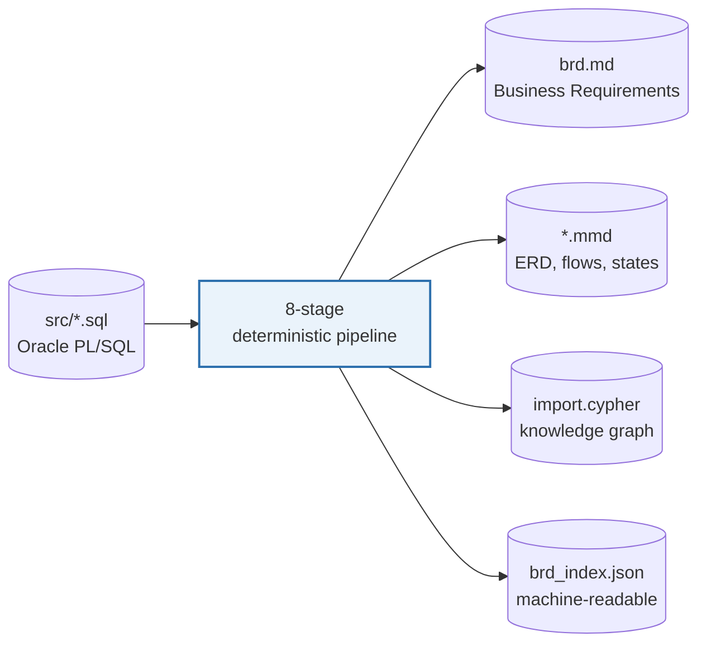

**"Agent" here means a pipeline stage** — an independent Python CLI program. It does *not* mean an autonomous LLM agent. The `.claude/agents/*.md` files are specifications for the development harness; they are never read by the pipeline.

---

## 2. Why it exists

An organisation runs a working Oracle PL/SQL system with no reliable documentation and no remaining authors. Before it can be modernised, replaced or audited, someone must answer: **what does it do, and what rules does it enforce?**

The motivating precedent is an industrial **6.4-million-line COBOL system** where two modernisation attempts failed — one automatic conversion, one package replacement — before the team fell back on *rewriting from a specification derived from the code*.

That sets the binding constraint: **the output is consumed by builders, not only readers.** Numbered, traceable, verifiable, explicit about what it does not know.

<details>
<summary><b>Why it stops at documentation instead of generating replacement code</b></summary>

Published results say don't go further: **extraction reaches roughly 90% precision and recall, while end-to-end code generation lands near 9%.** Extraction is a solved-enough problem; translation is not. The pipeline deliberately stops where the evidence stops.

</details>

<details>
<summary><b>Why there is no LLM anywhere in it</b></summary>

Two findings drove this decision:

1. **Empirical** — no automated documentation-quality metric correlates meaningfully with expert judgement (best reported *r* = 0.34), and expert inter-rater agreement fell to **ICC 0.12** on hard material. "The model checked it" is not a safety net.
2. **Practical** — a fabricated business rule in a specification is undetectable by the person relying on it.

> A deterministic pipeline that **misses** a rule fails *visibly*.
> A generative one that **invents** a rule fails *invisibly*.

For a document someone will rebuild from, the first failure mode is strictly better.

</details>

---

## 3. What it produces

From the reference corpus (`src/` — 7 files, 940 lines, 603 lines of code):

| Deliverable | Detail |
|---|---|
| **Business Requirements Document** | ~2,550 lines · 41 requirements · 4 parts by audience · clickable contents |
| **Machine-readable index** | `brd_index.json` — same content as structured data |
| **Gaps register** | 21 open matters ranked by severity |
| **Diagrams** | ERD · system data-flow map · entity state model · 5 process flows |
| **Knowledge graph** | 353 nodes / 769 relationships · MERGE-based Cypher + CSVs |
| **Query interface** | 12 plain-English questions, answerable with or without Neo4j |

---

## 4. Quick start

**Prerequisites:** Python 3.11+ and two libraries.

```bash
pip install antlr4-python3-runtime sqlglot
```

> ⚠️ **There is no dependency manifest in this repository.** No `requirements.txt`, `pyproject.toml` or lockfile exists; no versions are pinned. This is the largest operational risk — see [§32](#32-known-gaps-and-open-questions).

**Run all eight stages:**

```bash
python .claude/scripts/01_inventory.py src
python .claude/scripts/02_parser.py
python .claude/scripts/03_data.py
python .claude/scripts/04_logic.py
python .claude/scripts/05_rules.py
python .claude/scripts/06_diagram.py
python .claude/scripts/07_synthesis.py
python .claude/scripts/08_graph.py          # optional
```

Each stage prints where it wrote and the exact next command.

**Find your output:**

```bash
cat output/final_report/latest.json      # names the run directory holding brd.md
```

> ⚠️ Every run creates a new timestamped directory and **nothing prunes them**. Always open the run named in `latest.json` — opening a stale directory is an easy and previously-observed mistake.

**Ask the graph a question — no Neo4j needed:**

```bash
python .claude/scripts/08_graph.py --ask "what breaks if I change ACCOUNTS.BALANCE"
```

**Run the tests:**

```bash
for t in tests/test_*.py; do python "$t"; done     # 414 checks
```

---

## 5. Architecture at a glance

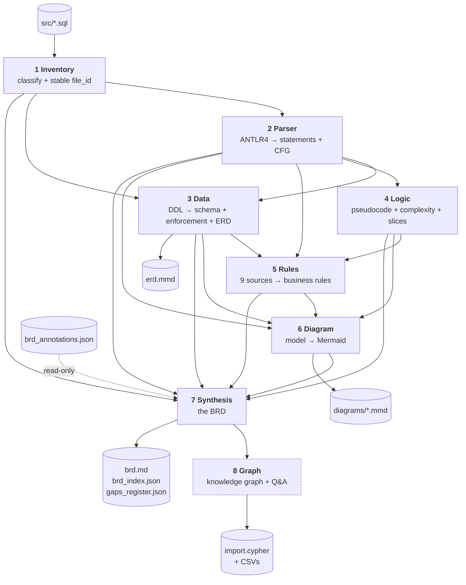

**Eight independent CLI programs chained by versioned JSON artefacts on disk.** No orchestrator, no shared state object, no service, no database.

**System context:**

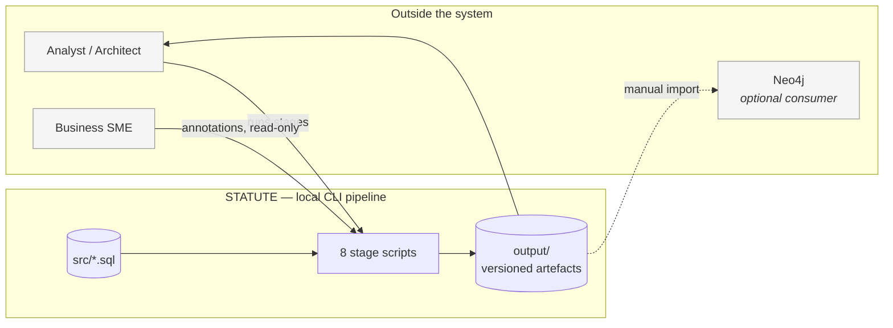

**There is no inbound interface** — no API, queue, or scheduler integration. The only trigger is a human running a command.

---

## 6. Technology stack

| Layer | Technology | Where | Why |
|---|---|---|---|
| Language | **Python 3.11+** | everywhere | Inferred from `X \| Y` type-hint syntax |
| Parsing | **ANTLR4** + vendored Oracle PL/SQL grammar (Apache 2.0) | Agents 2, 3 | Regex cannot survive nested blocks, string literals containing keywords, or `CASE` inside `CASE` |
| SQL decomposition | **sqlglot** (Oracle dialect) | Agent 2 | Recovers tables/columns from DML far more cheaply than walking the ANTLR tree |
| Diagrams | **Mermaid** | Agents 3, 6 | Renders natively in GitHub, VS Code and most wikis — no toolchain |
| Graph target | **Neo4j** | Agent 8 | Optional consumer, **never a runtime dependency** |
| Everything else | Python standard library | all | No dependency risk |

**Verified absent:** model calls · network calls · environment variables · database drivers · secrets · `logging` · Dockerfile · CI · dependency manifest.

---

## 7. Repository structure

```
.claude/
  agents/                     8 agent specifications (harness metadata + rationale)
  scripts/
    01_inventory.py    (724)  Stage 1
    02_parser.py       (858)  Stage 2
    03_data.py       (1,431)  Stage 3 — largest
    04_logic.py        (917)  Stage 4
    05_rules.py      (1,198)  Stage 5
    06_diagram.py    (1,207)  Stage 6
    07_synthesis.py  (1,308)  Stage 7
    08_graph.py        (419)  Stage 8
    lib_business_language.py  (271)  identifier → business language  (Agents 7, 8)
    lib_graph_model.py        (376)  in-memory property graph        (Agent 8)
    lib_graph_language.py     (433)  plain-English intent catalogue  (Agent 8)
    vendor/plsql_grammar/     vendored ANTLR4 grammar + NOTICE
    archive/                  superseded early scripts (not in the pipeline)
  skills/                     2 skill definitions
src/                          7 PL/SQL files — the reference corpus
tests/
  test_*.py                   8 suites, 414 checks
  evaluate_rules.py           the only evaluation harness
  fixtures/ground_truth/      4 annotated procedures + BASELINE.json
output/                       versioned runs (gitignored)
docs/                         16 detailed technical documents
tools_antlr_build/            grammar regeneration
reference/                    COBOL reference harness — GITIGNORED, guidance only
```

---

## 8. Design principles

<details open>
<summary><b>1. Stable identity everywhere</b></summary>

| Identifier | Form | Owner |
|---|---|---|
| `file_id` | `SLUG(rel_path) + "__" + SHA256(rel_path)[0:8]` | Agent 1 |
| `object_id` | `TYPE-OWNER.NAME`, `::` for package members | Agent 2 |
| `statement_id` | `file_id__object_id__STMT_nnnn` | Agent 2 |
| `column_id` | `TABLE.COLUMN` | Agent 3 |
| `rule_id` | `BR-nnn` | Agent 5 |
| `gap_id` | `GAP-nnn` | Agent 7 |

The hash is over the **path**, not contents — so editing a file preserves its identity. This is the enabling condition for the exact traceability matrix and the annotation layer.

</details>

<details>
<summary><b>2. Versioned runs with pointer-after-write</b></summary>

Every stage writes `output/<stage>/<timestamp>/` and only *then* updates `output/<stage>/latest.json`. A crash mid-write leaves an orphan directory; the pointer still names the last good run, so downstream stages are unaffected.

</details>

<details>
<summary><b>3. One kind of work per stage</b></summary>

The parser never interprets meaning. The rules agent never re-parses. The diagram agent draws only what earlier stages discovered. When a defect appears, there is exactly one place it can live.

</details>

<details>
<summary><b>4. Confidence is data, never hidden</b></summary>

A rule inferred from structure is marked `needs review`. A `DISABLED` database constraint is published **with a warning that it is not enforced**. A diagram too large to render legibly says so. All of it flows into the gaps register.

</details>

<details>
<summary><b>5. Separate the model from the rendering</b></summary>

Agents 6 and 8 build an in-memory model first and render last. This is why the node budget is enforceable (there is something to count), why tests can assert meaning rather than string formatting, and why the graph's local answers and its Neo4j answers cannot disagree.

</details>

---

## 9. Agent catalog and responsibility matrix

| # | Agent | Job | Deps | Doc |
|---|---|---|---|---|
| 1 | Inventory | Classify files, assign stable `file_id` | none | [↗](docs/agents/agent-01-inventory.md) |
| 2 | Parser | ANTLR4 → statements, CFG, `statement_id` | ANTLR4, sqlglot | [↗](docs/agents/agent-02-parser.md) |
| 3 | Data | DDL → schema + **real enforcement state** + ERD | ANTLR4 | [↗](docs/agents/agent-03-data.md) |
| 4 | Logic | Pseudocode, complexity, slices, CRUD | none | [↗](docs/agents/agent-04-logic.md) |
| 5 | Rules | 9 sources → business rules with confidence | none | [↗](docs/agents/agent-05-rules.md) |
| 6 | Diagram | Renderer-agnostic model → Mermaid | none | [↗](docs/agents/agent-06-diagram.md) |
| 7 | Synthesis | The BRD + index + gaps | none | [↗](docs/agents/agent-07-synthesis.md) |
| 8 | Graph | Property graph + Q&A *(optional)* | none | [↗](docs/agents/agent-08-graph.md) |

| Capability | 1 | 2 | 3 | 4 | 5 | 6 | 7 | 8 |
|---|:-:|:-:|:-:|:-:|:-:|:-:|:-:|:-:|
| Read filesystem source | ● | ● | ● | ● | ● | ● | | |
| Classify / route files | ● | ○ | ○ | | | | | |
| Parse PL/SQL grammar | | ● | ● | | | | | |
| Statement tree + CFG | | ● | | ○ | ○ | ○ | ○ | ○ |
| Schema + enforcement | | | ● | | ○ | ○ | ○ | ○ |
| Complexity, slices, CRUD | | | | ● | ○ | ○ | ○ | ○ |
| Business rules | | | ○ | ○ | ● | ○ | ○ | ○ |
| Diagrams | | | ● ERD | | | ● | ○ | |
| Document assembly | | | | | | | ● | |
| Graph + Q&A | | | | | | | | ● |

● owns · ○ consumes

---

## 10. Agent 1: Inventory

**Job:** walk the source tree, decide what each file is, give each a stable identity.

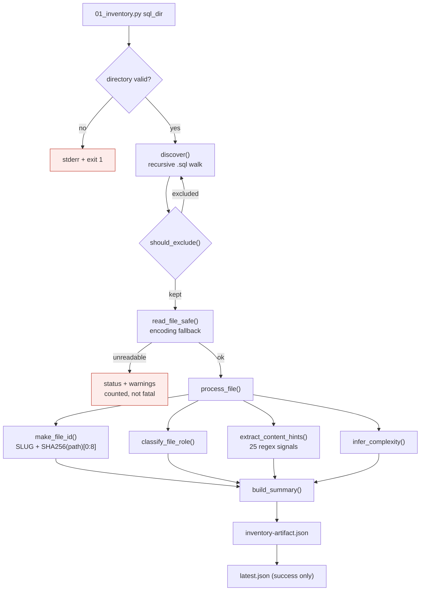

<details>
<summary><b>Details — inputs, outputs, why it matters</b></summary>

**Input:** a filesystem directory (positional argument). Optional flags: `--exclude`, `--no-default-excludes`, `--encoding`, `--no-content-hints`, `--verbose`, `--output` / `--output-root`.

**Output:** `inventory-artifact.json` with `file_index` (id → filename), `file_metadata` (role, line counts, SHA-256, encoding, status, warnings, complexity) and a 15-counter `summary`.

**Why it matters.** Downstream routing depends on it. Agent 2 parses only files whose role is in `PARSE_WORTHY_ROLES`; Agent 3 parses only DDL. **A real defect occurred here**: files containing `CREATE VIEW` were classified `mixed`, never reached Agent 3, and every table they defined vanished from the data model. Agent 3 now carries a compensating `DDL_CONTENT_HINTS` mechanism.

**Classification is content-driven, never filename-driven** — a file called `utils.sql` containing `CREATE TABLE` is DDL.

**Tests:** 22 checks, including a normalised golden-fixture diff.

</details>

---

## 11. Agent 2: Parser

**Job:** turn PL/SQL text into structure. **The only stage that reads source characters.**

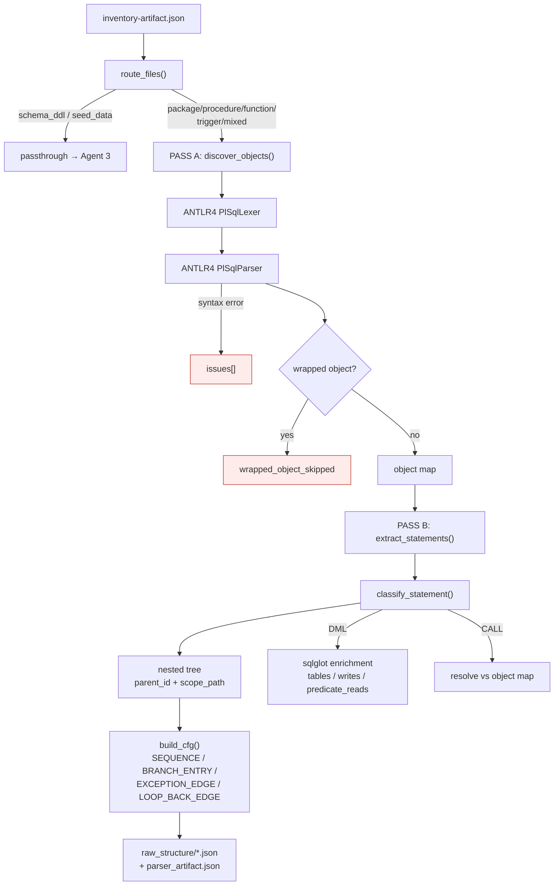

<details>
<summary><b>Details — two-pass design, statement IDs, known traps</b></summary>

**Why two passes.** A call in file A may target an object in file B. Resolution is impossible until all objects are known. Pass A discovers every object across the run; Pass B extracts statements and resolves references.

**Statement identifier** — the pipeline's primary join key:

```
04_MEDIUM_PROCESS_MONTHLY_INTEREST_CREDIT__B115DB87__PROC-.SP_PROCESS_MONTHLY_INTEREST_CREDIT__STMT_0004
```

Zero-padded sequence makes string sort equal numeric sort. Embeds `file_id`, so it inherits path-stability.

**Trap 1 — `reads[]` mixes columns and parameters.** A live `SELECT_INTO` record lists `p_from_account` (a parameter) alongside real columns. Consumers must filter; only Agent 8 does so structurally.

**Trap 2 — no condition text is stored.** An `IF` record carries only `nesting_depth`. Agents 4, 5 and 6 each independently re-read the source and re-slice the condition. Three implementations of one idea.

**Trap 3 — the generated ANTLR Python emits `this.` instead of `self.`** and must be patched after every grammar regeneration (`vendor/plsql_grammar/NOTICE.md`).

**Past defects now guarded by tests:** `build_cfg` linked only siblings (a decision had no edge to any branch); `classify_statement` returned `"IF_STATEMENT"` while recursion checked `"IF"`; `Into_clauseContext` was invisible to direct-child search; sqlglot conflated `UPDATE SET` targets with `WHERE` columns.

**Tests:** 31 checks.

</details>

---

## 12. Agent 3: Data

**Job:** build the physical data dictionary — and record which rules the database is **actually enforcing**.

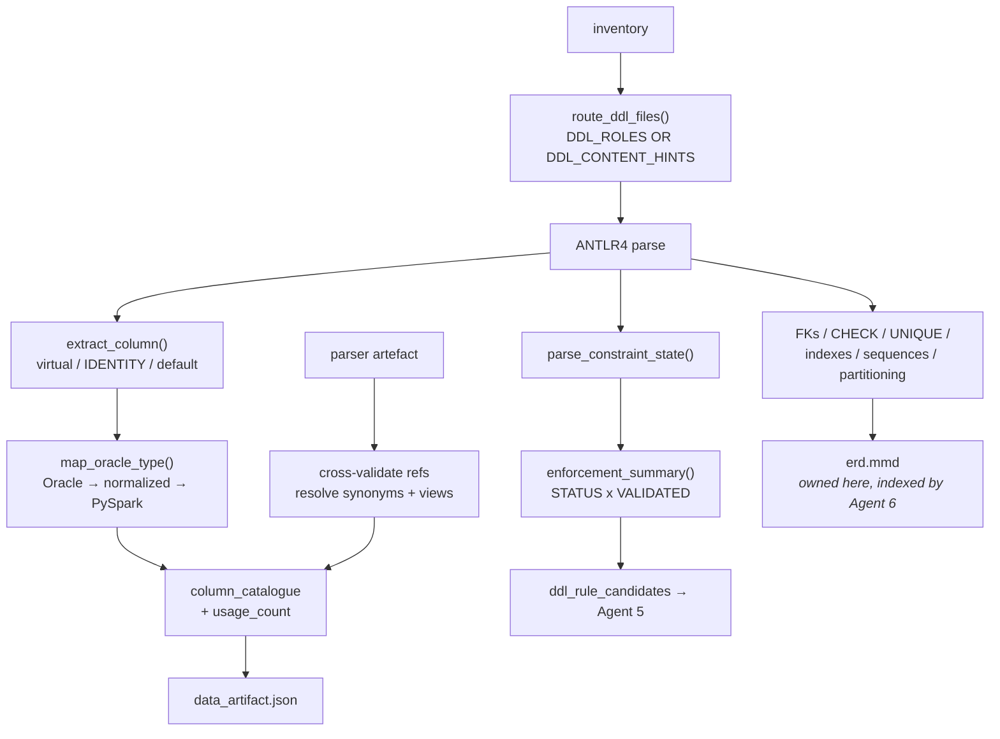

<details>
<summary><b>Details — the two-axis enforcement model (the central idea)</b></summary>

Oracle constraints have **two independent axes**, not one. A constraint can exist and not be enforced:

| STATUS | VALIDATED | `is_enforced` | `confidence` | Meaning |
|---|---|---|---|---|
| ENABLED | VALIDATED | `true` | `enforced` | Enforced for all data |
| ENABLED | NOT VALIDATED | `true` | `enforced_new_data_only` | New rows only; existing rows may violate |
| DISABLED | either | `false` | `not_enforced` | Documented intent only |

Agent 5 maps this to `(signal_strength, confidence, requires_sme_review)`:

```
"enforced"               → (5, "confirmed", False)
"enforced_new_data_only" → (4, "high",      True)
"not_enforced"           → (2, "low",       True)
```

**Design decision:** a DISABLED constraint is still surfaced as a rule rather than dropped — dropping it would hide documented business intent — but it is scored low, flagged for review, and its BRD statement says the database is not enforcing it.

**Whitespace defect, fixed.** ANTLR's `getText()` strips whitespace, producing `account_statusIN('ACTIVE')` and a rule named *"Restrict Account **Statusin**"*. `original_text_of()` uses the token stream to preserve source text.

**Naming trap.** The foreign-key field is **`references_table`**, not `referenced_table`. Querying the wrong name returns `None` and looks like missing data.

**Type triple:** `NUMBER(18,2)` → `DECIMAL` → `DecimalType(18,2)`. Agent 7 publishes the third as the **Target type** column for a rebuild.

**Tests:** 76 checks — the largest suite.

</details>

---

## 13. Agent 4: Logic

**Job:** make control flow readable and measurable.

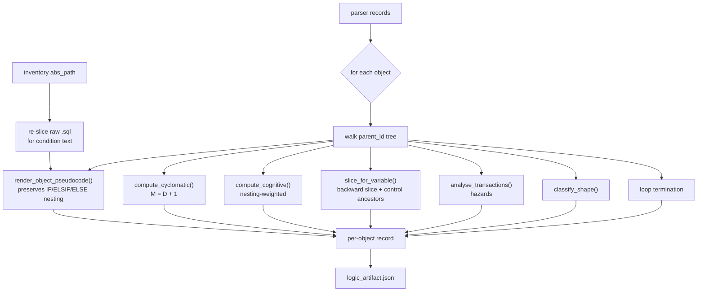

<details>
<summary><b>Details — metrics, slicing, and one explicit non-goal</b></summary>

**Cyclomatic complexity** (McCabe 1976): *M = D + 1*, where

$$D = n_{if} + n_{elsif} + n_{case\_when} + n_{loop} + n_{handler} + n_{logical}$$

Threshold **10**. Live example: breakdown `if=2, elsif=2, loop=1, exception_handler=2` → D=7, M=8. Highest observed: `SP_TRANSFER_FUNDS` at **M=16**.

**Cognitive complexity** (Campbell): increment per flow-break plus nesting increment. Threshold **15**. Zero objects exceed it on the corpus.

**Backward slices** (Weiser 1981): for each variable, every statement determining its value, including control ancestors. 25 slices on the corpus. These feed Agent 5's `variable_derivation` rules.

**Transaction hazards:** `COMMIT_INSIDE_LOOP`, `SAVEPOINT_PARTIAL_ROLLBACK` (1 found, severity **high**), `NO_TRANSACTION_CONTROL` (2 found, info).

**Processing shapes:** `BATCH_PROCESSOR`, `SINGLE_RECORD_TRANSACTION`, `CALCULATION`, `QUERY_ONLY` — each with a rationale string.

**Explicit non-goal — dead-code detection.** PL/SQL objects are routinely invoked by schedulers or code outside the repository, so *"no internal callers"* is reported as **informational only**, never as a finding.

**Tests:** 46 checks.

</details>

---

## 14. Agent 5: Rules

**Job:** find the business decisions and state them as requirements. **The intellectual core of the pipeline** — and the only stage with a measured accuracy figure.

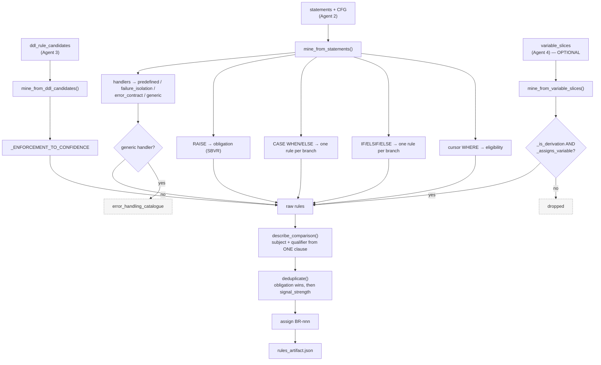

<details>
<summary><b>The nine mining sources</b></summary>

| Source kind | Trigger |
|---|---|
| `conditional_branch` | Every IF / ELSIF / ELSE branch |
| `case_branch` | Every CASE WHEN / ELSE |
| `cursor_eligibility` | A cursor's `WHERE` clause — *which records* the process applies to |
| `named_exception` | A guarded `RAISE`, restated as the obligation it enforces |
| `predefined_exception` | An Oracle exception the database itself detected |
| `failure_isolation` | `WHEN OTHERS` that logs and continues — a resilience requirement |
| `error_contract` | `WHEN OTHERS` raising a specific error callers depend on |
| `variable_derivation` | Business formulas from backward slices |
| `ddl_*` | CHECK / virtual column / unique constraint / view filter |

**Live distribution:** VALIDATION 19 · LIMIT_CHECK 12 · CALCULATION 6 · ERROR_HANDLING 4.

</details>

<details>
<summary><b>Exceptions become obligations (SBVR)</b></summary>

SBVR is explicit: *"there are no exceptions; instead, there are well stated business rules."*

A guarded `RAISE` merges with the `IF` that guards it and is phrased as what must hold. Since the IF condition is the **violation**, the rule is its negation:

```
p_amount <= 0  →  "Validate Amount above 0"
```

</details>

<details>
<summary><b>Measured accuracy — and why the headline number is not trustworthy</b></summary>

`tests/evaluate_rules.py` measures against 4 hand-annotated procedures, matching on source-line proximity (`LINE_TOLERANCE = 2`).

| Measurement | Precision | Recall | F1 |
|---|---|---|---|
| Baseline (pre-redesign) | 0.615 | 0.571 | **0.593** |
| Current (tuned) | 1.000 | 1.000 | **1.000** |
| **First blind held-out** | — | — | **0.588** |
| **Second blind held-out** | 1.000 | **0.400** | 0.571 |

**The 1.000 is contaminated.** Ground truth covers 4 of 5 procedures and each was eventually used to fix the extractor. **The defensible generalisation figures are the blind ones.**

Published comparison baselines cited in the harness: COBREX F1 0.59 · COBRAIN 0.73 · A-COBREX P 0.62 / R 0.74.

</details>

<details>
<summary><b>Three guards that took iteration to get right</b></summary>

1. **`_is_derivation`** — score = arithmetic ops + function calls; `≥ 2` means business formula. `ROUND(bal*(rate/100)*(days/365),2)` scores 5 ✅; `rec.balance + v_interest_amount` scores 1 ❌. **The threshold rests on n=2 evidence.**
2. **`_assigns_variable`** — the deriving statement must actually *assign* the slice variable. Without it, `v_new_balance` claimed the formula computing `v_interest_amount`, producing one formula as two rules.
3. **`_is_zero_guard`** — a comparison against literal zero is a sanity guard, not a business tier. Without it, `v_interest_amount > 0` keyword-matched CALCULATION and produced *"Calculate Interest Amount above 0"*.

**Tests:** 33 checks.

</details>

---

## 15. Agent 6: Diagram

**Job:** the visual layer. Builds a **renderer-agnostic model**, then emits Mermaid.

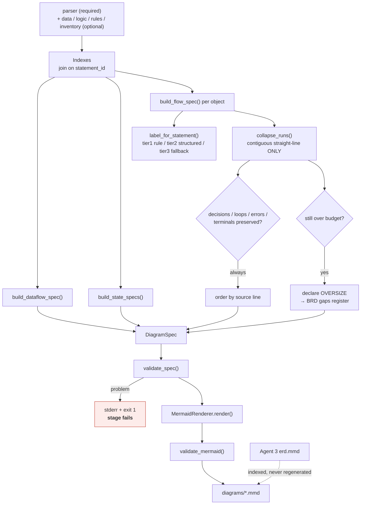

<details>
<summary><b>Details — the pipeline stage that fails loudest</b></summary>

**Pipeline shape:** `LOAD → RESOLVE → MODEL → REDUCE → ORDER → RENDER → VALIDATE → WRITE`. Steps up to ORDER emit no Mermaid.

**What it draws:**

| Diagram | Built from |
|---|---|
| ERD | **Agent 3** — indexed, never regenerated |
| System data-flow map | Agent 4 CRUD + Agent 2 calls + rule counts + complexity |
| Process flow (per object) | Agent 2 CFG ⋈ Agent 5 rules on `statement_id` |
| Entity state model | Agent 3 CHECK `IN`-list + UPDATEs writing that column |
| CRUD matrix | Agent 4 — as a table, because tabular data belongs in a table |

**Labels carry meaning.** Decisions read `Balance below 100,000?` and branches carry the rule they enact (`BR-041`). **100% of decisions and 100% of decision branches** resolve to business text.

**The node budget is real** — `DEFAULT_NODE_BUDGET = 40`. Contiguous straight-line runs collapse; decisions, loops, error paths and terminals **never** do.

**A second collapse tier was built and removed.** It merged every collapsible child of a parent regardless of adjacency, fusing statements at lines 33 and 124 into one node and implying they run together. *A diagram that meets its budget by misrepresenting the flow is worse than a large one.* Where structure cannot fit, the diagram is emitted and **declared oversize**.

**This is the only stage that fails on an internal-quality problem** — a half-valid diagram must not reach the BRD.

**Tests:** 52 checks (was 7), asserting against the model rather than strings.

</details>

---

## 16. Agent 7: Synthesis

**Job:** assemble the BRD — one document four different readers can each use.

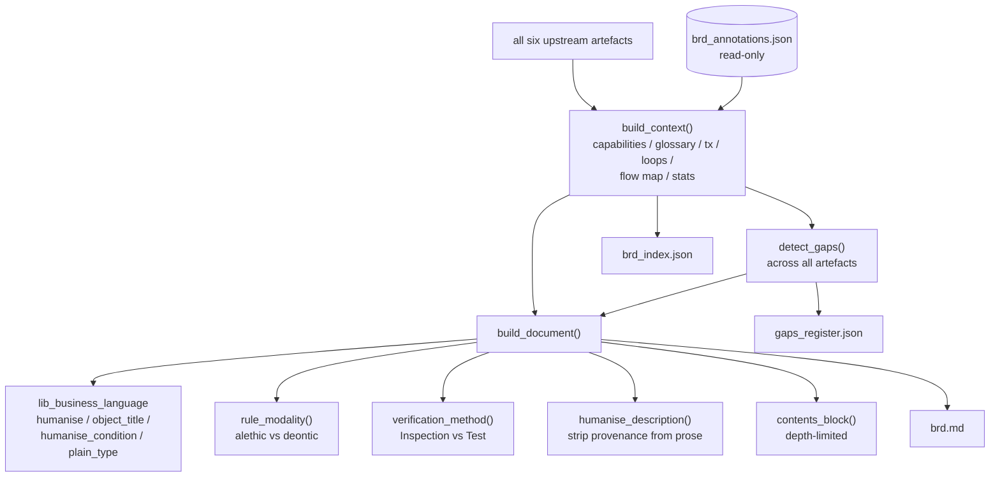

<details>
<summary><b>Business language — the core translation</b></summary>

| Machine | Business |
|---|---|
| `PROC-.SP_TRANSFER_FUNDS` | **Transfer Funds** |
| `v_from_balance < p_amount` | **From Balance is below Amount** |
| `e_insufficient_balance` | **Insufficient Balance** |
| `LAST_TXN_DATE` | **Last Transaction Date** |
| `NUMBER(18,2)` | **Decimal number (18 digits, 2 decimal places)** |

The machine identifier is carried *alongside* the prose, never substituted for it. Pseudocode and diagrams stay technical by design.

**Two defects found by judging the output:**
1. `NO` was mapped to `Number`, turning *"no preceding condition matched"* into *"Number Preceding Condition Matched"*. **Ordinary English words must stay out of the abbreviation table.**
2. Operator substitution ran *before* identifier substitution, feeding inserted words back through the identifier pass and producing *"is Below"*.

</details>

<details>
<summary><b>Document structure — four parts by audience</b></summary>

| Part | Audience | Chapters |
|---|---|---|
| **I — Business View** | Sponsors | Executive summary · Scope (in **and** out) · Glossary · Program units · Data flow · CRUD matrix |
| **II — Rules and Behaviour** | Analysts | Rules catalogue · Entity state models · Error contracts |
| **III — Build Specification** | Developers | Data model with target types · Interface contracts · Process specs · Operational characteristics |
| **IV — Assurance** | Auditors | Traceability matrix · Gaps register · Rebuild checklist |

Documentation needs are task-dependent, so one undifferentiated voice serves nobody.

</details>

<details>
<summary><b>Every rule stated three ways, with SBVR modality</b></summary>

```
BR-002 — Enforce From Balance at or above Amount

| Exact condition in code | `v_from_balance < p_amount` |
| How to verify           | Test (exercise the code path) |
| Owner                   | _to be assigned_ |

In plain terms.  From Balance is below Amount.

Formal statement.  It is obligatory that the operation is rejected
when From Balance is below Amount, raising Insufficient Balance.
```

**SBVR modality** distinguishes two epistemically different things:

| Modality | Phrasing | Meaning |
|---|---|---|
| **Alethic** | *"It is necessary that…"* | The database makes violation **impossible** |
| **Deontic** | *"It is obligatory that…"* | Violation is **possible** — which is why code checks |

**Verification method is derived:** schema-enforced → Inspection; code-enforced → Test. Two of ISO/IEC/IEEE 29148's eleven attributes. The rest (`Owner`, `Priority`) render as **visible blanks** — an empty column is an action item; a missing one is invisible.

**Traceability matrix.** Twenty years of IR-based traceability research fights for 19–32% precision on *inferred* links. These are constructed from `statement_id` and are **exact**.

**Tests:** 86 checks — the largest suite. Asserts readability (no identifiers in prose), navigation (every TOC link resolves), completeness, traceability, honesty, and that annotations land in both outputs.

</details>

---

## 17. Agent 8: Knowledge Graph

**Job:** make everything queryable. **Optional and terminal** — no other stage depends on it.

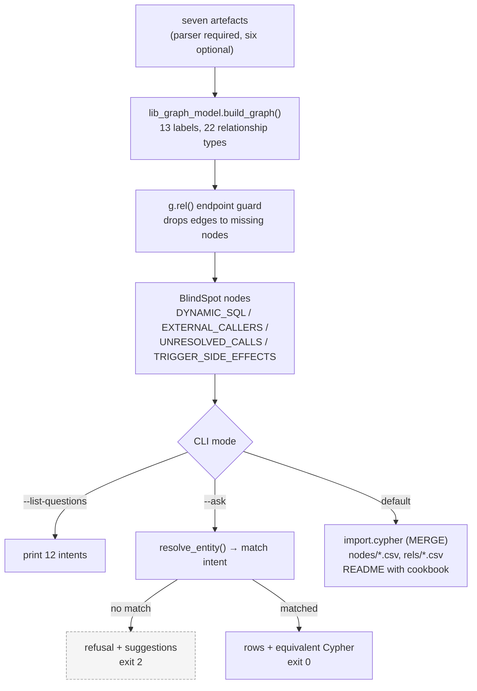

<details>
<summary><b>Schema — 353 nodes, 769 relationships</b></summary>

| Label | Count | | Relationship | Count |
|---|---|---|---|---|
| Statement | 124 | | CONTAINS_STATEMENT | 124 |
| Column | 105 | | DETERMINES | 119 |
| BusinessRule | 41 | | HAS_COLUMN | 105 |
| Gap | 21 | | FOLLOWS | 86 |
| Parameter | 20 | | WRITES_COLUMN | 69 |
| Table | 15 | | BELONGS_TO | 41 |
| File | 7 | | ENFORCED_IN | 40 |
| Object | 5 | | BRANCHES_TO | 40 |
| RuleSet, BlindSpot | 4, 4 | | IMPLEMENTED_AT | 39 |
| State, Sequence | 3, 3 | | READS_COLUMN | 36 |
| Index | 1 | | *(11 more types)* | |

**Three modelling decisions:**

1. **`Column` is a node**, not a property of `Table`. It is read, written, constrained and indexed — four independent relationships. As a property, impact analysis is unaskable.
2. **`Statement` is a node**, giving a **Code Property Graph** layer (Yamaguchi et al., IEEE S&P 2014). Agent 2's statement tree is an AST, its `control_flow_graph` is a CFG, Agent 4's slices are dependence facts — joining them answers questions none answers alone.
3. **`BlindSpot` is a node.** *A graph that looks authoritative is more dangerous than a document that looks uncertain.*

</details>

<details>
<summary><b>Why the English interface uses no LLM</b></summary>

From the module docstring:

> *"The obvious way to turn English into Cypher is to ask a language model. This pipeline does not… a fabricated Cypher query returns a plausible, wrong answer, and the user has no way to tell."*

Instead: **12 named intents**, each with trigger patterns, a resolver, and the equivalent Cypher. Unmatched questions are refused with the supported list.

**Total precision, imperfect recall** — the correct trade when a wrong impact answer is worse than none. The **negative tests are the most important ones** in the suite.

An invariant added after judging the output: *every advertised question, asked verbatim, must be recognised.* Found because *"Which columns are used most widely?"* was listed and then refused — a pattern assumed the word order "most widely used".

**Tests:** 68 checks (was 13).

</details>

---

## 18. End-to-end workflow

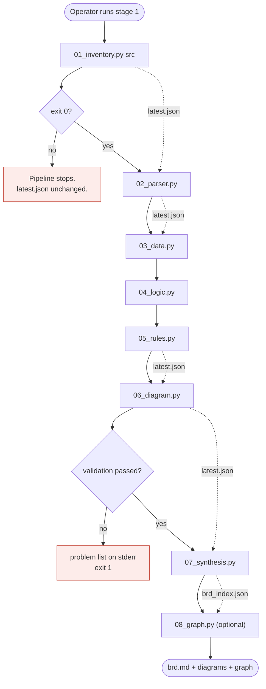

**Ordering is the operator's responsibility.** No script invokes another; each prints the next command, including the pinned run version.

**Live run output:**

```
Stage 1  7 files, 940 lines total, 603 code
Stage 2  5 objects, 124 statements, 0 parse errors, 0 unresolved calls
Stage 3  15 tables, 7 FKs + 1 inferred, 1 CHECK, 6 comment-only enums flagged
Stage 4  151 pseudocode lines, 25 slices, 1 over threshold, 1 SAVEPOINT hazard
Stage 5  41 rules — 19 validation, 12 limit-check, 6 calculation, 4 error-handling
Stage 6  7 figures, 100% decision labels, 100% branch traceability
Stage 7  41 requirements, 21 glossary terms, 41 traceability rows, 21 gaps
Stage 8  353 nodes / 769 relationships, 12 questions, 4 blind spots
```

---

## 19. Data flow and lineage

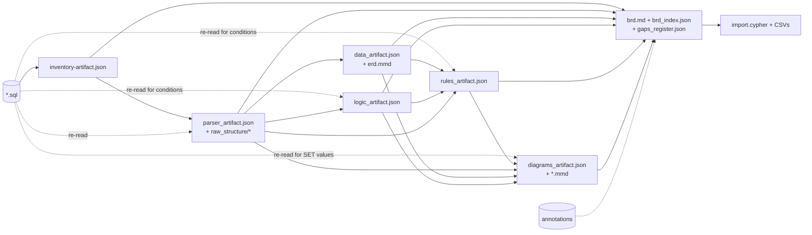

**Lineage of a single rule, end to end:**

```
src/05_medium_fund_transfer_with_validation.sql : line 79
  → Agent 1  file_id     = 05_MEDIUM_FUND_TRANSFER_WITH_VALIDATION__5E3A3BBB
  → Agent 2  statement_id = <file_id>__PROC-.SP_TRANSFER_FUNDS__STMT_00nn
  → Agent 5  BR-002, source.statement_id + line 79
  → Agent 6  decision node + BRANCH edge labelled "BR-002"
  → Agent 7  §5 rule block + §12 traceability row citing file:line
  → Agent 8  (:BusinessRule {rule_id:"BR-002"})-[:IMPLEMENTED_AT]->(:Statement)
```

---

## 20. Control flow and state

**There is no shared state object, session, thread or checkpointer. The filesystem is the state.**

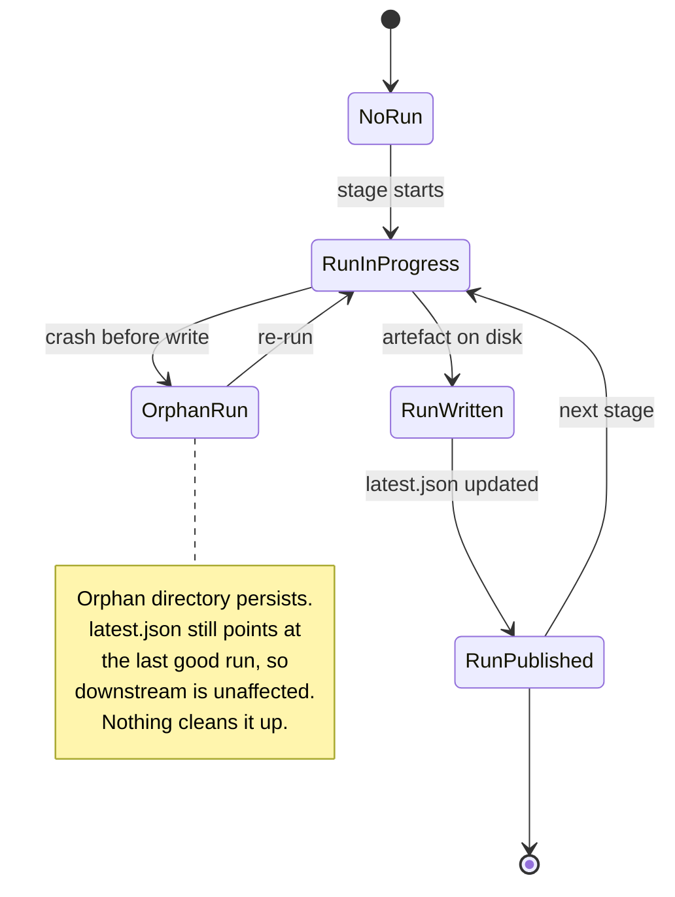

Every stage follows the same shape:

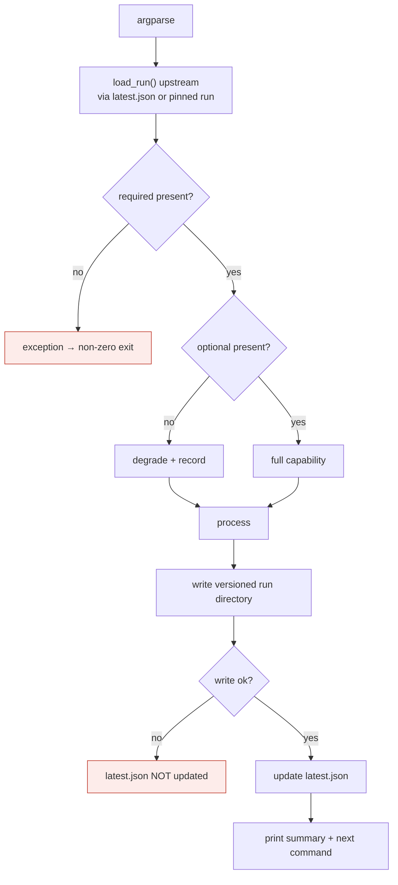

**Graceful degradation** is implemented in Agent 5 (logic optional) and Agents 6/8 (multiple optional inputs). **Agent 7 requires all six.**

---

## 21. Formulas, thresholds and algorithms

**The complete set of numeric thresholds in the repository** — verified exhaustive by grep:

| Constant | Value | Location | Purpose |
|---|---|---|---|
| `CYCLOMATIC_THRESHOLD` | 10 | `04_logic.py:71` | Complexity warning |
| `COGNITIVE_THRESHOLD` | 15 | `04_logic.py:73` | Cognitive complexity warning |
| `_DERIVATION_COMPLEXITY_THRESHOLD` | 2 | `05_rules.py:603` | Business formula vs mechanics |
| `DEFAULT_NODE_BUDGET` | 40 | `06_diagram.py:99` | Diagram readability budget |
| `LINE_TOLERANCE` | 2 | `tests/evaluate_rules.py:45` | Ground-truth match window |

<details>
<summary><b>Key formulas</b></summary>

**Stable file identity** (Agent 1)

$$\text{file\_id} = \text{SLUG}(\text{rel\_path}) \Vert \text{"\_\_"} \Vert \text{SHA256}(\text{rel\_path})[0{:}8]$$

**Cyclomatic complexity** (Agent 4)

$$M = D + 1, \quad D = n_{if} + n_{elsif} + n_{case\_when} + n_{loop} + n_{handler} + n_{logical}$$

**Derivation complexity** (Agent 5)

$$\text{score} = |\{\text{arithmetic ops}\}| + |\{\text{function calls}\}| \geq 2 \Rightarrow \text{business formula}$$

**Clause scoring for rule naming** (Agent 5)

$$\text{score}(c) = 2\cdot[\,op = \texttt{=} \wedge rhs \text{ literal}\,] + 1\cdot[\,lhs \in \text{known fields}\,]$$

**SBVR modality** (Agent 7)

$$\text{modality} = \texttt{alethic} \iff kind \in \text{DDL\_KINDS} \wedge is\_enforced \neq \texttt{False}$$

**Evaluation** (Agent 5 harness)

$$P = \tfrac{\text{matched}}{\text{extracted}}, \quad R = \tfrac{\text{matched}}{\text{ground truth}}, \quad F_1 = \tfrac{2PR}{P+R}$$

**Diagram quality** (Agent 6)

$$\text{tier1\_pct} = \tfrac{|\text{decisions with tier-1 label}|}{|\text{decisions}|}, \quad \text{traceability} = \tfrac{|\text{BRANCH edges with rule\_id}|}{|\text{BRANCH edges}|}$$

</details>

---

## 22. Error handling and recovery

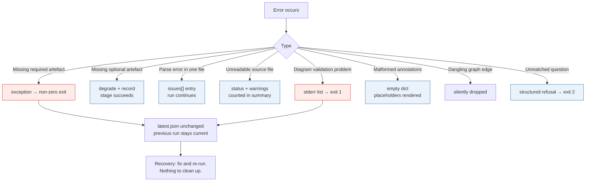

**No retries anywhere.** No backoff — there is no external service. **All stages are idempotent** modulo timestamp and run directory.

---

## 23. Configuration

**There are no environment variables and no configuration files.** The entire configuration surface is CLI arguments.

| Pattern | Purpose |
|---|---|
| `--<stage>-root`, `--<stage>-run` | Locate upstream artefacts (`latest` or a pinned run) |
| `--output-root`, `--output` | Where to write; `--output` disables run versioning |
| `--verbose` | Per-item status to stderr (Agents 1–4) |
| `--max-nodes` | Diagram node budget, default 40 — **the only numeric tunable** |
| `--system-name`, `--annotations` | Agent 7 |
| `--ask`, `--list-questions`, `--json` | Agent 8 |

**All other thresholds are hard-coded module constants** requiring a code edit.

---

## 24. The annotation layer

Static analysis can prove a 365-day threshold exists. It can never discover that the threshold is **mandated by regulation**. That is the concept assignment problem (Biggerstaff et al., 1993) — and it is why this layer exists.

Create `brd_annotations.json`:

```json
{
  "annotations": {
    "BR-001": {
      "note": "365-day threshold is set by regulation, not policy.",
      "owner": "Head of Retail Operations",
      "priority": "Must have"
    },
    "table:ACCOUNTS":       { "note": "Master record for every customer account." },
    "term:ACCOUNTS.BALANCE":{ "note": "Cleared balance, excluding pending items." },
    "object:PROC-.SP_TRANSFER_FUNDS": { "note": "Used by the mobile channel." },
    "executive_summary":    { "note": "Core retail ledger, in service since 2004." }
  }
}
```

Keyed by stable ID, merged at synthesis time, **never written by the pipeline**. Machine facts regenerate every run; your notes persist.

> ⚠️ Annotation text is inserted into the BRD **verbatim with no sanitisation**. Treat the file as trusted input.

---

## 25. Querying the knowledge graph

**No Neo4j required:**

```bash
python .claude/scripts/08_graph.py --list-questions
python .claude/scripts/08_graph.py --ask "what breaks if I change ACCOUNTS.BALANCE"
python .claude/scripts/08_graph.py --ask "..." --json     # for scripts
```

```
Question type : What breaks if I change a given column?
Subject       : ACCOUNTS.BALANCE — NUMBER(18,2) — NOT NULL
Results       : 10

  BR-014 Restrict Account Status to allowed values  constrains this table  business rule
  Check Minimum Balance — line 21                   reads                  SELECT_INTO
  Process Monthly Interest Credit — line 58         writes                 UPDATE
  Transfer Funds — line 95                          writes                 UPDATE
  Transfer Funds — line 109                         writes                 UPDATE
  ...

Equivalent Cypher:
  MATCH (c:Column {column_id: $column}) ...
```

<details>
<summary><b>All 12 supported questions</b></summary>

1. What breaks if I change a given column?
2. Which business rules apply to a program unit, table or column?
3. Where does a given rule live in the source?
4. Which program units read or write a given table?
5. What is the calling interface of a program unit?
6. Which rules still need a person to confirm them?
7. Which rules are recorded but not enforced by the database?
8. Which program units are most complex?
9. Which columns are used most widely?
10. Which tables are never touched by any program unit?
11. What open questions remain for the business?
12. What can this graph NOT see?

**Name entities exactly** — `ACCOUNTS.BALANCE`, `SP_TRANSFER_FUNDS`, `BR-014`.

</details>

**Loading into Neo4j:**

```bash
cd output/graph/<run-from-latest.json>/
cat import.cypher | cypher-shell -u neo4j -p <password>
```

`MERGE` throughout, so re-importing is safe and idempotent. The generated `README.md` in that directory holds the query cookbook, derived-view **concepts**, validation **constraints**, and declared blind spots.

---

## 26. Testing and evaluation

```bash
for t in tests/test_*.py; do python "$t"; done     # 414 checks
python tests/evaluate_rules.py                     # rule extraction vs ground truth
```

| Suite | Checks | Focus |
|---|---:|---|
| `test_synthesis` | 86 | Readability, navigation, completeness, traceability, honesty |
| `test_data` | 76 | Enforcement state, type mapping, cross-validation |
| `test_graph` | 68 | Schema, coverage, loadability, **refusal to guess** |
| `test_diagram` | 52 | Collapse invariants, label coverage, budget declaration |
| `test_logic` | 46 | Complexity, slicing, transaction hazards |
| `test_rules` | 33 | Obligation form, branch decomposition, dedup |
| `test_parser` | 31 | Grammar, CFG edges, sqlglot enrichment |
| `test_inventory` | 22 | Routing, stable IDs, golden diff |

Each suite is a standalone script using a shared `check(condition, label)` convention — **no pytest or test-runner configuration exists.** Suites run the real pipeline into a temporary directory: integration tests with unit-style assertions.

**Only Agent 5 has an evaluation harness.** Seven of eight agents have no measured accuracy. **No CI exists** — tests run only when a human runs them.

---

## 27. Observability and troubleshooting

**Logging:** `print()` only. Zero uses of `logging`. No levels, no structured fields, no metrics export, no alerting. `run_version` acts as the cross-stage correlation identifier.

| Symptom | Where to look |
|---|---|
| A table or object missing downstream | **Check `file_role` first** — routing is the most common cause, and has caused a real defect |
| Parse problems | `parser_artifact.json → issues[]` — the richest diagnostic surface |
| Stage 6 exits non-zero | It fails deliberately on any validation problem; the list is on stderr |
| BRD shows stale content | You opened an old run — use `output/final_report/latest.json` |
| A rule looks wrong | Every rule cites file and line; open the source |
| `--ask` refuses a question | Name the entity exactly; run `--list-questions` |
| Everything unresolved after a re-run | A crashed stage leaves `latest.json` on the previous run — check timestamps |

---

## 28. Security

**Verified controls:**

| Control | Status |
|---|---|
| Secrets / credentials / tokens | **None exist** — 0 env vars, verified by grep |
| Network access | **None** — no networking library imported |
| Command execution | **None** — no `subprocess`, `os.system`, `eval`, `exec` |
| Model / prompt-injection surface | **None** — no model |
| Auditability | Run versioning + `upstream` provenance in every artefact |

**Risks, stated plainly:**

| Risk | Detail |
|---|---|
| **Unpinned dependencies** | Two third-party libraries, no manifest, no lockfile — the largest supply-chain exposure |
| **Annotation injection** | `brd_annotations.json` content is inserted verbatim with no sanitisation |
| **Sensitive output** | `brd.md` and the graph export contain complete business logic, schema, interfaces and error contracts. No classification or redaction mechanism. |
| **`abs_path` leakage** | Local filesystem paths embedded in shareable artefacts |
| **No output schema validation** | Artefact shape enforced only by tests |

**No threat model exists** in the repository.

---

## 29. Deployment

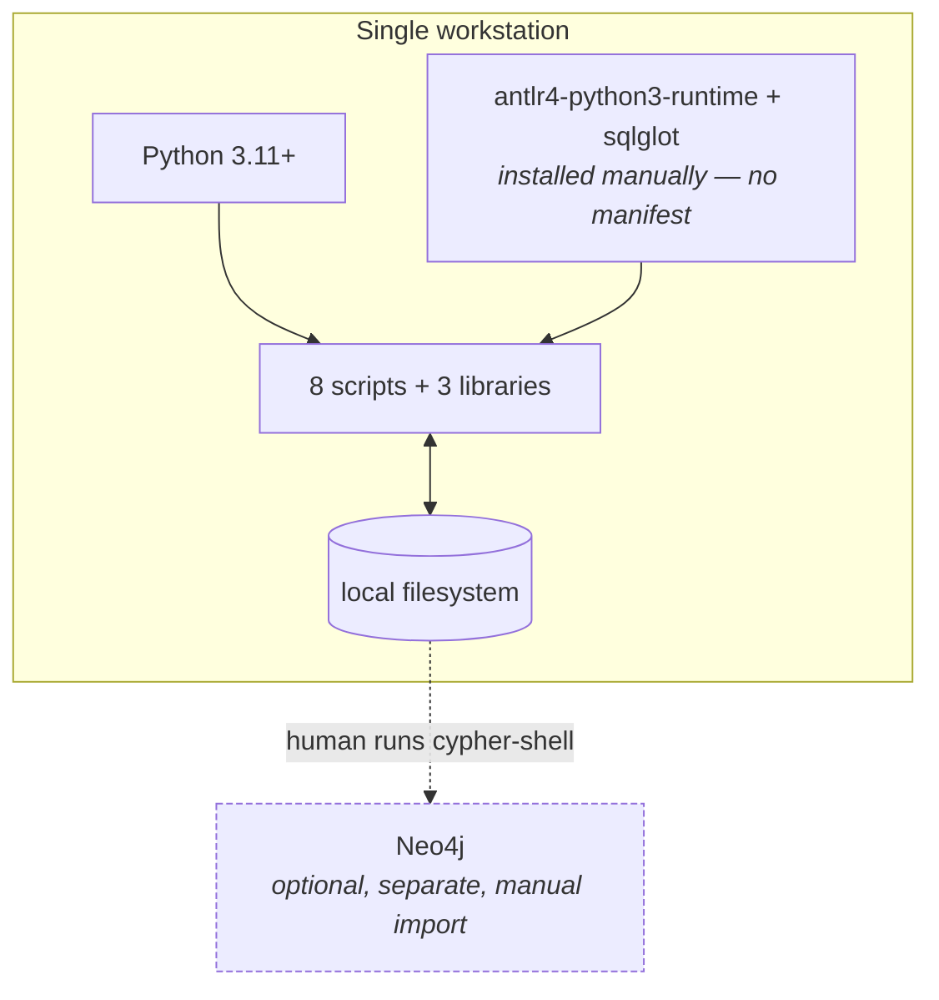

Short-lived sequential CLI processes on one machine. **No Dockerfile, no CI/CD, no health checks, no service, no environment separation.** Persistence is the local filesystem only.

---

## 30. Architecture decisions

Eleven ADRs in [Nygard format](docs/architecture-decisions.md). Summary:

| # | Decision | Key consequence |
|---|---|---|
| 001 | No language model in the generation path | Output is a pure function of input |
| 002 | Filesystem-mediated pipeline, no orchestrator | Any stage re-runnable in isolation; sequencing is manual |
| 003 | Path-derived stable identifiers | Editing a file preserves identity; **moving it does not** |
| 004 | Versioned runs, pointer-after-write | A crash cannot corrupt downstream; disk grows unbounded |
| 005 | Formal grammar over regex | Correct nesting; requires a post-generation patch |
| 006 | Two-axis constraint enforcement | The BRD never asserts a guarantee the database isn't providing |
| 007 | Separate diagram model from renderer | Budget enforceable; tests assert meaning |
| 008 | Stop at documentation | Scope matches demonstrated capability |
| 009 | Deterministic intent catalogue over generated Cypher | Total precision, imperfect recall |
| 010 | Annotations in a read-only sidecar | Human knowledge survives regeneration |
| 011 | Single collapse tier | Diagrams never imply an ordering that doesn't exist |

---

## 31. Known limitations

1. **The rule-extraction F1 is tuned, not blind.** Ground truth covers 4 of 5 procedures and each was used to fix the extractor. Defensible figures: **F1 0.588**, **recall 0.400**.
2. **Coverage metrics prove completeness, not usefulness.** No automated documentation metric correlates meaningfully with expert judgement.
3. **Concepts cannot be recovered from code.** `v_days_inactive > 365` becomes a lexical transformation; "dormancy policy" is nowhere in the source.
4. **The graph is a lower bound on dependencies**, never an upper bound. Four blind-spot classes are declared.
5. **Single-domain corpus.** 5 objects, 15 tables, one banking schema. Never run against foreign PL/SQL. Agent 5's category keywords are banking vocabulary.
6. **No dependency manifest, no CI, no container, no logging framework.**
7. **`TRANSITIONS_TO` graph edges are computed by Agent 6 but never emitted** by Agent 8 — the deriving loop contains only `pass`.
8. **Condition text is re-sliced three times** by Agents 4, 5 and 6.
9. **These are Solution/Functional requirements.** By BABOK's classification the BRD describes what the system *does*, not why the business wanted it. Its scope chapter says so.
10. **Detailed flowcharts have weak empirical support** (Shneiderman et al., 1977). The counter-argument — our reader cannot read PL/SQL — is an argument, not evidence.

---

## 32. Known gaps and open questions

<details>
<summary><b>Prioritised recommendations (none implemented)</b></summary>

| # | Recommendation | Addresses |
|---|---|---|
| 1 | Add `requirements.txt` / `pyproject.toml` with pinned versions | Largest operational risk |
| 2 | Run against foreign, non-banking PL/SQL and re-measure | The only real generalisation test |
| 3 | Implement `TRANSITIONS_TO`, or delete the misleading comment | A computed finding is discarded |
| 4 | Add CI running the 414 tests on push | Tests run only manually |
| 5 | Add a labelled corpus for file-role classification accuracy | Misclassification silently drops files |
| 6 | Sanitise annotation content | Markdown injection |
| 7 | Store condition text in Agent 2 | Removes three duplicate implementations |
| 8 | Publish JSON Schemas for each artefact | Shape enforced only by tests |
| 9 | Add run-directory pruning | Unbounded growth |
| 10 | Report a count when dangling edges are dropped | Silent data loss possible |

</details>

<details>
<summary><b>Open questions requiring stakeholder input</b></summary>

1. Why does Agent 2 not store condition text, forcing three re-implementations?
2. Why is `TRANSITIONS_TO` unimplemented when Agent 6 computes transitions?
3. What Python and dependency versions are supported?
4. Are complexity thresholds (10, 15) organisational standards or defaults?
5. Why is PySpark the assumed rebuild target?
6. What retention policy applies to run directories?
7. Who owns `brd_annotations.json` operationally?
8. Should the BRD carry a classification marking?
9. What is the largest codebase this has been run against?
10. What intent-match recall is acceptable for Agent 8?

</details>

Full detail: [docs/known-gaps-and-open-questions.md](docs/known-gaps-and-open-questions.md)

---

## 33. Extending the system

**The five changes with the widest blast radius:**

| Change | Ripples to |
|---|---|
| `file_id` scheme (Agent 1) | Every downstream ID; golden fixture; full re-run |
| `statement_id` format (Agent 2) | Agents 5, 6, 7, 8 — the pipeline's join key |
| Statement type strings (Agent 2) | Agents 4, 6, 8 all switch on them |
| A new rule source kind (Agent 5) | Agent 7 provenance labels; Agent 8 `origin` |
| Enforcement confidence strings (Agent 3) | Agent 5 keys on the string |

**To add a ninth stage:**

1. Follow the pattern: `main()` + `argparse` + `load_run` + versioned write + `latest.json`
2. Read upstream via `latest.json`; degrade gracefully on optional inputs
3. Emit the standard envelope (`pipeline_stage`, `schema_version`, `generated_at`, `upstream`, `stats`)
4. Add `tests/test_<stage>.py` using the shared `check(condition, label)` convention
5. Add `.claude/agents/<n>_<name>_agent.md` and `docs/agents/agent-0<n>-<name>.md`

---

## 34. References

<details>
<summary><b>Directly influenced the implementation</b> (named in code or specifications)</summary>

**Metrics and program analysis** — McCabe (1976) cyclomatic complexity · Campbell cognitive complexity · Weiser (1981) program slicing · Yamaguchi, Golde, Arp & Rieck (2014) *Code Property Graphs*, IEEE S&P · Lehnert, *A review of software change impact analysis*

**Requirements and documentation** — ISO/IEC/IEEE 29148:2018 · OMG SBVR 1.5 · IIBA BABOK v3 · Mavin et al. (EARS) · Chikofsky & Cross (1990) · Biggerstaff, Mitbander & Webster (1993) · Aghajani et al. (ICSE 2020) · Lethbridge, Singer & Forward (2003) · Cosentino et al. (WCRE 2013)

**Visualisation** — Moody (2009) *The "Physics" of Notations* · Shneiderman (1996) *The Eyes Have It* · Shneiderman et al. (1977) CACM 20(6) · Purchase (1997/2002) · VEIL (arXiv 2511.05066)

**Tooling precedent** — jQAssistant · Neo4j property-graph modelling guidance · CAST Imaging / Thoughtworks CodeConcise

**Evaluation baselines** (comparison only) — COBREX F1 0.59 · COBRAIN 0.73 · A-COBREX P 0.62 / R 0.74

**Industrial motivation** — Sneed, *From COBOL to Business Rules*

</details>

<details>
<summary><b>Used only to structure this documentation</b></summary>

- [arc42](https://arc42.org/overview) — architecture documentation structure
- [C4 model](https://c4model.com) — diagram level selection
- [Michael Nygard, *Documenting Architecture Decisions*](https://cognitect.com/blog/2011/11/15/documenting-architecture-decisions) — ADR format
- [GitHub collapsed sections](https://docs.github.com/en/get-started/writing-on-github/working-with-advanced-formatting/organizing-information-with-collapsed-sections) — the `<details>` technique used throughout this README

</details>

**Software licences:** vendored ANTLR4 Oracle PL/SQL grammar — Apache 2.0 (`antlr/grammars-v4`, see `.claude/scripts/vendor/plsql_grammar/NOTICE.md`) · `antlr4-python3-runtime` — BSD · `sqlglot` — MIT · this project — see [`LICENSE`](LICENSE).

---

## 35. Full documentation index

This README is self-contained. The `docs/` package holds deeper per-topic detail — 16 documents, 6,290 lines, every claim traceable to a file and function.

| Document | Purpose |
|---|---|
| [System overview](docs/system-overview.md) | 5-minute orientation |
| [Complete system technical documentation](docs/complete-system-technical-documentation.md) | Master document, 36 sections |
| [Agent documents](docs/agents/) | One per stage, 28 sections each |
| [Architecture decisions](docs/architecture-decisions.md) | 11 ADRs |
| [Traceability matrix](docs/traceability-matrix.md) | Every claim → repository evidence |
| [Known gaps and open questions](docs/known-gaps-and-open-questions.md) | Verified gaps + stakeholder questions |
| [References](docs/references.md) | Four-way classified |
| [Documentation review report](docs/documentation-review-report.md) | Self-critique against 19 criteria |

---

<div align="center">

**Every claim in this README is traceable to a repository file and function, labelled as an architectural inference, or marked as not found.**

</div>
