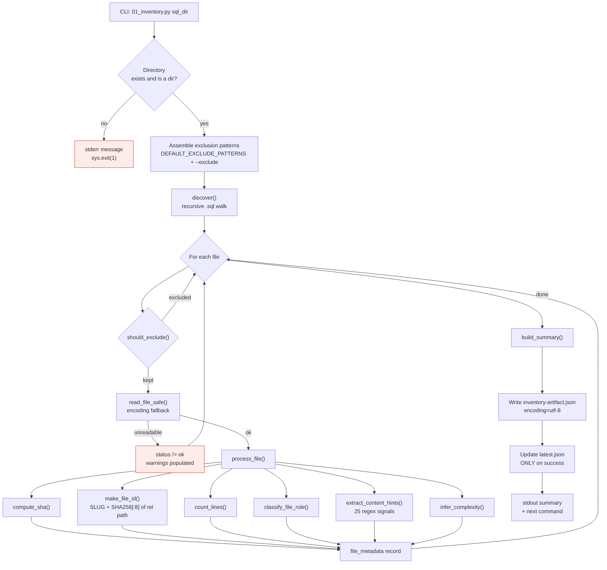
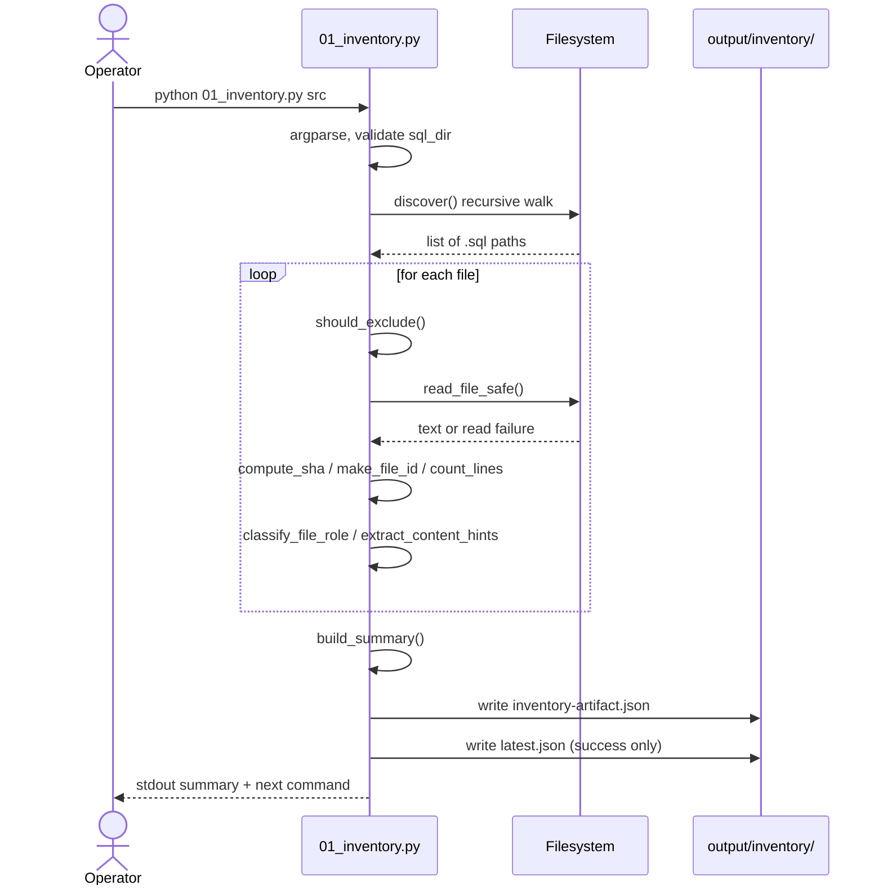
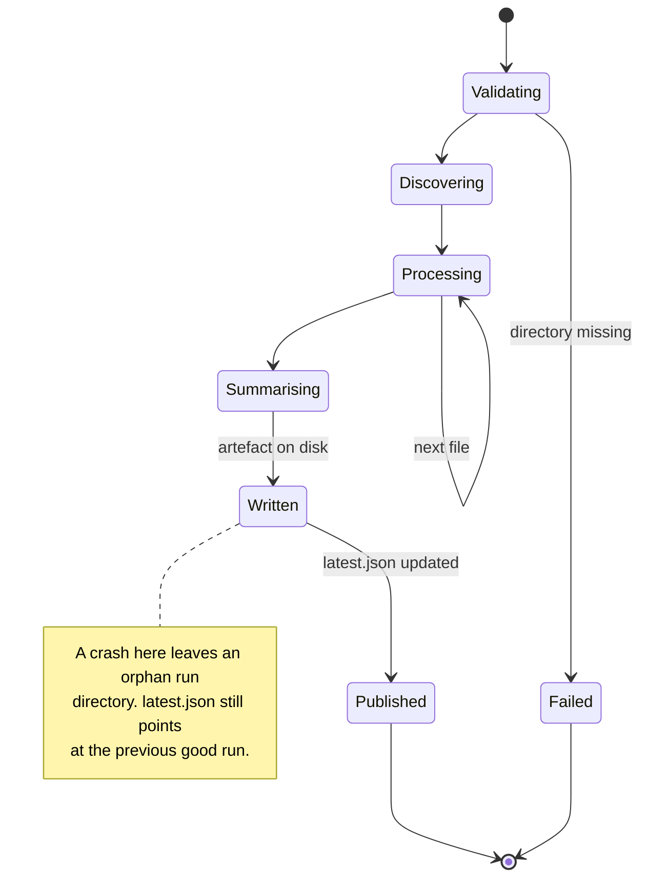

# Agent 01 — Inventory

## 1. Document Information

| Field | Value |
|---|---|
| **Agent name** | Inventory Agent |
| **Agent identifier** | `1_inventory_plsql` (harness spec), `01_inventory` (pipeline stage) |
| **Purpose of this document** | Complete technical handover for the file-discovery and classification stage |
| **Primary implementation** | [`.claude/scripts/01_inventory.py`](../../.claude/scripts/01_inventory.py) — 724 lines |
| **Related source files** | None. This agent imports only the Python standard library. |
| **Related prompt files** | `Not found in the current repository.` This agent makes no model calls. |
| **Related configuration files** | `Not found in the current repository.` Configuration is CLI arguments only. |
| **Related schemas** | Self-describing JSON; `schema_version: "2.0"` emitted in the artifact |
| **Related tests** | [`tests/test_inventory.py`](../../tests/test_inventory.py) — 22 checks; golden fixture `tests/fixtures/expected-inventory-artifact.json` |
| **Related specification** | [`.claude/agents/1_inventory_plsql_agent.md`](../../.claude/agents/1_inventory_plsql_agent.md) |
| **Upstream components** | None — this is the pipeline entry point. Input is a filesystem directory. |
| **Downstream components** | Agent 02 (Parser), Agent 03 (Data), Agent 07 (Synthesis), Agent 08 (Graph) |
| **Documentation status** | Complete |
| **Confidence level** | High — all claims confirmed from implementation or tests |

---

## 2. Table of Contents

- [3. Agent Overview](#3-agent-overview)
- [4. Core Problem Statement](#4-core-problem-statement)
- [5. Responsibilities](#5-responsibilities)
- [6. Non-Responsibilities](#6-non-responsibilities)
- [7. Inputs](#7-inputs)
- [8. Outputs](#8-outputs)
- [9. Internal Technical Workflow](#9-internal-technical-workflow)
- [10. Agent Architecture Diagram](#10-agent-architecture-diagram)
- [11. Sequence Diagram](#11-sequence-diagram)
- [12. State Management](#12-state-management)
- [13. Prompt and LLM Design](#13-prompt-and-llm-design)
- [14. Technologies and Techniques](#14-technologies-and-techniques)
- [15. Algorithms, Rules, Heuristics, and Formulas](#15-algorithms-rules-heuristics-and-formulas)
- [16. Error Handling and Recovery](#16-error-handling-and-recovery)
- [17. Security and Guardrails](#17-security-and-guardrails)
- [18. Performance and Scalability](#18-performance-and-scalability)
- [19. Testing and Validation](#19-testing-and-validation)
- [20. Evaluation and Quality Metrics](#20-evaluation-and-quality-metrics)
- [21. Observability](#21-observability)
- [22. Configuration and Environment](#22-configuration-and-environment)
- [23. Deployment and Runtime](#23-deployment-and-runtime)
- [24. Extension and Maintenance Guide](#24-extension-and-maintenance-guide)
- [25. Known Limitations](#25-known-limitations)
- [26. Open Questions](#26-open-questions)
- [27. Source Traceability](#27-source-traceability)
- [28. References](#28-references)

---

## 3. Agent Overview

**What it does.** Recursively walks a directory of `.sql` files, reads each one safely, classifies what kind of PL/SQL artefact it contains, assigns each file a stable identifier, and records metadata about it.

**Why it exists.** Every later stage needs two things this agent alone provides: a **stable identity** for each file that survives re-runs, and a **role classification** that determines routing. Agent 02 parses only files whose role is parse-worthy; Agent 03 parses only DDL. Without this stage there is no way to address a file consistently across artefacts.

**Where it sits.** Stage 1 of 8 — the pipeline entry point. It is the only agent whose input is the filesystem rather than another agent's artefact.

**System capability provided.** Addressability and routing.

**If removed.** The pipeline cannot start. No `file_id` means no `statement_id` (Agent 02 composes statement IDs from it), which means no traceability matrix (Agent 07) and no graph joins (Agent 08). Routing would have to be re-derived by every downstream stage independently.

---

## 4. Core Problem Statement

**Problem.** A directory of `.sql` files gives no reliable indication of what each file contains. Filenames are not trustworthy — a file named `utils.sql` may contain `CREATE TABLE`. Encodings vary. Some files may be unreadable.

**Technical need.** A deterministic, path-stable identifier per file, plus a content-derived role classification precise enough to route files to the correct downstream parser.

**Constraints handled.**
- Files may not be UTF-8 (fallback encodings attempted — `read_file_safe`, line 156)
- Files may be unreadable or empty (recorded as status, not raised as fatal)
- Identifiers must survive file edits (hence path-derived, not content-derived)
- Two files may produce the same slug (collision handling in `make_file_id`, line 133)

**Responsibility boundary.** Classification only. This agent never parses PL/SQL grammar — it uses regular expressions on file content to *classify*, and hands the file to Agent 02 or Agent 03 for real parsing.

**Expected result.** `inventory-artifact.json` containing `file_index`, `file_metadata`, and `summary`.

**Upstream dependency.** None. A filesystem path.

**Downstream impact.** Agent 02 routes on `file_role` (`PARSE_WORTHY_ROLES` / `PASSTHROUGH_ROLES`, `02_parser.py` lines 62–63). Agent 03 routes on `DDL_ROLES` plus `DDL_CONTENT_HINTS` (`03_data.py` lines 132, 143). Agents 07 and 08 read `file_metadata` for absolute paths and display names.

---

## 5. Responsibilities

1. Recursive discovery of `.sql` files (`discover`, line 470)
2. Exclusion filtering against default and user-supplied glob patterns (`should_exclude`, line 411)
3. Safe file reading with encoding fallback (`read_file_safe`, line 156)
4. SHA-256 content hashing (`compute_sha`, line 126)
5. Stable `file_id` assignment (`make_file_id`, line 133)
6. Line counting — total, code, comment, blank (`count_lines`, line 186)
7. File role classification (`classify_file_role`, line 214)
8. Content hint extraction — 25 regex signals (`extract_content_hints`, line 289)
9. Coarse complexity inference (`infer_complexity`, line 355)
10. Run versioning and `latest.json` pointer maintenance (`generate_run_version`, line 401)
11. Summary aggregation (`build_summary`, line 432)

---

## 6. Non-Responsibilities

This agent does **not**:

- Parse PL/SQL grammar — that is Agent 02 (`02_parser.py`) and Agent 03 (`03_data.py`)
- Identify individual database objects (procedures, functions, packages) — Agent 02, `discover_objects`
- Extract statements, control flow, or any structure — Agent 02
- Read or interpret DDL semantics — Agent 03
- Assess business meaning — Agent 05
- Make any judgement that requires understanding SQL semantics

**Boundary clarification.** `extract_content_hints` uses regexes such as `CREATE TABLE` to *classify* a file. This is signal detection for routing, not parsing. The distinction matters: a regex match here decides which parser sees the file; it never produces a fact that reaches the BRD.

---

## 7. Inputs

### Input 1 — `sql_dir` (positional, required)

| Property | Value |
|---|---|
| **Source** | Command line, positional argument |
| **Data type** | String → `pathlib.Path` |
| **Format** | Filesystem directory path |
| **Required** | Yes |
| **Validation** | Existence and is-directory checked at `01_inventory.py:589–594` |
| **Failure behaviour** | Prints `ERROR: directory not found` / `ERROR: not a directory` to stderr, `sys.exit(1)` |
| **Valid example** | `src`, `./sql_codebase`, an absolute path |
| **Invalid example** | A path to a file rather than a directory; a non-existent path |
| **Sensitive data** | The path is resolved and stored as `abs_path` in `file_metadata`. This exposes local directory structure in the artefact. |
| **Evidence** | Confirmed from implementation — `main()`, lines 541, 589–594 |

### Input 2 — Optional CLI flags

| Flag | Default | Purpose | Evidence |
|---|---|---|---|
| `--output` / `-o` | `None` | Exact output path; disables run versioning | line 545 |
| `--output-root` | `output/inventory` | Root for versioned runs | line 552 |
| `--exclude` / `-e` | `[]` | Additional glob exclusion patterns | line 560 |
| `--no-default-excludes` | `False` | Disable built-in exclusions | line 567 |
| `--encoding` | `utf-8` | Primary encoding attempted first | line 572 |
| `--no-content-hints` | `False` | Omit `content_hints` from output | line 577 |
| `--verbose` / `-v` | `False` | Per-file status to stderr | line 582 |

**Size limits / token limits.** `Not found in the current repository.` No file-size cap is enforced; files are read fully into memory.

---

## 8. Outputs

### Output — `inventory-artifact.json`

| Property | Value |
|---|---|
| **Destination** | `output/inventory/<run_version>/inventory-artifact.json`, or the exact path given by `--output` |
| **Format** | JSON, UTF-8 encoded (`encoding="utf-8"` explicitly set — see [Known Limitations](#25-known-limitations)) |
| **Schema version** | `"2.0"` |
| **Persistence** | Written to disk; `output/inventory/latest.json` updated only on success |
| **Downstream consumers** | Agents 02, 03, 07, 08 |

**Top-level fields:**

| Field | Type | Purpose |
|---|---|---|
| `pipeline_stage` | string | `"1_inventory"` |
| `schema_version` | string | `"2.0"` |
| `generated_at` | ISO-8601 string | UTC timestamp |
| `source_dir` | string | Resolved absolute input directory |
| `cli_args` | object | `encoding`, `exclude_patterns`, `content_hints` |
| `summary` | object | 15 aggregate counters |
| `file_index` | object | `file_id → filename` |
| `file_metadata` | object | `file_id → metadata record` |

**`file_metadata` record fields** (confirmed from a live artefact):

`abs_path`, `complexity`, `content_hints`, `encoding_used`, `file`, `file_role`, `last_modified`, `line_counts`, `sha256`, `size_bytes`, `status`, `warnings`

**Sample** (from `output/inventory/<run>/inventory-artifact.json`):

```json
{
  "file_index": { "00_DDL_CREATE_SCHEMA__CF266E14": "00_ddl_create_schema.sql" },
  "file_metadata": {
    "00_DDL_CREATE_SCHEMA__CF266E14": {
      "file": "00_ddl_create_schema.sql",
      "file_role": "schema_ddl",
      "line_counts": { "total": 120, "code": 95 },
      "status": "ok"
    }
  }
}
```

**Error outputs.** Unreadable files are recorded with a non-`ok` `status` and populated `warnings`, and counted in `summary.total_files_unreadable`. They are not raised.

**Quality/confidence fields.** `complexity` (coarse: low/medium/high) and `warnings`. There is no numeric confidence score at this stage.

---

## 9. Internal Technical Workflow

| # | Step | Implementation |
|---|---|---|
| 1 | **Triggered** by direct CLI invocation. No scheduler or orchestrator. | `if __name__ == "__main__": main()` |
| 2 | **Input received** — `sql_dir` plus flags | `argparse`, line 541 |
| 3 | **Input validated** — directory exists and is a directory | lines 589–594 |
| 4 | **Preprocessed** — exclusion patterns assembled from defaults + user | line 597 |
| 5 | **State read** — none. The agent holds no prior state. | — |
| 6 | **Recursive discovery** — walk tree, collect `.sql` | `discover()`, line 470 |
| 7 | **Exclusion** applied per file | `should_exclude()`, line 411 |
| 8 | **Safe read** with encoding fallback | `read_file_safe()`, line 156 |
| 9 | **Hash** computed | `compute_sha()`, line 126 |
| 10 | **Identifier** assigned, collisions resolved | `make_file_id()`, line 133 |
| 11 | **Lines counted** — total / code / comment / blank | `count_lines()`, line 186 |
| 12 | **Role classified** | `classify_file_role()`, line 214 |
| 13 | **Content hints** extracted (25 regexes) | `extract_content_hints()`, line 289 |
| 14 | **Complexity inferred** | `infer_complexity()`, line 355 |
| 15 | **Per-file record** assembled | `process_file()`, line 421 |
| 16 | **Summary** aggregated | `build_summary()`, line 432 |
| 17 | **Artefact written**, then `latest.json` updated | `main()` |
| 18 | **Console summary** printed, including the next command to run | `main()`, lines ~700–720 |

**Model / tool / database / API calls.** None. The agent uses only `os`, `pathlib`, `re`, `hashlib`, `json`, `fnmatch`, `argparse`, `datetime`, `sys`.

**Retries.** None. Encoding fallback (step 8) is the only recovery mechanism.

---

## 10. Agent Architecture Diagram



---

## 11. Sequence Diagram



**Components deliberately absent from this diagram:** no LLM, no orchestrator, no API layer, no database, no state store. None exist in this system.

---

## 12. State Management

**There is no shared state object, session, or thread in this system.**

`Architectural inference based on the following repository evidence:` no state class, no orchestrator module, and no framework import exists anywhere in `.claude/scripts/`. The only imports are `argparse, csv, dataclasses, datetime, fnmatch, hashlib, json, os, pathlib, re, sys`, plus `antlr4`, `sqlglot`, and the project's own `lib_*` modules.

**What plays the role of state:** the filesystem.

| Concern | Mechanism | Evidence |
|---|---|---|
| State object | None. Each stage is an independent OS process. | No orchestrator file exists |
| Persistence | JSON artefact written to `output/inventory/<run_version>/` | `main()` |
| Pointer / current state | `output/inventory/latest.json`, written **only after** the artefact is written | `main()` |
| Checkpointing | Every run is a checkpoint — directories are never overwritten | Run-version directory naming |
| Concurrency | Not handled. Two concurrent runs produce two run directories; the later `latest.json` write wins. | No locking present |
| Failure recovery | A crashed run leaves an orphan directory but does **not** move `latest.json`, so downstream stages continue reading the last good run | Pointer-after-write ordering |



---

## 13. Prompt and LLM Design

`Not found in the current repository.`

This agent makes no model calls. Verified by inspection: no `openai`, `anthropic`, or any model-client import exists in `.claude/scripts/`; the complete third-party import set for the whole pipeline is `antlr4`, `sqlglot`, and the vendored grammar.

Consequently the following are all **not applicable**: system prompt, user prompt, prompt templates, prompt variables, model provider, model name, temperature, token limits, structured-output format, tool calling, output parser, LLM retry/fallback, hallucination controls, prompt-injection protection, indirect prompt-injection protection.

**The system-level hallucination control is architectural, not prompt-based:** there is no generative component, so output is a pure function of input.

---

## 14. Technologies and Techniques

| Technology | Where | Why | Trade-offs | Evidence |
|---|---|---|---|---|
| **Python standard library only** | Entire agent | No dependency risk, no version drift, no install step for this stage | No parsing capability — deferred to Agent 02 | Import list, lines 1–30 |
| **SHA-256** (`hashlib`) | `compute_sha`, `make_file_id` | Content hash for change detection; the *path* hash provides identifier uniqueness | Truncated to 8 hex chars in the ID — collision handling required | line 126 |
| **`fnmatch` glob matching** | `should_exclude` | Familiar shell-style patterns for operators | Less expressive than regex | line 411 |
| **Regular expressions** | `classify_file_role`, `extract_content_hints` | Cheap, sufficient for *routing* decisions | Cannot parse nested structures — a deliberate boundary | lines 214, 289 |
| **Versioned run directories** | `main` | Immutable history; a failed run cannot corrupt downstream input | Unbounded disk growth (see Limitations) | `generate_run_version`, line 401 |

**Alternatives not taken.** `Architectural inference based on the following repository evidence:` a full parse could have replaced regex classification, but Agent 02 already owns parsing and depends on this agent's routing decision — parsing here would invert the dependency. No repository comment states this reasoning explicitly.

---

## 15. Algorithms, Rules, Heuristics, and Formulas

### 15.1 Stable file identifier

**Name:** `make_file_id`
**Purpose:** produce an identifier that is stable across runs and unique within a run.
**Location:** `01_inventory.py:133`

$$\text{file\_id} = \text{SLUG}(\text{relative\_path}) \;\Vert\; \text{"\_\_"} \;\Vert\; \text{SHA256}(\text{relative\_path})[0{:}8]$$

| Variable | Definition |
|---|---|
| `relative_path` | Path of the file relative to `sql_dir` |
| `SLUG` | Uppercased filename with non-alphanumerics replaced by `_` |
| `SHA256[0:8]` | First 8 hex characters of the SHA-256 digest of the **relative path** |

**Critical property:** the hash is over the **path**, not the file contents. Editing a file does not change its identifier. This is what makes `statement_id` (Agent 02) and the traceability matrix (Agent 07) stable across runs.

**Example:** `00_ddl_create_schema.sql` → `00_DDL_CREATE_SCHEMA__CF266E14`

**Edge case — collision.** Two different paths producing the same slug *and* hash prefix is handled by a `used_ids` set passed into the function; on collision a disambiguating suffix is applied. **Output range:** unbounded string; practically 20–60 characters.

### 15.2 File role classification

**Name:** `classify_file_role` — **Location:** `01_inventory.py:214`

Content-driven, not filename-driven. Returns one of: `schema_ddl`, `seed_data`, `procedure`, `function`, `package`, `trigger`, `mixed`.

**Why content-driven:** the specification records a real defect — files containing `CREATE VIEW` were classified `mixed`, never reached Agent 03, and every table they defined vanished from the data model. See `.claude/agents/3_data_agent.md` and `DDL_CONTENT_HINTS` (`03_data.py:143`), which exists to compensate.

### 15.3 Content hints

**Name:** `extract_content_hints` — **Location:** `01_inventory.py:289`
25 regular-expression signals over file text. Consumed by Agent 03's routing (`DDL_CONTENT_HINTS`).

### 15.4 Complexity inference

**Name:** `infer_complexity` — **Location:** `01_inventory.py:355`
Coarse bucket (`low` / `medium` / `high`). **This is not the cyclomatic complexity used downstream** — Agent 04 computes that independently (`CYCLOMATIC_THRESHOLD = 10`, `04_logic.py:71`). Do not conflate the two.

### 15.5 Line counting

**Name:** `count_lines` — **Location:** `01_inventory.py:186`
Produces `total`, `code`, `comment`, `blank` using `_SINGLE_LINE_COMMENT_RE` (line 99).

**Thresholds owned by this agent:** none numeric. The only tunable inputs are the exclusion patterns and encoding.

---

## 16. Error Handling and Recovery

| Condition | Behaviour | Evidence |
|---|---|---|
| Input directory missing | stderr message, `sys.exit(1)` | lines 589–591 |
| Input path is a file | stderr message, `sys.exit(1)` | lines 592–594 |
| File unreadable / encoding failure | Fallback encodings attempted; on total failure the file is recorded with non-`ok` `status` and `warnings`, and counted in `summary` | `read_file_safe`, line 156 |
| Empty file | Recorded, counted in `summary.total_files_empty` | `build_summary` |
| Partial success | **Supported.** Unreadable files do not abort the run. | `process_file` |

**Try blocks:** 4. **`sys.exit` calls:** 2. **Raised exceptions:** 0.

**Retry count:** none. **Backoff:** not applicable — no network or external service.
**Idempotency:** a re-run with identical input produces an identical artefact *except* `generated_at` and the run-version directory name. `tests/test_inventory.py` normalises these fields before comparing against the golden fixture.
**Recovery procedure:** re-run. Nothing to clean up; the prior run directory is untouched.
**User-visible error:** stderr text. **Internal error:** none distinguished.

---

## 17. Security and Guardrails

| Control | Status | Evidence |
|---|---|---|
| Authentication | Not applicable — local CLI tool | No auth code |
| Authorization | Relies entirely on filesystem permissions | No permission checks in code |
| Secrets management | **No secrets used.** No environment variables, no credentials, no tokens. | `grep os.environ` → 0 matches |
| Input validation | Directory existence and type only | lines 589–594 |
| Output validation | `Not found in the current repository.` The artefact is not schema-validated on write. | — |
| Prompt injection | Not applicable — no model | — |
| Tool permissions | Not applicable | — |
| File access | **Unrestricted read within `sql_dir`.** No path-traversal guard, no allowlist. | `discover()` |
| Command execution | None. No `subprocess`, no `os.system`. | Import list |
| Network access | **None.** No networking library imported anywhere. | `grep` → 0 matches |
| Data leakage | `abs_path` records the full local filesystem path in the artefact | `file_metadata` |
| Logging redaction | Not applicable — no secrets logged | — |
| Human approval | None | — |
| Auditability | Run versioning provides an immutable audit trail of every execution | Run directories |

**Missing or incomplete controls, stated plainly:**
1. No file-size limit — a very large file is read fully into memory.
2. No output schema validation.
3. `abs_path` leaks local directory structure into an artefact that may be shared.
4. No symlink handling policy is documented; behaviour follows Python defaults.

---

## 18. Performance and Scalability

**Measured on the repository corpus** (`src/`, 7 files, 940 total lines / 603 code):
- Wall-clock: sub-second. `Measured — observed during pipeline runs.`

**Estimated complexity** (`Architectural inference from the implementation`):
- Time: **O(N × L)** — N files, L average file length. Each file is read once and scanned by a bounded set of regexes.
- Space: **O(L_max + N)** — one file held in memory at a time, plus the accumulated metadata map.

| Property | Value |
|---|---|
| Model calls | 0 |
| Tool calls | 0 |
| Database calls | 0 |
| Network calls | 0 |
| Processing | Sequential, single-threaded |
| Caching | None |
| Batching | None |
| Concurrency | None |

**Bottleneck:** file I/O. **Scaling limitation:** whole-file read into memory; no streaming.
**Optimisation opportunities:** parallelise `process_file` across a pool (files are independent); stream `count_lines` rather than materialising. Neither is implemented.

---

## 19. Testing and Validation

**Command:** `python tests/test_inventory.py`
**Checks:** 22 — `Confirmed from tests.`

| Test type | Present | Detail |
|---|---|---|
| Unit | Partial | Assertions run against a full pipeline invocation rather than isolated functions |
| Integration | Yes | Runs `01_inventory.py` against `src/` via `subprocess` |
| Golden / regression | Yes | Normalised diff against `tests/fixtures/expected-inventory-artifact.json` |
| Edge cases | Partial | Empty and unreadable file *counters* are asserted; no fixture exercises an actually-unreadable file |
| Mocked services | None needed | No external services |

**Normalisation.** The golden comparison normalises `generated_at`, `source_dir`, `abs_path`, `last_modified`, `sha256`, `size_bytes` — fields that legitimately vary by machine and run. `Confirmed from tests.`

**Coverage gaps** (stated, not inferred):
- No test for a genuinely non-UTF-8 file
- No test for `file_id` collision handling
- No test for `--exclude` / `--no-default-excludes` behaviour
- No test asserting output JSON validates against a formal schema (none exists)

---

## 20. Evaluation and Quality Metrics

**No evaluation framework exists for this agent.** `Confirmed from repository inspection.`

`tests/evaluate_rules.py` measures Agent 05 only. There is no ground truth for file classification, so no precision/recall figure for `classify_file_role` exists.

**Recommendation (not implemented):** a small labelled corpus of files with known correct roles would allow classification accuracy to be measured. Given that a misclassification silently removes a file from the data model — the defect recorded in the Agent 03 specification — this is the highest-value evaluation gap in the pipeline.

---

## 21. Observability

| Concern | Implementation | Evidence |
|---|---|---|
| Logs | `print()` to stdout; `--verbose` adds per-file status to stderr | `grep "import logging"` → 0 matches |
| Log levels | None | — |
| Structured log fields | None | — |
| Correlation identifiers | `run_version` in the artefact serves this purpose across stages | `generate_run_version` |
| Trace identifiers | `Not found in the current repository.` | — |
| Metrics | `summary` object in the artefact (15 counters) — durable, but not emitted to any metrics backend | `build_summary` |
| Model-call tracing | Not applicable | — |
| Dashboards / alerts | `Not found in the current repository.` | — |
| Audit events | Run directories are an implicit audit trail | — |

**Debugging procedure.** Run with `--verbose` to get per-file status on stderr. Inspect the artefact directly — it is human-readable JSON. Compare run directories to see what changed between executions.

**Missing observability controls:** no structured logging, no log levels, no metrics export, no alerting, no timing instrumentation.

---

## 22. Configuration and Environment

**Environment variables:** `Not found in the current repository.` Zero uses of `os.environ` or `getenv` across the entire pipeline.

**Configuration files:** `Not found in the current repository.` No `.env`, `config.yaml`, `settings.py`, or equivalent.

**The entire configuration surface is CLI arguments** — see [Inputs](#7-inputs).

| Setting | Default | Notes |
|---|---|---|
| Output root | `output/inventory` | |
| Encoding | `utf-8` | Fallbacks applied automatically |
| Exclusions | `DEFAULT_EXCLUDE_PATTERNS` | Extendable / disableable |
| Timeouts | None | No external calls to time out |
| Retry limits | None | |
| Feature flags | `--no-content-hints`, `--no-default-excludes` | |

**Development / test / staging / production settings:** `Not found in the current repository.` No environment separation exists.

---

## 23. Deployment and Runtime

| Concern | Status |
|---|---|
| **Entry point** | `python .claude/scripts/01_inventory.py <sql_dir>` |
| **Startup sequence** | Process start → argparse → validate → run → exit |
| **Runtime process** | Short-lived CLI process. Not a service. |
| **Service dependencies** | None |
| **Container behaviour** | `Not found in the current repository.` No Dockerfile. |
| **CI/CD** | `Not found in the current repository.` No `.github/workflows`, no pipeline definition. |
| **Dependency manifest** | `Not found in the current repository.` No `requirements.txt`, `pyproject.toml`, or lockfile. Dependencies must be installed manually. |
| **Health / readiness checks** | Not applicable — not a service |
| **Shutdown behaviour** | Process exit |
| **Resource requirements** | Python 3.11+ (uses `X \| Y` union syntax in type hints). Memory proportional to the largest single file. |
| **Scaling behaviour** | Single process, single machine |
| **Persistence dependencies** | Local filesystem only |

---

## 24. Extension and Maintenance Guide

| Task | Where to change | Watch out for |
|---|---|---|
| Add a new file role | `classify_file_role` (line 214) | Update `PARSE_WORTHY_ROLES` / `PASSTHROUGH_ROLES` (`02_parser.py:62–63`) and `DDL_ROLES` (`03_data.py:132`) or the file will be silently dropped |
| Add a content hint | `extract_content_hints` (line 289) | Agent 03's `DDL_CONTENT_HINTS` reads these |
| Change the identifier scheme | `make_file_id` (line 133) | **Breaks every downstream ID.** `statement_id` embeds `file_id`; the traceability matrix and graph joins depend on it. Requires a full pipeline re-run and a golden-fixture update. |
| Add a metadata field | `process_file` (line 421) | Golden fixture `tests/fixtures/expected-inventory-artifact.json` must be regenerated |
| Change exclusion defaults | `DEFAULT_EXCLUDE_PATTERNS` | |
| Add a summary counter | `build_summary` (line 432) | Agent 07 reads `summary.total_files_included` and `total_lines_of_code` |
| Add logging | Currently `print()` only — introducing `logging` is a new pattern for the codebase | Every other agent uses `print()`; consistency matters |
| Add a test | `tests/test_inventory.py` | Follows a `check(condition, label)` convention shared across all suites |

**Troubleshooting.** If a file is missing from downstream output, check `file_role` first — routing is the most common cause. This exact failure has occurred before (see Agent 03's specification).

---

## 25. Known Limitations

Verified only:

1. **Coarse complexity is not cyclomatic complexity.** `infer_complexity` produces a bucket; Agent 04 computes McCabe complexity separately. Two different numbers named similarly.
2. **No output schema validation.** The artefact's shape is enforced only by the golden-fixture test.
3. **`abs_path` embeds local filesystem structure** in a shareable artefact.
4. **No file-size limit.** Whole files are read into memory.
5. **Unbounded run-directory growth.** Nothing prunes old runs. Observed: 17 `final_report` runs accumulated during a single development session.
6. **No dependency manifest** anywhere in the repository — `antlr4-python3-runtime` and `sqlglot` must be installed from knowledge, not from a file.
7. **Regex classification cannot handle every case** — this is why Agent 03 carries a compensating `DDL_CONTENT_HINTS` mechanism.

---

## 26. Open Questions

Cannot be answered from the repository:

1. What is the largest codebase this has been run against? Only a 7-file corpus is present.
2. Is symlink following intended? No policy is stated and no test covers it.
3. Should `abs_path` be relative for shareable artefacts? No requirement is recorded.
4. What retention policy is intended for run directories? None is implemented or documented.
5. Which Python version is the supported floor? 3.11+ is inferred from `X | Y` type-hint syntax; no manifest declares it. `Requires stakeholder confirmation.`

---

## 27. Source Traceability

| Documentation topic | Agent | Repository file | Function | Evidence type | Confidence |
|---|---|---|---|---|---|
| Stable `file_id` formula | 01 | `.claude/scripts/01_inventory.py` | `make_file_id` (L133) | Confirmed from implementation | High |
| Path-derived, not content-derived | 01 | same | `make_file_id` | Confirmed from implementation | High |
| Role classification is content-driven | 01 | same | `classify_file_role` (L214) | Confirmed from implementation | High |
| 25 content hints | 01 | same | `extract_content_hints` (L289) | Confirmed from implementation | High |
| Pointer-after-write ordering | 01 | same | `main` | Confirmed from implementation | High |
| UTF-8 explicit encoding | 01 | same | `main` | Confirmed from implementation | High |
| Routing consumed downstream | 02, 03 | `02_parser.py` L62–63; `03_data.py` L132,143 | module constants | Confirmed from implementation | High |
| 22 test checks | 01 | `tests/test_inventory.py` | `main` | Confirmed from tests | High |
| Golden-fixture normalisation | 01 | `tests/test_inventory.py` | normalisation block | Confirmed from tests | High |
| No LLM / network / env vars | all | `.claude/scripts/*.py` | import analysis | Confirmed from implementation | High |
| No state object / orchestrator | all | repository-wide | absence of module | Architectural inference | High |
| Complexity O(N × L) | 01 | `.claude/scripts/01_inventory.py` | `discover`, `process_file` | Architectural inference | Medium |

---

## 28. References

### References already present in the repository

| Reference | Where | Relation to this agent |
|---|---|---|
| Agent specification | `.claude/agents/1_inventory_plsql_agent.md` | Records design intent and the `file_id` rationale |
| `file-catalog` skill | `.claude/skills/file-catalog/SKILL.md` | Describes the traversal and classification behaviour this agent implements |

**Note:** unlike Agents 03–08, this agent declares **no** `DESIGN_REFERENCES` block in code. `Confirmed from implementation.`

### References that directly influenced the implementation

`Not found in the current repository.` No paper or standard is cited in `01_inventory.py`.

### References discovered during documentation research

Used to *structure this document*, not claimed as implementation influences:

- [arc42 template](https://arc42.org/overview) — the section ordering here loosely follows arc42's building-block and crosscutting-concepts separation
- [C4 model](https://c4model.com) — the architecture diagram is a component-level view in C4 terms
- [Michael Nygard, Documenting Architecture Decisions](https://cognitect.com/blog/2011/11/15/documenting-architecture-decisions) — ADR format used in [`../architecture-decisions.md`](../architecture-decisions.md)

### References used only to improve documentation format

- [Architectural Decision Records](https://adr.github.io/adr-templates/) — template selection

---

*Document generated from repository inspection. Every claim above is either traceable to a file and function, explicitly labelled as an architectural inference, or marked `Not found in the current repository.`*
