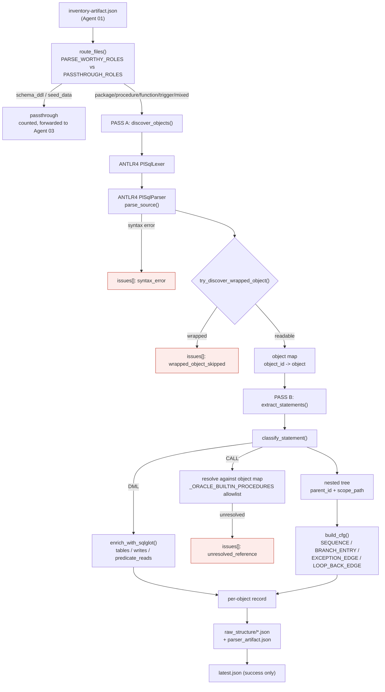
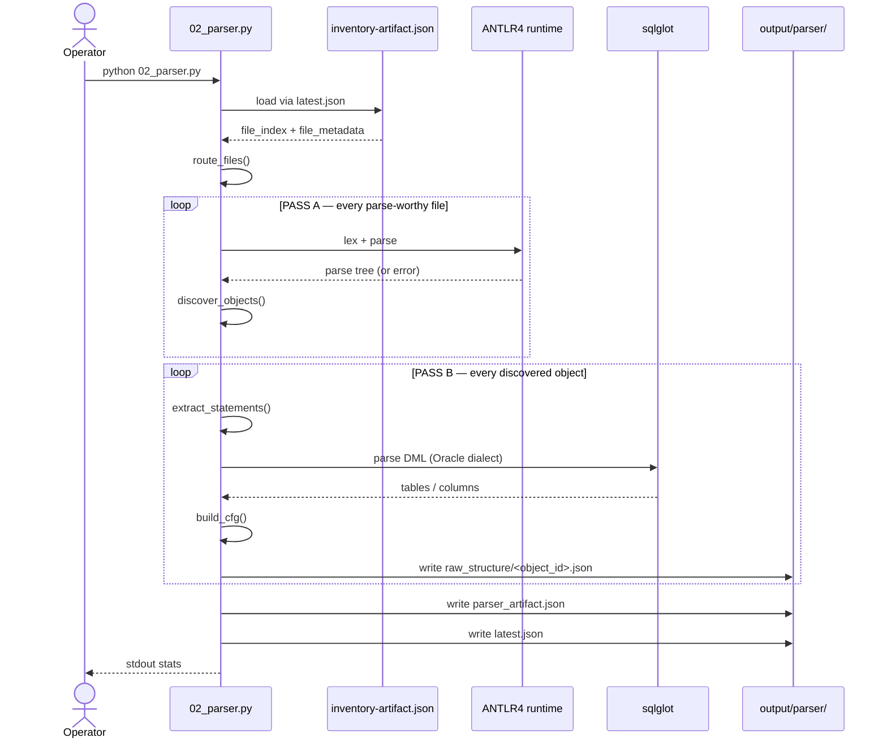
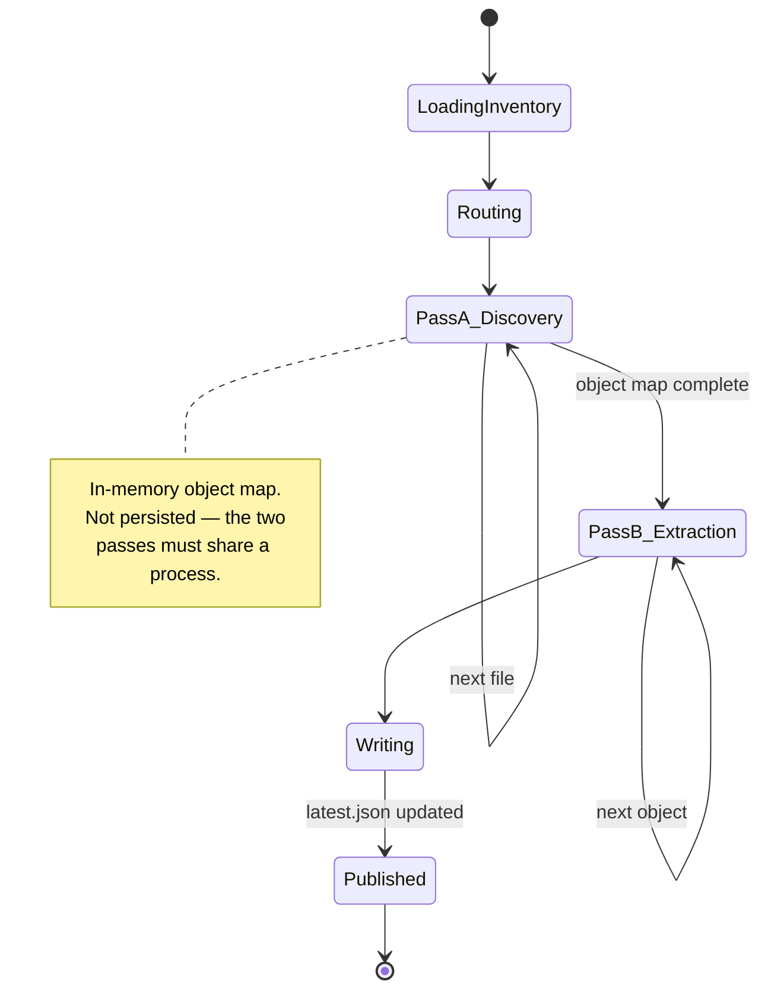

# Agent 02 — Parser

## 1. Document Information

| Field | Value |
|---|---|
| **Agent name** | Parser Agent |
| **Agent identifier** | `2_parser` |
| **Primary implementation** | [`.claude/scripts/02_parser.py`](../../.claude/scripts/02_parser.py) — 858 lines |
| **Related source files** | Vendored grammar: `.claude/scripts/vendor/plsql_grammar/{PlSqlLexer,PlSqlParser,PlSqlLexerBase,PlSqlParserBase,PlSqlParserVisitor}.py` |
| **Related prompt files** | `Not found in the current repository.` No model calls. |
| **Related configuration** | CLI arguments only |
| **Related schemas** | Self-describing JSON; per-object records under `raw_structure/` |
| **Related tests** | [`tests/test_parser.py`](../../tests/test_parser.py) — 31 checks |
| **Related specification** | [`.claude/agents/2_parser_agent.md`](../../.claude/agents/2_parser_agent.md) |
| **Upstream** | Agent 01 (Inventory) |
| **Downstream** | Agents 03, 04, 05, 06, 07, 08 — **every subsequent stage** |
| **Documentation status** | Complete |
| **Confidence level** | High |

---

## 2. Table of Contents

- [3. Agent Overview](#3-agent-overview) · [4. Core Problem Statement](#4-core-problem-statement) · [5. Responsibilities](#5-responsibilities) · [6. Non-Responsibilities](#6-non-responsibilities)
- [7. Inputs](#7-inputs) · [8. Outputs](#8-outputs) · [9. Internal Technical Workflow](#9-internal-technical-workflow)
- [10. Agent Architecture Diagram](#10-agent-architecture-diagram) · [11. Sequence Diagram](#11-sequence-diagram) · [12. State Management](#12-state-management)
- [13. Prompt and LLM Design](#13-prompt-and-llm-design) · [14. Technologies and Techniques](#14-technologies-and-techniques)
- [15. Algorithms, Rules, Heuristics, and Formulas](#15-algorithms-rules-heuristics-and-formulas)
- [16. Error Handling and Recovery](#16-error-handling-and-recovery) · [17. Security and Guardrails](#17-security-and-guardrails)
- [18. Performance and Scalability](#18-performance-and-scalability) · [19. Testing and Validation](#19-testing-and-validation)
- [20. Evaluation and Quality Metrics](#20-evaluation-and-quality-metrics) · [21. Observability](#21-observability)
- [22. Configuration and Environment](#22-configuration-and-environment) · [23. Deployment and Runtime](#23-deployment-and-runtime)
- [24. Extension and Maintenance Guide](#24-extension-and-maintenance-guide) · [25. Known Limitations](#25-known-limitations)
- [26. Open Questions](#26-open-questions) · [27. Source Traceability](#27-source-traceability) · [28. References](#28-references)

---

## 3. Agent Overview

**What it does.** Converts PL/SQL source text into structured data using a formal grammar. Produces, per database object: parameters, declarations, cursors, exception handlers, a **nested statement tree**, and a **control-flow graph**.

**Why it exists.** This is the only stage that reads PL/SQL characters. Everything downstream operates on its output. Regular expressions cannot survive nested blocks, string literals containing keywords, or `CASE` inside `CASE` — a real grammar is required.

**Where it sits.** Stage 2 of 8. The single most load-bearing stage.

**If removed.** The pipeline produces nothing. Agents 03–08 all consume `parser_artifact.json` or its per-object records.

---

## 4. Core Problem Statement

**Problem.** Turn opaque PL/SQL text into a queryable structure with stable, traceable identifiers.

**Constraints handled.**
- Nested blocks, nested `CASE`, string literals containing SQL keywords — solved by using a real parser, not regex
- Package members must be addressable separately from their package
- Statements must be individually addressable for later rule traceability
- Calls must be resolvable across files, which requires knowing all objects before resolving any
- Oracle-wrapped (obfuscated) objects cannot be parsed — must degrade, not crash

**Responsibility boundary.** Structure only. This agent never interprets business meaning.

**Expected result.** `parser_artifact.json` plus one JSON file per object under `raw_structure/`.

**Downstream impact.** `statement_id` produced here is the join key used by Agent 05 (rule provenance), Agent 06 (diagram labels), Agent 07 (traceability matrix) and Agent 08 (`IMPLEMENTED_AT` graph edges).

---

## 5. Responsibilities

1. Route files by `file_role` from Agent 01 (`route_files`, L~90)
2. Parse with ANTLR4 (`parse_source`)
3. Two-pass object discovery (`discover_objects`)
4. Assign owner-qualified `object_id` (`make_object_id`)
5. Detect and record Oracle-wrapped objects (`try_discover_wrapped_object`, L~217)
6. Classify statements (`classify_statement`, L~310)
7. Build the nested statement tree with `parent_id` and `scope_path` (`extract_statements`)
8. Enrich DML via sqlglot (`enrich_with_sqlglot`)
9. Build the control-flow graph (`build_cfg`)
10. Resolve internal calls; allowlist Oracle builtins (`_ORACLE_BUILTIN_PROCEDURES`, L622)
11. Pass DDL/seed files through untouched to Agent 03

---

## 6. Non-Responsibilities

Does **not**: parse DDL semantics (Agent 03); compute complexity (Agent 04); identify business rules (Agent 05); draw anything (Agent 06); interpret intent (Agent 05/07).

**Boundary note.** This agent stores almost nothing on control-flow statements beyond position and nesting — an `IF` record carries only `nesting_depth`. Condition *text* is deliberately re-sliced from source by Agents 04, 05 and 06. `Confirmed from implementation` — see Agent 06's `label_for_statement`, which must call Agent 05 for a decision label because Agent 02 does not store one.

---

## 7. Inputs

### Input 1 — Inventory artefact

| Property | Value |
|---|---|
| **Source** | `output/inventory/latest.json` → `inventory-artifact.json` |
| **Producer** | Agent 01 |
| **Required fields** | `file_index`, `file_metadata` (with `abs_path`, `file_role`) |
| **Validation** | Pointer file must exist and parse; missing file raises | `load_inventory` |
| **Failure behaviour** | Exception propagates — the stage aborts |
| **Evidence** | `load_inventory`, `--inventory-root` / `--inventory-run` |

### Input 2 — PL/SQL source files
Read from `abs_path` recorded by Agent 01. Only files whose role is in `PARSE_WORTHY_ROLES = {"package","procedure","function","trigger","mixed"}` (L62) are parsed. `PASSTHROUGH_ROLES = {"schema_ddl","seed_data"}` (L63) are counted and forwarded.

**Size / token limits:** `Not found in the current repository.`

---

## 8. Outputs

### Output 1 — `parser_artifact.json`

| Field | Purpose |
|---|---|
| `pipeline_stage`, `generated_at`, `upstream` | Provenance |
| `stats` | `objects_parsed`, `package_members`, `statements_extracted`, `dynamic_sql_blocks`, `parse_errors`, `unresolved_calls` |
| `object_index` | `object_id → relative path of the per-object record` |
| `issues` | `syntax_error`, `unresolved_reference`, `wrapped_object_skipped` |
| `files_parsed` / `files_passthrough` / `files_skipped` | Routing outcome |

### Output 2 — per-object record (`raw_structure/<object_id>.json`)

Confirmed fields: `object_id`, `type`, `file_id`, `owner`, `name`, `parent_object_id`, `start_line`, `end_line`, `parse_status`, `parameters[]`, `parse_issues[]`, `declarations[]`, `cursors[]`, `statements{}`, `control_flow_graph{}`.

**Statement record** — `statement_id`, `statement_type`, `start_line`, `end_line`, `parent_id`, `scope_path[]`, `nesting_depth`, plus type-specific fields:

| Statement type | Extra fields |
|---|---|
| `UPDATE` | `tables[]`, `writes[]`, `predicate_reads[]` |
| `SELECT_INTO` | `tables[]`, `reads[]` |
| `CALL` | `call_target`, `call_target_object_id`, `resolved`, `origin` |
| `EXCEPTION_HANDLER` | `handler_for[]` |

**Control-flow graph** — `{nodes: [statement_id], edges: [{from, to, type, branch?, on?}]}` with edge types `SEQUENCE`, `BRANCH_ENTRY`, `EXCEPTION_EDGE`, `LOOP_BACK_EDGE`. A `from` value of `"*"` denotes "any statement", used for block-level exception edges.

**Sample** (live artefact):
```json
{"statement_type":"SELECT_INTO","start_line":49,"end_line":53,"nesting_depth":2,
 "tables":["accounts"],
 "reads":["account_number","account_status","balance","daily_transfer_limit","p_from_account"]}
```
> Note the read list contains `p_from_account`, a **parameter**, not a column. Downstream consumers must filter. Agent 08's `g.rel()` guard does this by refusing edges to non-existent nodes.

---

## 9. Internal Technical Workflow

| # | Step | Implementation |
|---|---|---|
| 1 | CLI invocation | `main()` |
| 2 | Load inventory via `latest.json` or pinned run | `load_inventory` |
| 3 | Route files by role | `route_files` |
| 4 | **Pass A** — discover every object across the whole run | `discover_objects` |
| 5 | ANTLR4 lex + parse per file | `parse_source` |
| 6 | Wrapped-object detection | `try_discover_wrapped_object` (L217) |
| 7 | **Pass B** — extract statements, resolve calls against Pass A's map | `extract_statements` |
| 8 | Classify each statement | `classify_statement` (L310) |
| 9 | Enrich DML with sqlglot (Oracle dialect) | `enrich_with_sqlglot` |
| 10 | Build control-flow graph | `build_cfg` |
| 11 | Write per-object records, then the manifest | `main` |
| 12 | Update `latest.json` on success | `main` |

**Why two passes.** A call in file A may target an object in file B. Resolution is impossible until all objects are known. `Confirmed from implementation.`

**Tools called:** ANTLR4 runtime (vendored grammar), sqlglot. **No model, no network, no database.**

---

## 10. Agent Architecture Diagram



---

## 11. Sequence Diagram



---

## 12. State Management

No shared state object. Identical model to Agent 01: filesystem artefacts plus `latest.json` pointer-after-write.

**Agent-local state:** the Pass-A object map, held in memory between the two passes within a single process. It is not persisted separately; it is the reason the two passes cannot be run as separate invocations.



---

## 13. Prompt and LLM Design

`Not found in the current repository.` No model calls. All prompt, temperature, token-limit, tool-calling, and prompt-injection subsections are not applicable.

---

## 14. Technologies and Techniques

| Technology | Where | Why | Trade-offs | Evidence |
|---|---|---|---|---|
| **ANTLR4 + Oracle PL/SQL grammar** (vendored from `antlr/grammars-v4`, Apache 2.0) | `parse_source` | A real grammar survives nesting, string literals containing keywords, and nested `CASE`; regex cannot | Large vendored code; requires a post-generation patch (see Limitations) | `_VENDOR_DIR` L38; `vendor/plsql_grammar/NOTICE.md` |
| **sqlglot (Oracle dialect)** | `enrich_with_sqlglot` | Recovers tables, written columns and predicate columns from DML far more cheaply than walking the ANTLR tree | Independent parser — a second failure mode; may disagree with ANTLR | `extract_sqlglot_text`, `enrich_with_sqlglot` |
| **Two-pass architecture** | `discover_objects` → `extract_statements` | Cross-file call resolution requires a complete object map first | Whole run must be in memory; cannot stream | Implementation |
| **Flat ID + hierarchy in `parent_id`** | `extract_statements` | IDs stay sortable and joinable; structure lives in a field | Consumers must walk the tree themselves | Statement records |

**Alternative not taken:** storing condition text on `IF` records. `Architectural inference based on the following repository evidence:` `IF` records carry only `nesting_depth`; Agents 04, 05 and 06 each re-slice raw source. No comment states why. This is the single most-repeated piece of work in the pipeline. See [Open Questions](#26-open-questions).

---

## 15. Algorithms, Rules, Heuristics, and Formulas

### 15.1 Statement identifier

$$\text{statement\_id} = \text{file\_id} \;\Vert\; \text{"\_\_"} \;\Vert\; \text{object\_id} \;\Vert\; \text{"\_\_STMT\_"} \;\Vert\; \text{seq}_{04d}$$

**Example:** `04_MEDIUM_PROCESS_MONTHLY_INTEREST_CREDIT__B115DB87__PROC-.SP_PROCESS_MONTHLY_INTEREST_CREDIT__STMT_0004`

**Properties:** zero-padded sequence makes string sort equal numeric sort. Embeds `file_id`, so it inherits path-stability from Agent 01. **This is the pipeline's primary join key.**

### 15.2 Object identifier
Owner-qualified, `TYPE-OWNER.NAME`, with `::` separating package members (e.g. `PKGB-APP.ACCOUNT_MGMT::CREDIT_ACCOUNT`) — mirroring Oracle's own backtrace convention. `make_object_id`; `TYPE_TAXONOMY` L172.

### 15.3 Recursive tree search
`find_recursive` exists because `Into_clauseContext` sits several levels below `Select_statementContext` and is invisible to a direct-child search. `Confirmed from implementation` — `find_child`, `find_all_direct_children`, `find_recursive`.

### 15.4 Control-flow graph construction
`build_cfg` emits four edge types. `BRANCH_ENTRY` edges carry a `branch` label (`true`, `elsif`, `false`, `loop body`, `WHEN(...)`). Block-level exception edges use `from: "*"`.

### 15.5 Builtin allowlist
`_ORACLE_BUILTIN_PROCEDURES = {"RAISE_APPLICATION_ERROR"}` (L622) — prevents a standard Oracle builtin being reported as an unresolved external call.

**Numeric thresholds owned by this agent:** none.

---

## 16. Error Handling and Recovery

| Condition | Behaviour | Evidence |
|---|---|---|
| Syntax error | Recorded in `issues[]` as `syntax_error`; run continues | `issues` handling |
| Wrapped (obfuscated) object | Recorded as `wrapped_object_skipped`; not fatal | `try_discover_wrapped_object` L217 |
| Unresolved call | Recorded as `unresolved_reference`; counted in `stats` | Pass B |
| sqlglot failure on a statement | Caught; the statement keeps its ANTLR-derived fields | `try` blocks (3 total) |
| Missing inventory | Exception propagates; stage aborts | `load_inventory` |

**Try blocks:** 3. **`raise` statements:** 2. **`sys.exit`:** 0.
**Retries:** none. **Partial success:** supported and intended — a single bad file does not abort the run.
**Idempotency:** yes, modulo timestamp and run directory.

---

## 17. Security and Guardrails

| Control | Status |
|---|---|
| Authentication / authorization | Not applicable — local CLI |
| Secrets | None used. No env vars, no credentials. |
| Input validation | Artefact presence; parse errors captured not raised |
| Output validation | `Not found in the current repository.` |
| Command execution | None |
| Network access | **None** |
| Dependency risk | **Two third-party dependencies** — `antlr4-python3-runtime` and `sqlglot` — with **no pinned manifest**. This is the largest supply-chain gap in the repository. |
| Auditability | Run versioning |

**Missing controls:** no dependency pinning; no output schema validation; no limit on parse time or tree size.

---

## 18. Performance and Scalability

**Measured on `src/`:** 5 objects, 124 statements, 0 parse errors. Wall-clock a few seconds. `Measured — observed during pipeline runs.`

**Estimated:** time dominated by ANTLR parsing, approximately **O(N × L)** with a significant constant; memory **O(total objects + largest parse tree)** because Pass A holds every object.

| Property | Value |
|---|---|
| Model / network / DB calls | 0 |
| Parser invocations | 1 ANTLR parse per parse-worthy file, plus 1 sqlglot parse per DML statement |
| Processing | Sequential |
| Caching / batching / concurrency | None |

**Bottleneck:** ANTLR parse time. **Scaling limitation:** the whole object map is held in memory; there is no streaming or partitioning.

---

## 19. Testing and Validation

**Command:** `python tests/test_parser.py` — **31 checks.** `Confirmed from tests.`

Covers: object discovery, parameter extraction, statement classification, the nested tree, CFG edge types (including `BRANCH_ENTRY` presence, a documented past defect), sqlglot enrichment, and the builtin allowlist.

**Known past defects now guarded by tests** (`Confirmed from existing documentation`, `.claude/agents/2_parser_agent.md` and `6_diagram_agent.md`):
1. `build_cfg` linked only siblings — a decision had no edge to any of its branches.
2. `classify_statement` returned `"IF_STATEMENT"` while recursion checked `"IF"`, so branches never recursed.
3. `Into_clauseContext` invisible to direct-child search.
4. sqlglot conflated `UPDATE SET` targets with `WHERE` columns.

**Coverage gaps:** no test for a genuinely wrapped object; no test for a file that fails to parse entirely; no performance test.

---

## 20. Evaluation and Quality Metrics

**No formal evaluation framework for parsing accuracy exists.** `Confirmed from repository inspection.`

Implicit quality signal: `stats.parse_errors` and `stats.unresolved_calls`, both `0` on the current corpus. These are **counters, not accuracy measures** — a silently mis-parsed statement would not appear in either.

**Recommendation (not implemented):** compare extracted statement counts against a hand-counted ground truth for a sample of files.

---

## 21. Observability

`print()` only; `--verbose` adds detail. No `logging` module, no structured fields, no metrics backend, no tracing. `run_version` acts as the cross-stage correlation identifier.

**Durable diagnostics:** the `issues[]` array in the artefact is the richest debugging surface in the pipeline — it names the file, the issue type and a message for every parse problem.

**Debugging procedure:** inspect `parser_artifact.json → issues[]` first; then the per-object record under `raw_structure/`.

---

## 22. Configuration and Environment

Environment variables: `Not found in the current repository.` Configuration files: `Not found in the current repository.`

| Flag | Default |
|---|---|
| `--inventory-root` | `output/inventory` |
| `--inventory-run` | `latest` |
| `--output-root` | `output/parser` |
| `--output` | none (enables versioning when omitted) |
| `--verbose` | off |

---

## 23. Deployment and Runtime

Entry point `python .claude/scripts/02_parser.py`. Short-lived CLI process. **Runtime dependencies: `antlr4-python3-runtime`, `sqlglot`** — neither declared in any manifest. No Docker, no CI, no health checks, no service.

**Grammar regeneration** is a separate concern: `tools_antlr_build/` holds the `.g4` sources and a jar. Regenerated code requires a post-generation patch (see Limitations).

---

## 24. Extension and Maintenance Guide

| Task | Where | Watch out for |
|---|---|---|
| Support a new statement type | `classify_statement` (L310), `_LEAF_TYPE_NAMES` (L303) | Agent 04's `_BLOCK_TYPES`, Agent 06's `_KIND_BY_STATEMENT`, Agent 08's edge mapping all switch on these strings |
| Add a field to statements | `extract_statements` | Consumers read defensively with `.get()`, so additions are safe; removals are not |
| Add a CFG edge type | `build_cfg` | Agent 06 maps edge types to visual styles; Agent 08 maps them to relationship types. Both need updating. |
| Regenerate the grammar | `tools_antlr_build/` | **The generated Python uses `this.` instead of `self.` and must be patched.** Documented in `vendor/plsql_grammar/NOTICE.md`. |
| Add a builtin to the allowlist | `_ORACLE_BUILTIN_PROCEDURES` (L622) | |
| Change `statement_id` format | `extract_statements` | **Breaks Agents 05, 06, 07, 08 simultaneously.** It is the pipeline's join key. |

---

## 25. Known Limitations

1. **The generated ANTLR Python requires a manual patch** (`this.` → `self.`) after every regeneration. `Confirmed from existing documentation` — `vendor/plsql_grammar/NOTICE.md`.
2. **Two undeclared third-party dependencies.** No `requirements.txt` exists.
3. **Dynamic SQL is not resolved.** Counted as `dynamic_sql_blocks` and flagged; contents are not analysed. Agent 08 exports this as a `BlindSpot` node.
4. **Wrapped objects cannot be parsed** — recorded and skipped.
5. **`reads[]` mixes columns and parameters.** Consumers must filter.
6. **Control-flow statements carry no condition text**, forcing three downstream agents to re-slice raw source independently.
7. **Whole-run in-memory object map** limits scalability.

---

## 26. Open Questions

1. Why is condition text not stored on `IF`/`CASE` records, given three downstream agents re-derive it? No rationale is recorded. `Requires stakeholder confirmation.`
2. What is the intended behaviour when ANTLR and sqlglot disagree about a statement's tables? No reconciliation logic or test exists.
3. Which grammar revision is vendored? `NOTICE.md` records provenance; a version pin was not verified during this inspection.
4. Is there a maximum supported file size or parse timeout? Neither is implemented.

---

## 27. Source Traceability

| Topic | File | Function / constant | Evidence type | Confidence |
|---|---|---|---|---|
| ANTLR4 used for parsing | `02_parser.py` | `parse_source`, `_VENDOR_DIR` (L38) | Confirmed from implementation | High |
| sqlglot used for DML | `02_parser.py` | `enrich_with_sqlglot` | Confirmed from implementation | High |
| Two-pass design | `02_parser.py` | `discover_objects` → `extract_statements` | Confirmed from implementation | High |
| Routing constants | `02_parser.py` | L62–63 | Confirmed from implementation | High |
| Builtin allowlist | `02_parser.py` | L622 | Confirmed from implementation | High |
| CFG edge types | `02_parser.py` | `build_cfg` | Confirmed from implementation | High |
| Statement ID format | live artefact + `extract_statements` | — | Confirmed from implementation | High |
| `reads[]` contains parameters | live artefact sample | — | Confirmed from implementation | High |
| Grammar patch requirement | `vendor/plsql_grammar/NOTICE.md` | — | Confirmed from existing documentation | High |
| 31 test checks | `tests/test_parser.py` | — | Confirmed from tests | High |
| No condition text stored | `02_parser.py` statement records | — | Confirmed from implementation | High |
| Reason for that omission | — | — | **Not found in the repository** | — |

---

## 28. References

### Present in the repository
- `.claude/agents/2_parser_agent.md` — design rationale, records past defects
- `.claude/scripts/vendor/plsql_grammar/NOTICE.md` — grammar provenance, Apache 2.0, patch requirement
- `.claude/skills/reference-graph/SKILL.md` — reference-resolution behaviour

**This agent declares no `DESIGN_REFERENCES` block in code.** `Confirmed from implementation.`

### Directly influenced the implementation
- [antlr/grammars-v4 Oracle PL/SQL grammar](https://github.com/antlr/grammars-v4) — vendored, Apache 2.0. Confirmed by `NOTICE.md`.
- [sqlglot](https://github.com/tobymao/sqlglot) — imported and used in Oracle dialect.
- OpenTelemetry span model — the flat-ID-plus-`parent_id` shape mirrors it. Referenced in project discussion; **not cited in code.** `Architectural inference.`

### Discovered during documentation research (format only)
- [arc42](https://arc42.org/overview), [C4 model](https://c4model.com) — document and diagram structure.

---

*Every claim is traceable to a file and function, labelled an architectural inference, or marked `Not found in the current repository.`*
