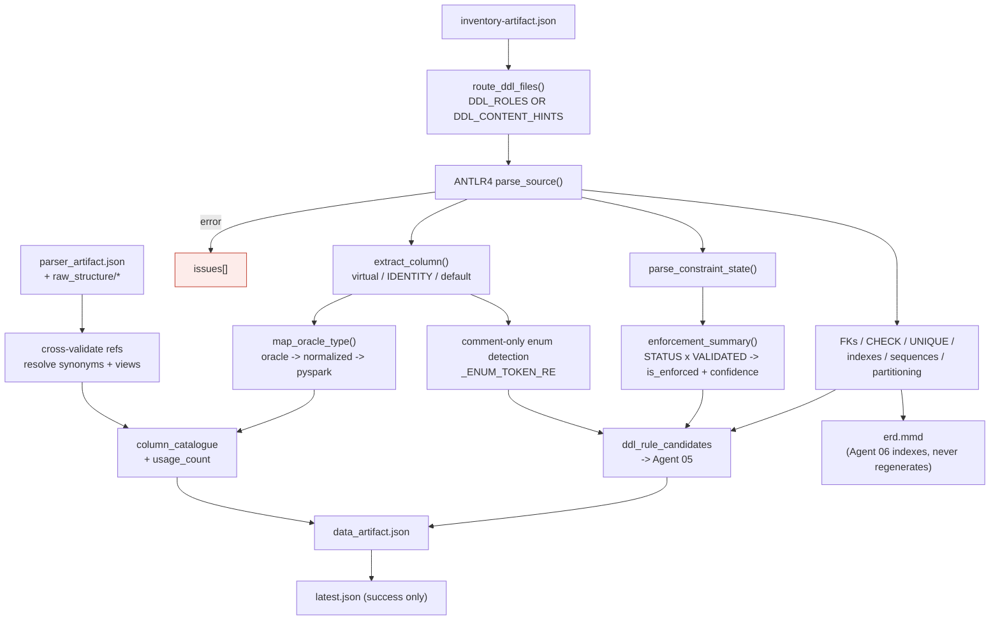
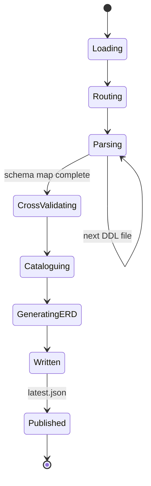

# Agent 03 — Data

## 1. Document Information

| Field | Value |
|---|---|
| **Agent name** | Data Agent |
| **Agent identifier** | `3_data` |
| **Primary implementation** | [`.claude/scripts/03_data.py`](../../.claude/scripts/03_data.py) — 1,431 lines (largest agent) |
| **Related source files** | Vendored ANTLR grammar (shared with Agent 02) |
| **Related prompt files** | `Not found in the current repository.` |
| **Related configuration** | CLI arguments only |
| **Related tests** | [`tests/test_data.py`](../../tests/test_data.py) — 76 checks (largest suite) |
| **Related specification** | [`.claude/agents/3_data_agent.md`](../../.claude/agents/3_data_agent.md) |
| **Upstream** | Agent 01 (routing), Agent 02 (cross-validation targets) |
| **Downstream** | Agents 05, 06, 07, 08 |
| **Documentation status** | Complete |
| **Confidence level** | High |

---

## 2. Table of Contents

- [3. Agent Overview](#3-agent-overview) · [4. Core Problem Statement](#4-core-problem-statement) · [5. Responsibilities](#5-responsibilities) · [6. Non-Responsibilities](#6-non-responsibilities)
- [7. Inputs](#7-inputs) · [8. Outputs](#8-outputs) · [9. Internal Technical Workflow](#9-internal-technical-workflow)
- [10. Agent Architecture Diagram](#10-agent-architecture-diagram) · [11. Sequence Diagram](#11-sequence-diagram) · [12. State Management](#12-state-management)
- [13. Prompt and LLM Design](#13-prompt-and-llm-design) · [14. Technologies and Techniques](#14-technologies-and-techniques)
- [15. Algorithms, Rules, Heuristics, and Formulas](#15-algorithms-rules-heuristics-and-formulas)
- [16. Error Handling and Recovery](#16-error-handling-and-recovery) · [17. Security and Guardrails](#17-security-and-guardrails)
- [18. Performance and Scalability](#18-performance-and-scalability) · [19. Testing and Validation](#19-testing-and-validation)
- [20. Evaluation and Quality Metrics](#20-evaluation-and-quality-metrics) · [21. Observability](#21-observability)
- [22. Configuration and Environment](#22-configuration-and-environment) · [23. Deployment and Runtime](#23-deployment-and-runtime)
- [24. Extension and Maintenance Guide](#24-extension-and-maintenance-guide) · [25. Known Limitations](#25-known-limitations)
- [26. Open Questions](#26-open-questions) · [27. Source Traceability](#27-source-traceability) · [28. References](#28-references)

---

## 3. Agent Overview

**What it does.** Parses DDL to build the physical data dictionary — tables, columns, keys, constraints, indexes, sequences, partitioning — records each constraint's **real enforcement state**, cross-validates Agent 02's table and column references, and generates the ERD.

**Why it exists.** A business rule written into the database is only a guarantee if the database is *enforcing* it. Oracle constraints can exist and be inactive. This agent is the only place that distinction is captured.

**If removed.** No data model, no ERD, no DDL-sourced rules, no type mapping for a rebuild, and no cross-validation of Agent 02's references.

---

## 4. Core Problem Statement

**Problem.** Recover the physical schema and determine which declared rules are actually in force.

**Constraints handled.**
- Oracle constraint state is two independent axes (`STATUS` × `VALIDATED`) — four combinations, not two
- ANTLR's `getText()` strips whitespace, corrupting extracted expressions
- Files may contain a mix of DDL and code, so role alone is insufficient for routing
- `%TYPE` / `%ROWTYPE` references must be resolved to concrete types
- Views and synonyms must be resolved before validating a table reference

**Responsibility boundary.** Physical schema and its enforcement state. Business interpretation belongs to Agent 05.

---

## 5. Responsibilities

1. Route DDL files by role **and content hints** (`route_ddl_files`; `DDL_ROLES` L132, `DDL_CONTENT_HINTS` L143)
2. Parse DDL with ANTLR4 (`parse_source`)
3. Extract columns including virtual and IDENTITY (`extract_column`, `parse_identity_clause`)
4. Map Oracle types to target types (`map_oracle_type`)
5. Parse constraint enforcement state (`parse_constraint_state`, `enforcement_summary`)
6. Extract foreign keys with `ON DELETE` behaviour (`_ON_DELETE_RE` L519)
7. Extract CHECK, unique constraints, indexes, sequences, synonyms, partitioning (`_PARTITION_STRATEGY` L586)
8. Detect comment-only enums (`_ENUM_TOKEN_RE` L810)
9. Resolve `%TYPE` / `%ROWTYPE` (`_TYPE_REF_RE` L933, `_ROWTYPE_REF_RE` L934)
10. Cross-validate every table/column reference from Agent 02
11. Build the column catalogue with usage counts
12. Emit `ddl_rule_candidates` for Agent 05
13. Generate `erd.mmd`

---

## 6. Non-Responsibilities

Does **not**: parse procedural code (Agent 02); compute complexity (Agent 04); phrase business rules (Agent 05 consumes `ddl_rule_candidates` and does the phrasing); draw process flows (Agent 06).

**Owns the ERD.** Agent 06 explicitly *indexes* `erd.mmd` rather than regenerating it — "two generators for one diagram would be an architecture smell." `Confirmed from existing documentation`, `.claude/agents/6_diagram_agent.md`.

---

## 7. Inputs

| Input | Source | Required fields | Failure behaviour |
|---|---|---|---|
| Inventory artefact | `output/inventory/latest.json` | `file_metadata` with `abs_path`, `file_role`, `content_hints` | Exception; stage aborts |
| Parser artefact | `output/parser/latest.json` | `object_index` + per-object records | Used for cross-validation |
| DDL source files | `abs_path` | — | Parse errors recorded, not raised |

**Routing rule.** A file is treated as DDL if its role is in `DDL_ROLES` **or** its `content_hints` match `DDL_CONTENT_HINTS`. The second condition exists because a real defect occurred: files containing `CREATE VIEW` were classified `mixed`, never reached this agent, and every table they defined vanished. `Confirmed from existing documentation.`

---

## 8. Outputs

### `data_artifact.json`

| Field | Content (live corpus) |
|---|---|
| `stats` | 28 counters |
| `tables` | 15 tables |
| `views`, `synonyms` | 0 each |
| `indexes` | 1 |
| `sequences` | 3 |
| `column_catalogue` | 105 entries |
| `inferred_relationships` | 1 |
| `ddl_rule_candidates` | 1 |
| `sequence_usages` | 4 |
| `type_reference_resolutions` | 0 |
| `issues` | 0 |

**Table record fields:** `table`, `columns[]`, `primary_key[]`, `foreign_keys[]`, `check_constraints[]`, `unique_constraints[]`, `partitioning`, `temporary`, `temporary_scope`, `comment`, `source_file`, `start_line`, `end_line`.

**Column record fields:** `name`, `oracle_type`, `normalized_type`, `pyspark_type`, `nullable`, `default`, `precision`, `scale`, `length`, `line`, `is_virtual`, `is_identity`, `inline_primary_key`, `inline_unique`, `inline_check`.

**Foreign-key record** (note the field name — a documentation trap):
```json
{"name":"FK_ACCOUNTS_CUSTOMER","kind":"FOREIGN_KEY","columns":["CUSTOMER_ID"],
 "references_table":"CUSTOMERS","references_columns":["CUSTOMER_ID"],
 "on_delete":"NO_ACTION","relationship_type":"...",
 "enforcement":{"status":"ENABLED","validated":"VALIDATED","deferrable":false,
   "rely":false,"explicitly_stated":false,"is_enforced":true,
   "confidence":"enforced","explanation":"Constraint is ENABLED and VALIDATED — enforced by the database for all data."}}
```
> The field is **`references_table`**, not `referenced_table`. Querying the wrong name returns `None` and looks like missing data.

**Column catalogue entry:** `column_id` (`TABLE.COLUMN`), `table`, `column`, types, `nullable`, `is_primary_key`, `enum_values`, `enum_source`, `used_by_objects[]`, `usage_count`.

### `erd.mmd`
Mermaid `erDiagram`. Solid connectors = declared FKs; dotted = inferred.

---

## 9. Internal Technical Workflow

| # | Step | Implementation |
|---|---|---|
| 1 | Load inventory and parser artefacts | `load_run` |
| 2 | Route DDL files by role **or** content hints | `route_ddl_files` |
| 3 | ANTLR4 parse | `parse_source` |
| 4 | Extract tables, columns, types | `extract_column`, `map_oracle_type` |
| 5 | Parse enforcement state per constraint | `parse_constraint_state` → `enforcement_summary` |
| 6 | Extract FKs, CHECKs, uniques, indexes, sequences, partitioning | dedicated extractors |
| 7 | Detect comment-only enums | `_ENUM_TOKEN_RE` |
| 8 | Resolve `%TYPE` / `%ROWTYPE` | `_TYPE_REF_RE`, `_ROWTYPE_REF_RE` |
| 9 | Cross-validate Agent 02's references (resolving synonyms/views) | cross-validation pass |
| 10 | Build column catalogue with usage counts | catalogue builder |
| 11 | Emit `ddl_rule_candidates` | candidate builder |
| 12 | Generate `erd.mmd` | ERD generator |
| 13 | Write artefact, then `latest.json` | `main` |

---

## 10. Agent Architecture Diagram



---

## 11. Sequence Diagram

```mermaid
sequenceDiagram
    actor Operator
    participant D as 03_data.py
    participant Inv as inventory artefact
    participant Par as parser artefact
    participant ANTLR as ANTLR4 runtime
    participant Out as output/data/

    Operator->>D: python 03_data.py
    D->>Inv: load (latest.json)
    D->>Par: load (latest.json + raw_structure)
    D->>D: route_ddl_files()
    loop each DDL file
        D->>ANTLR: parse
        ANTLR-->>D: parse tree
        D->>D: extract columns / constraints
        D->>D: parse_constraint_state + enforcement_summary
    end
    D->>D: cross-validate Agent 02 references
    D->>D: build column_catalogue + ddl_rule_candidates
    D->>Out: write data_artifact.json
    D->>Out: write erd.mmd
    D->>Out: write latest.json
    D-->>Operator: stdout stats
```

---

## 12. State Management

Same model as Agents 01–02: no shared state object; filesystem artefacts; `latest.json` pointer-after-write. Agent-local state is the in-memory table/column map used for cross-validation.



---

## 13. Prompt and LLM Design

`Not found in the current repository.` No model calls.

---

## 14. Technologies and Techniques

| Technology | Where | Why | Trade-offs |
|---|---|---|---|
| **ANTLR4 (shared grammar)** | `parse_source` | Same grammar as Agent 02; consistent parse semantics across code and DDL | Same patch requirement |
| **`original_text_of()`** | Expression extraction | ANTLR `getText()` **strips whitespace**, producing `account_statusIN('ACTIVE')`. This helper uses the token stream to preserve source text. | Slightly more code; must have `ctx.start`/`ctx.stop` |
| **Two-axis enforcement model** | `parse_constraint_state` | Oracle semantics genuinely require it | More states to handle downstream |
| **Type triple** (Oracle → normalized → PySpark) | `map_oracle_type` | Gives a rebuild a concrete target type | Target platform assumption baked in |

**On `original_text_of`:** this fixed a real, user-visible defect — a rule rendered as *"Restrict Account **Statusin**"*. `Confirmed from existing documentation`, `.claude/agents/3_data_agent.md`.

---

## 15. Algorithms, Rules, Heuristics, and Formulas

### 15.1 Constraint enforcement state — the central algorithm

**Location:** `parse_constraint_state`, `enforcement_summary`.

Oracle exposes two independent axes:

| STATUS | VALIDATED | `is_enforced` | `confidence` | Meaning |
|---|---|---|---|---|
| ENABLED | VALIDATED | `true` | `enforced` | Enforced for all data |
| ENABLED | NOT VALIDATED | `true` | `enforced_new_data_only` | New rows only; existing rows may violate |
| DISABLED | (either) | `false` | `not_enforced` | Documented intent only |

**Consumed by Agent 05** via `_ENFORCEMENT_TO_CONFIDENCE` (`05_rules.py:176`), which maps the confidence string to `(signal_strength, confidence, requires_sme_review)`:

```
"enforced"                -> (5, "confirmed", False)
"enforced_new_data_only"  -> (4, "high",      True)
"not_enforced"            -> (2, "low",       True)
```

`Confirmed from implementation` and `Confirmed from tests` — asserted in `tests/test_rules.py`.

**Design decision:** a DISABLED constraint is still surfaced as a rule rather than dropped, because dropping it would hide documented business intent — but it is scored low, flagged for review, and its BRD statement says the database is not enforcing it. `Confirmed from existing documentation.`

### 15.2 Type mapping
`map_oracle_type` produces `normalized_type` and `pyspark_type`, e.g. `NUMBER(18,2)` → `DECIMAL` → `DecimalType(18,2)`; `VARCHAR2(20)` → `STRING` → `StringType`. Agent 07 publishes `pyspark_type` as the **Target type** column in the build specification.

### 15.3 Inferred relationships
Name-match plus type-compatibility heuristic producing `relationship_type: "inferred"` with `confidence: "medium"` and a `basis` string (`"name_match+type_compatible"`). These are drawn as dotted connectors in the ERD and labelled as inferred in the BRD.

### 15.4 Comment-only enum detection
`_ENUM_TOKEN_RE = ^[A-Z][A-Z0-9_]*$` (L810). Values documented only in a comment are recorded with `enum_source: "comment_only"` and become a `medium`-severity gap in Agent 07 — *"valid values appear only in a source comment, not as a database rule; data may already violate them."*

### 15.5 Other named patterns
`_ON_DELETE_RE` (L519), `_PARTITION_STRATEGY` (L586), `_TYPE_REF_RE` / `_ROWTYPE_REF_RE` (L933–934).

**Numeric thresholds owned by this agent:** none.

---

## 16. Error Handling and Recovery

| Condition | Behaviour |
|---|---|
| DDL parse error | Recorded in `issues[]`, counted in `stats.parse_errors`; run continues |
| Unknown table/column reference | Counted (`stats.unknown_table_refs`, `unknown_column_refs`); reported, not fatal |
| Missing upstream artefact | Exception; stage aborts |
| Unresolvable `%TYPE` | Recorded in `type_reference_resolutions` |

**Try blocks:** 4. **`raise`:** 2. **`sys.exit`:** 0. **Retries:** none. **Partial success:** supported.

---

## 17. Security and Guardrails

| Control | Status |
|---|---|
| Secrets / env vars / network | **None used.** |
| Input validation | Artefact presence; parse errors captured |
| Output validation | `Not found in the current repository.` |
| Data sensitivity | **The artefact contains the full schema** — table and column names, types, constraints. On a real system this is sensitive design information. |
| Dependency risk | ANTLR4 runtime, unpinned |
| Auditability | Run versioning |

**Missing controls:** no schema validation of output; no redaction option for schema names; no dependency pinning.

---

## 18. Performance and Scalability

**Measured on `src/`:** 15 tables, 105 columns, 0 parse errors; a few seconds. `Measured.`
**Estimated:** O(D × L) over DDL files, plus O(R) cross-validation over Agent 02's references. Memory holds the whole schema map.

Model / network / DB calls: **0**. Sequential; no caching, batching or concurrency.

---

## 19. Testing and Validation

**Command:** `python tests/test_data.py` — **76 checks**, the largest suite. `Confirmed from tests.`

Covers enforcement-state parsing across all combinations, type mapping, virtual and IDENTITY columns, `ON DELETE`, partitioning, GTT, comment-only enums, cross-validation, and ERD generation.

**Coverage gaps:** no test for a DDL file that fails to parse entirely; views and synonyms are exercised at 0 instances in the current corpus, so those paths are effectively untested against real data.

---

## 20. Evaluation and Quality Metrics

No formal evaluation framework. `Confirmed from repository inspection.` Quality signals are counters in `stats` (`parse_errors`, `unknown_table_refs`, `unknown_column_refs`), all `0` on the current corpus.

**Recommendation (not implemented):** a DDL corpus with known-correct extraction would allow measuring schema-recovery completeness.

---

## 21. Observability

`print()` only. `stats` (28 counters) plus `issues[]` are the durable diagnostics. No structured logging, metrics backend, or tracing.

**Debugging procedure:** check `stats.parse_errors` and `issues[]`; then confirm routing — if a table is missing, the file most likely never reached this agent (`route_ddl_files`).

---

## 22. Configuration and Environment

Env vars: `Not found in the current repository.` Config files: `Not found in the current repository.`

Flags: `--inventory-root`, `--inventory-run`, `--parser-root`, `--parser-run`, `--output-root`, `--output`, `--verbose`.

---

## 23. Deployment and Runtime

`python .claude/scripts/03_data.py`. Requires `antlr4-python3-runtime` (undeclared). No container, CI, or service.

---

## 24. Extension and Maintenance Guide

| Task | Where | Watch out for |
|---|---|---|
| Support a new DDL construct | dedicated extractor + `parse_source` | Add a `ddl_rule_candidate` kind if it carries business meaning; **Agent 07's `_DDL_KINDS` and `formal_statement` must be updated or the rule renders with a generic statement** |
| Change target-type mapping | `map_oracle_type` | Agent 07 publishes `pyspark_type` directly |
| Add a rule candidate kind | candidate builder | Agent 05 `mine_from_ddl_candidates`; Agent 07 `rule_source_phrase` `RULE_ORIGIN_LABELS` |
| Change enforcement semantics | `enforcement_summary` | Agent 05's `_ENFORCEMENT_TO_CONFIDENCE` is keyed on the confidence **string** |
| Modify the ERD | ERD generator here — **not** Agent 06 | Agent 06 only indexes the file |

---

## 25. Known Limitations

1. **`references_table`, not `referenced_table`** — a naming trap that produces silent `None`s.
2. **Views and synonyms are untested against real data** (0 instances in the corpus).
3. **Inferred relationships are a heuristic** with `medium` confidence and a real false-positive risk; surfaced as such.
4. **Target-type mapping assumes PySpark** as the rebuild platform.
5. **No output schema validation.**
6. **Undeclared ANTLR dependency.**

---

## 26. Open Questions

1. Why is PySpark the assumed rebuild target? No requirement is recorded. `Requires stakeholder confirmation.`
2. What should happen when a synonym resolves to a table outside the analysed schema? No test or policy exists.
3. Should `RELY` constraints be treated as enforced? `rely` is captured but its effect on `is_enforced` was not verified during this inspection.

---

## 27. Source Traceability

| Topic | File | Function / constant | Evidence | Confidence |
|---|---|---|---|---|
| Two-axis enforcement | `03_data.py` | `parse_constraint_state`, `enforcement_summary` | Confirmed from implementation | High |
| Enforcement → confidence mapping | `05_rules.py` | `_ENFORCEMENT_TO_CONFIDENCE` (L176) | Confirmed from implementation + tests | High |
| Content-driven routing | `03_data.py` | `DDL_ROLES` L132, `DDL_CONTENT_HINTS` L143 | Confirmed from implementation | High |
| Whitespace-preserving extraction | `03_data.py` | `original_text_of` | Confirmed from implementation | High |
| Type triple | `03_data.py` | `map_oracle_type` | Confirmed from implementation | High |
| FK field name | live artefact | — | Confirmed from implementation | High |
| ERD ownership | `03_data.py` + `.claude/agents/6_diagram_agent.md` | — | Confirmed from existing documentation | High |
| 76 test checks | `tests/test_data.py` | — | Confirmed from tests | High |
| Routing defect history | `.claude/agents/3_data_agent.md` | — | Confirmed from existing documentation | High |

---

## 28. References

### Present in the repository
This agent declares **7 `DESIGN_REFERENCES` entries** in code (`03_data.py:68`) — the most of any agent. `Confirmed from implementation.` Also: `.claude/agents/3_data_agent.md`, `.claude/skills/file-catalog/SKILL.md`.

### Directly influenced the implementation
- Oracle constraint semantics (`STATUS` × `VALIDATED`) — the enforcement model is a direct implementation of documented Oracle behaviour.
- ANTLR4 Oracle PL/SQL grammar (Apache 2.0), vendored.

### Discovered during documentation research (format only)
- [arc42](https://arc42.org/overview), [C4 model](https://c4model.com).

---

*Every claim is traceable, labelled an inference, or marked `Not found in the current repository.`*
