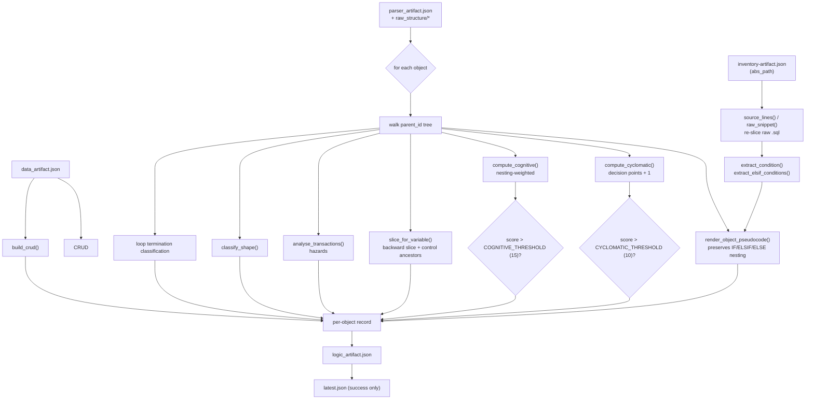
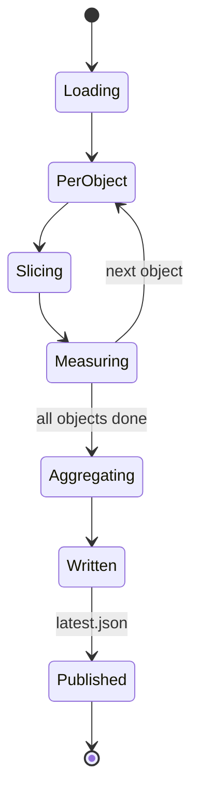

# Agent 04 — Logic

## 1. Document Information

| Field | Value |
|---|---|
| **Agent name** | Logic Agent |
| **Agent identifier** | `4_logic` |
| **Primary implementation** | [`.claude/scripts/04_logic.py`](../../.claude/scripts/04_logic.py) — 917 lines |
| **Related prompt files** | `Not found in the current repository.` |
| **Related tests** | [`tests/test_logic.py`](../../tests/test_logic.py) — 46 checks |
| **Related specification** | [`.claude/agents/4_logic_agent.md`](../../.claude/agents/4_logic_agent.md) |
| **Upstream** | Agent 02 (statements, CFG), Agent 03 (data context), Agent 01 (file paths) |
| **Downstream** | Agents 05, 06, 07, 08 |
| **Documentation status** | Complete |
| **Confidence level** | High |

---

## 2. Table of Contents

- [3. Agent Overview](#3-agent-overview) · [4. Core Problem Statement](#4-core-problem-statement) · [5. Responsibilities](#5-responsibilities) · [6. Non-Responsibilities](#6-non-responsibilities)
- [7. Inputs](#7-inputs) · [8. Outputs](#8-outputs) · [9. Internal Technical Workflow](#9-internal-technical-workflow)
- [10. Agent Architecture Diagram](#10-agent-architecture-diagram) · [11. Sequence Diagram](#11-sequence-diagram) · [12. State Management](#12-state-management)
- [13. Prompt and LLM Design](#13-prompt-and-llm-design) · [14. Technologies and Techniques](#14-technologies-and-techniques)
- [15. Algorithms, Rules, Heuristics, and Formulas](#15-algorithms-rules-heuristics-and-formulas)
- [16. Error Handling and Recovery](#16-error-handling-and-recovery) · [17. Security and Guardrails](#17-security-and-guardrails)
- [18. Performance and Scalability](#18-performance-and-scalability) · [19. Testing and Validation](#19-testing-and-validation)
- [20. Evaluation and Quality Metrics](#20-evaluation-and-quality-metrics) · [21. Observability](#21-observability)
- [22. Configuration and Environment](#22-configuration-and-environment) · [23. Deployment and Runtime](#23-deployment-and-runtime)
- [24. Extension and Maintenance Guide](#24-extension-and-maintenance-guide) · [25. Known Limitations](#25-known-limitations)
- [26. Open Questions](#26-open-questions) · [27. Source Traceability](#27-source-traceability) · [28. References](#28-references)

---

## 3. Agent Overview

**What it does.** Translates Agent 02's control-flow structure into readable pseudocode, computes complexity metrics, produces backward program slices per variable, analyses transaction behaviour, classifies each object's processing shape, and builds the CRUD matrix.

**Why it exists.** Agent 02 produces structure; nobody can read it. This agent produces the *interpretable* layer that Agent 05 mines for rules and Agent 07 publishes as process specifications.

**If removed.** Agent 05 loses `variable_derivation` rules entirely (it consumes slices). Agents 06 and 07 lose complexity, shape, CRUD and transaction hazards. The BRD loses its process-specification chapter.

---

## 4. Core Problem Statement

**Problem.** Make control flow measurable and readable without re-parsing.

**Constraints handled.**
- Pseudocode must preserve `IF`/`ELSIF`/`ELSE` nesting — requires walking `parent_id`, not the flat statement list
- Condition text is not stored by Agent 02, so it must be re-sliced from raw source
- Loop termination must be classified for a rebuild to know whether a set operation is possible
- PL/SQL objects are called by schedulers outside the repository, so absence of internal callers must **not** be reported as dead code

**Responsibility boundary.** Structural interpretation and measurement. No business naming (Agent 05), no visual rendering (Agent 06).

---

## 5. Responsibilities

1. Render pseudocode by walking the statement tree (`render_object_pseudocode`)
2. Compute cyclomatic complexity (`compute_cyclomatic`)
3. Compute cognitive complexity (`compute_cognitive`, `nesting_level_of`)
4. Produce backward variable slices (`slice_for_variable`, `control_ancestors`)
5. Analyse transactions and hazards (`analyse_transactions`)
6. Classify processing shape (`classify_shape`)
7. Build the CRUD matrix (`build_crud`)
8. Classify loop termination
9. Generate a narrative per object

---

## 6. Non-Responsibilities

Does **not**: parse source into structure (Agent 02); read DDL (Agent 03); name or phrase business rules (Agent 05); draw diagrams (Agent 06).

**Explicit non-goal — dead-code detection.** The specification states this directly: PL/SQL objects are routinely invoked by schedulers or code outside the repository, so *"no internal callers"* is reported as **informational only**, never as a finding. `Confirmed from existing documentation`, `.claude/agents/4_logic_agent.md`. Live output confirms: `No internal callers (info): 5`.

---

## 7. Inputs

| Input | Source | Used for |
|---|---|---|
| Parser artefact + per-object records | `output/parser/latest.json` | Statement tree, CFG, DML fields |
| Inventory artefact | `output/inventory/latest.json` | `abs_path` for raw-source re-slicing |
| Data artefact | `output/data/latest.json` | Data context |

**Raw source access.** This agent reads the original `.sql` files again (`source_lines`, `raw_snippet`) because Agent 02 does not store condition text. `Confirmed from implementation.`

---

## 8. Outputs

### `logic_artifact.json`
`stats` (11 counters), `shape_distribution`, `crud_matrix` (object → table → CRUD string), `object_index`, `note_on_no_internal_callers`.

### Per-object record
`object_id`, `type`, `file_id`, `narrative`, `shape{}`, `complexity{}`, `pseudocode[]`, `variable_slices[]`, `transactions{}`, `crud_matrix{}`, `loops[]`, `statement_count`.

**`complexity` sample:**
```json
{"cyclomatic":{"score":8,"decision_points":7,
  "breakdown":{"if":2,"elsif":2,"case_when":0,"loop":1,
               "exception_handler":2,"logical_operators":0},
  "threshold":10,"exceeds_threshold":false,"interpretation":"..."}}
```

**`transactions` sample:**
```json
{"commits":[{"statement_id":"...","line":52}],"rollbacks":[...],"savepoints":[],
 "commit_inside_loop":[],"rollback_in_exception_handler":[...],
 "transaction_segments":[{"statement_count":14,"tables_written":[],
   "note":"no COMMIT — transaction left open to the caller"}],
 "hazards":[{"hazard":"NO_TRANSACTION_CONTROL","severity":"info",
   "occurrences":[],"explanation":"..."}]}
```

**`loops` sample:** `{"statement_id":"...","line":34,"termination_pattern":"COUNTED_OR_CURSOR_LOOP"}`

**Live corpus:** 151 pseudocode lines, 25 variable slices, 1 object over the cyclomatic threshold, 1 SAVEPOINT hazard, 0 unbounded loops.

---

## 9. Internal Technical Workflow

| # | Step | Implementation |
|---|---|---|
| 1 | Load parser, inventory, data artefacts | `load_run` |
| 2 | For each object, load its parser record | `main` |
| 3 | Re-slice raw source for condition text | `source_lines`, `raw_snippet`, `extract_condition` |
| 4 | Render pseudocode by walking `parent_id` | `render_object_pseudocode` |
| 5 | Count decision points | `count_logical_operators`, `branch_labels` |
| 6 | Compute cyclomatic complexity | `compute_cyclomatic` |
| 7 | Compute cognitive complexity | `compute_cognitive`, `nesting_level_of` |
| 8 | Build backward slices | `identifiers_in`, `assignment_targets_and_sources`, `control_ancestors`, `slice_for_variable` |
| 9 | Analyse transactions | `analyse_transactions` |
| 10 | Classify shape and loops | `classify_shape` |
| 11 | Build CRUD matrix | `build_crud` |
| 12 | Write per-object records + artefact, then `latest.json` | `main` |

---

## 10. Agent Architecture Diagram



---

## 11. Sequence Diagram

```mermaid
sequenceDiagram
    actor Operator
    participant L as 04_logic.py
    participant Par as parser artefact
    participant FS as original .sql files
    participant Out as output/logic/

    Operator->>L: python 04_logic.py
    L->>Par: load object_index + records
    loop each object
        L->>FS: read raw source (condition text)
        FS-->>L: source lines
        L->>L: render_object_pseudocode()
        L->>L: compute_cyclomatic / compute_cognitive
        L->>L: slice_for_variable()
        L->>L: analyse_transactions / classify_shape / build_crud
        L->>Out: write per-object record
    end
    L->>Out: write logic_artifact.json + latest.json
    L-->>Operator: stdout stats
```

---

## 12. State Management

No shared state object. Filesystem artefacts; `latest.json` pointer-after-write. Agent-local state is per-object and does not persist between objects.



---

## 13. Prompt and LLM Design

`Not found in the current repository.` No model calls. The `narrative` field is **template-generated from computed fields**, not model-generated — evidenced by its formulaic output: *"PROC-.SP_TRANSFER_FUNDS is a procedure classified as SINGLE_RECORD_TRANSACTION. Reads and writes a small, bounded set of rows in one pass…"*. `Confirmed from implementation.`

---

## 14. Technologies and Techniques

| Technique | Where | Why | Trade-offs |
|---|---|---|---|
| **McCabe cyclomatic complexity (1976)** | `compute_cyclomatic` | Long-established, cheap, comparable across systems | Counts structure, not comprehension difficulty |
| **Campbell cognitive complexity** | `compute_cognitive` | Penalises nesting, which cyclomatic ignores | Less widely known; threshold is a judgement |
| **Weiser backward slicing (1981)** | `slice_for_variable` | Answers "what determines this value?" — the basis of Agent 05's derivation rules | Slices include transitive dependencies, which caused a real defect downstream (see below) |
| **Tree walk over `parent_id`** | `render_object_pseudocode` | Preserves nesting; a flat walk loses `ELSIF`/`ELSE` structure | Requires the tree to be well-formed |
| **Raw-source re-slicing** | `raw_snippet` | Recovers condition text Agent 02 does not store | Duplicated in Agents 05 and 06 — three implementations of the same idea |

**Downstream consequence of slicing semantics.** A backward slice legitimately includes transitive dependencies, so the statement computing `v_interest_amount` also appears in `v_new_balance`'s slice. Agent 05 had to add an `_assigns_variable` guard to stop one formula being attributed to two variables. `Confirmed from existing documentation`, `.claude/agents/5_rules_agent.md`.

---

## 15. Algorithms, Rules, Heuristics, and Formulas

### 15.1 Cyclomatic complexity — `compute_cyclomatic`

$$M = D + 1$$

Where $D$ is the count of decision points, decomposed in `breakdown` as:

$$D = n_{if} + n_{elsif} + n_{case\_when} + n_{loop} + n_{exception\_handler} + n_{logical\_operators}$$

| Variable | Meaning |
|---|---|
| $n_{if}$, $n_{elsif}$ | `IF` and `ELSIF` branches |
| $n_{case\_when}$ | `WHEN` arms of a `CASE` |
| $n_{loop}$ | Loop constructs |
| $n_{exception\_handler}$ | Exception handlers |
| $n_{logical\_operators}$ | `AND` / `OR` in conditions (`count_logical_operators`) |

**Threshold:** `CYCLOMATIC_THRESHOLD = 10` (`04_logic.py:71`).
**Output range:** integer $\geq 1$.
**Worked example** (live corpus, `SP_PROCESS_MONTHLY_INTEREST_CREDIT`): breakdown `if=2, elsif=2, case_when=0, loop=1, exception_handler=2, logical_operators=0` → $D = 7$, $M = 8$, `exceeds_threshold = false`.
**Highest observed:** `SP_TRANSFER_FUNDS`, $M = 16$ — exceeds threshold, surfaced as a `medium` gap by Agent 07 and coloured amber by Agent 06.

### 15.2 Cognitive complexity — `compute_cognitive`

Increment per flow-break, plus a nesting increment. `nesting_level_of` computes depth. `_NESTING_LEVEL_TYPES` / `_NESTING_INCREMENT_TYPES` distinguish constructs that *add* nesting from those that only increment (`else`/`elsif` are hybrid: they increment without adding a nesting penalty).

**Threshold:** `COGNITIVE_THRESHOLD = 15` (`04_logic.py:73`).
**Live corpus:** 0 objects exceed it.

### 15.3 Backward slice — `slice_for_variable`
For a variable $v$, the slice is the transitive closure of statements that determine $v$'s value, **including control ancestors** (`control_ancestors`). Emitted as `determined_by_statements[]` and `depends_on_variables[]`.
**Live corpus:** 25 slices.

### 15.4 Transaction hazards — `analyse_transactions`

| Hazard | Severity (observed) | Meaning |
|---|---|---|
| `COMMIT_INSIDE_LOOP` | — | A commit per iteration; partial completion possible |
| `SAVEPOINT_PARTIAL_ROLLBACK` | `high` | Partial rollback within a transaction; no Spark equivalent |
| `NO_TRANSACTION_CONTROL` | `info` | Boundary owned by the caller |

**Live corpus:** 1 × `SAVEPOINT_PARTIAL_ROLLBACK` (high), 2 × `NO_TRANSACTION_CONTROL` (info).

### 15.5 Shape classification — `classify_shape`
`BATCH_PROCESSOR`, `SINGLE_RECORD_TRANSACTION`, `CALCULATION`, `QUERY_ONLY`, each with a `rationale` string. **Live distribution:** `{CALCULATION:1, SINGLE_RECORD_TRANSACTION:2, QUERY_ONLY:1, BATCH_PROCESSOR:1}`.

### 15.6 Loop termination
`termination_pattern`, e.g. `COUNTED_OR_CURSOR_LOOP`. Agent 07 maps these to plain English (`LOOP_TERMINATION_PHRASES`). Loops with no visible exit carry a `warning` and become a `high` gap.

**Thresholds owned by this agent:** `CYCLOMATIC_THRESHOLD = 10`, `COGNITIVE_THRESHOLD = 15`. Both are module constants with no configuration override.

---

## 16. Error Handling and Recovery

| Condition | Behaviour |
|---|---|
| Missing per-object record | Skipped |
| Unreadable raw source | `source_lines` returns `[]` on `OSError`; condition text degrades to empty |
| Missing upstream artefact | Exception; stage aborts |

**Try blocks:** 1. **`raise`:** 0. **`sys.exit`:** 0. **Retries:** none. **Partial success:** supported.

---

## 17. Security and Guardrails

Secrets, env vars, network: **none**. Re-reads original source files by `abs_path` from Agent 01 — inherits that trust boundary. No output schema validation. No command execution. Auditability via run versioning.

---

## 18. Performance and Scalability

**Measured:** 5 objects, 151 pseudocode lines, 25 slices — seconds. `Measured.`
**Estimated:** slicing is the dominant cost. A naive transitive closure per variable is worst-case **O(V × S)** for V variables and S statements per object. `Architectural inference from the implementation.`

Model / network / DB calls: **0**. Sequential; no caching or concurrency. Raw source is re-read (cached per file in `_SOURCE_CACHE`-style dict within the module).

---

## 19. Testing and Validation

**Command:** `python tests/test_logic.py` — **46 checks.** `Confirmed from tests.`
Covers cyclomatic and cognitive computation, slicing, transaction hazards, shape classification, loop termination, and pseudocode nesting.

**Known past defect guarded:** Agent 07 read `termination_type` while Agent 04 emits `termination_pattern`, so every loop rendered as `UNKNOWN` in the BRD. `Confirmed from existing documentation`, `.claude/agents/7_synthesis_agent.md`.

**Coverage gaps:** no test for an unbounded loop (0 in corpus); no test for `COMMIT_INSIDE_LOOP` (0 in corpus).

---

## 20. Evaluation and Quality Metrics

No formal evaluation framework. Complexity metrics are computed, not evaluated against ground truth. **Recommendation (not implemented):** compare computed cyclomatic scores against a reference tool for a sample.

---

## 21. Observability

`print()` only. Durable diagnostics: `stats` (11 counters), `shape_distribution`, and per-object `hazards`.

---

## 22. Configuration and Environment

Env vars and config files: `Not found in the current repository.`
Flags: `--parser-root`, `--parser-run`, `--inventory-root`, `--inventory-run`, `--output-root`, `--output`, `--verbose`.
**Thresholds are hard-coded constants, not configurable.**

---

## 23. Deployment and Runtime

`python .claude/scripts/04_logic.py`. Standard library only — **no third-party dependency.** No container, CI, or service.

---

## 24. Extension and Maintenance Guide

| Task | Where | Watch out for |
|---|---|---|
| Change a complexity threshold | `CYCLOMATIC_THRESHOLD` L71 / `COGNITIVE_THRESHOLD` L73 | Agent 06 colours objects amber on `exceeds_threshold`; Agent 07 raises a gap |
| Add a hazard type | `analyse_transactions` | Agent 07's `detect_gaps` maps severity; Agent 08 does not currently model hazards as nodes |
| Add a shape | `classify_shape` | Agent 07's `SHAPE_PHRASES` in `lib_business_language.py` must gain a matching entry or it falls back to a generic label |
| Add a loop pattern | loop classifier | Agent 07's `LOOP_TERMINATION_PHRASES` must gain a matching key |
| Rename an output field | per-object record | **This has caused a defect before** (`termination_type` vs `termination_pattern`) |

---

## 25. Known Limitations

1. **Thresholds are not configurable** — module constants only.
2. **Slices include transitive dependencies**, requiring a guard in Agent 05.
3. **Raw-source re-slicing is duplicated** across Agents 04, 05 and 06 — three implementations of `raw_snippet`-style logic.
4. **`narrative` uses raw identifiers** (`PROC-.SP_TRANSFER_FUNDS is a procedure classified as SINGLE_RECORD_TRANSACTION`) — Agent 07 does not consume it for prose, generating its own instead.
5. **Cognitive-complexity path is untested against real exceedance** (0 instances in the corpus).

---

## 26. Open Questions

1. Are the thresholds (10, 15) organisational standards or defaults from the source literature? Not recorded. `Requires stakeholder confirmation.`
2. Should slicing be forward as well as backward? Only backward is implemented; forward slices would answer "what does changing this input affect?".
3. Is `narrative` intended for consumption at all, given Agent 07 ignores it?

---

## 27. Source Traceability

| Topic | File | Function / constant | Evidence | Confidence |
|---|---|---|---|---|
| Cyclomatic formula | `04_logic.py` | `compute_cyclomatic`; `CYCLOMATIC_THRESHOLD` L71 | Confirmed from implementation | High |
| Cognitive formula | `04_logic.py` | `compute_cognitive`; `COGNITIVE_THRESHOLD` L73 | Confirmed from implementation | High |
| Backward slicing | `04_logic.py` | `slice_for_variable`, `control_ancestors` | Confirmed from implementation | High |
| Transaction hazards | `04_logic.py` | `analyse_transactions` | Confirmed from implementation + live artefact | High |
| Shape classification | `04_logic.py` | `classify_shape` | Confirmed from implementation | High |
| Dead code explicitly not detected | `.claude/agents/4_logic_agent.md`; artefact `note_on_no_internal_callers` | — | Confirmed from existing documentation | High |
| Pseudocode walks `parent_id` | `04_logic.py` | `render_object_pseudocode` | Confirmed from implementation | High |
| 46 test checks | `tests/test_logic.py` | — | Confirmed from tests | High |
| Slicing complexity O(V×S) | `04_logic.py` | `slice_for_variable` | Architectural inference | Medium |

---

## 28. References

### Present in the repository
`04_logic.py:45` declares a **`DESIGN_REFERENCES` block with 3 entries**. `Confirmed from implementation.` Also `.claude/agents/4_logic_agent.md`.

### Directly influenced the implementation
- **McCabe (1976)**, cyclomatic complexity — implemented as the decision-point shortcut.
- **Campbell**, cognitive complexity — nesting-weighted implementation.
- **Weiser (1981)**, program slicing — backward slices with control ancestors.

All three are named in the agent's `DESIGN_REFERENCES` and its specification.

### Discovered during documentation research (format only)
- [arc42](https://arc42.org/overview), [C4 model](https://c4model.com).

---

*Every claim is traceable, labelled an inference, or marked `Not found in the current repository.`*
