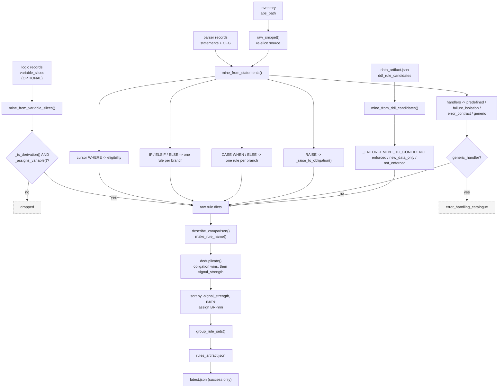
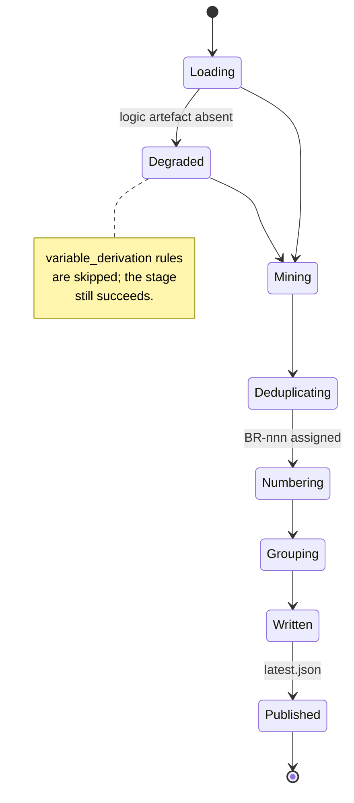

# Agent 05 — Rules

## 1. Document Information

| Field | Value |
|---|---|
| **Agent name** | Rules Agent |
| **Agent identifier** | `5_rules` |
| **Primary implementation** | [`.claude/scripts/05_rules.py`](../../.claude/scripts/05_rules.py) — 1,198 lines |
| **Related prompt files** | `Not found in the current repository.` |
| **Related tests** | [`tests/test_rules.py`](../../tests/test_rules.py) — 33 checks; **plus** [`tests/evaluate_rules.py`](../../tests/evaluate_rules.py) — the only evaluation harness in the repository |
| **Related fixtures** | `tests/fixtures/ground_truth/*.json` — 4 hand-annotated procedures + `BASELINE.json` |
| **Related specification** | [`.claude/agents/5_rules_agent.md`](../../.claude/agents/5_rules_agent.md) |
| **Upstream** | Agent 02 (statements), Agent 03 (`ddl_rule_candidates`), Agent 04 (slices) |
| **Downstream** | Agents 06, 07, 08 |
| **Documentation status** | Complete |
| **Confidence level** | High |

---

## 2. Table of Contents

- [3. Agent Overview](#3-agent-overview) · [4. Core Problem Statement](#4-core-problem-statement) · [5. Responsibilities](#5-responsibilities) · [6. Non-Responsibilities](#6-non-responsibilities)
- [7. Inputs](#7-inputs) · [8. Outputs](#8-outputs) · [9. Internal Technical Workflow](#9-internal-technical-workflow)
- [10. Agent Architecture Diagram](#10-agent-architecture-diagram) · [11. Sequence Diagram](#11-sequence-diagram) · [12. State Management](#12-state-management)
- [13. Prompt and LLM Design](#13-prompt-and-llm-design) · [14. Technologies and Techniques](#14-technologies-and-techniques)
- [15. Algorithms, Rules, Heuristics, and Formulas](#15-algorithms-rules-heuristics-and-formulas)
- [16. Error Handling and Recovery](#16-error-handling-and-recovery) · [17. Security and Guardrails](#17-security-and-guardrails)
- [18. Performance and Scalability](#18-performance-and-scalability) · [19. Testing and Validation](#19-testing-and-validation)
- [20. Evaluation and Quality Metrics](#20-evaluation-and-quality-metrics) · [21. Observability](#21-observability)
- [22. Configuration and Environment](#22-configuration-and-environment) · [23. Deployment and Runtime](#23-deployment-and-runtime)
- [24. Extension and Maintenance Guide](#24-extension-and-maintenance-guide) · [25. Known Limitations](#25-known-limitations)
- [26. Open Questions](#26-open-questions) · [27. Source Traceability](#27-source-traceability) · [28. References](#28-references)

---

## 3. Agent Overview

**What it does.** Mines business rules from **nine sources** spanning Agents 02, 03 and 04, classifies each into a category, derives confidence from real enforcement state, names each rule so it is distinguishable from its siblings, deduplicates, and groups into rule sets.

**Why it exists.** This is the stage that converts *structure* into *requirements*. It is the intellectual core of the pipeline and the only stage with a measured accuracy figure.

**If removed.** No BRD rules catalogue, no traceability matrix, no rule labels on diagrams, no `BusinessRule` nodes in the graph. The pipeline would produce a structural report with no business content.

---

## 4. Core Problem Statement

**Problem.** Identify every place the code makes a *business* decision, and state it as a reviewable requirement traceable to its source line.

**Constraints handled.**
- Business rules are not marked in code — they must be inferred from structure
- An exception is not itself a rule; the rule is what the exception protects
- A multi-branch construct encodes one outcome *per branch*
- A backward slice includes transitive dependencies, so a formula can be attributed to the wrong variable
- Rules must be distinguishable — several rules sharing a name cannot be reviewed
- A DISABLED constraint is documented intent, not a guarantee

**Responsibility boundary.** Rule identification, classification, naming, confidence. Document assembly is Agent 07.

---

## 5. Responsibilities

1. Mine nine rule sources (see [15.1](#151-the-nine-mining-sources))
2. Classify category (`classify_category`) and structural pattern (`classify_pattern`)
3. Derive confidence from enforcement state (`_ENFORCEMENT_TO_CONFIDENCE` L176)
4. Name rules distinguishably (`make_rule_name`, `describe_comparison`, `condition_qualifier`)
5. Restate exceptions as obligations (`_raise_to_obligation`)
6. Deduplicate (`deduplicate`)
7. Group into rule sets (`group_rule_sets`)
8. Assign `BR-nnn` identifiers
9. Route generic `WHEN OTHERS` to `error_handling_catalogue` rather than the rules list

---

## 6. Non-Responsibilities

Does **not**: parse (Agent 02); read DDL directly — consumes Agent 03's `ddl_rule_candidates`; compute complexity or slices (Agent 04); render diagrams (Agent 06); write the document (Agent 07).

**Does not decide document phrasing.** Agent 07 applies SBVR modality and business-language translation. Agent 05 supplies `condition_text`, `outcome_text`, `category`, `confidence` and `is_obligation`.

---

## 7. Inputs

| Input | Source | Required | Notes |
|---|---|---|---|
| Parser artefact + records | `output/parser/latest.json` | Yes | Statements, CFG, DML fields |
| Data artefact | `output/data/latest.json` | Yes | `ddl_rule_candidates` |
| Inventory artefact | `output/inventory/latest.json` | Yes | `abs_path` for re-slicing |
| Logic artefact + records | `output/logic/latest.json` | **Optional** | Slices for `variable_derivation`. If absent the agent degrades to condition + DDL sources rather than failing. `Confirmed from implementation`, `main()`. |

---

## 8. Outputs

### `rules_artifact.json`

| Field | Live corpus |
|---|---|
| `stats` | `branches_examined: 21`, `rules_extracted: 41`, `duplicates_merged: 5`, `requires_sme_review: 3`, `by_category`, `by_confidence` |
| `rule_sets` | 4 |
| `business_rules` | 41 |
| `error_handling_catalogue` | 4 |
| `design_references` | 2 entries |

**Rule record:** `rule_id`, `name`, `description`, `category`, `structural_pattern`, `condition_text`, `outcome_text`, `signal_strength`, `confidence`, `requires_sme_review`, `is_obligation`, `raises`, `is_enforced`, `source{}`.

**`source` object by kind** — every code-sourced rule carries `object_id`, `line` **and `statement_id`**; DDL rules carry `table` plus `constraint_name`/`index_name`/`column`:

```
conditional_branch    keys = [kind, line, object_id, statement_id]
ddl_check_constraint  keys = [constraint_name, kind, table]
```

`statement_id` is the join key used by Agents 06, 07 and 08.

**Category distribution (live):** VALIDATION 19, LIMIT_CHECK 12, CALCULATION 6, ERROR_HANDLING 4, ROUTING 0, COMPLIANCE 0.

---

## 9. Internal Technical Workflow

| # | Step | Implementation |
|---|---|---|
| 1 | Load parser, data, inventory; **optionally** logic | `main`, `load_run` |
| 2 | Mine DDL candidates | `mine_from_ddl_candidates` |
| 3 | Mine statements — cursors, IF/ELSIF/ELSE, CASE, RAISE, handlers | `mine_from_statements` |
| 4 | Mine variable slices | `mine_from_variable_slices` |
| 5 | Split generic handlers from business rules | `generic_handler` flag |
| 6 | Deduplicate by `raw_key` | `deduplicate` |
| 7 | Sort by `-signal_strength`, then name; assign `BR-nnn` | `main` |
| 8 | Group into rule sets | `group_rule_sets` |
| 9 | Build `error_handling_catalogue` | `main` |
| 10 | Write artefact, then `latest.json` | `main` |

---

## 10. Agent Architecture Diagram



---

## 11. Sequence Diagram

```mermaid
sequenceDiagram
    actor Operator
    participant R as 05_rules.py
    participant Par as parser artefact
    participant Dat as data artefact
    participant Log as logic artefact (optional)
    participant FS as original .sql
    participant Out as output/rules/

    Operator->>R: python 05_rules.py
    R->>Dat: ddl_rule_candidates
    R->>Par: statements + CFG
    R->>Log: variable_slices
    alt logic artefact missing
        Log-->>R: FileNotFoundError
        R->>R: degrade — skip variable_derivation
    end
    loop each object
        R->>FS: raw_snippet() for condition text
        R->>R: mine 9 sources
    end
    R->>R: deduplicate / sort / assign BR-nnn
    R->>Out: rules_artifact.json + latest.json
    R-->>Operator: stdout stats by category
```

---

## 12. State Management

No shared state object. Filesystem artefacts; `latest.json` pointer-after-write. Agent-local state: the accumulated rule list before deduplication, and `_SOURCE_CACHE` for raw file text.



---

## 13. Prompt and LLM Design

`Not found in the current repository.` No model calls. Rule naming and phrasing are produced by deterministic string construction (`make_rule_name`, `describe_comparison`, `business_name`).

---

## 14. Technologies and Techniques

| Technique | Where | Why | Trade-offs |
|---|---|---|---|
| **Slice-derived rules** | `mine_from_variable_slices` | Condition mining answers "what conditions exist?"; slicing answers "what determines this value?" | Depends on Agent 04; degrades gracefully |
| **SBVR obligation restatement** | `_raise_to_obligation` | An exception is not a rule; the rule is what it protects | Requires inverting the condition, which can misfire on compound expressions |
| **Per-branch decomposition** | `mine_from_statements` | Each branch is a separately-changeable policy | Increases rule count; risks over-extraction |
| **Ground-truth evaluation** | `tests/evaluate_rules.py` | Makes accuracy a measurement rather than an assertion | Ground truth authored by the same party as the extractor |
| **Deterministic naming with qualifiers** | `describe_comparison` | Distinguishable rule names are a review prerequisite | Heuristic; can produce awkward phrasing |

---

## 15. Algorithms, Rules, Heuristics, and Formulas

### 15.1 The nine mining sources

| Source kind | Trigger | Location |
|---|---|---|
| `conditional_branch` | IF / ELSIF / ELSE branch | `_emit_condition_rule` |
| `case_branch` | CASE WHEN / ELSE | `mine_from_case_expression` |
| `cursor_eligibility` | Cursor `WHERE` clause | `mine_from_cursors` |
| `named_exception` | Guarded `RAISE` | `_raise_to_obligation` |
| `predefined_exception` | Oracle predefined handler that sets an outcome | `mine_from_statements` |
| `failure_isolation` | `WHEN OTHERS` that logs and continues | `mine_from_statements` |
| `error_contract` | `WHEN OTHERS` raising a specific application error | `mine_from_statements` |
| `variable_derivation` | Business formula from a backward slice | `mine_from_variable_slices` |
| `ddl_*` | CHECK / virtual column / unique / view filter | `mine_from_ddl_candidates` |

### 15.2 Enforcement → confidence

**Location:** `_ENFORCEMENT_TO_CONFIDENCE`, `05_rules.py:176`.

$$\text{enforcement} \mapsto (\text{signal\_strength}, \text{confidence}, \text{requires\_sme\_review})$$

| Enforcement (from Agent 03) | signal | confidence | SME review |
|---|---|---|---|
| `enforced` | 5 | `confirmed` | `False` |
| `enforced_new_data_only` | 4 | `high` | `True` |
| `not_enforced` | 2 | `low` | `True` |

`Confirmed from implementation` and `Confirmed from tests`.

### 15.3 Derivation-complexity score

**Location:** `_is_derivation`; threshold `_DERIVATION_COMPLEXITY_THRESHOLD = 2` (`05_rules.py:603`).

$$\text{score} = |\{\text{arithmetic operators}\}| + |\{\text{function calls}\}|$$

A derivation qualifies as a **business calculation** when $\text{score} \geq 2$; an aggregate (`SUM`, `COUNT`, `AVG`, `MAX`, `MIN`) qualifies unconditionally.

| Expression | Score | Verdict |
|---|---|---|
| `ROUND(bal * (rate/100) * (days/365), 2)` | 5 | business formula |
| `EXTRACT(DAY FROM LAST_DAY(p_run_date))` | 2 | business definition |
| `p_as_of_date - NVL(v_last, p_as_of - 9999)` | 3 | business formula |
| `rec.balance + v_interest_amount` | 1 | mechanics — dropped |

**Documented provenance of this threshold:** it was chosen so one interest formula passed and one simple addition failed — i.e. **n = 2 evidence**. Recorded as a limitation in the README. `Confirmed from existing documentation.`

**Second guard:** `_assigns_variable` requires the deriving statement to actually *assign* the slice variable. Without it, `v_new_balance` claimed the formula computing `v_interest_amount`, producing one formula as two rules. `Confirmed from existing documentation.`

**Third guard:** `if len(deriving) > 2: continue` — a variable assigned by a formula in more than two branches is skipped, because those branches already produced their own rules.

### 15.4 Zero-guard reclassification

**Location:** `_is_zero_guard`, pattern `(<=|>=|!=|<>|\^=|=|<|>)\s*0\b`.

A comparison against literal zero is a sanity guard, not a business tier. Without this, `v_interest_amount > 0` keyword-matched `CALCULATION` on the field name, producing the nonsense rule name *"Calculate Interest Amount above 0"*. `Confirmed from implementation` (inline comment).

**Related rule:** an obligation is never a `CALCULATION` — you do not reject on a calculation. Demoted to `LIMIT_CHECK` if the condition contains `<`/`>`, else `VALIDATION`.

### 15.5 Naming — subject and qualifier from the same comparison

**Location:** `describe_comparison`.

Clause scoring:

$$\text{score}(c) = 2 \cdot [\,op = \texttt{=} \wedge rhs \text{ is a literal}\,] + 1 \cdot [\,lhs \in \text{known fields}\,]$$

The highest-scoring clause supplies **both** subject and qualifier. Deriving them independently produced *"Calculate Amount at or above Amount"*. In a compound condition (`AND`/`OR`), an inequality qualifier is suppressed because it cannot summarise the whole condition faithfully; an equality against a literal is kept as a scope qualifier.

**Operator inversion** (`_OPERATOR_INVERSE`): for obligations the IF condition is the *violation*, so the qualifier inverts — `p_amount <= 0` → *"Validate Amount above 0"*.

### 15.6 Deduplication
**Location:** `deduplicate`. Rules sharing a `raw_key` collapse to one; preference order is **`is_obligation` first, then higher `signal_strength`**. `Confirmed from tests`.

### 15.7 Category classification
`CATEGORY_FIELD_SIGNALS` — keyword lists per category; `CATEGORY_PRIORITY` resolves ties. **Acknowledged limitation:** the keyword table is banking vocabulary and untested on other domains.

**Thresholds owned by this agent:** `_DERIVATION_COMPLEXITY_THRESHOLD = 2` (L603); the `len(deriving) > 2` cap; clause-scoring weights 2 and 1; `signal >= 4` for `high` confidence.

---

## 16. Error Handling and Recovery

| Condition | Behaviour |
|---|---|
| **Logic artefact missing** | **Graceful degradation** — `variable_derivation` skipped, stage succeeds. `Confirmed from implementation`, `try/except (FileNotFoundError, KeyError)` in `main()`. |
| Missing per-object record | Skipped |
| Unreadable raw source | `raw_snippet` returns `""` |
| Missing parser or data artefact | Exception; stage aborts |

**Try blocks:** 3. **`raise`:** 0. **`sys.exit`:** 0. **Retries:** none.

---

## 17. Security and Guardrails

Secrets, env vars, network: **none**. Reads original source by `abs_path`. No output schema validation.

**Content sensitivity:** rule descriptions embed source expressions and `RAISE_APPLICATION_ERROR` message text verbatim — business logic in readable form. On a real system this is the most sensitive artefact the pipeline produces.

---

## 18. Performance and Scalability

**Measured:** 21 branches examined, 41 rules, 5 duplicates merged — sub-second beyond artefact loading. `Measured.`
**Estimated:** O(S) over statements per object plus O(V) over slices. Model / network / DB calls: **0**.

---

## 19. Testing and Validation

**Command:** `python tests/test_rules.py` — **33 checks.** `Confirmed from tests.`

Covers: pipeline contract (every rule has `source.kind`, `object_id`, `line`; unique `rule_id`; rule sets partition all rules), obligation form, branch decomposition (CASE ≥ 5 branch rules; distinct source lines per branch), the `WHEN OTHERS` three-way split, slice and cursor mining, enforcement→confidence mapping, and dedup preference.

**Regression guards named in the suite:** `rec.balance` must not collapse to *"Enforce Rec"*; one derivation rule per formula (transitive slice members not re-attributed).

---

## 20. Evaluation and Quality Metrics

**This is the only agent with a real evaluation harness.** `tests/evaluate_rules.py` — 237 lines.

**Method.** Four hand-annotated procedures in `tests/fixtures/ground_truth/`. Matching criterion is **source-line proximity**, `LINE_TOLERANCE = 2` (L45), using closest-unmatched assignment rather than first-match. Subject agreement is reported *separately* as a quality signal, deliberately not folded into the match decision.

$$\text{precision} = \frac{\text{matched}}{\text{extracted}}, \quad
\text{recall} = \frac{\text{matched}}{\text{ground truth}}, \quad
F_1 = \frac{2PR}{P+R}$$

**Reported figures** (`Confirmed from existing documentation` — `BASELINE.json` and README):

| Measurement | Precision | Recall | F1 |
|---|---|---|---|
| Baseline (pre-redesign) | 0.615 | 0.571 | **0.593** |
| Current (tuned) | 1.000 | 1.000 | **1.000** |
| **First blind held-out procedure** | — | — | **0.588** |
| **Second blind held-out procedure** | 1.000 | **0.400** | 0.571 |

**The 1.000 is explicitly labelled as contaminated** in the repository README: ground truth covers 4 of 5 procedures and each was eventually used to fix the extractor. The defensible generalisation estimates are the two blind numbers. Published baselines cited in the harness: COBREX F1 0.59, COBRAIN 0.73, A-COBREX P 0.62 / R 0.74.

**Commands:** `python tests/evaluate_rules.py` · `--baseline` (write) · `--compare` (diff).

---

## 21. Observability

`print()` only. Durable diagnostics: `stats` with `by_category` and `by_confidence` breakdowns, `duplicates_merged`, `requires_sme_review`.

---

## 22. Configuration and Environment

Env vars / config files: `Not found in the current repository.`
Flags: `--parser-root`, `--parser-run`, `--data-root`, `--data-run`, `--inventory-root`, `--inventory-run`, `--logic-root`, `--logic-run`, `--output-root`, `--output`.
**Thresholds are hard-coded constants.**

---

## 23. Deployment and Runtime

`python .claude/scripts/05_rules.py`. Standard library only. No container, CI, or service.

---

## 24. Extension and Maintenance Guide

| Task | Where | Watch out for |
|---|---|---|
| Add a mining source | new `mine_from_*` + call in `main` | **Agent 07's `RULE_ORIGIN_LABELS` and `_DDL_KINDS` must gain the new kind**, or provenance renders generically. Agent 08's `origin` property carries it. A past defect: Agent 07 crashed with `KeyError: 'object_id'` on an unhandled kind. |
| Change a threshold | `_DERIVATION_COMPLEXITY_THRESHOLD` L603 | Re-run `tests/evaluate_rules.py --compare` |
| Add a category | `CATEGORY_FIELD_SIGNALS`, `CATEGORY_PRIORITY` | Agent 07 groups by category; Agent 06 does not |
| Change naming | `describe_comparison`, `make_rule_name` | Name uniqueness is asserted by `tests/test_synthesis.py` |
| Change `raw_key` | any miner | Controls merge behaviour — a wrong key silently merges unrelated rules |
| Add ground truth | `tests/fixtures/ground_truth/` | **Annotate blind first**, then measure, then fix — the repository documents this discipline |

---

## 25. Known Limitations

1. **F1 1.000 is tuned, not blind.** 4 of 5 procedures annotated; all used for fixing. Blind estimates: 0.588 and 0.400 recall.
2. **`_DERIVATION_COMPLEXITY_THRESHOLD = 2` rests on n = 2 evidence.**
3. **`CATEGORY_FIELD_SIGNALS` is banking vocabulary** — untested on other domains.
4. **Ground truth authored by the same party as the extractor** — annotator bias unmeasured.
5. **`LINE_TOLERANCE = 2` is a weak matching criterion** on short procedures; subject agreement (0.20–0.78) is the stricter signal.
6. **Compound-condition naming can still be imprecise** — qualifiers are suppressed rather than composed.
7. **Rule names are not globally unique** — one duplicate pair persists across different objects.

---

## 26. Open Questions

1. Would the derivation threshold hold on a larger corpus? Unknown.
2. What accuracy results on non-banking PL/SQL? Never run.
3. Should `ROUTING` and `COMPLIANCE` categories be retired? Both are 0 on the corpus.
4. Is `signal_strength` calibrated, or ordinal only? Used for sorting and a `>= 4` confidence cut; no calibration evidence exists.

---

## 27. Source Traceability

| Topic | File | Function / constant | Evidence | Confidence |
|---|---|---|---|---|
| Nine mining sources | `05_rules.py` | `mine_from_*` + `source.kind` values | Confirmed from implementation | High |
| Enforcement→confidence | `05_rules.py` | `_ENFORCEMENT_TO_CONFIDENCE` L176 | Confirmed from implementation + tests | High |
| Derivation threshold | `05_rules.py` | `_DERIVATION_COMPLEXITY_THRESHOLD` L603 | Confirmed from implementation | High |
| `_assigns_variable` guard | `05_rules.py` | `_assigns_variable` | Confirmed from implementation | High |
| Zero-guard rule | `05_rules.py` | `_is_zero_guard` | Confirmed from implementation | High |
| Clause scoring | `05_rules.py` | `describe_comparison` | Confirmed from implementation | High |
| Dedup preference | `05_rules.py` | `deduplicate` | Confirmed from tests | High |
| Graceful degradation | `05_rules.py` | `main` try/except | Confirmed from implementation | High |
| F1 figures | `tests/evaluate_rules.py`, `BASELINE.json`, `README.md` | — | Confirmed from tests + documentation | High |
| Threshold provenance (n=2) | `README.md` | Known limitations | Confirmed from existing documentation | High |

---

## 28. References

### Present in the repository
`05_rules.py` declares **2 `DESIGN_REFERENCES` entries**. `.claude/agents/5_rules_agent.md` names the works applied. `tests/evaluate_rules.py` cites published baselines.

### Directly influenced the implementation
- **OMG SBVR** — *"there are no exceptions; instead, there are well stated business rules."* Implemented in `_raise_to_obligation`.
- **Weiser program slicing / COBREX variable-centric extraction** — the basis of `mine_from_variable_slices`.
- **COBREX, COBRAIN, A-COBREX** — cited as comparison baselines in the evaluation harness.

### Discovered during documentation research (format only)
- [arc42](https://arc42.org/overview), [C4 model](https://c4model.com).

---

*Every claim is traceable, labelled an inference, or marked `Not found in the current repository.`*
