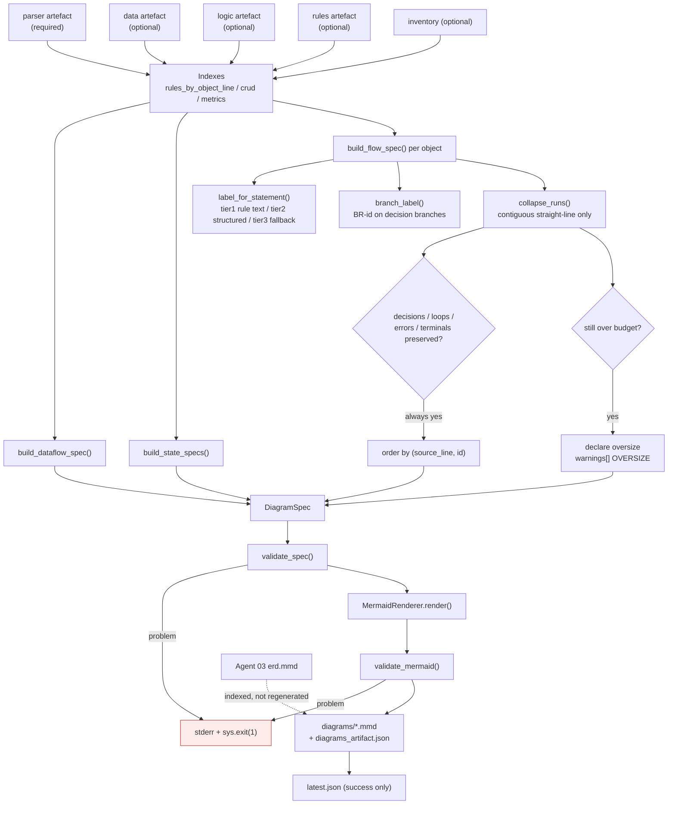
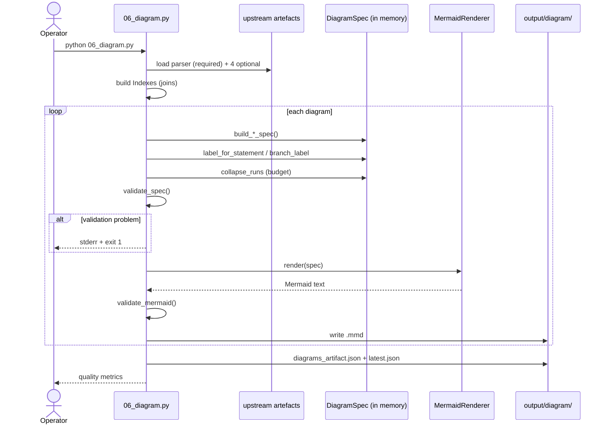
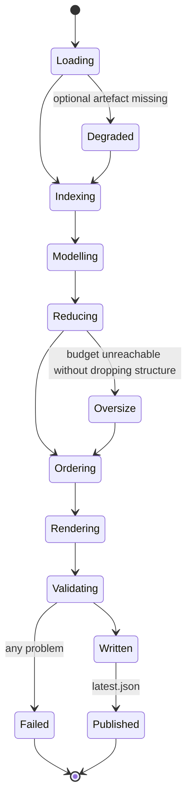

# Agent 06 — Diagram

## 1. Document Information

| Field | Value |
|---|---|
| **Agent name** | Diagram Agent (Visual Model Agent) |
| **Agent identifier** | `6_diagram` |
| **Primary implementation** | [`.claude/scripts/06_diagram.py`](../../.claude/scripts/06_diagram.py) — 1,207 lines |
| **Related prompt files** | `Not found in the current repository.` |
| **Related tests** | [`tests/test_diagram.py`](../../tests/test_diagram.py) — 52 checks |
| **Related specification** | [`.claude/agents/6_diagram_agent.md`](../../.claude/agents/6_diagram_agent.md) |
| **Upstream** | Agents 02, 03, 04, 05 |
| **Downstream** | Agents 07, 08 |
| **Documentation status** | Complete |
| **Confidence level** | High |

---

## 2. Table of Contents

- [3. Agent Overview](#3-agent-overview) · [4. Core Problem Statement](#4-core-problem-statement) · [5. Responsibilities](#5-responsibilities) · [6. Non-Responsibilities](#6-non-responsibilities)
- [7. Inputs](#7-inputs) · [8. Outputs](#8-outputs) · [9. Internal Technical Workflow](#9-internal-technical-workflow)
- [10. Agent Architecture Diagram](#10-agent-architecture-diagram) · [11. Sequence Diagram](#11-sequence-diagram) · [12. State Management](#12-state-management)
- [13. Prompt and LLM Design](#13-prompt-and-llm-design) · [14. Technologies and Techniques](#14-technologies-and-techniques)
- [15. Algorithms, Rules, Heuristics, and Formulas](#15-algorithms-rules-heuristics-and-formulas)
- [16. Error Handling and Recovery](#16-error-handling-and-recovery) · [17. Security and Guardrails](#17-security-and-guardrails)
- [18. Performance and Scalability](#18-performance-and-scalability) · [19. Testing and Validation](#19-testing-and-validation)
- [20. Evaluation and Quality Metrics](#20-evaluation-and-quality-metrics) · [21. Observability](#21-observability)
- [22. Configuration and Environment](#22-configuration-and-environment) · [23. Deployment and Runtime](#23-deployment-and-runtime)
- [24. Extension and Maintenance Guide](#24-extension-and-maintenance-guide) · [25. Known Limitations](#25-known-limitations)
- [26. Open Questions](#26-open-questions) · [27. Source Traceability](#27-source-traceability) · [28. References](#28-references)

---

## 3. Agent Overview

**What it does.** Produces the BRD's visual layer: a system data-flow map, one process-flow diagram per object, and entity state models — plus a CRUD matrix in markdown. **Agent 03's ERD is indexed, never regenerated.**

**Architectural centrepiece.** It builds a **renderer-agnostic `DiagramSpec`** first and emits Mermaid last. This is what makes the node budget enforceable and the tests meaningful.

**If removed.** The BRD loses all figures; Agent 08 loses entity states.

---

## 4. Core Problem Statement

**Problem.** Draw diagrams a business reader can use, from structure a business reader cannot read, without exceeding what a renderer can lay out legibly.

**Constraints handled.**
- Agent 02 stores no condition text on `IF` records — labels must come from Agent 05
- A rule anchored at a statement may describe the *branch* starting there, not the statement
- Mermaid computes layout in the browser; large graphs degrade
- Structure (decisions, loops, error paths) must never be dropped to hit a size target

---

## 5. Responsibilities

1. Build `DiagramSpec` models (`build_dataflow_spec`, `build_flow_spec`, `build_state_specs`)
2. Resolve labels via a three-tier ladder (`label_for_statement`)
3. Join CFG nodes to Agent 05 rules on `statement_id` (`Indexes.rule_at`, `rule_in_span`)
4. Enforce the node budget by collapsing straight-line runs (`collapse_runs`)
5. Order nodes by source line
6. Render Mermaid (`MermaidRenderer`)
7. Validate spec and rendered text (`validate_spec`, `validate_mermaid`)
8. Emit the CRUD matrix as markdown (`build_crud_markdown`)
9. Index Agent 03's ERD
10. Report quality metrics and warnings

---

## 6. Non-Responsibilities

Does **not**: generate the ERD (Agent 03 owns it — `erd_reference` merely records the path); extract rules (Agent 05); compute complexity (Agent 04); write the BRD (Agent 07).

---

## 7. Inputs

| Input | Required | Degradation if absent |
|---|---|---|
| Parser artefact + records | **Yes** | Hard fail |
| Data artefact | No | Skip state models; table validity unchecked |
| Logic artefact | No | Lose CRUD edges and complexity |
| Rules artefact | No | **All labels fall back to tier 3** (`Decision (line 38)`) |
| Inventory artefact | No | Lose `abs_path` for re-slicing |

`Confirmed from implementation` — `optional()` in `main()`.

---

## 8. Outputs

### `diagrams_artifact.json` (schema_version 2.0)
`diagram_index`, `erd_reference`, `crud_matrix{markdown, raw}`, `quality`, `warnings`, `stats`, `node_budget`, `design_references`.

**`quality` (live):** `decision_label_tier1_pct: 1.0`, `branch_traceability_pct: 1.0`, `max_nodes_any_diagram: 45`, `fallback_labels: 1`, `total_nodes: 128`.

**`warnings` kinds:** `OVERSIZE`, `DETAIL_COLLAPSED`, `DIAGRAM_NOTE` — all consumed by Agent 07's gaps register.

### `diagrams/*.mmd` — 7 files on the live corpus
`system_dataflow.mmd`, `state_ACCOUNTS.mmd`, and 5 × `flow_<OBJECT>.mmd`.

---

## 9. Internal Technical Workflow

```
LOAD → RESOLVE → MODEL → REDUCE → ORDER → RENDER → VALIDATE → WRITE
```

| # | Step | Implementation |
|---|---|---|
| 1 | Load artefacts; optional ones degrade | `optional()` |
| 2 | Build join indexes once | `Indexes.__init__`, `load_object_metrics` |
| 3 | Build `DiagramSpec` per diagram | `build_dataflow_spec`, `build_state_specs`, `build_flow_spec` |
| 4 | Resolve labels (3-tier ladder) | `label_for_statement`, `branch_label` |
| 5 | Collapse to budget | `collapse_runs`, `collapse_summary` |
| 6 | Order nodes by `(source_line, id)` | `build_flow_spec` |
| 7 | Render Mermaid | `MermaidRenderer.render` |
| 8 | Validate spec, then text | `validate_spec`, `validate_mermaid` |
| 9 | **Fail the stage on any validation problem** | `sys.exit(1)` |
| 10 | Write `.mmd` files + artefact + `latest.json` | `main` |

**Steps 1–6 emit no Mermaid.** Step 7 is the only Mermaid-aware code.

---

## 10. Agent Architecture Diagram



---

## 11. Sequence Diagram



---

## 12. State Management

No shared state object. Agent-local state is the `Indexes` object plus the in-memory `DiagramSpec` list.



---

## 13. Prompt and LLM Design

`Not found in the current repository.` No model calls.

---

## 14. Technologies and Techniques

| Technique | Where | Why | Trade-offs |
|---|---|---|---|
| **Model-then-render separation** | `DiagramSpec` → `MermaidRenderer` | Nothing to count means no budget; nothing but strings means no meaningful tests | Extra indirection |
| **Mermaid** | `MermaidRenderer` | Renders natively in GitHub, VS Code, most wikis; no toolchain | Browser-side layout; degrades on large graphs |
| **`statement_id` join to Agent 05** | `Indexes.rule_at` | The only way to get business text onto a decision | Diagram quality is downstream of rule-naming quality |
| **Short node IDs** (`N1`, `N2`) | `_IdSeq` | Predecessor used ~110-character IDs twice per edge | Real IDs kept in the artefact for traceability |
| **Shape + colour as meaning** | `_SHAPES`, `classDef` | Dual coding | Colour is not accessible alone |

---

## 15. Algorithms, Rules, Heuristics, and Formulas

### 15.1 Label resolution ladder — `label_for_statement`

| Tier | Source | Example |
|---|---|---|
| 1 | Agent 05 rule `condition_text` | `Balance below 100,000?` |
| 2 | Agent 02 structured fields | `Update ACCOUNTS`, `On error: NO_DATA_FOUND` |
| 3 | Fallback | `Decision (line 38)` |

**Guard — only a decision may take a rule label.** A rule anchored at a line may describe the *branch* starting there. Without this guard an `UPDATE` opening an `ELSIF` branch rendered as a **data-store shape bearing the ELSIF's condition** — wrong shape and wrong meaning. `Confirmed from implementation` (inline comment).

**Span lookup — `rule_in_span`.** Agent 05 merges a guarded `RAISE` into its `IF` but records the *RAISE's* line, so `IF p_amount <= 0 THEN RAISE …` spanning lines 35–37 carries its rule at 36. Exact-line matches win; otherwise the earliest rule within the statement's span is used.

### 15.2 Node budget and collapse — `collapse_runs`

**Budget:** `DEFAULT_NODE_BUDGET = 40` (`06_diagram.py:99`), exposed as `--max-nodes`.

**Never collapsed:** `_NEVER_COLLAPSE = {DECISION, LOOP, ERROR, TERMINAL}`.

**Exactly one collapse tier**, deliberately. Contiguous runs of collapsible siblings sharing a parent merge into one node. A second tier was **implemented and removed** because it merged every collapsible child of a parent regardless of adjacency, fusing statements at lines 33 and 124 into one node and implying they run together. `Confirmed from implementation` — the removal is documented in an in-code comment where the tier used to be.

**Reserved slots:** `reserved = 1 + (1 if any "*" edge else 0)` — for `START` and `ANY_ERROR`, added after collapsing.

**Oversize is declared, not hidden.** If structure cannot fit, `budget_report.oversize = True`, a note is added, and `validate_spec` permits the overrun **only because it is declared**:

```
if spec.type == "process_flow" and len(nodes) > budget and not budget_report.get("oversize"):
    problems.append(...)
```

**Live corpus:** `SP_TRANSFER_FUNDS` = 45 nodes vs budget 40 — 29 of its statements are decisions, raises, handlers or terminals, all protected.

### 15.3 Edge typing
`BRANCH_ENTRY` edges are re-typed by source-node kind: `DECISION → BRANCH`, `ERROR → EXCEPTION`, `LOOP → LOOP_ENTRY`, else `FLOW`. This keeps `branch_traceability_pct` honest — handler dispatch (`WHEN E_INSUFFICIENT_BALANCE`) is already informative and Agent 05 anchors that rule at the RAISE site by design.

### 15.4 Condition humanisation — `humanise_condition`
Strips only a wrapper enclosing the **whole** expression. A blanket `strip("()")` amputated the closing paren of `NVL(x, y - 9999)`. `Confirmed from tests`.

### 15.5 State-model derivation — `discover_state_attributes`, `build_state_specs`
States from a CHECK `IN`-list (`_CHECK_IN_RE`); transitions from `UPDATE` statements writing that column, target re-sliced from source, guard from the controlling branch's rule.

**Evidence bar — the strictest in the pipeline:** target unresolvable → **transition dropped**; origin unresolvable → drawn from `[*]` and marked `inferred`. *"A fabricated state edge in a BRD is worse than no state diagram, because a reviewer cannot tell it is wrong."*

**Live finding:** `ACCOUNTS.CLOSED` is permitted by `CK_ACCOUNTS_STATUS` but no code transitions into it — reported as a note.

### 15.6 Quality metrics — `quality_metrics`

$$\text{tier1\_pct} = \frac{|\{\text{decision nodes with label\_tier}=1\}|}{|\{\text{decision nodes}\}|}, \quad
\text{traceability} = \frac{|\{\text{BRANCH edges with rule\_id}\}|}{|\{\text{BRANCH edges}\}|}$$

Both **1.000** on the live corpus.

**Thresholds owned:** `DEFAULT_NODE_BUDGET = 40`.

---

## 16. Error Handling and Recovery

| Condition | Behaviour |
|---|---|
| Optional artefact missing | Degrade; record in `quality.degraded_inputs` |
| Parser artefact missing | Hard fail |
| **Any validation problem** | **stderr listing + `sys.exit(1)` — the stage fails** |
| Budget unreachable | Declared oversize; not an error |

**Try blocks:** 2. **`sys.exit`:** 1. **Retries:** none.

**Design note:** this is the only agent that *fails the stage* on an internal-quality problem. A half-valid diagram must not reach the BRD.

---

## 17. Security and Guardrails

Secrets, env vars, network: **none**.

**Internal-identifier leakage is an explicit guardrail.** `_INTERNAL_ID_PATTERNS` blocks `STMT_\d+`, `NESTED_BLOCK#\d+`, `__[0-9A-F]{8}`, `IF#\d+\.` from reaching any label — enforced in `validate_spec` and asserted in tests.

**Output validation:** the strongest in the pipeline — structural validation of both the model and the rendered text.

---

## 18. Performance and Scalability

**Measured:** 7 diagrams, 128 total nodes; largest 45. `Measured.`
**Estimated:** O(S) per object plus O(E) over CFG edges. No model, network or DB calls.

**Scaling limitation, stated:** Mermaid computes layout in-browser and degrades on large graphs. The node budget is the mitigation. If diagrams must scale beyond ~50 nodes, that is a **renderer** decision (Graphviz), and the `DiagramSpec` split is what makes it a drop-in change.

---

## 19. Testing and Validation

**Command:** `python tests/test_diagram.py` — **52 checks** (was 7). `Confirmed from tests.`

Asserts against `DiagramSpec`, not strings: collapse never removes structure; budget honoured or declared; label ladder precedence; state model refuses to invent transitions; renderer escaping; no leaked identifiers; every indexed diagram has a rendered file.

---

## 20. Evaluation and Quality Metrics

**Has published quality gates** — the only agent besides 05 and 07 to do so:

| Metric | Gate | Live |
|---|---|---|
| Decision nodes with tier-1 labels | ≥ 90% | **100%** |
| Decision branches carrying a BR-id | ≥ 80% | **100%** |
| Tier-3 fallback labels | < 15% of nodes | 1/128 |
| Leaked internal identifiers | 0 | 0 |
| Budget | enforced or declared | declared once |

**Honest caveat recorded in the specification:** these prove the diagram is *complete and traceable*, not that a reader finds it *useful*.

---

## 21. Observability

`print()` with quality percentages. Durable: `quality`, `warnings`, per-diagram `budget` reports in the artefact.

---

## 22. Configuration and Environment

Env vars / config files: `Not found in the current repository.`
Flags include `--max-nodes` (default 40) — **the only numeric tunable exposed on any agent's CLI.**

---

## 23. Deployment and Runtime

`python .claude/scripts/06_diagram.py`. Standard library only. Output renders wherever Mermaid is supported; no rendering toolchain is required to *produce* the files.

---

## 24. Extension and Maintenance Guide

| Task | Where | Watch out for |
|---|---|---|
| Add a diagram type | new `build_*_spec` + `MermaidRenderer` branch | Agent 07 must embed it |
| Add a node kind | `_KIND_BY_STATEMENT`, `_SHAPES` | Keep `_NEVER_COLLAPSE` correct |
| Change the budget | `DEFAULT_NODE_BUDGET` L99 or `--max-nodes` | Collapse invariants are asserted by tests |
| Swap renderer (e.g. Graphviz) | new renderer class only | `DiagramSpec` is renderer-agnostic by design |
| Add a quality gate | `quality_metrics` + `tests/test_diagram.py` | |

---

## 25. Known Limitations

1. **Layout is not controlled** — Mermaid owns it. Only input size and emission order can be influenced.
2. **One diagram exceeds budget** (45 vs 40) — declared, by design.
3. **Diagram quality is downstream of Agent 05's naming.**
4. **Colour carries meaning** without a non-colour equivalent.
5. **State transitions rely on re-slicing raw source** for the SET value.

---

## 26. Open Questions

1. At what corpus size does Mermaid become unusable here? Not measured.
2. Should a Graphviz renderer be added? The architecture supports it; no requirement recorded.
3. Are the gates (90%/80%) organisational standards or chosen defaults? Not recorded.

---

## 27. Source Traceability

| Topic | File | Function / constant | Evidence | Confidence |
|---|---|---|---|---|
| Model-then-render | `06_diagram.py` | `DiagramSpec`, `MermaidRenderer` | Confirmed from implementation | High |
| Node budget | `06_diagram.py` | `DEFAULT_NODE_BUDGET` L99 | Confirmed from implementation | High |
| Never-collapse invariant | `06_diagram.py` | `_NEVER_COLLAPSE`, `collapse_runs` | Confirmed from implementation + tests | High |
| Second collapse tier removed | `06_diagram.py` | `collapse_runs` comment | Confirmed from implementation | High |
| Label ladder + decision guard | `06_diagram.py` | `label_for_statement` | Confirmed from implementation | High |
| Span lookup | `06_diagram.py` | `Indexes.rule_in_span` | Confirmed from implementation | High |
| State evidence bar | `06_diagram.py` | `build_state_specs` | Confirmed from implementation | High |
| Stage fails on validation | `06_diagram.py` | `main`, `sys.exit(1)` | Confirmed from implementation | High |
| Quality gates | `tests/test_diagram.py` | — | Confirmed from tests | High |
| ERD indexed not regenerated | `06_diagram.py` | `erd_reference` | Confirmed from implementation | High |

---

## 28. References

### Present in the repository
`06_diagram.py` declares **2 `DESIGN_REFERENCES` entries**; `.claude/agents/6_diagram_agent.md` lists the applied works.

### Directly influenced the implementation
Named in the agent's `DESIGN_REFERENCES` / specification:
- **Moody (2009), The "Physics" of Notations, IEEE TSE 35(6)** — semantic transparency, dual coding, complexity management, graphic economy
- **Shneiderman (1996), The Eyes Have It** — overview → zoom → details-on-demand
- **Shneiderman, Mayer, McKay & Heller (1977), CACM 20(6)** — detailed flowcharts showed no measurable benefit → draw decisions, collapse runs
- **Purchase (1997/2002)** — edge crossings dominate comprehension → bound graph size
- **VEIL (arXiv 2511.05066)** — emit in source order
- **BABOK v3** — diagram selection

### Discovered during documentation research (format only)
- [arc42](https://arc42.org/overview), [C4 model](https://c4model.com).

---

*Every claim is traceable, labelled an inference, or marked `Not found in the current repository.`*
