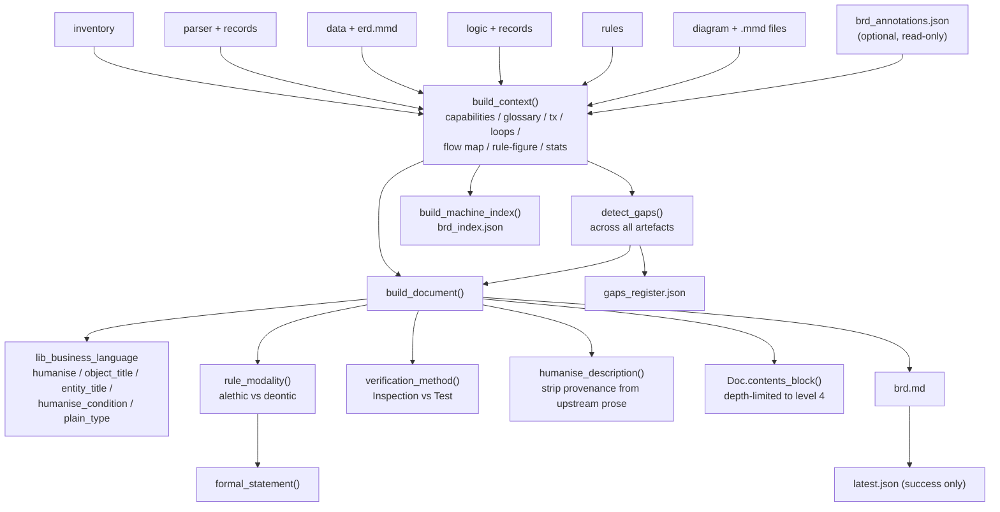
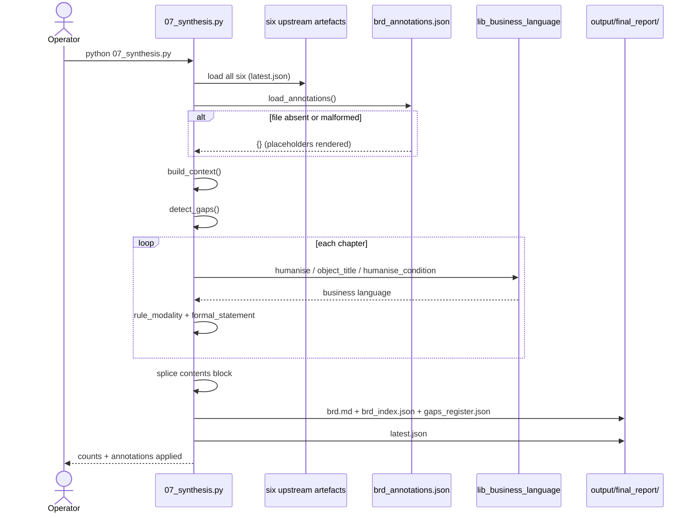
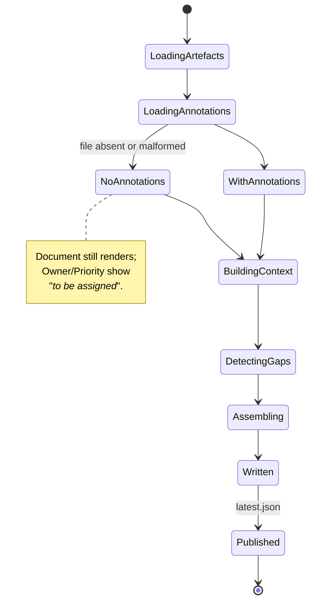

# Agent 07 — Synthesis (BRD)

## 1. Document Information

| Field | Value |
|---|---|
| **Agent name** | BRD Synthesis Agent |
| **Agent identifier** | `7_synthesis` |
| **Primary implementation** | [`.claude/scripts/07_synthesis.py`](../../.claude/scripts/07_synthesis.py) — 1,308 lines |
| **Shared library** | [`.claude/scripts/lib_business_language.py`](../../.claude/scripts/lib_business_language.py) — 271 lines (shared with Agent 08) |
| **Related prompt files** | `Not found in the current repository.` |
| **Optional input file** | `brd_annotations.json` — human curation layer, **read only, never written** |
| **Related tests** | [`tests/test_synthesis.py`](../../tests/test_synthesis.py) — 86 checks (largest suite) |
| **Related specification** | [`.claude/agents/7_synthesis_agent.md`](../../.claude/agents/7_synthesis_agent.md) |
| **Upstream** | Agents 01–06 (all six) |
| **Downstream** | Agent 08 (consumes `brd_index.json`); human readers |
| **Documentation status** | Complete |
| **Confidence level** | High |

---

## 2. Table of Contents

- [3. Agent Overview](#3-agent-overview) · [4. Core Problem Statement](#4-core-problem-statement) · [5. Responsibilities](#5-responsibilities) · [6. Non-Responsibilities](#6-non-responsibilities)
- [7. Inputs](#7-inputs) · [8. Outputs](#8-outputs) · [9. Internal Technical Workflow](#9-internal-technical-workflow)
- [10. Agent Architecture Diagram](#10-agent-architecture-diagram) · [11. Sequence Diagram](#11-sequence-diagram) · [12. State Management](#12-state-management)
- [13. Prompt and LLM Design](#13-prompt-and-llm-design) · [14. Technologies and Techniques](#14-technologies-and-techniques)
- [15. Algorithms, Rules, Heuristics, and Formulas](#15-algorithms-rules-heuristics-and-formulas)
- [16. Error Handling and Recovery](#16-error-handling-and-recovery) · [17. Security and Guardrails](#17-security-and-guardrails)
- [18. Performance and Scalability](#18-performance-and-scalability) · [19. Testing and Validation](#19-testing-and-validation)
- [20. Evaluation and Quality Metrics](#20-evaluation-and-quality-metrics) · [21. Observability](#21-observability)
- [22. Configuration and Environment](#22-configuration-and-environment) · [23. Deployment and Runtime](#23-deployment-and-runtime)
- [24. Extension and Maintenance Guide](#24-extension-and-maintenance-guide) · [25. Known Limitations](#25-known-limitations)
- [26. Open Questions](#26-open-questions) · [27. Source Traceability](#27-source-traceability) · [28. References](#28-references)

---

## 3. Agent Overview

**What it does.** Assembles every upstream artefact into `brd.md` — a Business Requirements Document structured in four parts by audience — plus `brd_index.json` (machine-readable) and `gaps_register.json`. Translates every machine identifier into business language, states rules with SBVR modality, publishes an exact traceability matrix, and merges human annotations that survive regeneration.

**If removed.** The pipeline produces artefacts but no document — no deliverable for a human.

---

## 4. Core Problem Statement

**Problem.** Produce one document that four different readers can each use — a sponsor, an analyst, a build team, and a machine — from artefacts written in machine identifiers.

**Constraints handled.**
- Identifiers such as `PROC-.SP_TRANSFER_FUNDS` and `v_from_balance < p_amount` are unreadable to the intended audience
- Documentation needs are task-dependent — one undifferentiated voice serves nobody
- A database-enforced rule and a code-enforced rule are epistemically different
- Domain intent is **not recoverable from code**, so the document must ask rather than guess
- The document is regenerated on every run, so human knowledge must live outside it

---

## 5. Responsibilities

1. Translate identifiers via `lib_business_language`
2. Assemble the document in four audience-based parts (`build_document`)
3. Assign SBVR modality and formal statements (`rule_modality`, `formal_statement`)
4. Derive verification method (`verification_method`)
5. Build the traceability matrix
6. Detect and rank gaps (`detect_gaps`)
7. Merge human annotations (`load_annotations`, `annotation_for`)
8. Emit `brd_index.json` and `gaps_register.json`
9. Generate the clickable contents page (`Doc.contents_block`)
10. Strip provenance from upstream prose (`humanise_description`)

---

## 6. Non-Responsibilities

Does **not**: extract rules (Agent 05); generate diagrams (Agent 06 — embedded here); generate the ERD (Agent 03); compute metrics (Agent 04); **write annotations** — the annotation file is read-only input.

---

## 7. Inputs

| Input | Source | Required |
|---|---|---|
| Inventory / Parser / Data / Logic / Rules / Diagram artefacts | each stage's `latest.json` | Yes — all six loaded via `load_run` |
| Per-object parser and logic records | `raw_structure/`, logic `object_index` | Yes |
| Mermaid diagram files | `output/diagram/<run>/diagrams/` | Read at embed time |
| `erd.mmd` | `output/data/<run>/` | Read at embed time |
| **`brd_annotations.json`** | `--annotations` (default `brd_annotations.json`) | **Optional** |

**Annotation schema** (keys are stable IDs):

```json
{"annotations": {
  "BR-001": {"note": "...", "owner": "...", "priority": "..."},
  "table:ACCOUNTS": {"note": "..."},
  "term:ACCOUNTS.BALANCE": {"note": "..."},
  "param:<object_id>:<param>": {"note": "..."},
  "object:<object_id>": {"note": "..."},
  "executive_summary": {"note": "..."}
}}
```

**Failure behaviour:** missing or malformed file → `{}` returned; the document renders with `_to be supplied_` placeholders. `Confirmed from implementation`, `load_annotations` catches `OSError` and `JSONDecodeError`.

---

## 8. Outputs

### `brd.md` — ~2,550 lines on the live corpus

| Part | Audience | Chapters |
|---|---|---|
| Front matter | all | Document Control, contents, How to Read |
| **I — Business View** | Sponsors | 1 Executive Summary, 2 Scope, 3 Business Glossary, 4 Program Units |
| **II — Rules and Behaviour** | Analysts | 5 Business Rules Catalogue, 6 Entity State Models, 7 Error Handling |
| **III — Build Specification** | Developers | 8 Data Model, 9 Interface Contracts, 10 Process Specifications, 11 Operational Characteristics |
| **IV — Assurance** | Auditors | 12 Traceability Matrix, 13 Gaps, 14 Rebuilding This System |
| Appendices | all | A Method, B Reference Scheme, C Standards |

### `brd_index.json`
`document`, `schema_version: "2.0"`, `system`, `generated_at`, `upstream`, `capabilities[]`, `requirements[]`, `glossary[]`, `gaps[]`, `traceability[]`.

**Requirement record:** `id`, `heading`, `text`, `formal`, `modality`, `type`, `confidence`, `verification_method`, `source`, `needs_review`, `owner`, `priority`.

### `gaps_register.json`
Live corpus: 21 gaps — high 4, medium 8, low 9.

---

## 9. Internal Technical Workflow

| # | Step | Implementation |
|---|---|---|
| 1 | Load all six artefacts | `load_run` × 6 |
| 2 | Load per-object records | `build_context` |
| 3 | Load annotations (optional) | `load_annotations` |
| 4 | Build derived context — capabilities, glossary, tx phrases, loop phrases, flow map, rule→figure, rule→tables, stats, source files | `build_context` |
| 5 | Detect gaps across all artefacts | `detect_gaps` |
| 6 | Assemble the document part by part | `build_document` |
| 7 | Translate identifiers | `lib_business_language` |
| 8 | Assign modality and formal statements | `rule_modality`, `formal_statement` |
| 9 | Splice the contents block after the opening | `Doc.contents_block` + `str.replace` |
| 10 | Build the machine index | `build_machine_index` |
| 11 | Write three files, then `latest.json` | `main` |

---

## 10. Agent Architecture Diagram



---

## 11. Sequence Diagram



---

## 12. State Management

No shared state object. **The annotation file is the closest thing to persistent state in the system** — and it is deliberately outside the pipeline's write path.

| Concern | Mechanism |
|---|---|
| Machine facts | Regenerated every run from artefacts |
| Human knowledge | `brd_annotations.json`, keyed by stable ID, **never written by the pipeline** |
| Merge point | `annotation_for(annotations, key)` at render time |



---

## 13. Prompt and LLM Design

`Not found in the current repository.` No model calls.

**The document itself states this**, and a test enforces the wording:
- Document Control row: *"Hallucination risk — None, structurally impossible… There is no sampling temperature because there is no model in the generation path."*
- `tests/test_synthesis.py` asserts `"no language model generates"` and `"structurally impossible"` appear in the output. `Confirmed from tests.`

---

## 14. Technologies and Techniques

| Technique | Where | Why | Trade-offs |
|---|---|---|---|
| **Single translation point** | `lib_business_language` | Vocabulary is consistent and correctable in one edit | All agents depend on one module |
| **Audience partitioning** | `build_document` | Documentation needs are task-dependent | Longer document |
| **SBVR modality** | `rule_modality`, `formal_statement` | Distinguishes impossible-to-violate from enforced-because-violable | Requires enforcement data from Agent 03 |
| **Dual presentation** | Rule blocks | A spec only a developer can check is not reviewable | Verbosity |
| **Annotation sidecar** | `load_annotations` | Domain intent is not recoverable from code | Requires a human to actually fill it in |
| **Depth-limited TOC** | `Doc.contents_block` | 41 rule headings would swamp navigation | Rules not individually linked |

---

## 15. Algorithms, Rules, Heuristics, and Formulas

### 15.1 SBVR modality — `rule_modality`

$$\text{modality} = \begin{cases}
\texttt{alethic} & \text{if } kind \in \text{DDL\_KINDS} \wedge is\_enforced \neq \texttt{False} \\
\texttt{deontic} & \text{otherwise}
\end{cases}$$

`_DDL_KINDS = {ddl_check_constraint, ddl_virtual_column, ddl_unique_constraint, ddl_unique_index, ddl_view_filter}`

| Modality | Phrasing | Meaning |
|---|---|---|
| **Alethic** (definitional) | *"It is necessary that…"* | The database makes violation impossible |
| **Deontic** (behavioural) | *"It is obligatory that…"* | Violation is possible — which is why code checks |

A **disabled** constraint takes neither: *"The system is INTENDED to ensure… This constraint is currently DISABLED and is NOT being enforced."*

### 15.2 Verification method — `verification_method`

$$\text{method} = \begin{cases}
\text{Inspection (database schema)} & kind \in \text{DDL\_KINDS} \wedge is\_enforced \neq \texttt{False} \\
\text{Inspection — currently DISABLED…} & kind \in \text{DDL\_KINDS} \wedge is\_enforced = \texttt{False} \\
\text{Test (exercise the code path)} & \text{otherwise}
\end{cases}$$

Two of ISO/IEC/IEEE 29148's eleven requirement attributes are derivable this way. The rest (`Owner`, `Priority`) render as **visible blanks** — *"an empty Owner column is an action item; a missing one is invisible."*

### 15.3 Provenance stripping — `humanise_description`

Two patterns:
```
_PROVENANCE_TAIL  = \s*(?:Implemented|Defined|Declared)\s+in\s+.*?,\s*line\s+\d+\.?
_PROVENANCE_PAREN = \s*\([A-Z]{3,6}-[^)]*?,\s*line\s+\d+\)
```

**Documented defect:** the original pattern used `[^.]*?`, which **can never span an object ID** because object IDs contain a period. `Confirmed from tests` — a regression test asserts `"Implemented in"` and `"PROC-"` are gone.

Also replaces the rule's `condition_text` with its humanised form, and rewrites `[ep]_*` identifiers (exception and parameter names) to business language.

### 15.4 Business language — `lib_business_language`

| Function | Transformation |
|---|---|
| `object_title` | `PROC-.SP_TRANSFER_FUNDS` → `Transfer Funds` (strips type prefix and `SP_`/`FN_`/`PKG_`) |
| `humanise` | `p_from_account` → `From Account`; `e_insufficient_balance` → `Insufficient Balance` |
| `humanise_condition` | `v_from_balance < p_amount` → `From Balance is below Amount` |
| `humanise_identifiers` | Only tokens containing `_` or `.` — leaves ordinary words alone |
| `plain_type` | `NUMBER(18,2)` → `Decimal number (18 digits, 2 decimal places)` |
| `anchor` | GitHub-flavoured markdown anchor for TOC links |

**Two documented defects, both fixed and guarded by tests:**
1. `NO` was mapped to `Number`, turning *"no preceding condition matched"* into *"Number Preceding Condition Matched"*. Ordinary English words must stay out of the abbreviation table.
2. Operator substitution ran **before** identifier substitution, feeding inserted words back through the identifier pass and producing *"is Below"*. Order was reversed.

**`e_` is stripped** as the Oracle exception-prefix convention; without it, `humanise` produced *"E Insufficient Balance"*.

### 15.5 Gap detection — `detect_gaps`
Produces `GAP-nnn` across 11 gap types with severity in `{critical, high, medium, low}`, sourced from all six upstream artefacts including Agent 06's `warnings` (`OVERSIZE`, `DETAIL_COLLAPSED`, `DIAGRAM_NOTE`).

### 15.6 Loop phrasing
`LOOP_TERMINATION_PHRASES` maps Agent 04's `termination_pattern` to plain English. **Historic defect:** Agent 07 previously read `termination_type`, so every loop rendered `UNKNOWN`.

**Thresholds owned:** none numeric. TOC depth limit is `level > 4`.

---

## 16. Error Handling and Recovery

| Condition | Behaviour |
|---|---|
| Any of the six artefacts missing | Exception; stage aborts — **all six are required** |
| Annotation file missing or malformed | `{}` returned; document renders with placeholders |
| Diagram file referenced but absent | `diagram_text()` returns `None`; the figure is skipped |

**Try blocks:** 1. **`sys.exit`:** 0. **Retries:** none.

---

## 17. Security and Guardrails

| Control | Status |
|---|---|
| Secrets / env vars / network | **None** |
| Input validation | Artefact presence; annotation JSON parse guarded |
| **Output validation** | **Strong, via tests** — no vacuous requirements, no identifiers in prose, every TOC link resolves, no invented `BR-` IDs |
| **Data sensitivity** | **Highest in the pipeline.** `brd.md` contains the complete business logic, schema, interfaces and error contracts in readable form. |
| Annotation trust | Annotation text is **injected into the document verbatim** with no sanitisation. A malicious annotation could inject arbitrary markdown. `Confirmed from implementation.` |
| Auditability | Run versioning + `upstream` block recording every input run |

**Missing controls:** no annotation sanitisation; no classification/redaction mechanism for the BRD; no output schema validation beyond tests.

---

## 18. Performance and Scalability

**Measured:** 5 capabilities, 41 requirements, 21 glossary terms, 41 traceability rows, ~2,550 lines — seconds. `Measured.`
**Estimated:** O(R + T + C) over rules, tables and columns. No model, network or DB calls.

**Scaling note:** the entire document is assembled in memory as a list of lines and written once.

---

## 19. Testing and Validation

**Command:** `python tests/test_synthesis.py` — **86 checks** (was 18). `Confirmed from tests.`

| Group | Asserts |
|---|---|
| Business language | `object_title`, `humanise`, `humanise_condition`, `plain_type`, `e_` stripping, dotted-record resolution |
| Provenance | `Implemented in …` removed; `(PROC-…)` removed |
| Modality | alethic vs deontic; disabled never stated as a guarantee; Inspection vs Test |
| Readability | **no `PROC-.`, `v_`, `p_`, `STMT_` in prose** (fenced blocks excluded — pseudocode stays technical) |
| Structure | contents present; **every TOC link resolves to a real heading**; 15–80 links |
| Completeness | interface directions, target types, transaction boundaries, hazards present |
| Traceability | every requirement has a row; > 80% cite a line; no invented `BR-` IDs |
| Machine index | all keys and requirement attributes present; modality ∈ {alethic, deontic} |
| Honesty | *Out of scope* stated; *cannot* stated; *no language model generates*; *structurally impossible*; gaps > 0; visible blanks; *Needs review* present |
| **Annotations** | rule note, executive-summary note and owner all reach both `brd.md` and `brd_index.json` |

---

## 20. Evaluation and Quality Metrics

**Published gates** (asserted in tests):

| Gate | Status |
|---|---|
| Vacuous requirements (*"apply the processing described below"*) | **0** — was 41/41 before the redesign |
| Identifiers in prose | 0 (excluding fenced blocks and `*Technical name*` lines) |
| TOC links resolving | 100% |
| Duplicate rule names | ≤ 1 |
| Requirements with a traceability row | 100% |
| Requirements citing an exact line | > 80% (live: 40/41) |

**Documented caveat:** these prove completeness and traceability, **not usefulness** — no automated documentation metric correlates meaningfully with expert judgement.

---

## 21. Observability

`print()` summary: capabilities, requirements, glossary terms, traceability rows, gaps by severity, **annotations applied**. Durable: `gaps_register.json`, `brd_index.json`, and the `upstream` provenance block.

---

## 22. Configuration and Environment

Env vars / config files: `Not found in the current repository.`

| Flag | Default |
|---|---|
| six `--*-root` flags | each stage's default output dir |
| `--run` | `latest` |
| `--output-root` | `output/final_report` |
| `--system-name` | `PL/SQL Banking System` |
| `--annotations` | `brd_annotations.json` |

---

## 23. Deployment and Runtime

`python .claude/scripts/07_synthesis.py`. Standard library only. Output renders wherever Mermaid-aware markdown is supported.

---

## 24. Extension and Maintenance Guide

| Task | Where | Watch out for |
|---|---|---|
| Add a chapter | `build_document` | Add a TOC-visible heading (level ≤ 4) or it will not be linked |
| Change vocabulary | `lib_business_language.ABBREVIATIONS` | **Never add ordinary English words** — `NO` → `Number` caused a real defect |
| Support a new rule source kind | `RULE_ORIGIN_LABELS`, `_DDL_KINDS`, `formal_statement` | Otherwise provenance renders generically |
| Add an annotation key | `annotation_for` call sites | Document the key in section 13 of the BRD so users know it exists |
| Add a gap type | `detect_gaps` | Severity must be in `SEVERITY_ORDER` |
| Change TOC depth | `Doc.contents_block` | A test bounds link count 15–80 |

---

## 25. Known Limitations

1. **All six upstream artefacts are required** — no graceful degradation, unlike Agents 05 and 06.
2. **Annotation content is not sanitised** — markdown injection is possible.
3. **One duplicate rule name persists** across different objects.
4. **Coverage metrics do not prove usefulness.**
5. **Assumes PySpark** as the rebuild target type (inherited from Agent 03).
6. **Document is titled a BRD**, though by BABOK's classification its contents are Solution/Functional requirements — stated in the scope chapter.

---

## 26. Open Questions

1. Who owns the annotation file in an operational setting? No process is documented.
2. Should the BRD carry a classification marking? None exists.
3. Is `--system-name` the only intended customisation? No branding or template mechanism exists.

---

## 27. Source Traceability

| Topic | File | Function / constant | Evidence | Confidence |
|---|---|---|---|---|
| SBVR modality | `07_synthesis.py` | `rule_modality`, `_DDL_KINDS` | Confirmed from implementation + tests | High |
| Verification derivation | `07_synthesis.py` | `verification_method` | Confirmed from implementation + tests | High |
| Provenance stripping + regex defect | `07_synthesis.py` | `_PROVENANCE_TAIL` | Confirmed from implementation + tests | High |
| Business language | `lib_business_language.py` | all public functions | Confirmed from implementation + tests | High |
| `NO` abbreviation defect | `lib_business_language.py` | `ABBREVIATIONS` comment | Confirmed from implementation | High |
| Operator/identifier ordering defect | `lib_business_language.py` | `humanise_condition` comment | Confirmed from implementation | High |
| Annotation layer read-only | `07_synthesis.py` | `load_annotations` docstring | Confirmed from implementation | High |
| Four-part structure | `07_synthesis.py` | `build_document` | Confirmed from implementation | High |
| Determinism statement enforced | `tests/test_synthesis.py` | honesty group | Confirmed from tests | High |
| 86 test checks | `tests/test_synthesis.py` | — | Confirmed from tests | High |

---

## 28. References

### Present in the repository
`07_synthesis.py` declares **2 `DESIGN_REFERENCES` entries** (the module also lists 7 works in its docstring). `.claude/agents/7_synthesis_agent.md` records applied works.

### Directly influenced the implementation
Named in the module's `DESIGN_REFERENCES` / docstring:
- **ISO/IEC/IEEE 29148:2018** — requirement attribute schema; unresolvable attributes rendered as visible blanks
- **OMG SBVR 1.5** — alethic vs deontic modality
- **IIBA BABOK v3** — scope, glossary, honest requirement classification
- **Chikofsky & Cross (1990)** — redocumentation vs design recovery labelling per part
- **Biggerstaff, Mitbander & Webster (1993)** — concept assignment; the reason the annotation layer exists
- **Aghajani et al. (ICSE 2020)** — documentation needs are task-dependent → audience partitioning
- **Lethbridge, Singer & Forward (2003)** — regenerable documentation
- **Cosentino et al. (WCRE 2013)** — controlled vocabulary linking terms to code
- **Mavin et al., EARS** — formal requirement phrasing

### Discovered during documentation research (format only)
- [arc42](https://arc42.org/overview), [C4 model](https://c4model.com), [ADR](https://adr.github.io/adr-templates/).

---

*Every claim is traceable, labelled an inference, or marked `Not found in the current repository.`*
