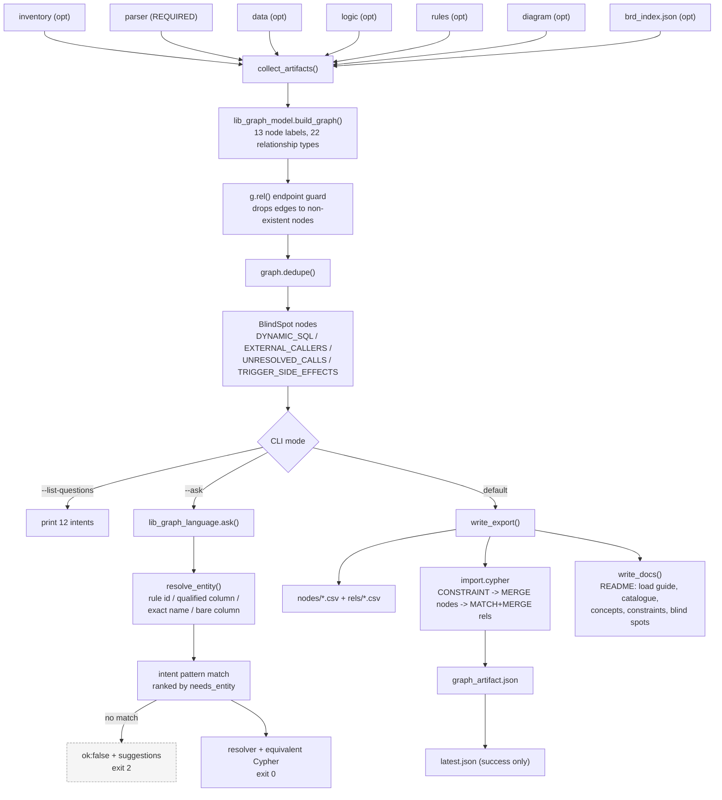
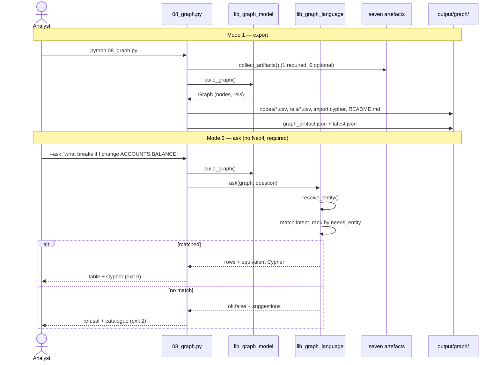
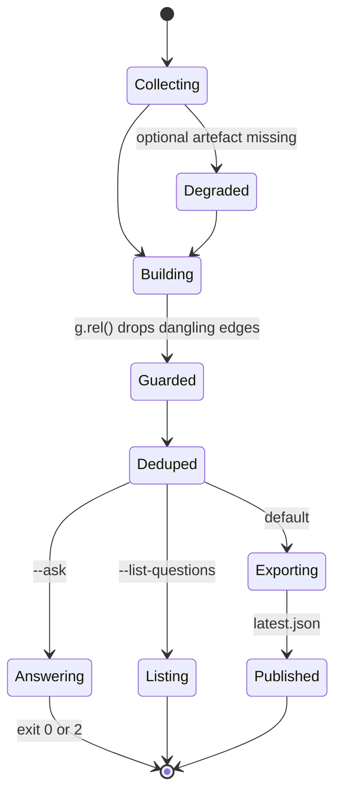

# Agent 08 — Knowledge Graph

## 1. Document Information

| Field | Value |
|---|---|
| **Agent name** | Knowledge Graph Agent |
| **Agent identifier** | `8_neo4j_graph` (harness `name:` field), `08_graph` (pipeline stage) |
| **Primary implementation** | [`.claude/scripts/08_graph.py`](../../.claude/scripts/08_graph.py) — 419 lines |
| **Shared libraries** | [`lib_graph_model.py`](../../.claude/scripts/lib_graph_model.py) (376 lines), [`lib_graph_language.py`](../../.claude/scripts/lib_graph_language.py) (433 lines), [`lib_business_language.py`](../../.claude/scripts/lib_business_language.py) |
| **Related prompt files** | `Not found in the current repository.` |
| **Related tests** | [`tests/test_graph.py`](../../tests/test_graph.py) — 68 checks |
| **Related specification** | [`.claude/agents/8_graph_agent.md`](../../.claude/agents/8_graph_agent.md) |
| **Upstream** | Agents 01–07 (all seven) |
| **Downstream** | **None.** Terminal and optional. |
| **Documentation status** | Complete |
| **Confidence level** | High |

---

## 2. Table of Contents

- [3. Agent Overview](#3-agent-overview) · [4. Core Problem Statement](#4-core-problem-statement) · [5. Responsibilities](#5-responsibilities) · [6. Non-Responsibilities](#6-non-responsibilities)
- [7. Inputs](#7-inputs) · [8. Outputs](#8-outputs) · [9. Internal Technical Workflow](#9-internal-technical-workflow)
- [10. Agent Architecture Diagram](#10-agent-architecture-diagram) · [11. Sequence Diagram](#11-sequence-diagram) · [12. State Management](#12-state-management)
- [13. Prompt and LLM Design](#13-prompt-and-llm-design) · [14. Technologies and Techniques](#14-technologies-and-techniques)
- [15. Algorithms, Rules, Heuristics, and Formulas](#15-algorithms-rules-heuristics-and-formulas)
- [16. Error Handling and Recovery](#16-error-handling-and-recovery) · [17. Security and Guardrails](#17-security-and-guardrails)
- [18. Performance and Scalability](#18-performance-and-scalability) · [19. Testing and Validation](#19-testing-and-validation)
- [20. Evaluation and Quality Metrics](#20-evaluation-and-quality-metrics) · [21. Observability](#21-observability)
- [22. Configuration and Environment](#22-configuration-and-environment) · [23. Deployment and Runtime](#23-deployment-and-runtime)
- [24. Extension and Maintenance Guide](#24-extension-and-maintenance-guide) · [25. Known Limitations](#25-known-limitations)
- [26. Open Questions](#26-open-questions) · [27. Source Traceability](#27-source-traceability) · [28. References](#28-references)

---

## 3. Agent Overview

**What it does.** Builds an in-memory property graph from all seven upstream artefacts, exports it as MERGE-based Cypher plus per-label CSVs for Neo4j, and provides a **deterministic plain-English question interface** that works with or without Neo4j installed.

**Optional and terminal.** No other stage depends on it; the JSON artefacts remain the source of truth. `Confirmed from implementation` — module docstring.

**If removed.** The BRD and diagrams are unaffected. Impact-analysis querying is lost.

---

## 4. Core Problem Statement

**Problem.** The artefacts contain answers to questions the document cannot express — *"what breaks if I change this column?"* requires traversal, not prose.

**Constraints handled.**
- No database may be required at runtime — the export must work offline
- The local answer and the Neo4j answer must not disagree
- Static analysis cannot see everything; the graph must not appear authoritative where it is blind
- A wrong impact answer is worse than no answer

---

## 5. Responsibilities

1. Collect all seven artefacts, degrading on optional ones (`collect_artifacts`, `optional`)
2. Build the property graph (`lib_graph_model.build_graph`)
3. Export CSVs and MERGE-based Cypher (`write_export`)
4. Emit README with load guide, question catalogue, concepts and constraints (`write_docs`)
5. Answer plain-English questions (`lib_graph_language.ask`)
6. Declare blind spots as queryable nodes
7. Report node/relationship statistics

---

## 6. Non-Responsibilities

Does **not**: connect to any database (no driver is imported — the only `neo4j` string in the file is inside a documentation example); extract rules, diagrams or the BRD; write to Neo4j; validate that Neo4j accepted the import.

---

## 7. Inputs

| Input | Required | Degradation |
|---|---|---|
| Parser artefact + records | **Yes** | Hard fail |
| Inventory | No | No `File` nodes |
| Data | No | No `Table`/`Column`/`Index`/`Sequence`/`State` |
| Logic | No | No CRUD or `DETERMINES` edges, no complexity properties |
| Rules | No | No `BusinessRule` nodes |
| Diagram | No | State-model notes lost |
| **`brd_index.json`** (Agent 07) | No | No `Gap` nodes; no `modality`/`verification_method` on rules |

`Confirmed from implementation` — `optional()` returns `({}, None)` on `FileNotFoundError`, `KeyError`, `JSONDecodeError`.

---

## 8. Outputs

| File | Content |
|---|---|
| `import.cypher` | Uniqueness constraints, then all nodes (`MERGE`), then all relationships (`MATCH … MERGE`) |
| `nodes/<Label>.csv` | One file per label |
| `rels/<TYPE>.csv` | One file per relationship type |
| `README.md` | Load guide, question catalogue with Cypher, concepts, constraints, blind spots, provenance |
| `graph_artifact.json` | `stats`, `supported_questions`, `concepts`, `constraints`, `blind_spots`, `design_references` |

**Live corpus:** **353 nodes across 13 labels; 769 relationships across 22 types.**

| Label | Count | | Relationship | Count |
|---|---|---|---|---|
| Statement | 124 | | CONTAINS_STATEMENT | 124 |
| Column | 105 | | DETERMINES | 119 |
| BusinessRule | 41 | | HAS_COLUMN | 105 |
| Gap | 21 | | FOLLOWS | 86 |
| Parameter | 20 | | WRITES_COLUMN | 69 |
| Table | 15 | | BELONGS_TO | 41 |
| File | 7 | | ENFORCED_IN | 40 |
| Object, RuleSet, BlindSpot, State, Sequence, Index | 5,4,4,3,3,1 | | BRANCHES_TO, IMPLEMENTED_AT, READS_COLUMN, … | 40,39,36,… |

---

## 9. Internal Technical Workflow

| # | Step | Implementation |
|---|---|---|
| 1 | Collect artefacts | `collect_artifacts`, `optional` |
| 2 | Build the property graph | `lib_graph_model.build_graph` |
| 3 | **`--ask` mode:** answer and exit | `lib_graph_language.ask` → `render_answer`; exit `0` ok / `2` refused |
| 4 | **`--list-questions` mode:** print catalogue and exit | `main` |
| 5 | Export mode: write CSVs + Cypher | `write_export` |
| 6 | Write README | `write_docs` |
| 7 | Write artefact, then `latest.json` | `main` |

---

## 10. Agent Architecture Diagram



---

## 11. Sequence Diagram



---

## 12. State Management

No shared state object. The `Graph` object is in-memory and rebuilt on every invocation — including every `--ask`.

**Critical design property:** the export and the question interface are **two views over one model**, so a locally-answered question and the same question in Neo4j cannot disagree.



---

## 13. Prompt and LLM Design

`Not found in the current repository.` No model calls.

**This is an explicit design decision for the question interface**, documented in `lib_graph_language.py`'s module docstring: *"The obvious way to turn English into Cypher is to ask a language model. This pipeline does not… a fabricated Cypher query returns a plausible, wrong answer, and the user has no way to tell."*

Instead: an **intent catalogue** of 12 named intents, each with trigger regexes, a resolver, and the equivalent Cypher. Unmatched questions are refused.

---

## 14. Technologies and Techniques

| Technique | Where | Why | Trade-offs |
|---|---|---|---|
| **In-memory property graph** | `lib_graph_model.Graph` | One model, two views | Rebuilt per invocation — no caching |
| **`MERGE` throughout** | `write_export` | Idempotent import | Slower than `CREATE` on large loads |
| **Uniqueness constraints emitted first** | `write_export` | Double as the indexes `MERGE` needs | Requires Neo4j 4.4+ syntax |
| **Endpoint guard in `g.rel()`** | `lib_graph_model` | Prevents dangling edges that silently vanish on load | Silently drops — no diagnostic emitted |
| **Deterministic intent matching** | `lib_graph_language` | Total precision; refusal over fabrication | Imperfect recall — a valid question may be refused |
| **BlindSpot nodes** | `build_graph` | Limits become queryable rather than assumed away | Requires maintenance as coverage changes |

---

## 15. Algorithms, Rules, Heuristics, and Formulas

### 15.1 Node-vs-property decision rule

Documented in `lib_graph_model.py`: *a thing that participates in several **independent** relationships must be a node.*

| Modelled as a node | Independent relationships |
|---|---|
| `Column` | read by, written by, constrained by, covered by index, populated by sequence |
| `Statement` | contains, follows, branches to, implements rule, reads/writes column |
| `Parameter` | the interface contract |

**Consequence:** column-level impact analysis — the stated reason to build a graph at all — is only possible because `Column` is a node.

### 15.2 Code Property Graph layer

Three of Yamaguchi et al.'s (IEEE S&P 2014) representations are joined on `Statement` nodes:

| Representation | Source | Edge types |
|---|---|---|
| AST | Agent 02 statement tree | `CONTAINS_STATEMENT` |
| CFG | Agent 02 `control_flow_graph` | `FOLLOWS`, `BRANCHES_TO`, `ON_ERROR_REACHES`, `LOOPS_BACK_TO` |
| Dependence | Agent 04 `variable_slices` | `DETERMINES` |

CFG edge mapping (`build_graph`):
```
SEQUENCE -> FOLLOWS   BRANCH_ENTRY -> BRANCHES_TO
EXCEPTION_EDGE -> ON_ERROR_REACHES   LOOP_BACK_EDGE -> LOOPS_BACK_TO
```
Edges with `from == "*"` (block-level exception) are skipped.

### 15.3 Column-level lineage — object *and* statement level

For each DML statement, edges are emitted **twice**:
```
Object    -[WRITES_COLUMN]-> Column
Statement -[WRITES_COLUMN]-> Column      # enables "which LINE writes this column"
```
Parameter names appearing in Agent 02's `reads[]` find no `Column` node and are **dropped by the endpoint guard** rather than creating phantom columns. `Confirmed from implementation` (inline comment).

### 15.4 Entity-state discovery
`_CHECK_IN_RE = ([A-Za-z_][A-Za-z0-9_$#]*)\s+IN\s*\(([^)]*)\)` over `check_constraints`, requiring ≥ 2 values.

### 15.5 Blind spots
Four `BlindSpot` nodes are always emitted: `DYNAMIC_SQL` (count from Agent 02 `stats`), `EXTERNAL_CALLERS`, `UNRESOLVED_CALLS` (count from Agent 02 `issues`), `TRIGGER_SIDE_EFFECTS`.

**Rationale, stated in code:** *"a graph that looks authoritative is more dangerous than a document that looks uncertain."* Treat the graph as a **lower bound** on dependencies.

### 15.6 Entity resolution — `resolve_entity`

Strictly ordered, literal matching — no fuzzy matching:
1. Rule ID regex `\b(br-\d{3})\b`
2. Qualified column `table.column`
3. Exact node key / `name` / `title`, **longest match wins** (so `ACCOUNTS` beats `ACCOUNT`)
4. Bare column name in tokens
5. Otherwise `(None, None)`

### 15.7 Intent ranking — `ask`

$$\text{rank}(i) = \big(\,[\,i.\text{needs\_entity} \neq \text{label}\,],\ \text{INTENTS.index}(i)\,\big)$$

Intents whose required entity type matches the resolved entity sort first — *"what rules apply to ACCOUNTS.BALANCE"* and *"what breaks if I change ACCOUNTS.BALANCE"* share vocabulary but want different answers.

**Three outcomes:**

| Outcome | Meaning | Exit |
|---|---|---|
| `ok: true` | Matched + entity resolved | 0 |
| `ok: false`, reason names the question type | Understood the *type*, could not identify the entity | 2 |
| `ok: false`, "No supported question matched" | Not understood | 2 |

**Invariant enforced by tests:** every advertised question, asked verbatim, must be *recognised*. Found by judging output — *"Which columns are used most widely?"* was listed and then refused because a pattern assumed the word order "most widely used". `Confirmed from tests.`

### 15.8 Concepts and constraints
Shipped in the README, after jQAssistant's model:
- **Concepts** (3) — derived views that add labels/properties: `Hot column` (> 2 dependent units), `Rule-bearing statement`, `Write path`
- **Constraints** (3) — validations that must return nothing: every rule traces to source; no orphan columns in rules; unenforced constraints are visible

**Thresholds owned:** `> 2` dependent units for `HotColumn`; `*1..10` path depth in the write-path concept.

---

## 16. Error Handling and Recovery

| Condition | Behaviour |
|---|---|
| Optional artefact missing/malformed | `optional()` → `({}, None)`; graph degrades |
| Parser artefact missing | Exception; stage aborts |
| Dangling relationship endpoint | **Silently dropped** by `g.rel()` |
| Question unmatched | Structured refusal, exit 2 |
| Entity unresolvable | Refusal naming the question type, exit 2 |

**Try blocks:** 1. **`sys.exit`:** 1. **Retries:** none.

---

## 17. Security and Guardrails

| Control | Status |
|---|---|
| Secrets / env vars / network | **None.** No driver, no connection, no credentials. |
| Database credentials | **Never handled.** The README shows `cypher-shell -u neo4j -p <password>` as a *user instruction*; the agent never sees a password. |
| Input validation | Artefact presence; JSON parse guarded |
| Output validation | Endpoint guard + dedupe; **no Cypher-injection escaping audit was performed** — `cypher_value` escapes `\`, `"` and newlines |
| **Data sensitivity** | **High.** The export contains the complete schema, business rules, source line numbers and gaps. |
| **Query-fabrication guardrail** | **Explicit and central** — refusal over generation |
| Auditability | Run versioning + provenance in README |

**Missing controls:** no sanitisation audit of `cypher_value` against injection via schema-derived strings; dangling-edge drops are silent with no diagnostic count.

---

## 18. Performance and Scalability

**Measured:** 353 nodes, 769 relationships — seconds, including a full artefact reload. `Measured.`
**Estimated:** O(S + C + R) over statements, columns and rules. `g.rel()` performs dict lookups; `graph.out()`/`inn()` are **linear scans over the whole relationship list**, so question answering is O(E) per hop. `Architectural inference from the implementation.`

**Scaling limitations:**
- The graph is rebuilt on **every** `--ask` — no caching or daemon
- `out()`/`inn()` linear scans do not scale to large graphs
- The whole graph is held in memory

---

## 19. Testing and Validation

**Command:** `python tests/test_graph.py` — **68 checks** (was 13). `Confirmed from tests.`

| Group | Asserts |
|---|---|
| Schema | `Column`, `Statement`, `Parameter`, `Gap`, `State`, ≥ 4 `BlindSpot`; column lineage both directions; `IMPLEMENTED_AT`; CFG layer present |
| Coverage | Every upstream agent contributes |
| Export | `MERGE` used; **no bare `CREATE (`**; constraints declared; **nodes precede relationships**; CSV dirs; ≥ 10 node CSVs |
| Documentation | Load guide, `cypher-shell` command, catalogue, concepts, constraints, limits |
| Answers | 9 real questions answered; **line-level impact**; every answer ships Cypher |
| **Advertised questions** | Every catalogue entry, asked verbatim, is recognised |
| **Refusals** | Unsupported refused; unidentifiable entity refused; empty refused; exact resolution for columns and rule IDs |
| Invariants | No dangling relationships; no duplicates; every `Column` has a `Table`; every `Statement` has an `Object` |

**The negative tests are called out in the suite docstring as the most important ones.**

---

## 20. Evaluation and Quality Metrics

No precision/recall framework for question answering. `Confirmed from repository inspection.`

Quality is enforced structurally: the advertised-question invariant, the refusal tests, and the model invariants. **Recommendation (not implemented):** a labelled question set with expected answers would allow measuring intent-match recall — currently unknown by design ("imperfect recall" is stated as an accepted trade).

---

## 21. Observability

`print()` with full node/relationship census by label and type, question count and blind-spot count. Durable: `graph_artifact.json` `stats`, plus the generated README.

**No diagnostic for dropped dangling edges** — a silent behaviour worth instrumenting.

---

## 22. Configuration and Environment

Env vars / config files: `Not found in the current repository.`

| Flag | Purpose |
|---|---|
| seven `--*-root` | artefact locations |
| `--run` | `latest` or a pinned run |
| `--output-root` | `output/graph` |
| `--ask` | plain-English question |
| `--list-questions` | print the catalogue |
| `--json` | machine-readable answer |

---

## 23. Deployment and Runtime

`python .claude/scripts/08_graph.py`. Standard library only. **Neo4j is an optional consumer, never a runtime dependency.** Three load paths documented: `cypher-shell`, CSV import, or no Neo4j at all via `--ask`.

---

## 24. Extension and Maintenance Guide

| Task | Where | Watch out for |
|---|---|---|
| Add a node label | `build_graph` + `KEY_PROPERTY` | Missing from `KEY_PROPERTY` → key falls back to `"id"` and constraints are wrong |
| Add a relationship type | `build_graph` | `g.rel()` silently drops if endpoints are absent — verify counts |
| Add a question | `INTENTS` in `lib_graph_language` | Must supply resolver **and** equivalent Cypher; the advertised-question invariant will fail otherwise |
| Add trigger patterns | `Intent.patterns` | **Test both word orders** — this has caused two defects |
| Add a concept/constraint | `CONCEPTS` / `CONSTRAINTS` | Appear in the README automatically |
| Add a blind spot | `build_graph` | Tests assert ≥ 4 |

---

## 25. Known Limitations

1. **Graph rebuilt on every invocation**, including every `--ask`.
2. **`out()`/`inn()` are linear scans** — O(E) per traversal hop.
3. **Dangling edges are dropped silently** with no count reported.
4. **Intent recall is unmeasured** — refusal of a valid question is possible and accepted.
5. **The graph is a lower bound** on dependencies; four blind-spot classes are declared.
6. **`CALLS` is empty on the current corpus** (no internal calls exist), so that path is untested against real data.
7. **State transitions are not exported as edges** — `State` nodes exist and `HAS_STATE` links them to columns, but the `TRANSITIONS_TO` relationship described in the specification is **not emitted by `build_graph`**. The diagram-notes loop in `build_graph` contains a `pass` statement where transitions would be derived. `Confirmed from implementation.`

---

## 26. Open Questions

1. Why are state transitions not exported as `TRANSITIONS_TO` edges when Agent 06 computes them? The loop exists but does nothing. `Requires stakeholder confirmation.`
2. Should a Neo4j driver mode be added for direct loading? Deliberately absent; no requirement recorded.
3. What intent-match recall is acceptable? Not defined.
4. Has `cypher_value` been audited against injection via adversarial schema names? Not evidenced.

---

## 27. Source Traceability

| Topic | File | Function / constant | Evidence | Confidence |
|---|---|---|---|---|
| One model, two views | `08_graph.py`, `lib_graph_model.py` | `build_graph` used by both paths | Confirmed from implementation | High |
| Node-vs-property rule | `lib_graph_model.py` | module docstring | Confirmed from implementation | High |
| CPG layer | `lib_graph_model.py` | CFG edge mapping | Confirmed from implementation | High |
| Statement-level column edges | `lib_graph_model.py` | DML loop | Confirmed from implementation | High |
| Endpoint guard | `lib_graph_model.py` | `Graph.rel` | Confirmed from implementation + tests | High |
| BlindSpot nodes | `lib_graph_model.py` | `build_graph` tail | Confirmed from implementation + tests | High |
| Refusal over generation | `lib_graph_language.py` | module docstring, `ask` | Confirmed from implementation + tests | High |
| Intent ranking | `lib_graph_language.py` | `ask` | Confirmed from implementation | High |
| Advertised-question invariant | `tests/test_graph.py` | `test_advertised_questions_are_answerable` | Confirmed from tests | High |
| MERGE-only export | `08_graph.py` | `write_export` | Confirmed from implementation + tests | High |
| **`TRANSITIONS_TO` not emitted** | `lib_graph_model.py` | diagram-notes loop contains `pass` | Confirmed from implementation | High |
| 353 nodes / 769 relationships | live `graph_artifact.json` | — | Measured | High |

---

## 28. References

### Present in the repository
`08_graph.py` declares **4 `DESIGN_REFERENCES` entries**; `.claude/agents/8_graph_agent.md` records applied works; the generated `README.md` cites the same.

### Directly influenced the implementation
Named in `DESIGN_REFERENCES`:
- **Yamaguchi, Golde, Arp & Rieck (2014), Code Property Graphs, IEEE S&P** — Statement nodes joined by control-flow and dependence edges
- **jQAssistant** (scan → graph → concepts + constraints) — the derived-view/validation split
- **Lehnert, *A review of software change impact analysis*** — blind spots exported as nodes; no automated impact analysis is complete
- **Neo4j property-graph modelling guidance** — node vs relationship vs property; minimal relationship properties

Also referenced in the agent specification: **CAST Imaging / Thoughtworks CodeConcise** as industry precedent for a Neo4j knowledge base.

### Discovered during documentation research (format only)
- [arc42](https://arc42.org/overview), [C4 model](https://c4model.com), [ADR](https://adr.github.io/adr-templates/).

---

*Every claim is traceable, labelled an inference, or marked `Not found in the current repository.`*
