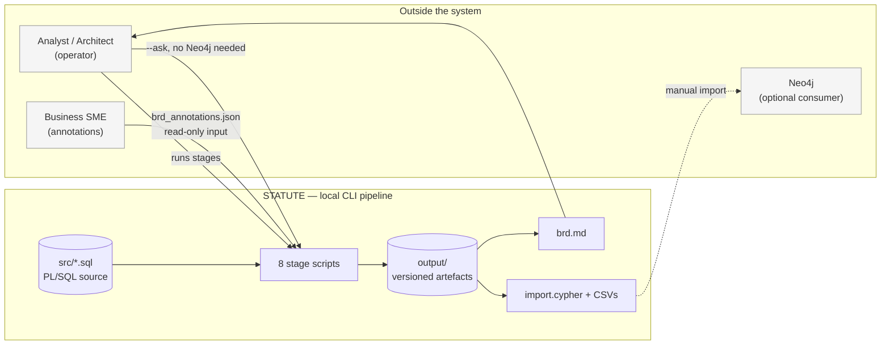
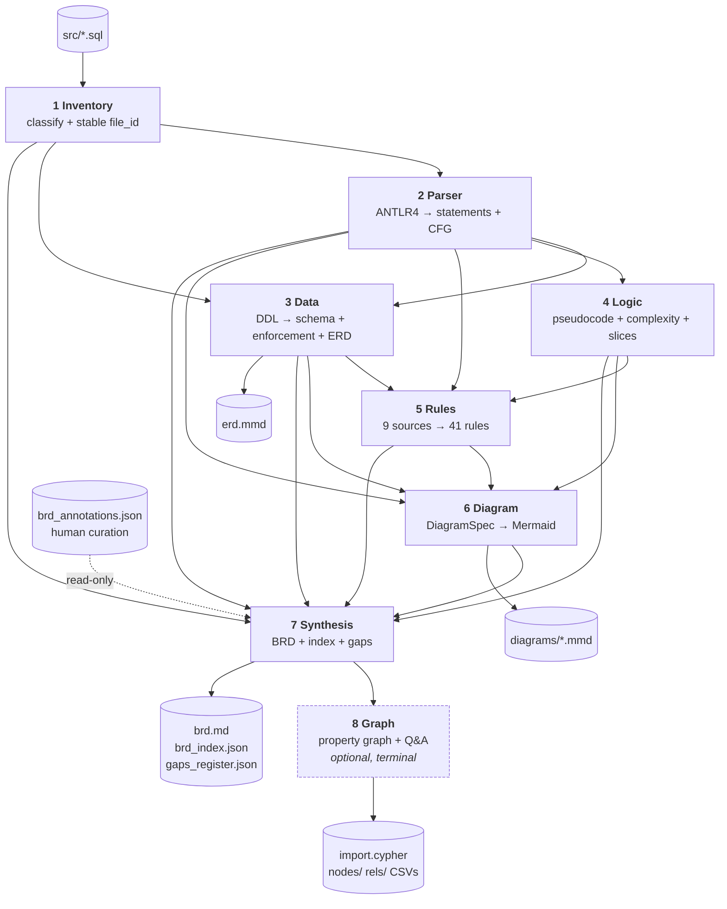
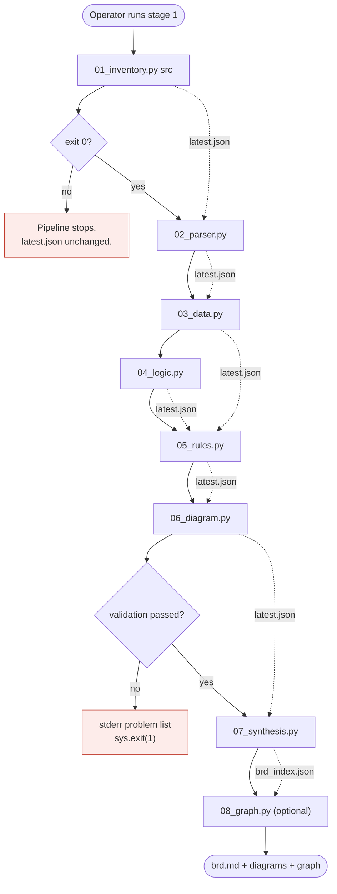
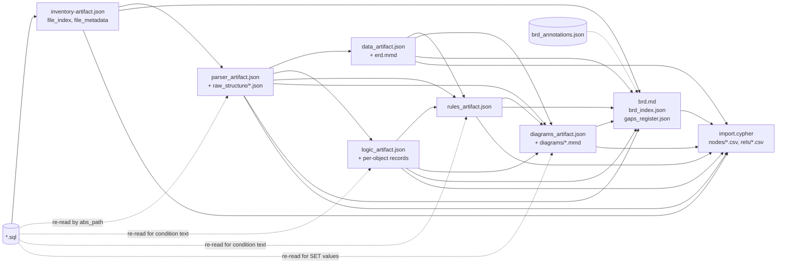
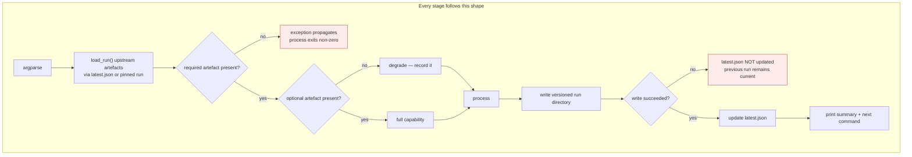
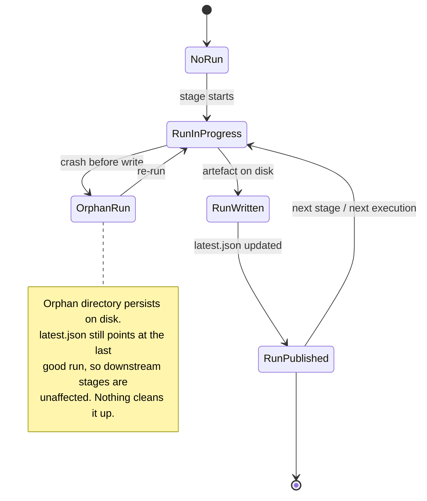
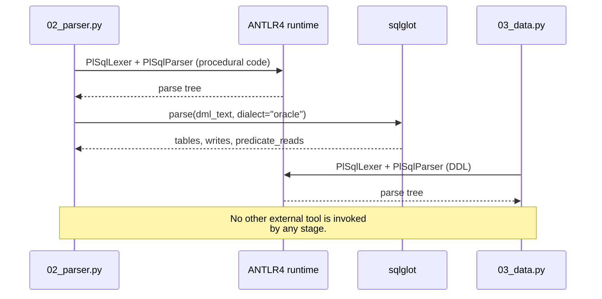
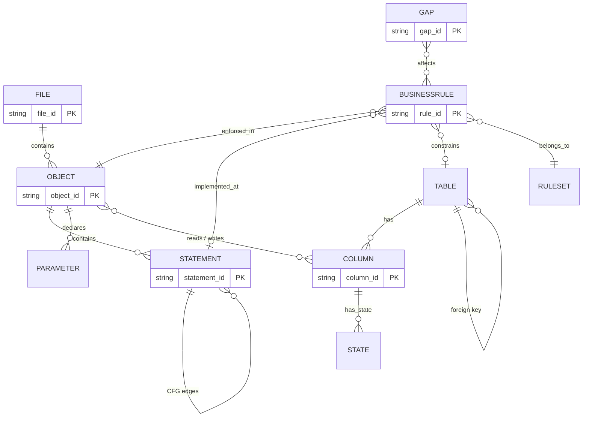
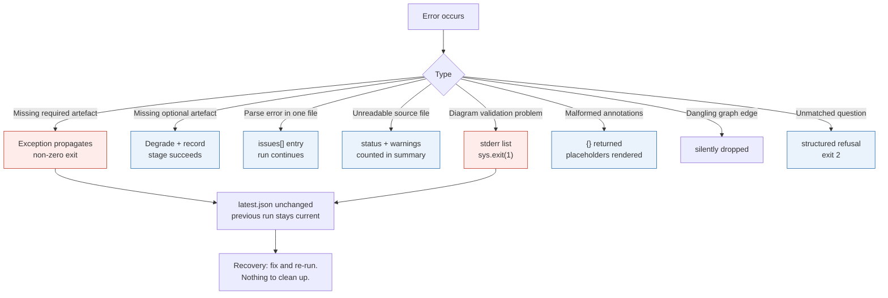
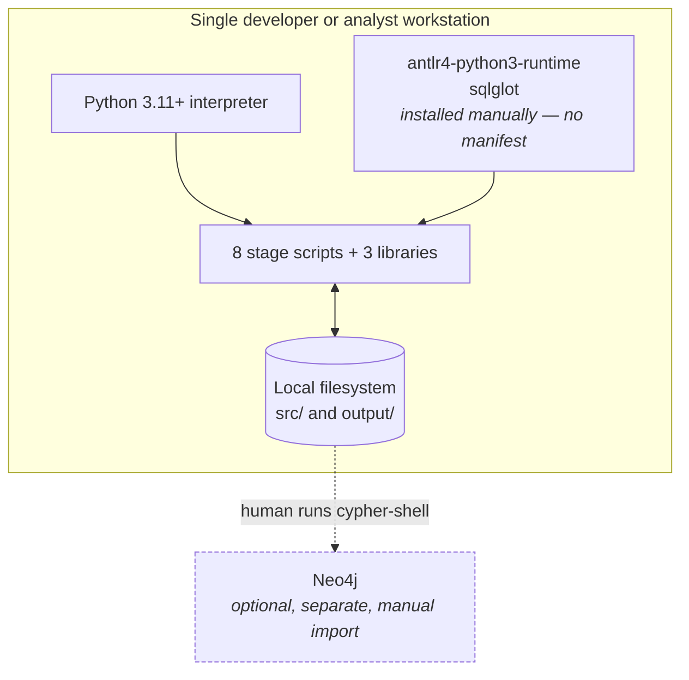

# STATUTE — Complete System Technical Documentation

**S**tructured **T**ranslation & **A**nalysis **T**ool for **U**ndocumented **T**ransactional **E**ngines

**Implementation-grounded architecture and handover documentation for the PL/SQL → BRD reverse-engineering pipeline.**

> **Grounding statement.** Every technical claim in this document is traceable to a repository file and function, explicitly labelled as an architectural inference with its supporting evidence, or marked `Not found in the current repository.` No technology, formula, metric or control is asserted that is not present in the code.

---

## Table of Contents

1. [Executive Summary](#1-executive-summary)
2. [Project Problem Statement](#2-project-problem-statement)
3. [Goals and Non-Goals](#3-goals-and-non-goals)
4. [Scope](#4-scope)
5. [System Context](#5-system-context)
6. [Technical Environment](#6-technical-environment)
7. [Repository Structure](#7-repository-structure)
8. [High-Level Architecture](#8-high-level-architecture)
9. [Agent Catalog](#9-agent-catalog)
10. [Agent Responsibility Matrix](#10-agent-responsibility-matrix)
11. [End-to-End Workflow](#11-end-to-end-workflow)
12. [Data Flow](#12-data-flow)
13. [Control Flow](#13-control-flow)
14. [Agent Orchestration](#14-agent-orchestration)
15. [State Management](#15-state-management)
16. [Prompt Flow](#16-prompt-flow)
17. [Model and Tool Interactions](#17-model-and-tool-interactions)
18. [Database and Storage Interactions](#18-database-and-storage-interactions)
19. [Input and Output Contracts](#19-input-and-output-contracts)
20. [Schema Relationships](#20-schema-relationships)
21. [Algorithms and Formulas](#21-algorithms-and-formulas)
22. [Validation and Guardrails](#22-validation-and-guardrails)
23. [Error and Recovery Workflow](#23-error-and-recovery-workflow)
24. [Security Architecture](#24-security-architecture)
25. [Testing Strategy](#25-testing-strategy)
26. [Evaluation Strategy](#26-evaluation-strategy)
27. [Observability](#27-observability)
28. [Deployment Architecture](#28-deployment-architecture)
29. [Configuration Management](#29-configuration-management)
30. [Performance and Scalability](#30-performance-and-scalability)
31. [Architecture Decisions](#31-architecture-decisions)
32. [Traceability Matrix](#32-traceability-matrix)
33. [Known Limitations](#33-known-limitations)
34. [Open Questions](#34-open-questions)
35. [References](#35-references)
36. [Maintenance and Extension Guide](#36-maintenance-and-extension-guide)

---

## 1. Executive Summary

**STATUTE** (*Structured Translation & Analysis Tool for Undocumented Transactional Engines*) reverse-engineers an Oracle PL/SQL codebase into three deliverables: a Business Requirements Document, a set of Mermaid diagrams, and a queryable knowledge graph with a plain-English question interface.

It is a **pipeline of eight independent Python command-line programs** chained by versioned JSON artefacts on disk. There is no orchestrator process, no shared state object, no service, and — the defining property — **no language model anywhere in the system.**

| Property | Value | Evidence |
|---|---|---|
| Implementation | 8 stage scripts + 3 shared libraries, ~9,142 lines of Python | `wc -l .claude/scripts/*.py` |
| Third-party dependencies | **2** — `antlr4-python3-runtime`, `sqlglot` | Import analysis across all scripts |
| Model calls | **0** | No model client imported anywhere |
| Network calls | **0** | No `requests`/`urllib`/`http` import |
| Environment variables | **0** | No `os.environ`/`getenv` use |
| Database connections | **0** | Neo4j is an export target, not a runtime dependency |
| Tests | 8 suites, **414 checks** | `tests/test_*.py` |
| Evaluation harness | 1 (Agent 05 only) | `tests/evaluate_rules.py` |

**Output on the reference corpus** (`src/`, 7 files, 603 lines of code): 41 business rules, a ~2,550-line BRD, 7 diagrams, a 353-node / 769-relationship knowledge graph, and 21 recorded gaps.

---

## 2. Project Problem Statement

An organisation runs a working Oracle PL/SQL system with no reliable documentation and no remaining authors. Before it can be modernised, replaced or audited, someone must answer: **what does it do, and what rules does it enforce?**

The repository documents the motivating precedent: an industrial 6.4-million-line COBOL system where two modernisation attempts failed — one automatic conversion, one package replacement — before the team fell back on *rewriting from a specification derived from the code*. `Confirmed from existing documentation` — `README.md`.

That sets the binding design constraint: **the output is consumed by builders, not only readers.** It must be numbered, traceable, verifiable, and explicit about what it does not know.

---

## 3. Goals and Non-Goals

### Goals (evidenced by implementation)

| Goal | Evidence |
|---|---|
| Recover business rules with source-line traceability | Agent 05 `source.statement_id`; Agent 07 traceability matrix |
| Produce a document four audiences can use | Agent 07 four-part structure |
| Make dependencies queryable | Agent 08 graph + question interface |
| Be reproducible | No model; versioned runs; golden-fixture tests |
| Be honest about uncertainty | Confidence fields, gaps register, `BlindSpot` nodes |

### Non-Goals (explicitly declined in the repository)

| Non-goal | Where declined |
|---|---|
| **Generating replacement code** | `README.md` — extraction ≈ 90% precision vs ≈ 9% for end-to-end generation |
| **Dead-code detection** | Agent 04 spec — objects are called by schedulers outside the repo; reported informational only |
| **Using an LLM to generate content** | Every agent docstring; enforced by `tests/test_synthesis.py` |
| **Regenerating the ERD in Agent 06** | Agent 06 spec — "two generators for one diagram would be an architecture smell" |
| **Writing the annotation file** | Agent 07 `load_annotations` — read-only by design |

---

## 4. Scope

**In scope.** Static analysis of `.sql` files supplied in a directory: procedures, functions, packages, triggers, DDL and seed data.

**Out of scope**, as recorded in the generated BRD's own scope chapter:
- Why the business chose these rules — intent is not in the code
- Anything that calls the system — schedulers, screens, batch wrappers, external systems
- Volumes, timings, service levels
- Security and access control
- Data quality of existing records

---

## 5. System Context



**No inbound interface.** There is no API, no queue, no scheduler integration. The only trigger is a human running a command.

---

## 6. Technical Environment

| Element | Detail | Evidence |
|---|---|---|
| Language | Python **3.11+** (`X \| Y` union type hints) | `Architectural inference` from syntax; no manifest declares it |
| Standard library | `argparse, csv, dataclasses, datetime, fnmatch, hashlib, json, os, pathlib, re, sys` | Import analysis |
| Third-party | `antlr4-python3-runtime`, `sqlglot` | Import analysis |
| Vendored | ANTLR4 Oracle PL/SQL grammar, Apache 2.0 | `.claude/scripts/vendor/plsql_grammar/NOTICE.md` |
| Grammar build tooling | `tools_antlr_build/` (`.g4` sources + jar) | Directory listing |
| Dependency manifest | **`Not found in the current repository.`** No `requirements.txt`, `pyproject.toml`, `Pipfile` or lockfile | Filesystem check |
| Containerisation | **`Not found in the current repository.`** | No Dockerfile |
| CI/CD | **`Not found in the current repository.`** | No `.github/workflows` |
| Runtime services | **None** | No server, no daemon |

---

## 7. Repository Structure

```
.claude/
  agents/                     8 agent specifications (harness metadata + design rationale)
  scripts/
    01_inventory.py   (724)   Stage 1
    02_parser.py      (858)   Stage 2
    03_data.py      (1,431)   Stage 3  — largest
    04_logic.py       (917)   Stage 4
    05_rules.py     (1,198)   Stage 5
    06_diagram.py   (1,207)   Stage 6
    07_synthesis.py (1,308)   Stage 7
    08_graph.py       (419)   Stage 8
    lib_business_language.py (271)  identifier → business language  (Agents 7, 8)
    lib_graph_model.py       (376)  in-memory property graph        (Agent 8)
    lib_graph_language.py    (433)  plain-English intent catalogue  (Agent 8)
    vendor/plsql_grammar/           vendored ANTLR4 grammar + NOTICE
    archive/                        superseded early scripts (not in the pipeline)
  skills/                     2 skill definitions (file-catalog, reference-graph)
src/                          7 PL/SQL files — the reference corpus
tests/
  test_*.py                   8 suites, 414 checks
  evaluate_rules.py           the only evaluation harness
  fixtures/ground_truth/      4 annotated procedures + BASELINE.json
  fixtures/expected-inventory-artifact.json
output/                       versioned runs (gitignored)
tools_antlr_build/            grammar regeneration
docs/                         this documentation package
reference/                    COBOL reference harness — GITIGNORED, design guidance only
```

**Important.** `reference/` is in `.gitignore` and is **not part of the system**. It is a COBOL pipeline used for design guidance. `Confirmed from configuration` — `.gitignore`.

---

## 8. High-Level Architecture



**Architectural style.** `Architectural inference based on the following repository evidence:` each stage is a separate `main()` with its own `argparse` block, reads upstream artefacts via `load_run()`, and writes a versioned directory plus `latest.json`. No module imports another stage. This is a **filesystem-mediated batch pipeline**, sometimes called pipes-and-filters with durable intermediate storage.

---

## 9. Agent Catalog

| # | Agent | Script | Lines | Detailed document |
|---|---|---|---|---|
| 1 | Inventory | `01_inventory.py` | 724 | [agent-01-inventory.md](agents/agent-01-inventory.md) |
| 2 | Parser | `02_parser.py` | 858 | [agent-02-parser.md](agents/agent-02-parser.md) |
| 3 | Data | `03_data.py` | 1,431 | [agent-03-data.md](agents/agent-03-data.md) |
| 4 | Logic | `04_logic.py` | 917 | [agent-04-logic.md](agents/agent-04-logic.md) |
| 5 | Rules | `05_rules.py` | 1,198 | [agent-05-rules.md](agents/agent-05-rules.md) |
| 6 | Diagram | `06_diagram.py` | 1,207 | [agent-06-diagram.md](agents/agent-06-diagram.md) |
| 7 | Synthesis | `07_synthesis.py` | 1,308 | [agent-07-synthesis.md](agents/agent-07-synthesis.md) |
| 8 | Graph | `08_graph.py` | 419 | [agent-08-graph.md](agents/agent-08-graph.md) |

> **Terminology note.** "Agent" here means a **pipeline stage** — an independent CLI program. It does **not** mean an autonomous LLM agent. The `.claude/agents/*.md` files are specifications for the Claude Code harness that a developer uses to work on the code; they are not executed by the pipeline.

---

## 10. Agent Responsibility Matrix

| Capability | 1 | 2 | 3 | 4 | 5 | 6 | 7 | 8 |
|---|---|---|---|---|---|---|---|---|
| Read filesystem source | ● | ● | ● | ● | ● | ● | | |
| Classify / route files | ● | ○ | ○ | | | | | |
| Parse PL/SQL grammar | | ● | ● | | | | | |
| Statement tree + CFG | | ● | | ○ | ○ | ○ | ○ | ○ |
| Schema + enforcement state | | | ● | | ○ | ○ | ○ | ○ |
| Complexity, slices, CRUD | | | | ● | ○ | ○ | ○ | ○ |
| Business rules | | | ○ | ○ | ● | ○ | ○ | ○ |
| Diagrams | | | ● ERD | | | ● | ○ | |
| Document assembly | | | | | | | ● | |
| Graph + Q&A | | | | | | | | ● |
| Stable identifiers | ● file_id | ● statement_id | ● column_id | | ● BR-nnn | | ● GAP-nnn | |

● owns · ○ consumes

---

## 11. End-to-End Workflow



**Ordering is the operator's responsibility.** No script invokes another. Each prints the next command to run — Agent 01 prints the exact `02_parser.py` invocation including the pinned run version. `Confirmed from implementation`.

---

## 12. Data Flow



**Note the dotted edges.** Agents 02, 04, 05 and 06 all re-read the original `.sql` files. Agent 02 does not store condition text, so three later stages independently re-slice raw source. `Confirmed from implementation` — `raw_snippet`/`source_lines` exist separately in `04_logic.py`, `05_rules.py` and `06_diagram.py`.

### Data lineage of a single business rule

```
src/05_medium_fund_transfer_with_validation.sql : line 79
  → Agent 01  file_id = 05_MEDIUM_FUND_TRANSFER_WITH_VALIDATION__5E3A3BBB
  → Agent 02  statement_id = <file_id>__PROC-.SP_TRANSFER_FUNDS__STMT_00nn
  → Agent 05  BR-002, source.statement_id + source.line = 79
  → Agent 06  decision node label + BRANCH edge carrying "BR-002"
  → Agent 07  §5 rule block + §12 traceability row citing the file and line
  → Agent 08  (:BusinessRule {rule_id:"BR-002"})-[:IMPLEMENTED_AT]->(:Statement)
```

---

## 13. Control Flow



**Graceful degradation is implemented in exactly two stages:** Agent 05 (logic artefact optional) and Agents 06/08 (multiple optional inputs). Agent 07 requires all six. `Confirmed from implementation`.

---

## 14. Agent Orchestration

**There is no orchestrator.** `Architectural inference based on the following repository evidence:` no orchestration module, workflow definition, DAG file, scheduler config, or framework import (`langgraph`, `airflow`, `prefect`, `celery`) exists anywhere in the repository. Each script defines its own `main()` and is invoked directly.

| Orchestration concern | Mechanism |
|---|---|
| Sequencing | **Human** — operator runs 8 commands in order; each prints the next |
| Dependency resolution | `latest.json` pointer per stage |
| Failure propagation | Process exit code; the operator decides whether to continue |
| Parallelism | None. Agents 03 and 04 are independent and *could* run in parallel; nothing does so. |
| Retry | None at any level |
| Idempotency | Every stage is idempotent modulo timestamp and run directory |

---

## 15. State Management

**There is no shared state object, session, thread, or checkpointer.** The filesystem is the state.



| Concern | Design | Evidence |
|---|---|---|
| State store | `output/<stage>/<run_version>/` | Every `main()` |
| Current pointer | `output/<stage>/latest.json`, written **after** the artefact | Every `main()` |
| Run identifier | UTC timestamp `%Y-%m-%dT%H.%M.%S.%fZ` | `generate_run_version` in all 8 scripts |
| Cross-stage correlation | `upstream` block records the run version of every input | Artefact schemas |
| Checkpointing | Every run *is* a checkpoint; directories are never overwritten | Naming scheme |
| Concurrency | **Not handled.** Concurrent runs create separate directories; the last `latest.json` write wins. No locking. | No lock code |
| Human state | `brd_annotations.json` — outside the write path entirely | Agent 07 `load_annotations` |

---

## 16. Prompt Flow

`Not found in the current repository.`

There are no prompts, prompt templates, system prompts, user-prompt builders, or prompt variables in this system. Verified by inspection: the complete third-party import set is `antlr4` and `sqlglot`; no model client of any provider is present.

The `.claude/agents/*.md` files contain natural-language specifications, but these are **metadata for the Claude Code development harness**, not runtime prompts. They are never read by any pipeline script. `Confirmed from implementation` — no script opens a path under `.claude/agents/`.

---

## 17. Model and Tool Interactions

**Model interactions:** none.

**Tool interactions** — two libraries, both local:

| Tool | Used by | Purpose | Evidence |
|---|---|---|---|
| **ANTLR4 runtime + vendored Oracle PL/SQL grammar** | Agents 02, 03 | Lex and parse PL/SQL and DDL | `_VENDOR_DIR`, `parse_source` |
| **sqlglot (Oracle dialect)** | Agent 02 | Decompose DML into tables/columns | `enrich_with_sqlglot` |



---

## 18. Database and Storage Interactions

**No database is connected to at any point.** No driver (`neo4j`, `psycopg`, `sqlalchemy`, `cx_Oracle`) is imported.

| Storage | Role |
|---|---|
| Local filesystem | The only persistence mechanism |
| `output/<stage>/<run>/` | Versioned artefacts |
| `output/<stage>/latest.json` | Current-run pointer |
| **Neo4j** | **Optional downstream consumer.** Agent 08 generates `import.cypher` and CSVs that a *human* loads. The only occurrence of the string `neo4j` in the code is inside a README example command. |

---

## 19. Input and Output Contracts

| Stage | Required inputs | Optional inputs | Primary output |
|---|---|---|---|
| 1 | `sql_dir` (filesystem) | — | `inventory-artifact.json` |
| 2 | inventory | — | `parser_artifact.json` + `raw_structure/*` |
| 3 | inventory, parser | — | `data_artifact.json`, `erd.mmd` |
| 4 | parser, inventory | data | `logic_artifact.json` + records |
| 5 | parser, data, inventory | **logic** | `rules_artifact.json` |
| 6 | **parser** | data, logic, rules, inventory | `diagrams_artifact.json`, `diagrams/*.mmd` |
| 7 | **all six** | `brd_annotations.json` | `brd.md`, `brd_index.json`, `gaps_register.json` |
| 8 | **parser** | six others + `brd_index.json` | `import.cypher`, CSVs, `README.md`, `graph_artifact.json` |

**Common artefact envelope** (all stages): `pipeline_stage`, `schema_version`, `generated_at`, `upstream`, `stats`. Agents 03–08 additionally carry `design_references`.

---

## 20. Schema Relationships



**Identifier scheme:**

| ID | Form | Owner |
|---|---|---|
| `file_id` | `SLUG__SHA256(rel_path)[0:8]` | Agent 01 |
| `object_id` | `TYPE-OWNER.NAME`, `::` for package members | Agent 02 |
| `statement_id` | `file_id__object_id__STMT_nnnn` | Agent 02 |
| `column_id` | `TABLE.COLUMN` | Agent 03 |
| `rule_id` | `BR-nnn` | Agent 05 |
| `gap_id` | `GAP-nnn` | Agent 07 |

---

## 21. Algorithms and Formulas

Complete inventory of the **five numeric thresholds** in the repository:

| Constant | Value | File:Line | Purpose |
|---|---|---|---|
| `CYCLOMATIC_THRESHOLD` | 10 | `04_logic.py:71` | Complexity warning |
| `COGNITIVE_THRESHOLD` | 15 | `04_logic.py:73` | Cognitive complexity warning |
| `_DERIVATION_COMPLEXITY_THRESHOLD` | 2 | `05_rules.py:603` | Business formula vs mechanics |
| `DEFAULT_NODE_BUDGET` | 40 | `06_diagram.py:99` | Diagram readability budget |
| `LINE_TOLERANCE` | 2 | `tests/evaluate_rules.py:45` | Ground-truth match window |

### Key formulas

**Stable file identity** (Agent 01)
$$\text{file\_id} = \text{SLUG}(\text{rel\_path}) \Vert \text{"\_\_"} \Vert \text{SHA256}(\text{rel\_path})[0{:}8]$$

**Cyclomatic complexity** (Agent 04)
$$M = D + 1, \quad D = n_{if} + n_{elsif} + n_{case\_when} + n_{loop} + n_{handler} + n_{logical}$$

**Derivation complexity** (Agent 05)
$$\text{score} = |\{\text{arithmetic ops}\}| + |\{\text{function calls}\}| \geq 2 \Rightarrow \text{business formula}$$

**Enforcement → confidence** (Agents 03 → 05)
$$\texttt{enforced} \mapsto (5,\texttt{confirmed},\texttt{False}); \quad
\texttt{enforced\_new\_data\_only} \mapsto (4,\texttt{high},\texttt{True}); \quad
\texttt{not\_enforced} \mapsto (2,\texttt{low},\texttt{True})$$

**SBVR modality** (Agent 07)
$$\text{modality} = \texttt{alethic} \iff kind \in \text{DDL\_KINDS} \wedge is\_enforced \neq \texttt{False}$$

**Evaluation** (Agent 05 harness)
$$P = \tfrac{\text{matched}}{\text{extracted}}, \quad R = \tfrac{\text{matched}}{\text{ground truth}}, \quad F_1 = \tfrac{2PR}{P+R}$$

**Clause scoring for rule naming** (Agent 05)
$$\text{score}(c) = 2\cdot[\,op = \texttt{=} \wedge rhs \text{ literal}\,] + 1\cdot[\,lhs \in \text{known fields}\,]$$

**Diagram quality** (Agent 06)
$$\text{tier1\_pct} = \tfrac{|\text{decisions with tier-1 label}|}{|\text{decisions}|}, \quad \text{traceability} = \tfrac{|\text{BRANCH edges with rule\_id}|}{|\text{BRANCH edges}|}$$

Per-agent detail is in the individual documents, section 15 of each.

---

## 22. Validation and Guardrails

| Guardrail | Stage | Mechanism |
|---|---|---|
| Content-driven routing | 1, 3 | Filename is never trusted |
| Builtin allowlist | 2 | `RAISE_APPLICATION_ERROR` not reported as external |
| Whitespace-preserving extraction | 3 | `original_text_of` — `getText()` corrupts expressions |
| Enforcement honesty | 3 → 5 → 7 | Disabled constraints surfaced *with* a warning |
| Derivation guards | 5 | `_is_derivation` + `_assigns_variable` + `len(deriving) > 2` |
| Decision-only rule labels | 6 | A branch rule may not label a non-decision statement |
| Never-collapse invariant | 6 | Decisions, loops, errors, terminals always survive |
| Oversize declared, not hidden | 6 | Undeclared overrun fails the stage |
| Internal-identifier block | 6 | `_INTERNAL_ID_PATTERNS` |
| Structural validation | 6 | **Fails the stage** on any problem |
| Provenance stripping | 7 | Identifiers removed from prose |
| Visible blanks | 7 | Unknowable attributes rendered, not omitted |
| Endpoint guard | 8 | No dangling graph edges |
| **Refusal over fabrication** | 8 | Unmatched questions refused, never guessed |
| Blind spots as nodes | 8 | Limits are queryable |

---

## 23. Error and Recovery Workflow



**Retries:** none anywhere. **Backoff:** not applicable — no external service. **Idempotency:** all stages. **Partial success:** supported in Agents 01, 02, 03.

---

## 24. Security Architecture

### Verified controls

| Control | Status | Evidence |
|---|---|---|
| Secrets management | **No secrets exist.** 0 env vars, 0 credentials, 0 tokens | Repository-wide grep |
| Network exposure | **None.** No networking library imported | Import analysis |
| Command execution | **None.** No `subprocess`, `os.system`, `eval`, `exec` | Import analysis |
| Model / prompt-injection surface | **None** — no model | Import analysis |
| Auditability | Run versioning + `upstream` provenance in every artefact | All stages |
| Input validation | Directory checks; parse errors captured not raised | Agents 01–03 |
| Output validation | Structural validation in Agent 06 (fails the stage); test-enforced in Agent 07 | Agents 06, 07 |

### Gaps and risks — stated plainly

| Risk | Detail |
|---|---|
| **Unpinned dependencies** | `antlr4-python3-runtime` and `sqlglot` are used with **no manifest and no lockfile**. This is the largest supply-chain exposure. |
| **Annotation injection** | `brd_annotations.json` content is inserted into `brd.md` verbatim with no sanitisation. Arbitrary markdown can be injected. |
| **Sensitive output** | `brd.md` and the graph export contain the complete business logic, schema, interfaces and error contracts. No classification marking or redaction mechanism exists. |
| **`abs_path` leakage** | Local filesystem paths are embedded in artefacts. |
| **No output schema validation** | Artefact shape is enforced only by tests. |
| **Cypher escaping unaudited** | `cypher_value` escapes `\`, `"` and newlines; no injection audit against adversarial schema names was found. |
| **No authentication or authorization** | By design — a local CLI relying on filesystem permissions. |

**Threat model:** `Not found in the current repository.` No threat model, STRIDE analysis or security review document exists.

---

## 25. Testing Strategy

```bash
for t in tests/test_*.py; do python "$t"; done     # 414 checks
python tests/evaluate_rules.py                     # rule extraction vs ground truth
```

| Suite | Checks | Focus |
|---|---|---|
| `test_synthesis` | 86 | Readability, navigation, completeness, traceability, honesty, annotations |
| `test_data` | 76 | Enforcement state, type mapping, cross-validation |
| `test_graph` | 68 | Schema, coverage, loadability, **refusal to guess** |
| `test_diagram` | 52 | Collapse invariants, label coverage, budget declaration |
| `test_logic` | 46 | Complexity, slicing, transaction hazards |
| `test_rules` | 33 | Obligation form, branch decomposition, dedup |
| `test_parser` | 31 | Grammar, CFG edges, sqlglot enrichment |
| `test_inventory` | 22 | Routing, stable IDs, golden diff |

**Conventions.** Every suite uses `check(condition, label)` and prints `[PASS]`/`[FAIL]`. Suites run the real pipeline via `subprocess` into a `TemporaryDirectory` — these are **integration tests with unit-style assertions**, not isolated unit tests.

**Notable practice.** Agents 06 and 08 assert against **in-memory models** rather than rendered strings, which is what makes their tests check meaning. Agent 08's suite explicitly identifies its **negative tests** (refusal behaviour) as the most important.

**Test framework:** `Not found in the current repository.` No pytest, unittest, or test runner configuration — each suite is a standalone script with a `main()` returning an exit code.

---

## 26. Evaluation Strategy

**One evaluation harness exists**, for Agent 05 only.

`tests/evaluate_rules.py` measures rule extraction against 4 hand-annotated procedures in `tests/fixtures/ground_truth/`, matching on source-line proximity (`LINE_TOLERANCE = 2`).

| Measurement | Precision | Recall | F1 |
|---|---|---|---|
| Baseline (pre-redesign) | 0.615 | 0.571 | 0.593 |
| Current (tuned) | 1.000 | 1.000 | 1.000 |
| **First blind held-out** | — | — | **0.588** |
| **Second blind held-out** | 1.000 | **0.400** | 0.571 |

**The repository itself labels the 1.000 as contaminated** — 4 of 5 procedures are annotated and each was used to fix the extractor. The defensible generalisation figures are the blind ones. `Confirmed from existing documentation` — `README.md` known limitations.

**No evaluation exists for:** file classification (Agent 01), parsing accuracy (Agent 02), schema recovery (Agent 03), complexity correctness (Agent 04), diagram usefulness (Agent 06), document usefulness (Agent 07), question recall (Agent 08).

Agents 06 and 07 publish **quality gates** (coverage thresholds asserted in tests), which measure completeness — explicitly **not** usefulness.

---

## 27. Observability

| Concern | Status |
|---|---|
| Logging framework | **None.** `print()` only; zero uses of `logging`. |
| Log levels | None |
| Structured logs | None |
| Correlation ID | `run_version`, recorded in every artefact's `upstream` block |
| Trace IDs | `Not found in the current repository.` |
| Metrics | `stats` blocks in artefacts — durable but not exported anywhere |
| Dashboards / alerting | `Not found in the current repository.` |
| Audit trail | Versioned run directories |

**Debugging procedure** (derived from the artefact design):
1. `parser_artifact.json → issues[]` — richest diagnostic surface
2. `<stage>_artifact.json → stats` — counters per stage
3. `diagrams_artifact.json → quality`, `warnings`
4. `gaps_register.json` — everything the pipeline could not settle
5. Compare run directories to see what changed

---

## 28. Deployment Architecture



| Concern | Status |
|---|---|
| Entry points | 8 CLI scripts |
| Process model | Short-lived, sequential, single-threaded |
| Containerisation | `Not found in the current repository.` |
| CI/CD | `Not found in the current repository.` |
| Health / readiness checks | Not applicable — not a service |
| Scaling | Single machine, single process |
| Persistence | Local filesystem only |

---

## 29. Configuration Management

**Environment variables:** `Not found in the current repository.`
**Configuration files:** `Not found in the current repository.`
**Environment separation (dev/test/staging/prod):** `Not found in the current repository.`

The **entire** configuration surface is CLI arguments:

| Pattern | Present on |
|---|---|
| `--<stage>-root` / `--<stage>-run` | Every consuming stage |
| `--output-root` / `--output` | All stages |
| `--verbose` | Agents 01–04 |
| `--max-nodes` | Agent 06 — **the only numeric tunable exposed** |
| `--system-name`, `--annotations` | Agent 07 |
| `--ask`, `--list-questions`, `--json` | Agent 08 |

**All five numeric thresholds except `--max-nodes` are hard-coded module constants** requiring a code change to alter.

---

## 30. Performance and Scalability

**Measured** on the reference corpus (7 files, 603 lines of code): the full 8-stage pipeline completes in well under a minute. `Measured — observed during repeated pipeline runs.`

| Stage | Dominant cost | Estimated complexity |
|---|---|---|
| 1 | File I/O | O(N × L) |
| 2 | **ANTLR parsing** | O(N × L), large constant |
| 3 | ANTLR parsing + cross-validation | O(D × L + R) |
| 4 | **Backward slicing** | O(V × S) per object |
| 5 | Statement scan + re-slicing | O(S + V) |
| 6 | Spec build + collapse | O(S + E) |
| 7 | Document assembly | O(R + T + C) |
| 8 | Graph build; `out()`/`inn()` **linear scans** | O(E) per traversal hop |

All complexity figures are `Architectural inference from the implementation` — no profiling artefact exists in the repository.

**Known bottlenecks and limits:**
- Agent 02 holds every object in memory (two-pass design)
- Agent 08 rebuilds the entire graph on **every** `--ask`
- Mermaid computes layout in-browser and degrades past roughly 50 nodes; the node budget is the mitigation
- No parallelism, caching or batching anywhere
- Unbounded run-directory growth — nothing prunes

---

## 31. Architecture Decisions

Recorded in ADR (Nygard) format in **[architecture-decisions.md](architecture-decisions.md)**. Summary:

| # | Decision | Status |
|---|---|---|
| ADR-001 | No LLM in the generation path | Accepted |
| ADR-002 | Filesystem-mediated pipeline, no orchestrator | Accepted |
| ADR-003 | Path-derived stable identifiers | Accepted |
| ADR-004 | Versioned runs with pointer-after-write | Accepted |
| ADR-005 | Formal grammar (ANTLR4) over regular expressions | Accepted |
| ADR-006 | Two-axis constraint enforcement model | Accepted |
| ADR-007 | Separate the diagram model from the renderer | Accepted |
| ADR-008 | Stop at documentation; do not generate code | Accepted |
| ADR-009 | Deterministic intent catalogue over LLM-generated Cypher | Accepted |
| ADR-010 | Human annotations in a read-only sidecar | Accepted |
| ADR-011 | Single collapse tier in diagram reduction | Accepted (supersedes a removed two-tier design) |

---

## 32. Traceability Matrix

| Claim | Repository evidence | Type | Confidence |
|---|---|---|---|
| No LLM anywhere | Import analysis across `.claude/scripts/*.py` | Confirmed from implementation | High |
| No network / env vars / DB drivers | Repository-wide grep | Confirmed from implementation | High |
| No orchestrator | Absence of any orchestration module or framework import | Architectural inference | High |
| 8 stages, 3 libraries | `wc -l .claude/scripts/*.py` | Confirmed from implementation | High |
| 414 test checks | 8 suites executed | Confirmed from tests | High |
| 5 numeric thresholds | Grep for constants | Confirmed from implementation | High |
| Pointer-after-write | Every `main()` | Confirmed from implementation | High |
| ANTLR4 + sqlglot only | Import analysis | Confirmed from implementation | High |
| Enforcement → confidence chain | `03_data.py` → `05_rules.py:176` → `07_synthesis.py` | Confirmed from implementation + tests | High |
| F1 figures | `tests/evaluate_rules.py`, `BASELINE.json`, `README.md` | Confirmed from tests + documentation | High |
| **`TRANSITIONS_TO` not emitted** | `lib_graph_model.py` loop contains `pass`; live artefact shows relationship absent | Confirmed from implementation | High |
| No Dockerfile / CI / manifest | Filesystem check | Confirmed from configuration | High |
| `reference/` is gitignored | `.gitignore` | Confirmed from configuration | High |
| Complexity estimates | Implementation reading only; no profiling data | Architectural inference | Medium |
| Python 3.11+ floor | `X \| Y` type-hint syntax | Architectural inference | Medium |

---

## 33. Known Limitations

**Verified, system-wide:**

1. **Rule-extraction F1 is tuned, not blind.** Defensible figures: F1 0.588, recall 0.400.
2. **No dependency manifest** — two third-party libraries installed from knowledge.
3. **No CI, no container, no deployment automation.**
4. **No logging framework, no metrics export, no alerting.**
5. **`TRANSITIONS_TO` graph edges are not emitted** despite `State` nodes existing — the deriving loop contains only `pass`.
6. **Coverage metrics prove completeness, not usefulness.**
7. **Concepts cannot be recovered from code** — the annotation layer exists because of this.
8. **The graph is a lower bound on dependencies**; four blind-spot classes are declared.
9. **Condition text is re-sliced three times** by Agents 04, 05 and 06.
10. **No concurrency control** on `latest.json`.
11. **Unbounded run-directory growth.**
12. **Annotation content is unsanitised.**
13. **Category keyword tables are banking vocabulary**, untested on other domains.
14. **Only 5 objects and 15 tables** have ever been processed — no large-corpus evidence.

---

## 34. Open Questions

Cannot be resolved from the repository. `Requires stakeholder confirmation.`

1. Why does Agent 02 not store condition text, forcing three re-implementations?
2. Why is `TRANSITIONS_TO` unimplemented when Agent 06 computes transitions?
3. What is the supported Python floor, and what dependency versions are validated?
4. Are complexity thresholds (10, 15) organisational standards or defaults?
5. Why is PySpark the assumed rebuild target?
6. What is the retention policy for run directories?
7. Who owns `brd_annotations.json` operationally?
8. Should the BRD carry a classification marking?
9. What is the largest codebase this has been run against?
10. What intent-match recall is acceptable for Agent 08?

---

## 35. References

Full list with classification in **[references.md](references.md)**.

**Declared in code** (`DESIGN_REFERENCES` blocks): Agent 03 — 7 entries; Agent 04 — 3; Agents 05, 06, 07 — 2 each; Agent 08 — 4. **Agents 01 and 02 declare none.**

**Directly influenced the implementation** (named in code or specifications): McCabe (1976); Campbell cognitive complexity; Weiser (1981); ISO/IEC/IEEE 29148:2018; OMG SBVR 1.5; IIBA BABOK v3; Chikofsky & Cross (1990); Biggerstaff et al. (1993); Aghajani et al. (ICSE 2020); Lethbridge et al. (2003); Cosentino et al. (WCRE 2013); Mavin et al. (EARS); Moody (2009); Shneiderman (1996); Shneiderman et al. (1977); Purchase (1997/2002); VEIL (arXiv 2511.05066); Yamaguchi et al. (2014); jQAssistant; Lehnert; ANTLR grammars-v4; sqlglot.

**Used only to structure this documentation:** [arc42](https://arc42.org/overview), [C4 model](https://c4model.com), [ADR / Nygard](https://cognitect.com/blog/2011/11/15/documenting-architecture-decisions).

---

## 36. Maintenance and Extension Guide

### The five changes that ripple furthest

| Change | Blast radius |
|---|---|
| `file_id` scheme (Agent 01) | Every downstream ID; golden fixture; full re-run |
| `statement_id` format (Agent 02) | Agents 05, 06, 07, 08 simultaneously — the pipeline's join key |
| Statement type strings (Agent 02) | Agent 04 `_BLOCK_TYPES`, Agent 06 `_KIND_BY_STATEMENT`, Agent 08 edge mapping |
| A new rule source kind (Agent 05) | Agent 07 `RULE_ORIGIN_LABELS` + `formal_statement`; Agent 08 `origin` |
| Enforcement confidence strings (Agent 03) | Agent 05 `_ENFORCEMENT_TO_CONFIDENCE` keys on the string |

### Adding a ninth stage

1. Follow the `main()` + `argparse` + `load_run` + versioned-write + `latest.json` pattern
2. Read upstream via `latest.json`; degrade gracefully on optional inputs
3. Emit the standard envelope (`pipeline_stage`, `schema_version`, `generated_at`, `upstream`, `stats`)
4. Add `tests/test_<stage>.py` using the `check(condition, label)` convention
5. Add `.claude/agents/<n>_<name>_agent.md`
6. Add `docs/agents/agent-0<n>-<name>.md` following the 28-section template

### Highest-value improvements (evidence-based, not implemented)

1. **Add a dependency manifest** — the largest operational risk
2. **Implement `TRANSITIONS_TO`** — a computed finding is being discarded
3. **Run against foreign, non-banking PL/SQL** — the only real test of generalisation
4. **Store condition text in Agent 02** — removes three duplicate implementations
5. **Prune old run directories** — unbounded growth is already observable

---

*Companion documents: eight [agent documents](agents/), plus [system-overview](system-overview.md), [architecture-decisions](architecture-decisions.md), [traceability-matrix](traceability-matrix.md), [references](references.md), [known-gaps-and-open-questions](known-gaps-and-open-questions.md), and [documentation-review-report](documentation-review-report.md).*
