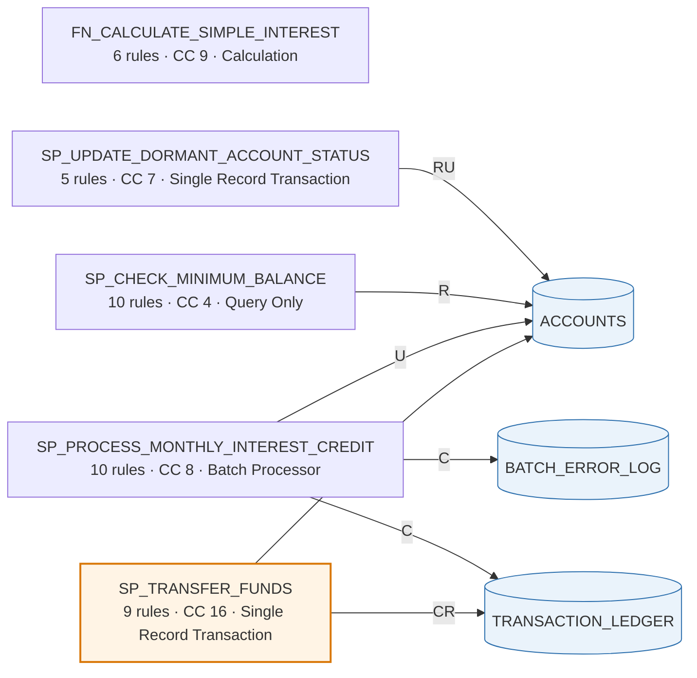
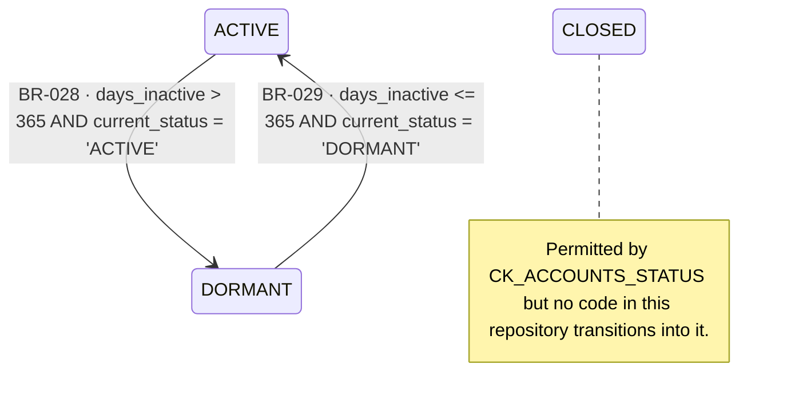
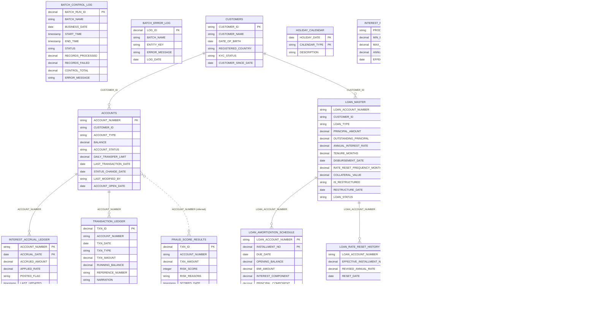
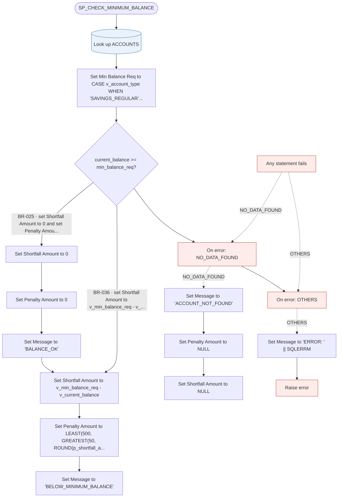
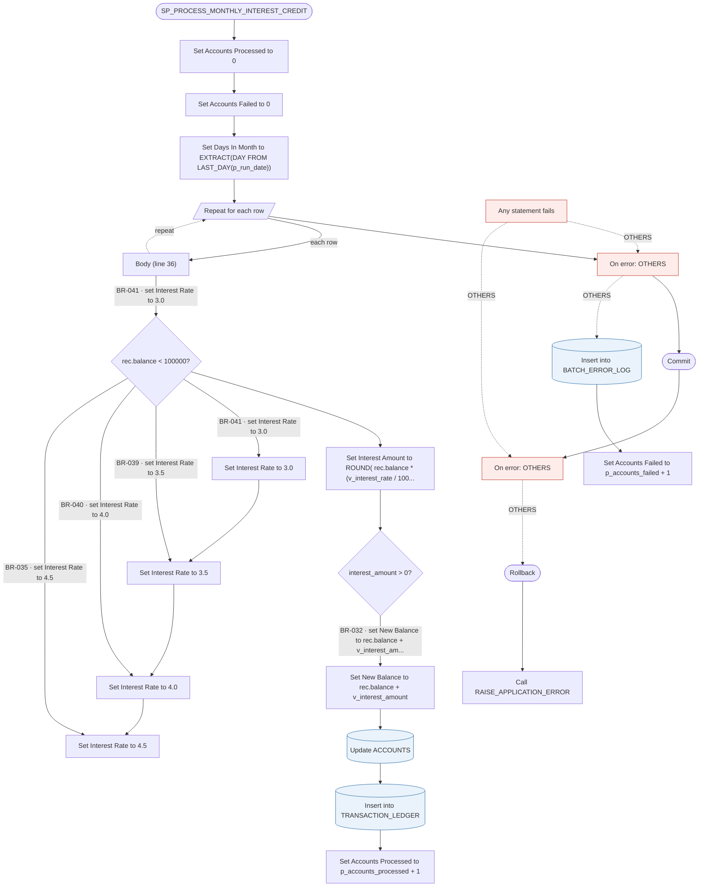
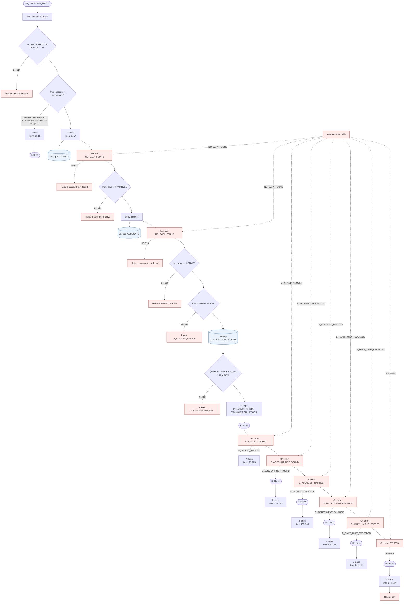
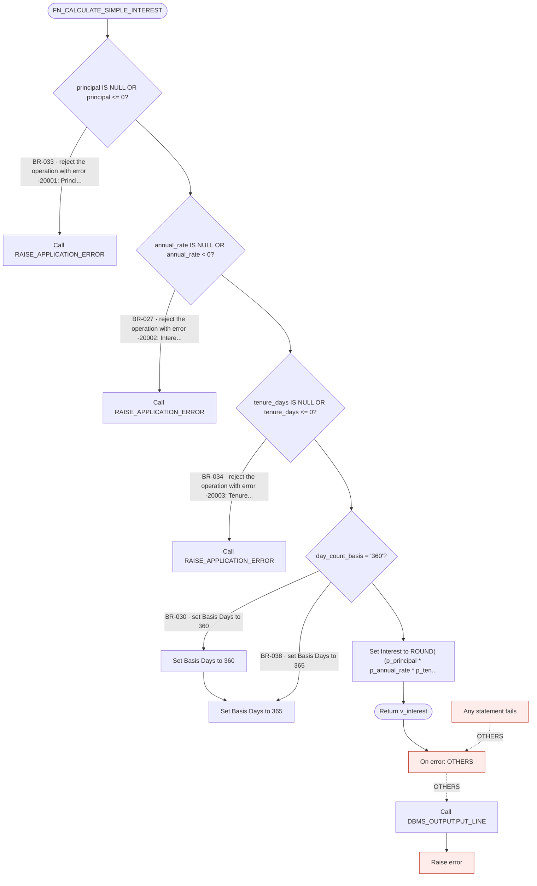
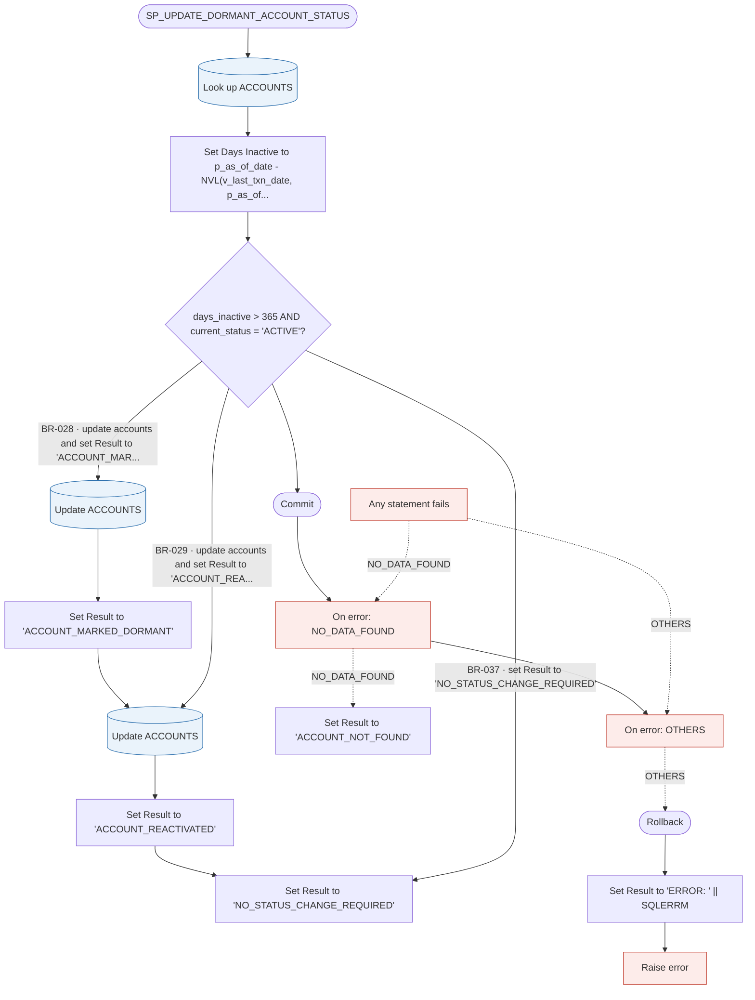

# PL/SQL Banking System — Business Requirements Document


> **What this document is.** A Business Requirements Document for an existing Oracle PL/SQL system, recovered automatically from its source code. It is written so that a business reader can understand what the system does, a business analyst can review and sign off its rules, and a development team can rebuild the system from it without reading the original code.


> **What it is not.** It does not say *why* the business wanted these behaviours. That intent was never written into the code and cannot be recovered from it. Section 13 lists every place a person needs to supply it.


<!-- CONTENTS -->
## Contents

- [Document Control](#document-control)
- [How to Read This Document](#how-to-read-this-document)
- [Part I — Business View](#part-i-business-view)
  - [1. Executive Summary](#1-executive-summary)
  - [2. Scope](#2-scope)
  - [3. Business Glossary](#3-business-glossary)
  - [4. Program Units](#4-program-units)
    - [Figure 1 — Data flow: program units and the tables they access](#figure-1-data-flow-program-units-and-the-tables-they-access)
    - [CRUD matrix](#crud-matrix)
- [Part II — Business Rules and Behaviour](#part-ii-business-rules-and-behaviour)
  - [5. Business Rules Catalogue](#5-business-rules-catalogue)
    - [5.1 Validation rules](#51-validation-rules)
    - [5.2 Limit Check rules](#52-limit-check-rules)
    - [5.3 Calculation rules](#53-calculation-rules)
    - [5.6 Error Handling rules](#56-error-handling-rules)
  - [6. Entity State Models](#6-entity-state-models)
    - [Figure 2.1 — Accounts lifecycle](#figure-21-accounts-lifecycle)
  - [7. Error Handling and Guarantees](#7-error-handling-and-guarantees)
- [Part III — Build Specification](#part-iii-build-specification)
  - [8. Data Model](#8-data-model)
    - [Figure 3 — Entity Relationship Diagram (ERD)](#figure-3-entity-relationship-diagram-erd)
    - [8.1 Accounts](#81-accounts)
    - [8.2 Batch Control Log](#82-batch-control-log)
    - [8.3 Batch Error Log](#83-batch-error-log)
    - [8.4 Customers](#84-customers)
    - [8.5 Fraud Score Results](#85-fraud-score-results)
    - [8.6 Holiday Calendar](#86-holiday-calendar)
    - [8.7 Interest Accrual Ledger](#87-interest-accrual-ledger)
    - [8.8 Interest Rate Master](#88-interest-rate-master)
    - [8.9 Loan Amortization Schedule](#89-loan-amortization-schedule)
    - [8.10 Loan Master](#810-loan-master)
    - [8.11 Loan Rate Reset History](#811-loan-rate-reset-history)
    - [8.12 Loan Repayment Tracker](#812-loan-repayment-tracker)
    - [8.13 Non-Performing Asset Classification History](#813-non-performing-asset-classification-history)
    - [8.14 Non-Performing Asset Provisioning Summary](#814-non-performing-asset-provisioning-summary)
    - [8.15 Transaction Ledger](#815-transaction-ledger)
    - [8.x Sequences](#8x-sequences)
  - [9. Interface Contracts](#9-interface-contracts)
    - [Calculate Simple Interest](#calculate-simple-interest)
    - [Update Dormant Account Status](#update-dormant-account-status)
    - [Check Minimum Balance](#check-minimum-balance)
    - [Process Monthly Interest Credit](#process-monthly-interest-credit)
    - [Transfer Funds](#transfer-funds)
  - [10. Process Specifications](#10-process-specifications)
    - [10.1 Check Minimum Balance](#101-check-minimum-balance)
    - [10.2 Process Monthly Interest Credit](#102-process-monthly-interest-credit)
    - [10.3 Transfer Funds](#103-transfer-funds)
    - [10.4 Calculate Simple Interest](#104-calculate-simple-interest)
    - [10.5 Update Dormant Account Status](#105-update-dormant-account-status)
  - [11. Operational Characteristics](#11-operational-characteristics)
- [Part IV — Assurance and Handover](#part-iv-assurance-and-handover)
  - [12. Requirements Traceability Matrix](#12-requirements-traceability-matrix)
  - [13. Gaps, Assumptions and Questions for the Business](#13-gaps-assumptions-and-questions-for-the-business)
    - [High priority (4)](#high-priority-4)
    - [Medium priority (8)](#medium-priority-8)
    - [Low priority (9)](#low-priority-9)
    - [How to answer these](#how-to-answer-these)
  - [14. Rebuilding This System](#14-rebuilding-this-system)
- [Appendix A — How This Document Was Produced](#appendix-a-how-this-document-was-produced)
- [Appendix B — Reference Scheme](#appendix-b-reference-scheme)
- [Appendix C — Method References](#appendix-c-method-references)

## Document Control

| Item | Value |
|---|---|
| Document type | Business Requirements Document (BRD) |
| System | PL/SQL Banking System |
| Generated | 2026-07-29T16:06:14.998597+00:00 |
| Generated by | Deterministic static-analysis pipeline. Python analysers (ANTLR4 Oracle PL/SQL grammar for structure, sqlglot for SQL) orchestrated by an AI agent harness. |
| Hallucination risk | **None — structurally impossible.** No language model generates, summarises, judges or rewrites any content here. Every sentence is assembled by rule from a parse tree, which is why every statement cites a file and line number. There is no sampling temperature because there is no model in the generation path. |
| Source analysed | 7 files, 0 lines of code |
| Analysis run | 2026-07-29T16.05.37.101Z |
| Human annotations | none supplied yet — see section 13 |
| Status | Draft for review — not yet confirmed by a business owner |

**Status note.** This document records what the code does, not what the business intends. Section 13 lists everything that still requires input from a person.

## How to Read This Document

The document is in four parts. You do not need to read all of them.

| If you are… | Read | You will learn |
|---|---|---|
| A sponsor or manager | Part I | Scope, program units, tables, and where risk sits |
| A business analyst | Parts I and II | Every rule the system enforces, in reviewable form |
| A developer or architect | Parts II and III | Everything needed to rebuild it |
| An auditor or tester | Part IV | Where each rule lives in the source, and what is uncertain |
| A machine | `brd_index.json` | The same content as structured data |


**How certain is each part?** Static analysis is not equally sure of everything, so each part says which it is:

| Marking | Meaning |
|---|---|
| **Recorded** | Read directly from the source. Near-certain — the code says this. |
| **Recovered** | Inferred from code structure. Very likely, but the business meaning behind it is interpretation. |
| **Needs review** | Flagged for a person to confirm. Do not rely on it yet. |

## Part I — Business View

*Reliability of this part: **Recorded**. Everything here is counted or read directly from the source code.*

### 1. Executive Summary

**PL/SQL Banking System** is a banking system that performs **5 distinct business capabilities** over **15 database tables**.


The system provides:

- **Check Minimum Balance** — Reads information and reports it back without changing anything.

- **Process Monthly Interest Credit** — Works through many records in one run, one at a time.

- **Transfer Funds** — Handles one business event from start to finish.

- **Calculate Simple Interest** — Takes values in, returns a computed result, changes no data.

- **Update Dormant Account Status** — Handles one business event from start to finish.


**41 business rules** were recovered from the code, every one traced to the exact line that implements it. **18** are certain; **3** need a person to confirm what they mean.


**Before relying on this document**, 4 significant matters need attention — see section 13. The most important are:

- Needs business confirmation: Enforce Balance below 100,000 (BR-041)

- Needs business confirmation: Enforce Balance below 1,000,000 (BR-039)

- Needs business confirmation: Enforce Balance below 10,000,000 (BR-040)

- Transaction behaviour to preserve in Transfer Funds: Savepoint Partial Rollback


### 2. Scope

**In scope.** This document describes, completely, the behaviour implemented in the source code supplied for analysis:

| Included | Count | Meaning |
|---|---|---|
| Program units | 5 | Procedures and functions analysed |
| Business rules | 41 | Decisions, calculations, limits and checks it enforces |
| Tables | 15 | Database tables the system reads or writes |
| Columns | 105 | Columns across all tables |
| Parameters | 20 | IN / OUT parameters across all units |

**Out of scope.** These are genuinely absent and must be obtained elsewhere before any rebuild:

- **Why the business chose these rules.** Thresholds, rates and limits are recorded, but the policy or regulation behind them is not in the code.

- **Anything that calls this system.** Schedulers, screens, batch jobs and external systems are outside the supplied source.

- **Volumes, timings and service levels.** How many records, how often, and how fast are operational facts, not code facts.

- **Security and access control.** Who is permitted to run these processes is not expressed in the analysed code.

- **Data quality of existing records.** Rules are described as written; whether current data complies is a separate exercise.

### 3. Business Glossary

Every term used in this document, and the technical name behind it. This is the bridge between business language and the code — and the place to record what each term actually means to the business.

| Business term | Technical name | What it holds | Used by | Business meaning |
|---|---|---|---|---|
| Account Number | `ACCOUNTS.ACCOUNT_NUMBER` | Text (up to 20 characters) | Check Minimum Balance, Process Monthly Interest Credit, Transfer Funds, Update Dormant Account Status | _to be supplied_ |
| Last Transaction Date | `ACCOUNTS.LAST_TRANSACTION_DATE` | Date | Process Monthly Interest Credit, Transfer Funds, Update Dormant Account Status | _to be supplied_ |
| Balance | `ACCOUNTS.BALANCE` | Decimal number (18 digits, 2 decimal places) | Check Minimum Balance, Process Monthly Interest Credit, Transfer Funds | _to be supplied_ |
| Account Number | `TRANSACTION_LEDGER.ACCOUNT_NUMBER` | Text (up to 20 characters) | Process Monthly Interest Credit, Transfer Funds | _to be supplied_ |
| Narration | `TRANSACTION_LEDGER.NARRATION` | Text (up to 200 characters) | Process Monthly Interest Credit, Transfer Funds | _to be supplied_ |
| Running Balance | `TRANSACTION_LEDGER.RUNNING_BALANCE` | Decimal number (18 digits, 2 decimal places) | Process Monthly Interest Credit, Transfer Funds | _to be supplied_ |
| Transaction Amount | `TRANSACTION_LEDGER.TXN_AMOUNT` | Decimal number (18 digits, 2 decimal places) | Process Monthly Interest Credit, Transfer Funds | _to be supplied_ |
| Transaction Date | `TRANSACTION_LEDGER.TXN_DATE` | Date | Process Monthly Interest Credit, Transfer Funds | _to be supplied_ |
| Transaction Identifier | `TRANSACTION_LEDGER.TXN_ID` | Number | Process Monthly Interest Credit, Transfer Funds | _to be supplied_ |
| Transaction Type | `TRANSACTION_LEDGER.TXN_TYPE` | Text (up to 20 characters) | Process Monthly Interest Credit, Transfer Funds | _to be supplied_ |
| Account Status | `ACCOUNTS.ACCOUNT_STATUS` | Text (up to 20 characters) | Transfer Funds, Update Dormant Account Status | _to be supplied_ |
| Batch Name | `BATCH_ERROR_LOG.BATCH_NAME` | Text (up to 50 characters) | Process Monthly Interest Credit | _to be supplied_ |
| Entity Key | `BATCH_ERROR_LOG.ENTITY_KEY` | Text (up to 50 characters) | Process Monthly Interest Credit | _to be supplied_ |
| Error Message | `BATCH_ERROR_LOG.ERROR_MESSAGE` | Text (up to 1000 characters) | Process Monthly Interest Credit | _to be supplied_ |
| Log Date | `BATCH_ERROR_LOG.LOG_DATE` | Date | Process Monthly Interest Credit | _to be supplied_ |
| Log Identifier | `BATCH_ERROR_LOG.LOG_ID` | Number | Process Monthly Interest Credit | _to be supplied_ |
| Last Modified by | `ACCOUNTS.LAST_MODIFIED_BY` | Text (up to 50 characters) | Update Dormant Account Status | _to be supplied_ |
| Status Change Date | `ACCOUNTS.STATUS_CHANGE_DATE` | Date | Update Dormant Account Status | _to be supplied_ |
| Account Type | `ACCOUNTS.ACCOUNT_TYPE` | Text (up to 20 characters) | Check Minimum Balance | _to be supplied_ |
| Daily Transfer Limit | `ACCOUNTS.DAILY_TRANSFER_LIMIT` | Decimal number (18 digits, 2 decimal places) | Transfer Funds | _to be supplied_ |
| Reference Number | `TRANSACTION_LEDGER.REFERENCE_NUMBER` | Text (up to 50 characters) | Transfer Funds | _to be supplied_ |

*21 terms still need a business definition. See section 13 for how to supply them.*

### 4. Program Units

Each procedure and function, with what it does and what it accesses. Full specifications are in Part III.

**Check Minimum Balance** — Enquiry

Reads information and reports it back without changing anything.

Enforces 10 rules; touches Accounts.


**Process Monthly Interest Credit** — Batch process

Works through many records in one run, one at a time.

Enforces 10 rules; touches Accounts, Batch Error Log, Transaction Ledger.


**Transfer Funds** — Single transaction

Handles one business event from start to finish.

Enforces 9 rules; touches Accounts, Transaction Ledger.


**Calculate Simple Interest** — Calculation

Takes values in, returns a computed result, changes no data.

Enforces 6 rules; touches no stored records.


**Update Dormant Account Status** — Single transaction

Handles one business event from start to finish.

Enforces 5 rules; touches Accounts.


#### Figure 1 — Data flow: program units and the tables they access



*Rounded boxes are business processes; cylinders are stored records. Arrows show what each process does to each record: C = creates, R = reads, U = updates, D = deletes. Amber processes are unusually complex.*

#### CRUD matrix

| Program | ACCOUNTS | BATCH_ERROR_LOG | TRANSACTION_LEDGER |
|---|---|---|---|
| SP_CHECK_MINIMUM_BALANCE | R |  |  |
| SP_PROCESS_MONTHLY_INTEREST_CREDIT | U | C | C |
| SP_TRANSFER_FUNDS | CRU |  | CR |
| SP_UPDATE_DORMANT_ACCOUNT_STATUS | RU |  |  |

*C = creates, R = reads, U = updates, D = deletes. Derived from the DML statements each program executes.*

## Part II — Business Rules and Behaviour

*Reliability of this part: **Recovered**. The rules are read from code with certainty; naming them in business language is interpretation. Anything marked **Needs review** is not yet dependable.*

### 5. Business Rules Catalogue

Every rule the system enforces. Each is stated twice — once in plain English, once in formal language suitable for building and testing — and points at the exact line of source that implements it.


**Two kinds of rule appear here.** A rule the database itself enforces cannot be broken, and is written *“it is necessary that…”*. A rule enforced by program code *can* be broken — that is precisely why the code checks for it — and is written *“it is obligatory that…”*.


#### 5.1 Validation rules

##### BR-012 — Require the Accounts record for From Account to exist

| Attribute | Value |
|---|---|
| Requirement type | Functional — validation |
| Confidence | Confirmed |
| Source | guarded RAISE in Transfer Funds — `05_medium_fund_transfer_with_validation.sql:56` |
| How to verify | Test (exercise the code path) |
| Owner | _to be assigned_ |
| Priority | _to be assigned_ |
| Exact condition in code | `row must exist in accounts` |

**In plain terms.** Row Must Exist in Accounts.

The referenced row in Accounts must exist. If the lookup returns no data the operation is rejected and Account Not Found is raised.


**Formal statement.** It is obligatory that the operation is rejected unless Row Must Exist in Accounts, raising Account Not Found.


##### BR-013 — Require the Accounts record for To Account to exist

| Attribute | Value |
|---|---|
| Requirement type | Functional — validation |
| Confidence | Confirmed |
| Source | guarded RAISE in Transfer Funds — `05_medium_fund_transfer_with_validation.sql:71` |
| How to verify | Test (exercise the code path) |
| Owner | _to be assigned_ |
| Priority | _to be assigned_ |
| Exact condition in code | `row must exist in accounts` |

**In plain terms.** Row Must Exist in Accounts.

The referenced row in Accounts must exist. If the lookup returns no data the operation is rejected and Account Not Found is raised.


**Formal statement.** It is obligatory that the operation is rejected unless Row Must Exist in Accounts, raising Account Not Found.


##### BR-014 — Restrict Account Status to allowed values

| Attribute | Value |
|---|---|
| Requirement type | Functional — validation |
| Confidence | Confirmed |
| Source | CHECK constraint `CK_ACCOUNTS_STATUS` on `ACCOUNTS` (DDL) |
| How to verify | Inspection (database schema) |
| Owner | _to be assigned_ |
| Priority | _to be assigned_ |
| Exact condition in code | `account_status IN ('ACTIVE','DORMANT','CLOSED')` |

**In plain terms.** Account Status IN ('ACTIVE','DORMANT','CLOSED').

The database defines: Account Status IN ('ACTIVE','DORMANT','CLOSED') (table Accounts). Constraint is ENABLED and VALIDATED — enforced by the database for all data.


**Formal statement.** It is necessary that Account Status IN ('ACTIVE','DORMANT','CLOSED').


##### BR-015 — Restrict processing to eligible Accounts records

| Attribute | Value |
|---|---|
| Requirement type | Functional — validation |
| Confidence | Confirmed |
| Source | cursor WHERE clause in Process Monthly Interest Credit — `04_medium_process_monthly_interest_credit.sql:17` |
| How to verify | Test (exercise the code path) |
| Owner | _to be assigned_ |
| Priority | _to be assigned_ |
| Exact condition in code | `account_status = 'ACTIVE' AND account_type LIKE 'SAVINGS%'` |

**In plain terms.** Account Status is 'ACTIVE' and Account Type LIKE 'SAVINGS%'.

This process applies only to rows of Accounts where Account Status is 'ACTIVE' and Account Type LIKE 'SAVINGS%'. Records outside this population are not processed. Defined by cursor c_savings_accounts in Process Monthly Interest Credit, line 17.


**Formal statement.** It is obligatory that only records where Account Status is 'ACTIVE' and Account Type LIKE 'SAVINGS%' are processed.


##### BR-016 — Validate Amount

| Attribute | Value |
|---|---|
| Requirement type | Functional — validation |
| Confidence | Confirmed |
| Source | guarded RAISE in Transfer Funds — `05_medium_fund_transfer_with_validation.sql:36` |
| How to verify | Test (exercise the code path) |
| Owner | _to be assigned_ |
| Priority | _to be assigned_ |
| Exact condition in code | `p_amount IS NULL OR p_amount <= 0` |

**In plain terms.** Amount is missing or Amount is at or below 0.

The operation must not proceed when Amount is missing or Amount is at or below 0. Violation raises Invalid Amount.


**Formal statement.** It is obligatory that the operation is rejected when Amount is missing or Amount is at or below 0, raising Invalid Amount.


##### BR-017 — Validate From Status is ACTIVE

| Attribute | Value |
|---|---|
| Requirement type | Functional — validation |
| Confidence | Confirmed |
| Source | guarded RAISE in Transfer Funds — `05_medium_fund_transfer_with_validation.sql:60` |
| How to verify | Test (exercise the code path) |
| Owner | _to be assigned_ |
| Priority | _to be assigned_ |
| Exact condition in code | `v_from_status <> 'ACTIVE'` |

**In plain terms.** From Status is not 'ACTIVE'.

The operation must not proceed when From Status is not 'ACTIVE'. Violation raises Account Inactive.


**Formal statement.** It is obligatory that the operation is rejected when From Status is not 'ACTIVE', raising Account Inactive.


##### BR-018 — Validate To Status is ACTIVE

| Attribute | Value |
|---|---|
| Requirement type | Functional — validation |
| Confidence | Confirmed |
| Source | guarded RAISE in Transfer Funds — `05_medium_fund_transfer_with_validation.sql:75` |
| How to verify | Test (exercise the code path) |
| Owner | _to be assigned_ |
| Priority | _to be assigned_ |
| Exact condition in code | `v_to_status <> 'ACTIVE'` |

**In plain terms.** To Status is not 'ACTIVE'.

The operation must not proceed when To Status is not 'ACTIVE'. Violation raises Account Inactive.


**Formal statement.** It is obligatory that the operation is rejected when To Status is not 'ACTIVE', raising Account Inactive.


##### BR-027 — Validate Annual Rate

| Attribute | Value |
|---|---|
| Requirement type | Functional — validation |
| Confidence | High |
| Source | IF/ELSIF branch in Calculate Simple Interest — `01_simple_calculate_simple_interest.sql:23` |
| How to verify | Test (exercise the code path) |
| Owner | _to be assigned_ |
| Priority | _to be assigned_ |
| Exact condition in code | `p_annual_rate IS NULL OR p_annual_rate < 0` |

**In plain terms.** Annual Rate is missing or Annual Rate is below 0. When this happens, the system reject the operation with error -20002: Interest rate cannot be negative..

When Annual Rate is missing or Annual Rate is below 0, the system applies the corresponding handling.


**Formal statement.** When Annual Rate is missing or Annual Rate is below 0, it is obligatory that the system reject the operation with error -20002: Interest rate cannot be negative..


##### BR-028 — Validate Current Status is ACTIVE

| Attribute | Value |
|---|---|
| Requirement type | Functional — validation |
| Confidence | High |
| Source | IF/ELSIF branch in Update Dormant Account Status — `02_simple_update_dormant_account_status.sql:27` |
| How to verify | Test (exercise the code path) |
| Owner | _to be assigned_ |
| Priority | _to be assigned_ |
| Exact condition in code | `v_days_inactive > 365 AND v_current_status = 'ACTIVE'` |

**In plain terms.** Days Inactive is above 365 and Current Status is 'ACTIVE'. When this happens, the system update accounts and set Result to 'Account Marked Dormant'.

When Days Inactive is above 365 and Current Status is 'ACTIVE', the system applies the corresponding handling.


**Formal statement.** When Days Inactive is above 365 and Current Status is 'ACTIVE', it is obligatory that the system update Accounts and set Result to 'Account Marked Dormant'.


##### BR-029 — Validate Current Status is DORMANT

| Attribute | Value |
|---|---|
| Requirement type | Functional — validation |
| Confidence | High |
| Source | IF/ELSIF branch in Update Dormant Account Status — `02_simple_update_dormant_account_status.sql:40` |
| How to verify | Test (exercise the code path) |
| Owner | _to be assigned_ |
| Priority | _to be assigned_ |
| Exact condition in code | `v_days_inactive <= 365 AND v_current_status = 'DORMANT'` |

**In plain terms.** Days Inactive is at or below 365 and Current Status is 'DORMANT'. When this happens, the system update accounts and set Result to 'Account Reactivated'.

When Days Inactive is at or below 365 and Current Status is 'DORMANT', the system applies the corresponding handling (ELSIF branch 1).


**Formal statement.** When Days Inactive is at or below 365 and Current Status is 'DORMANT', it is obligatory that the system update Accounts and set Result to 'Account Reactivated'.


##### BR-030 — Validate Day Count Basis is 360

| Attribute | Value |
|---|---|
| Requirement type | Functional — validation |
| Confidence | High |
| Source | IF/ELSIF branch in Calculate Simple Interest — `01_simple_calculate_simple_interest.sql:32` |
| How to verify | Test (exercise the code path) |
| Owner | _to be assigned_ |
| Priority | _to be assigned_ |
| Exact condition in code | `p_day_count_basis = '360'` |

**In plain terms.** Day Count Basis is '360'. When this happens, the system set Basis Days to 360.

When Day Count Basis is '360', the system applies the corresponding handling.


**Formal statement.** When Day Count Basis is '360', it is obligatory that the system set Basis Days to 360.


##### BR-031 — Validate From Account is To Account

| Attribute | Value |
|---|---|
| Requirement type | Functional — validation |
| Confidence | High |
| Source | IF/ELSIF branch in Transfer Funds — `05_medium_fund_transfer_with_validation.sql:39` |
| How to verify | Test (exercise the code path) |
| Owner | _to be assigned_ |
| Priority | _to be assigned_ |
| Exact condition in code | `p_from_account = p_to_account` |

**In plain terms.** From Account is To Account. When this happens, the system set Status to 'FAILED' and set Message to 'Source and destination accounts cannot be the same.'.

When From Account is To Account, the system applies the corresponding handling.


**Formal statement.** When From Account is To Account, it is obligatory that the system set Status to 'FAILED' and set Message to 'Source and destination Accounts cannot be the same.'.


##### BR-032 — Validate Interest Amount above 0

| Attribute | Value |
|---|---|
| Requirement type | Functional — validation |
| Confidence | High |
| Source | IF/ELSIF branch in Process Monthly Interest Credit — `04_medium_process_monthly_interest_credit.sql:54` |
| How to verify | Test (exercise the code path) |
| Owner | _to be assigned_ |
| Priority | _to be assigned_ |
| Exact condition in code | `v_interest_amount > 0` |

**In plain terms.** Interest Amount is above 0. When this happens, the system set New Balance to Balance + Interest Amount and update accounts.

When Interest Amount is above 0, the system applies the corresponding handling.


**Formal statement.** When Interest Amount is above 0, it is obligatory that the system set New Balance to Balance + Interest Amount and update Accounts.


##### BR-033 — Validate Principal

| Attribute | Value |
|---|---|
| Requirement type | Functional — validation |
| Confidence | High |
| Source | IF/ELSIF branch in Calculate Simple Interest — `01_simple_calculate_simple_interest.sql:19` |
| How to verify | Test (exercise the code path) |
| Owner | _to be assigned_ |
| Priority | _to be assigned_ |
| Exact condition in code | `p_principal IS NULL OR p_principal <= 0` |

**In plain terms.** Principal is missing or Principal is at or below 0. When this happens, the system reject the operation with error -20001: Principal amount must be greater than zero..

When Principal is missing or Principal is at or below 0, the system applies the corresponding handling.


**Formal statement.** When Principal is missing or Principal is at or below 0, it is obligatory that the system reject the operation with error -20001: Principal amount must be greater than zero..


##### BR-034 — Validate Tenure Days

| Attribute | Value |
|---|---|
| Requirement type | Functional — validation |
| Confidence | High |
| Source | IF/ELSIF branch in Calculate Simple Interest — `01_simple_calculate_simple_interest.sql:27` |
| How to verify | Test (exercise the code path) |
| Owner | _to be assigned_ |
| Priority | _to be assigned_ |
| Exact condition in code | `p_tenure_days IS NULL OR p_tenure_days <= 0` |

**In plain terms.** Tenure Days is missing or Tenure Days is at or below 0. When this happens, the system reject the operation with error -20003: Tenure in days must be greater than zero..

When Tenure Days is missing or Tenure Days is at or below 0, the system applies the corresponding handling.


**Formal statement.** When Tenure Days is missing or Tenure Days is at or below 0, it is obligatory that the system reject the operation with error -20003: Tenure in days must be greater than zero..


##### BR-035 — Apply default Balance handling

| Attribute | Value |
|---|---|
| Requirement type | Functional — validation |
| Confidence | Medium |
| Source | IF/ELSIF branch in Process Monthly Interest Credit — `04_medium_process_monthly_interest_credit.sql:45` |
| How to verify | Test (exercise the code path) |
| Owner | _to be assigned_ |
| Priority | _to be assigned_ |
| Exact condition in code | `no preceding condition matched` |

**In plain terms.** No Preceding Condition Matched. When this happens, the system set Interest Rate to 4.5.

When none of the preceding Balance conditions hold, the system applies its default handling.


**Formal statement.** When No Preceding Condition Matched, it is obligatory that the system set Interest Rate to 4.5.


##### BR-036 — Apply default Current Balance handling

| Attribute | Value |
|---|---|
| Requirement type | Functional — validation |
| Confidence | Medium |
| Source | IF/ELSIF branch in Check Minimum Balance — `03_simple_check_minimum_balance.sql:42` |
| How to verify | Test (exercise the code path) |
| Owner | _to be assigned_ |
| Priority | _to be assigned_ |
| Exact condition in code | `no preceding condition matched` |

**In plain terms.** No Preceding Condition Matched. When this happens, the system set Shortfall Amount to Minimum Balance Req - Current Balance and set Penalty Amount to LEAST(500, GREATEST(50, ROUND(Shortfall Amount * 0.05, 2))).

When none of the preceding Current Balance conditions hold, the system applies its default handling.


**Formal statement.** When No Preceding Condition Matched, it is obligatory that the system set Shortfall Amount to Minimum Balance Req - Current Balance and set Penalty Amount to LEAST(500, GREATEST(50, ROUND(Shortfall Amount * 0.05, 2))).


##### BR-037 — Apply default Current Status handling

| Attribute | Value |
|---|---|
| Requirement type | Functional — validation |
| Confidence | Medium |
| Source | IF/ELSIF branch in Update Dormant Account Status — `02_simple_update_dormant_account_status.sql:49` |
| How to verify | Test (exercise the code path) |
| Owner | _to be assigned_ |
| Priority | _to be assigned_ |
| Exact condition in code | `no preceding condition matched` |

**In plain terms.** No Preceding Condition Matched. When this happens, the system set Result to 'No Status Change Required'.

When none of the preceding Current Status conditions hold, the system applies its default handling.


**Formal statement.** When No Preceding Condition Matched, it is obligatory that the system set Result to 'No Status Change Required'.


##### BR-038 — Apply default Day Count Basis handling

| Attribute | Value |
|---|---|
| Requirement type | Functional — validation |
| Confidence | Medium |
| Source | IF/ELSIF branch in Calculate Simple Interest — `01_simple_calculate_simple_interest.sql:35` |
| How to verify | Test (exercise the code path) |
| Owner | _to be assigned_ |
| Priority | _to be assigned_ |
| Exact condition in code | `no preceding condition matched` |

**In plain terms.** No Preceding Condition Matched. When this happens, the system set Basis Days to 365.

When none of the preceding Day Count Basis conditions hold, the system applies its default handling.


**Formal statement.** When No Preceding Condition Matched, it is obligatory that the system set Basis Days to 365.


#### 5.2 Limit Check rules

##### BR-001 — Enforce Amount

| Attribute | Value |
|---|---|
| Requirement type | Functional — threshold |
| Confidence | Confirmed |
| Source | guarded RAISE in Transfer Funds — `05_medium_fund_transfer_with_validation.sql:91` |
| How to verify | Test (exercise the code path) |
| Owner | _to be assigned_ |
| Priority | _to be assigned_ |
| Exact condition in code | `(v_today_txn_total + p_amount) > v_daily_limit` |

**In plain terms.** (Today Transaction Total + Amount) is above Daily Limit.

The operation must not proceed when (Today Transaction Total + Amount) is above Daily Limit. Violation raises Daily Limit Exceeded.


**Formal statement.** It is obligatory that the operation is rejected when (Today Transaction Total + Amount) is above Daily Limit, raising Daily Limit Exceeded.


##### BR-002 — Enforce From Balance at or above Amount

| Attribute | Value |
|---|---|
| Requirement type | Functional — threshold |
| Confidence | Confirmed |
| Source | guarded RAISE in Transfer Funds — `05_medium_fund_transfer_with_validation.sql:79` |
| How to verify | Test (exercise the code path) |
| Owner | _to be assigned_ |
| Priority | _to be assigned_ |
| Exact condition in code | `v_from_balance < p_amount` |

**In plain terms.** From Balance is below Amount.

The operation must not proceed when From Balance is below Amount. Violation raises Insufficient Balance.


**Formal statement.** It is obligatory that the operation is rejected when From Balance is below Amount, raising Insufficient Balance.


##### BR-003 — Enforce Minimum Balance Req for CURRENT_PREMIUM

| Attribute | Value |
|---|---|
| Requirement type | Functional — threshold |
| Confidence | Confirmed |
| Source | CASE expression branch in Check Minimum Balance — `03_simple_check_minimum_balance.sql:33` |
| How to verify | Test (exercise the code path) |
| Owner | _to be assigned_ |
| Priority | _to be assigned_ |
| Exact condition in code | `v_account_type = 'CURRENT_PREMIUM'` |

**In plain terms.** Account Type is 'CURRENT_PREMIUM'. When this happens, the system set Minimum Balance Req to 25000.

When Account Type is 'CURRENT_PREMIUM', Minimum Balance Req is 25000.


**Formal statement.** When Account Type is 'CURRENT_PREMIUM', it is obligatory that the system set Minimum Balance Req to 25000.


##### BR-004 — Enforce Minimum Balance Req for CURRENT_REGULAR

| Attribute | Value |
|---|---|
| Requirement type | Functional — threshold |
| Confidence | Confirmed |
| Source | CASE expression branch in Check Minimum Balance — `03_simple_check_minimum_balance.sql:32` |
| How to verify | Test (exercise the code path) |
| Owner | _to be assigned_ |
| Priority | _to be assigned_ |
| Exact condition in code | `v_account_type = 'CURRENT_REGULAR'` |

**In plain terms.** Account Type is 'CURRENT_REGULAR'. When this happens, the system set Minimum Balance Req to 5000.

When Account Type is 'CURRENT_REGULAR', Minimum Balance Req is 5000.


**Formal statement.** When Account Type is 'CURRENT_REGULAR', it is obligatory that the system set Minimum Balance Req to 5000.


##### BR-005 — Enforce Minimum Balance Req for SAVINGS_PREMIUM

| Attribute | Value |
|---|---|
| Requirement type | Functional — threshold |
| Confidence | Confirmed |
| Source | CASE expression branch in Check Minimum Balance — `03_simple_check_minimum_balance.sql:30` |
| How to verify | Test (exercise the code path) |
| Owner | _to be assigned_ |
| Priority | _to be assigned_ |
| Exact condition in code | `v_account_type = 'SAVINGS_PREMIUM'` |

**In plain terms.** Account Type is 'SAVINGS_PREMIUM'. When this happens, the system set Minimum Balance Req to 10000.

When Account Type is 'SAVINGS_PREMIUM', Minimum Balance Req is 10000.


**Formal statement.** When Account Type is 'SAVINGS_PREMIUM', it is obligatory that the system set Minimum Balance Req to 10000.


##### BR-006 — Enforce Minimum Balance Req for SAVINGS_REGULAR

| Attribute | Value |
|---|---|
| Requirement type | Functional — threshold |
| Confidence | Confirmed |
| Source | CASE expression branch in Check Minimum Balance — `03_simple_check_minimum_balance.sql:29` |
| How to verify | Test (exercise the code path) |
| Owner | _to be assigned_ |
| Priority | _to be assigned_ |
| Exact condition in code | `v_account_type = 'SAVINGS_REGULAR'` |

**In plain terms.** Account Type is 'SAVINGS_REGULAR'. When this happens, the system set Minimum Balance Req to 1000.

When Account Type is 'SAVINGS_REGULAR', Minimum Balance Req is 1000.


**Formal statement.** When Account Type is 'SAVINGS_REGULAR', it is obligatory that the system set Minimum Balance Req to 1000.


##### BR-007 — Enforce Minimum Balance Req for SAVINGS_ZERO_BAL

| Attribute | Value |
|---|---|
| Requirement type | Functional — threshold |
| Confidence | Confirmed |
| Source | CASE expression branch in Check Minimum Balance — `03_simple_check_minimum_balance.sql:31` |
| How to verify | Test (exercise the code path) |
| Owner | _to be assigned_ |
| Priority | _to be assigned_ |
| Exact condition in code | `v_account_type = 'SAVINGS_ZERO_BAL'` |

**In plain terms.** Account Type is 'SAVINGS_ZERO_BAL'. When this happens, the system set Minimum Balance Req to 0.

When Account Type is 'SAVINGS_ZERO_BAL', Minimum Balance Req is 0.


**Formal statement.** When Account Type is 'SAVINGS_ZERO_BAL', it is obligatory that the system set Minimum Balance Req to 0.


##### BR-025 — Enforce Current Balance at or above Minimum Balance Req

| Attribute | Value |
|---|---|
| Requirement type | Functional — threshold |
| Confidence | High |
| Source | IF/ELSIF branch in Check Minimum Balance — `03_simple_check_minimum_balance.sql:37` |
| How to verify | Test (exercise the code path) |
| Owner | _to be assigned_ |
| Priority | _to be assigned_ |
| Exact condition in code | `v_current_balance >= v_min_balance_req` |

**In plain terms.** Current Balance is at or above Minimum Balance Req. When this happens, the system set Shortfall Amount to 0 and set Penalty Amount to 0.

When Current Balance is at or above Minimum Balance Req, the system applies the corresponding handling.


**Formal statement.** When Current Balance is at or above Minimum Balance Req, it is obligatory that the system set Shortfall Amount to 0 and set Penalty Amount to 0.


##### BR-026 — Enforce default Minimum Balance Req

| Attribute | Value |
|---|---|
| Requirement type | Functional — threshold |
| Confidence | High |
| Source | CASE expression branch in Check Minimum Balance — `03_simple_check_minimum_balance.sql:34` |
| How to verify | Test (exercise the code path) |
| Owner | _to be assigned_ |
| Priority | _to be assigned_ |
| Exact condition in code | `no preceding case matched` |

**In plain terms.** No Preceding case Matched. When this happens, the system default Minimum Balance Req to 1000.

When no other case matches, Minimum Balance Req defaults to 1000.


**Formal statement.** When No Preceding case Matched, it is obligatory that the system default Minimum Balance Req to 1000.


##### BR-039 — Enforce Balance below 1,000,000

| Attribute | Value |
|---|---|
| Requirement type | Functional — threshold |
| Confidence | Needs review |
| Source | IF/ELSIF branch in Process Monthly Interest Credit — `04_medium_process_monthly_interest_credit.sql:41` |
| How to verify | Test (exercise the code path) |
| Owner | _to be assigned_ |
| Priority | _to be assigned_ |
| Exact condition in code | `rec.balance < 1000000` |

**In plain terms.** Balance is below 1000000. When this happens, the system set Interest Rate to 3.5.

When Balance is below 1000000, the system applies the corresponding handling (ELSIF branch 1).


**Formal statement.** When Balance is below 1000000, it is obligatory that the system set Interest Rate to 3.5.

> **Needs review.** This rule was inferred from code structure and its business purpose is not certain. Confirm before relying on it.


##### BR-040 — Enforce Balance below 10,000,000

| Attribute | Value |
|---|---|
| Requirement type | Functional — threshold |
| Confidence | Needs review |
| Source | IF/ELSIF branch in Process Monthly Interest Credit — `04_medium_process_monthly_interest_credit.sql:43` |
| How to verify | Test (exercise the code path) |
| Owner | _to be assigned_ |
| Priority | _to be assigned_ |
| Exact condition in code | `rec.balance < 10000000` |

**In plain terms.** Balance is below 10000000. When this happens, the system set Interest Rate to 4.0.

When Balance is below 10000000, the system applies the corresponding handling (ELSIF branch 2).


**Formal statement.** When Balance is below 10000000, it is obligatory that the system set Interest Rate to 4.0.

> **Needs review.** This rule was inferred from code structure and its business purpose is not certain. Confirm before relying on it.


##### BR-041 — Enforce Balance below 100,000

| Attribute | Value |
|---|---|
| Requirement type | Functional — threshold |
| Confidence | Needs review |
| Source | IF/ELSIF branch in Process Monthly Interest Credit — `04_medium_process_monthly_interest_credit.sql:38` |
| How to verify | Test (exercise the code path) |
| Owner | _to be assigned_ |
| Priority | _to be assigned_ |
| Exact condition in code | `rec.balance < 100000` |

**In plain terms.** Balance is below 100000. When this happens, the system set Interest Rate to 3.0.

When Balance is below 100000, the system applies the corresponding handling.


**Formal statement.** When Balance is below 100000, it is obligatory that the system set Interest Rate to 3.0.

> **Needs review.** This rule was inferred from code structure and its business purpose is not certain. Confirm before relying on it.


#### 5.3 Calculation rules

##### BR-019 — Determine Days In Month

| Attribute | Value |
|---|---|
| Requirement type | Functional — calculation |
| Confidence | High |
| Source | assignment / backward slice in Process Monthly Interest Credit — `04_medium_process_monthly_interest_credit.sql:32` |
| How to verify | Test (exercise the code path) |
| Owner | _to be assigned_ |
| Priority | _to be assigned_ |
| Exact condition in code | `v_days_in_month := EXTRACT(DAY FROM LAST_DAY(p_run_date))` |

**In plain terms.** Days in Month : is EXTRACT(DAY FROM LAST_DAY(Run Date)).

Days In Month is derived as: Days in Month : is EXTRACT(DAY FROM LAST_DAY(Run Date)). It depends on Day, Extract, Run Date.


**Formal statement.** It is obligatory that this value is calculated as: Days in Month : is EXTRACT(DAY FROM LAST_DAY(Run Date)).


##### BR-020 — Determine Days Inactive

| Attribute | Value |
|---|---|
| Requirement type | Functional — calculation |
| Confidence | High |
| Source | assignment / backward slice in Update Dormant Account Status — `02_simple_update_dormant_account_status.sql:25` |
| How to verify | Test (exercise the code path) |
| Owner | _to be assigned_ |
| Priority | _to be assigned_ |
| Exact condition in code | `v_days_inactive := p_as_of_date - NVL(v_last_txn_date, p_as_of_date - 9999)` |

**In plain terms.** Days Inactive : is As of Date - NVL(Last Transaction Date, As of Date - 9999).

Days Inactive is derived as: Days Inactive : is As of Date - NVL(Last Transaction Date, As of Date - 9999). It depends on Account Number, Account Status, Last Transaction Date, Account Number.


**Formal statement.** It is obligatory that this value is calculated as: Days Inactive : is As of Date - NVL(Last Transaction Date, As of Date - 9999).


##### BR-021 — Determine Interest

| Attribute | Value |
|---|---|
| Requirement type | Functional — calculation |
| Confidence | High |
| Source | assignment / backward slice in Calculate Simple Interest — `01_simple_calculate_simple_interest.sql:39` |
| How to verify | Test (exercise the code path) |
| Owner | _to be assigned_ |
| Priority | _to be assigned_ |
| Exact condition in code | `v_interest := ROUND( (p_principal * p_annual_rate * p_tenure_days) / (100 * v_basis_days), 2 )` |

**In plain terms.** Interest : is ROUND( (Principal * Annual Rate * Tenure Days) / (100 * Basis Days), 2 ).

Interest is derived as: Interest : is ROUND( (Principal * Annual Rate * Tenure Days) / (100 * Basis Days), 2 ). It depends on Annual Rate, Principal, Tenure Days, Basis Days.


**Formal statement.** It is obligatory that this value is calculated as: Interest : is ROUND( (Principal * Annual Rate * Tenure Days) / (100 * Basis Days), 2 ).


##### BR-022 — Determine Interest Amount

| Attribute | Value |
|---|---|
| Requirement type | Functional — calculation |
| Confidence | High |
| Source | assignment / backward slice in Process Monthly Interest Credit — `04_medium_process_monthly_interest_credit.sql:49` |
| How to verify | Test (exercise the code path) |
| Owner | _to be assigned_ |
| Priority | _to be assigned_ |
| Exact condition in code | `v_interest_amount := ROUND( rec.balance * (v_interest_rate / 100) * (v_days_in_month / 365), 2 )` |

**In plain terms.** Interest Amount : is ROUND( Balance * (Interest Rate / 100) * (Days in Month / 365), 2 ).

Interest Amount is derived as: Interest Amount : is ROUND( Balance * (Interest Rate / 100) * (Days in Month / 365), 2 ). It depends on Balance, Day, Extract, Run Date.


**Formal statement.** It is obligatory that this value is calculated as: Interest Amount : is ROUND( Balance * (Interest Rate / 100) * (Days in Month / 365), 2 ).


##### BR-023 — Determine Penalty Amount

| Attribute | Value |
|---|---|
| Requirement type | Functional — calculation |
| Confidence | High |
| Source | assignment / backward slice in Check Minimum Balance — `03_simple_check_minimum_balance.sql:45` |
| How to verify | Test (exercise the code path) |
| Owner | _to be assigned_ |
| Priority | _to be assigned_ |
| Exact condition in code | `p_penalty_amount := LEAST(500, GREATEST(50, ROUND(p_shortfall_amount * 0.05, 2)))` |

**In plain terms.** Penalty Amount : is LEAST(500, GREATEST(50, ROUND(Shortfall Amount * 0.05, 2))).

Penalty Amount is derived as: Penalty Amount : is LEAST(500, GREATEST(50, ROUND(Shortfall Amount * 0.05, 2))). It depends on Account Number, Account Type, Balance, Current Premium.


**Formal statement.** It is obligatory that this value is calculated as: Penalty Amount : is LEAST(500, GREATEST(50, ROUND(Shortfall Amount * 0.05, 2))).


##### BR-024 — Determine Today Transaction Total

| Attribute | Value |
|---|---|
| Requirement type | Functional — calculation |
| Confidence | High |
| Source | assignment / backward slice in Transfer Funds — `05_medium_fund_transfer_with_validation.sql:83` |
| How to verify | Test (exercise the code path) |
| Owner | _to be assigned_ |
| Priority | _to be assigned_ |
| Exact condition in code | `SELECT NVL(SUM(txn_amount), 0) INTO v_today_txn_total FROM transaction_ledger WHERE account_number = p_from_account AND txn_type = 'TRANSFER_OUT' AND TRUNC(txn_date) = TRUNC(SYSDATE)` |

**In plain terms.** SELECT NVL(SUM(Transaction Amount), 0) Into Today Transaction Total FROM Transaction Ledger WHERE Account Number is From Account and Transaction Type is 'TRANSFER_OUT' and TRUNC(Transaction Date) is TRUNC(SYSDATE).

Today Transaction Total is derived as: SELECT NVL(SUM(Transaction Amount), 0) Into Today Transaction Total FROM Transaction Ledger WHERE Account Number is From Account and Transaction Type is 'TRANSFER_OUT' and TRUNC(Transaction Date) is TRUNC(SYSDATE). It depends on Account Number, From Account, Transfer Out, Transaction Amount.


**Formal statement.** It is obligatory that this value is calculated as: SELECT NVL(SUM(Transaction Amount), 0) Into Today Transaction Total FROM Transaction Ledger WHERE Account Number is From Account and Transaction Type is 'TRANSFER_OUT' and TRUNC(Transaction Date) is TRUNC(SYSDATE).


#### 5.6 Error Handling rules

##### BR-008 — Isolate per-record failures from the batch

| Attribute | Value |
|---|---|
| Requirement type | Non-functional — resilience |
| Confidence | Confirmed |
| Source | WHEN OTHERS (per-record isolation) in Process Monthly Interest Credit — `04_medium_process_monthly_interest_credit.sql:76` |
| How to verify | Test (exercise the code path) |
| Owner | _to be assigned_ |
| Priority | _to be assigned_ |
| Exact condition in code | `unhandled error on a single record` |

**In plain terms.** Unhandled Error On A Single Record. When this happens, the system record the failure and continue with the remaining records.

A failure while processing one record is recorded and the run continues; a single bad record must not abort the batch.


**Formal statement.** When Unhandled Error On A Single Record, it is obligatory that the system record the failure and continue with the remaining records.


##### BR-009 — Report missing Accounts record

| Attribute | Value |
|---|---|
| Requirement type | Non-functional — resilience |
| Confidence | Confirmed |
| Source | predefined exception handler in Update Dormant Account Status — `02_simple_update_dormant_account_status.sql:55` |
| How to verify | Test (exercise the code path) |
| Owner | _to be assigned_ |
| Priority | _to be assigned_ |
| Exact condition in code | `NO_DATA_FOUND` |

**In plain terms.** No Data Found. When this happens, the system Result := 'Account Not Found'.

When the database reports No Data Found — the requested record does not exist or the query returned no row — the system responds with: Result := 'ACCOUNT_NOT_FOUND'.


**Formal statement.** When No Data Found, it is obligatory that the system Result := 'Account Not Found'.


##### BR-010 — Report missing Accounts record

| Attribute | Value |
|---|---|
| Requirement type | Non-functional — resilience |
| Confidence | Confirmed |
| Source | predefined exception handler in Check Minimum Balance — `03_simple_check_minimum_balance.sql:50` |
| How to verify | Test (exercise the code path) |
| Owner | _to be assigned_ |
| Priority | _to be assigned_ |
| Exact condition in code | `NO_DATA_FOUND` |

**In plain terms.** No Data Found. When this happens, the system Message := 'Account Not Found'; Penalty Amount := NULL.

When the database reports No Data Found — the requested record does not exist or the query returned no row — the system responds with: Message := 'ACCOUNT_NOT_FOUND'; Penalty Amount := NULL.


**Formal statement.** When No Data Found, it is obligatory that the system Message := 'Account Not Found'; Penalty Amount := NULL.


##### BR-011 — Report run failure as error -20010

| Attribute | Value |
|---|---|
| Requirement type | Non-functional — resilience |
| Confidence | Confirmed |
| Source | WHEN OTHERS (application error) in Process Monthly Interest Credit — `04_medium_process_monthly_interest_credit.sql:92` |
| How to verify | Test (exercise the code path) |
| Owner | _to be assigned_ |
| Priority | _to be assigned_ |
| Exact condition in code | `unrecoverable failure -> -20010` |

**In plain terms.** Unrecoverable Failure - is above -20010. When this happens, the system roll back the run and report application error -20010 to the caller.

An unrecoverable failure rolls the run back and reports application error -20010 to the caller. Callers depend on this code.


**Formal statement.** When Unrecoverable Failure - is above -20010, it is obligatory that the system roll back the run and report application error -20010 to the caller.


### 6. Entity State Models

Some records move through a defined series of states. The permitted states come from the database; the moves between them come from the code that performs them.

#### Figure 2.1 — Accounts lifecycle



> **Note.** State CLOSED: Permitted by CK_ACCOUNTS_STATUS but no code in this repository transitions into it.


### 7. Error Handling and Guarantees

What the system promises to do when something goes wrong. These are contracts — anything calling this system may depend on them.

| Reference | Guarantee | Where |
|---|---|---|
| BR-009 | When the database reports NO_DATA_FOUND — the requested record does not exist or the query returned no row — the system responds with: Result := 'ACCOUNT_NOT_FOUND' | predefined exception handler in Update Dormant Account Status — `02_simple_update_dormant_account_status.sql:55` |
| BR-010 | When the database reports NO_DATA_FOUND — the requested record does not exist or the query returned no row — the system responds with: Message := 'ACCOUNT_NOT_FOUND'; Penalty Amount := NULL | predefined exception handler in Check Minimum Balance — `03_simple_check_minimum_balance.sql:50` |
| BR-008 | A failure while processing one record is recorded and the run continues; a single bad record must not abort the batch | WHEN OTHERS (per-record isolation) in Process Monthly Interest Credit — `04_medium_process_monthly_interest_credit.sql:76` |
| BR-011 | An unrecoverable failure rolls the run back and reports application error -20010 to the caller | WHEN OTHERS (application error) in Process Monthly Interest Credit — `04_medium_process_monthly_interest_credit.sql:92` |

**Technical error handling.** The following were judged to be technical plumbing rather than business behaviour, and are listed for completeness only.

| Where | Handles | Note |
|---|---|---|
| Calculate Simple Interest | OTHERS | Technical only |
| Update Dormant Account Status | OTHERS | Technical only |
| Check Minimum Balance | OTHERS | Technical only |
| Transfer Funds | OTHERS | Technical only |

## Part III — Build Specification

*Reliability of this part: **Recorded**. Structures, types and interfaces are read directly from source. This part contains what is needed to rebuild the system.*

### 8. Data Model

#### Figure 3 — Entity Relationship Diagram (ERD)



*Solid connectors are relationships declared in the database. Dotted connectors were inferred from matching names and types and are not guaranteed.*

Every record type, with every field, in build-ready detail. The **Rebuild as** column gives the equivalent type for a modern data platform.

#### 8.1 Accounts

*Technical name: `ACCOUNTS`*

| Column | Name in DDL | Oracle type | Target type | Constraints | Default |
|---|---|---|---|---|---|
| Account Number | `ACCOUNT_NUMBER` | Text (up to 20 characters) | StringType | identifier, required | — |
| Customer Identifier | `CUSTOMER_ID` | Text (up to 20 characters) | StringType | required | — |
| Account Type | `ACCOUNT_TYPE` | Text (up to 20 characters) | StringType | required | — |
| Balance | `BALANCE` | Decimal number (18 digits, 2 decimal places) | DecimalType(18,2) | required | `0` |
| Account Status | `ACCOUNT_STATUS` | Text (up to 20 characters) | StringType | required | `'ACTIVE'` |
| Daily Transfer Limit | `DAILY_TRANSFER_LIMIT` | Decimal number (18 digits, 2 decimal places) | DecimalType(18,2) | — | `500000` |
| Last Transaction Date | `LAST_TRANSACTION_DATE` | Date | TimestampType | — | — |
| Status Change Date | `STATUS_CHANGE_DATE` | Date | TimestampType | — | — |
| Last Modified by | `LAST_MODIFIED_BY` | Text (up to 50 characters) | StringType | — | — |
| Account Open Date | `ACCOUNT_OPEN_DATE` | Date | TimestampType | — | `SYSDATE` |

**Relationships.**

| This field | Points to | On delete | Enforced? |
|---|---|---|---|
| Customer Identifier | Customers (CUSTOMER_ID) | No Action | Yes |

**Value rules enforced by the database.**

| Rule | Condition | Active? |
|---|---|---|
| CK_ACCOUNTS_STATUS | `account_status IN ('ACTIVE','DORMANT','CLOSED')` | Yes |


#### 8.2 Batch Control Log

*Technical name: `BATCH_CONTROL_LOG`*

| Column | Name in DDL | Oracle type | Target type | Constraints | Default |
|---|---|---|---|---|---|
| Batch Run Identifier | `BATCH_RUN_ID` | Number | DecimalType(38,10) | identifier, required | — |
| Batch Name | `BATCH_NAME` | Text (up to 50 characters) | StringType | required | — |
| Business Date | `BUSINESS_DATE` | Date | TimestampType | required | — |
| Start Time | `START_TIME` | Date and time | TimestampType | — | — |
| End Time | `END_TIME` | Date and time | TimestampType | — | — |
| Status | `STATUS` | Text (up to 20 characters) | StringType | — | `'RUNNING'` |
| Records Processed | `RECORDS_PROCESSED` | Number | DecimalType(38,10) | — | — |
| Records Failed | `RECORDS_FAILED` | Number | DecimalType(38,10) | — | — |
| Control Total | `CONTROL_TOTAL` | Decimal number (20 digits, 2 decimal places) | DecimalType(20,2) | — | — |
| Error Message | `ERROR_MESSAGE` | Text (up to 1000 characters) | StringType | — | — |


#### 8.3 Batch Error Log

*Technical name: `BATCH_ERROR_LOG`*

| Column | Name in DDL | Oracle type | Target type | Constraints | Default |
|---|---|---|---|---|---|
| Log Identifier | `LOG_ID` | Number | DecimalType(38,10) | identifier, required | — |
| Batch Name | `BATCH_NAME` | Text (up to 50 characters) | StringType | required | — |
| Entity Key | `ENTITY_KEY` | Text (up to 50 characters) | StringType | — | — |
| Error Message | `ERROR_MESSAGE` | Text (up to 1000 characters) | StringType | — | — |
| Log Date | `LOG_DATE` | Date | TimestampType | — | `SYSDATE` |


#### 8.4 Customers

*Technical name: `CUSTOMERS`*

| Column | Name in DDL | Oracle type | Target type | Constraints | Default |
|---|---|---|---|---|---|
| Customer Identifier | `CUSTOMER_ID` | Text (up to 20 characters) | StringType | identifier, required | — |
| Customer Name | `CUSTOMER_NAME` | Text (up to 150 characters) | StringType | required | — |
| Date of Birth | `DATE_OF_BIRTH` | Date | TimestampType | — | — |
| Registered Country | `REGISTERED_COUNTRY` | Text (up to 3 characters) | StringType | required | — |
| Know Your Customer Status | `KYC_STATUS` | Text (up to 20 characters) | StringType | — | `'VERIFIED'` |
| Customer Since Date | `CUSTOMER_SINCE_DATE` | Date | TimestampType | — | `SYSDATE` |


#### 8.5 Fraud Score Results

*Technical name: `FRAUD_SCORE_RESULTS`*

| Column | Name in DDL | Oracle type | Target type | Constraints | Default |
|---|---|---|---|---|---|
| Transaction Identifier | `TXN_ID` | Number | DecimalType(38,10) | identifier, required | — |
| Account Number | `ACCOUNT_NUMBER` | Text (up to 20 characters) | StringType | required | — |
| Transaction Amount | `TXN_AMOUNT` | Decimal number (18 digits, 2 decimal places) | DecimalType(18,2) | required | — |
| Risk Score | `RISK_SCORE` | Decimal number (5 digits, 0 decimal places) | IntegerType | — | `0` |
| Risk Reasons | `RISK_REASONS` | Text (up to 4000 characters) | StringType | — | — |
| Scored Date | `SCORED_DATE` | Date and time | TimestampType | — | `SYSTIMESTAMP` |


#### 8.6 Holiday Calendar

*Technical name: `HOLIDAY_CALENDAR`*

| Column | Name in DDL | Oracle type | Target type | Constraints | Default |
|---|---|---|---|---|---|
| Holiday Date | `HOLIDAY_DATE` | Date | TimestampType | identifier, required | — |
| Calendar Type | `CALENDAR_TYPE` | Text (up to 20 characters) | StringType | identifier, required | — |
| Description | `DESCRIPTION` | Text (up to 100 characters) | StringType | — | — |


#### 8.7 Interest Accrual Ledger

*Technical name: `INTEREST_ACCRUAL_LEDGER`*

| Column | Name in DDL | Oracle type | Target type | Constraints | Default |
|---|---|---|---|---|---|
| Account Number | `ACCOUNT_NUMBER` | Text (up to 20 characters) | StringType | identifier, required | — |
| Accrual Date | `ACCRUAL_DATE` | Date | TimestampType | identifier, required | — |
| Accrued Amount | `ACCRUED_AMOUNT` | Decimal number (18 digits, 4 decimal places) | DecimalType(18,4) | required | — |
| Applied Rate | `APPLIED_RATE` | Decimal number (6 digits, 3 decimal places) | DecimalType(6,3) | — | — |
| Posted Indicator | `POSTED_FLAG` | Text (up to 1 characters) | StringType | — | `'N'` |
| Last Updated | `LAST_UPDATED` | Date and time | TimestampType | — | `SYSTIMESTAMP` |

**Relationships.**

| This field | Points to | On delete | Enforced? |
|---|---|---|---|
| Account Number | Accounts (ACCOUNT_NUMBER) | No Action | Yes |


#### 8.8 Interest Rate Master

*Technical name: `INTEREST_RATE_MASTER`*

| Column | Name in DDL | Oracle type | Target type | Constraints | Default |
|---|---|---|---|---|---|
| Product Code | `PRODUCT_CODE` | Text (up to 20 characters) | StringType | identifier, required | — |
| Minimum Balance | `MIN_BALANCE` | Decimal number (18 digits, 2 decimal places) | DecimalType(18,2) | identifier, required | `0` |
| Maximum Balance | `MAX_BALANCE` | Decimal number (18 digits, 2 decimal places) | DecimalType(18,2) | — | — |
| Annual Rate | `ANNUAL_RATE` | Decimal number (6 digits, 3 decimal places) | DecimalType(6,3) | required | — |
| Effective Date | `EFFECTIVE_DATE` | Date | TimestampType | identifier, required | — |


#### 8.9 Loan Amortization Schedule

*Technical name: `LOAN_AMORTIZATION_SCHEDULE`*

| Column | Name in DDL | Oracle type | Target type | Constraints | Default |
|---|---|---|---|---|---|
| Loan Account Number | `LOAN_ACCOUNT_NUMBER` | Text (up to 20 characters) | StringType | identifier, required | — |
| Installment No | `INSTALLMENT_NO` | Number | DecimalType(38,10) | identifier, required | — |
| Due Date | `DUE_DATE` | Date | TimestampType | required | — |
| Opening Balance | `OPENING_BALANCE` | Decimal number (18 digits, 2 decimal places) | DecimalType(18,2) | required | — |
| Equated Monthly Instalment Amount | `EMI_AMOUNT` | Decimal number (18 digits, 2 decimal places) | DecimalType(18,2) | required | — |
| Interest Component | `INTEREST_COMPONENT` | Decimal number (18 digits, 2 decimal places) | DecimalType(18,2) | required | — |
| Principal Component | `PRINCIPAL_COMPONENT` | Decimal number (18 digits, 2 decimal places) | DecimalType(18,2) | required | — |
| Closing Balance | `CLOSING_BALANCE` | Decimal number (18 digits, 2 decimal places) | DecimalType(18,2) | required | — |

**Relationships.**

| This field | Points to | On delete | Enforced? |
|---|---|---|---|
| Loan Account Number | Loan Master (LOAN_ACCOUNT_NUMBER) | No Action | Yes |


#### 8.10 Loan Master

*Technical name: `LOAN_MASTER`*

| Column | Name in DDL | Oracle type | Target type | Constraints | Default |
|---|---|---|---|---|---|
| Loan Account Number | `LOAN_ACCOUNT_NUMBER` | Text (up to 20 characters) | StringType | identifier, required | — |
| Customer Identifier | `CUSTOMER_ID` | Text (up to 20 characters) | StringType | required | — |
| Loan Type | `LOAN_TYPE` | Text (up to 20 characters) | StringType | required | — |
| Principal Amount | `PRINCIPAL_AMOUNT` | Decimal number (18 digits, 2 decimal places) | DecimalType(18,2) | required | — |
| Outstanding Principal | `OUTSTANDING_PRINCIPAL` | Decimal number (18 digits, 2 decimal places) | DecimalType(18,2) | required | — |
| Annual Interest Rate | `ANNUAL_INTEREST_RATE` | Decimal number (6 digits, 3 decimal places) | DecimalType(6,3) | required | — |
| Tenure Months | `TENURE_MONTHS` | Number | DecimalType(38,10) | required | — |
| Disbursement Date | `DISBURSEMENT_DATE` | Date | TimestampType | required | — |
| Rate Reset Frequency Months | `RATE_RESET_FREQUENCY_MONTHS` | Number | DecimalType(38,10) | — | `0` |
| Collateral Value | `COLLATERAL_VALUE` | Decimal number (18 digits, 2 decimal places) | DecimalType(18,2) | — | `0` |
| Is Restructured | `IS_RESTRUCTURED` | Text (up to 1 characters) | StringType | — | `'N'` |
| Restructure Date | `RESTRUCTURE_DATE` | Date | TimestampType | — | — |
| Loan Status | `LOAN_STATUS` | Text (up to 20 characters) | StringType | — | `'ACTIVE'` |

**Relationships.**

| This field | Points to | On delete | Enforced? |
|---|---|---|---|
| Customer Identifier | Customers (CUSTOMER_ID) | No Action | Yes |


#### 8.11 Loan Rate Reset History

*Technical name: `LOAN_RATE_RESET_HISTORY`*

| Column | Name in DDL | Oracle type | Target type | Constraints | Default |
|---|---|---|---|---|---|
| Loan Account Number | `LOAN_ACCOUNT_NUMBER` | Text (up to 20 characters) | StringType | identifier, required | — |
| Effective Installment No | `EFFECTIVE_INSTALLMENT_NO` | Number | DecimalType(38,10) | identifier, required | — |
| Revised Annual Rate | `REVISED_ANNUAL_RATE` | Decimal number (6 digits, 3 decimal places) | DecimalType(6,3) | required | — |
| Reset Date | `RESET_DATE` | Date | TimestampType | — | `SYSDATE` |

**Relationships.**

| This field | Points to | On delete | Enforced? |
|---|---|---|---|
| Loan Account Number | Loan Master (LOAN_ACCOUNT_NUMBER) | No Action | Yes |


#### 8.12 Loan Repayment Tracker

*Technical name: `LOAN_REPAYMENT_TRACKER`*

| Column | Name in DDL | Oracle type | Target type | Constraints | Default |
|---|---|---|---|---|---|
| Loan Account Number | `LOAN_ACCOUNT_NUMBER` | Text (up to 20 characters) | StringType | identifier, required | — |
| As of Date | `AS_OF_DATE` | Date | TimestampType | identifier, required | — |
| Days Past Due | `DAYS_PAST_DUE` | Number | DecimalType(38,10) | — | `0` |
| Last Payment Date | `LAST_PAYMENT_DATE` | Date | TimestampType | — | — |
| Last Payment Amount | `LAST_PAYMENT_AMOUNT` | Decimal number (18 digits, 2 decimal places) | DecimalType(18,2) | — | — |

**Relationships.**

| This field | Points to | On delete | Enforced? |
|---|---|---|---|
| Loan Account Number | Loan Master (LOAN_ACCOUNT_NUMBER) | No Action | Yes |


#### 8.13 Non-Performing Asset Classification History

*Technical name: `NPA_CLASSIFICATION_HISTORY`*

| Column | Name in DDL | Oracle type | Target type | Constraints | Default |
|---|---|---|---|---|---|
| Loan Account Number | `LOAN_ACCOUNT_NUMBER` | Text (up to 20 characters) | StringType | identifier, required | — |
| Classification Date | `CLASSIFICATION_DATE` | Date | TimestampType | identifier, required | — |
| Classification | `CLASSIFICATION` | Text (up to 20 characters) | StringType | required | — |
| Days Past Due | `DAYS_PAST_DUE` | Number | DecimalType(38,10) | — | — |
| Outstanding Principal | `OUTSTANDING_PRINCIPAL` | Decimal number (18 digits, 2 decimal places) | DecimalType(18,2) | — | — |
| Collateral Cover Percentage | `COLLATERAL_COVER_PCT` | Decimal number (6 digits, 2 decimal places) | DecimalType(6,2) | — | — |
| Provisioning Amount | `PROVISIONING_AMOUNT` | Decimal number (18 digits, 2 decimal places) | DecimalType(18,2) | — | — |
| Prior Classification | `PRIOR_CLASSIFICATION` | Text (up to 20 characters) | StringType | — | — |
| Movement Type | `MOVEMENT_TYPE` | Text (up to 20 characters) | StringType | — | — |


#### 8.14 Non-Performing Asset Provisioning Summary

*Technical name: `NPA_PROVISIONING_SUMMARY`*

| Column | Name in DDL | Oracle type | Target type | Constraints | Default |
|---|---|---|---|---|---|
| Quarter End Date | `QUARTER_END_DATE` | Date | TimestampType | identifier, required | — |
| Total Accounts | `TOTAL_ACCOUNTS` | Number | DecimalType(38,10) | — | — |
| Total Provisioning Amount | `TOTAL_PROVISIONING_AMOUNT` | Decimal number (20 digits, 2 decimal places) | DecimalType(20,2) | — | — |
| Run Timestamp | `RUN_TIMESTAMP` | Date and time | TimestampType | — | `SYSTIMESTAMP` |


#### 8.15 Transaction Ledger

*Technical name: `TRANSACTION_LEDGER`*

| Column | Name in DDL | Oracle type | Target type | Constraints | Default |
|---|---|---|---|---|---|
| Transaction Identifier | `TXN_ID` | Number | DecimalType(38,10) | identifier, required | — |
| Account Number | `ACCOUNT_NUMBER` | Text (up to 20 characters) | StringType | required | — |
| Transaction Date | `TXN_DATE` | Date | TimestampType | required | `SYSDATE` |
| Transaction Type | `TXN_TYPE` | Text (up to 20 characters) | StringType | required | — |
| Transaction Amount | `TXN_AMOUNT` | Decimal number (18 digits, 2 decimal places) | DecimalType(18,2) | required | — |
| Running Balance | `RUNNING_BALANCE` | Decimal number (18 digits, 2 decimal places) | DecimalType(18,2) | — | — |
| Reference Number | `REFERENCE_NUMBER` | Text (up to 50 characters) | StringType | — | — |
| Narration | `NARRATION` | Text (up to 200 characters) | StringType | — | — |
| Origin Country | `ORIGIN_COUNTRY` | Text (up to 3 characters) | StringType | — | — |
| Beneficiary Identifier | `BENEFICIARY_ID` | Text (up to 20 characters) | StringType | — | — |
| Hold Indicator | `HOLD_FLAG` | Text (up to 1 characters) | StringType | — | `'N'` |

**Relationships.**

| This field | Points to | On delete | Enforced? |
|---|---|---|---|
| Account Number | Accounts (ACCOUNT_NUMBER) | No Action | Yes |

**Indexes.** Recreate these to preserve performance and uniqueness.

| Index | Covers | Unique? | Purpose |
|---|---|---|---|
| IDX_TXN_LEDGER_ACCT_DATE | Account Number, Transaction Date | No | Lookup performance |


#### 8.x Sequences

Oracle sequences. A rebuild must preserve the current high-water marks to avoid key collisions.

| Sequence | START WITH | INCREMENT BY | CACHE | Used by column |
|---|---|---|---|---|
| Sequence Batch Run Identifier | 1 | 1 | 0 | — |
| Sequence Log Identifier | 1 | 1 | 0 | — |
| Sequence Transaction Identifier | 100001 | 1 | 0 | , ,  |

### 9. Interface Contracts

Exactly how each capability is called and what it gives back. **A rebuild must preserve these signatures** or every caller breaks.

#### Calculate Simple Interest

*Technical name: `FN_CALCULATE_SIMPLE_INTEREST`*

| Value | Technical name | Direction | Type | Meaning |
|---|---|---|---|---|
| Principal | `p_principal` | Supplied by caller | Number | _to be supplied_ |
| Annual Rate | `p_annual_rate` | Supplied by caller | Number | _to be supplied_ |
| Tenure Days | `p_tenure_days` | Supplied by caller | Number | _to be supplied_ |
| Day Count Basis | `p_day_count_basis` | Supplied by caller | Varchar2 | _to be supplied_ |

#### Update Dormant Account Status

*Technical name: `SP_UPDATE_DORMANT_ACCOUNT_STATUS`*

| Value | Technical name | Direction | Type | Meaning |
|---|---|---|---|---|
| Account Number | `p_account_number` | Supplied by caller | Varchar2 | _to be supplied_ |
| As of Date | `p_as_of_date` | Supplied by caller | Date | _to be supplied_ |
| Result | `p_result` | Returned to caller | Varchar2 | _to be supplied_ |

#### Check Minimum Balance

*Technical name: `SP_CHECK_MINIMUM_BALANCE`*

| Value | Technical name | Direction | Type | Meaning |
|---|---|---|---|---|
| Account Number | `p_account_number` | Supplied by caller | Varchar2 | _to be supplied_ |
| Penalty Amount | `p_penalty_amount` | Returned to caller | Number | _to be supplied_ |
| Shortfall Amount | `p_shortfall_amount` | Returned to caller | Number | _to be supplied_ |
| Message | `p_message` | Returned to caller | Varchar2 | _to be supplied_ |

#### Process Monthly Interest Credit

*Technical name: `SP_PROCESS_MONTHLY_INTEREST_CREDIT`*

| Value | Technical name | Direction | Type | Meaning |
|---|---|---|---|---|
| Run Date | `p_run_date` | Supplied by caller | Date | _to be supplied_ |
| Accounts Processed | `p_accounts_processed` | Returned to caller | Number | _to be supplied_ |
| Accounts Failed | `p_accounts_failed` | Returned to caller | Number | _to be supplied_ |

#### Transfer Funds

*Technical name: `SP_TRANSFER_FUNDS`*

| Value | Technical name | Direction | Type | Meaning |
|---|---|---|---|---|
| From Account | `p_from_account` | Supplied by caller | Varchar2 | _to be supplied_ |
| To Account | `p_to_account` | Supplied by caller | Varchar2 | _to be supplied_ |
| Amount | `p_amount` | Supplied by caller | Number | _to be supplied_ |
| Transaction Reference | `p_txn_ref` | Supplied by caller | Varchar2 | _to be supplied_ |
| Status | `p_status` | Returned to caller | Varchar2 | _to be supplied_ |
| Message | `p_message` | Returned to caller | Varchar2 | _to be supplied_ |

### 10. Process Specifications

One section per capability: what it is for, what it does step by step, which rules it applies, and how it behaves inside a transaction.

#### 10.1 Check Minimum Balance

*Technical name: `PROC-.SP_CHECK_MINIMUM_BALANCE` — Enquiry*

**Purpose.** Reads information and reports it back without changing anything.

| Characteristic | Value |
|---|---|
| Processing style | Enquiry |
| Decision paths | 4 (threshold 10) |
| Records touched | Accounts |
| Rules enforced | 10 |
| Transaction boundary | None of its own — the caller decides when to save or undo |
| Repetition | Runs once — no repetition |

**Rules applied here.**

| Rule | Statement |
|---|---|
| BR-003 | Enforce Minimum Balance Req for CURRENT_PREMIUM |
| BR-004 | Enforce Minimum Balance Req for CURRENT_REGULAR |
| BR-005 | Enforce Minimum Balance Req for SAVINGS_PREMIUM |
| BR-006 | Enforce Minimum Balance Req for SAVINGS_REGULAR |
| BR-007 | Enforce Minimum Balance Req for SAVINGS_ZERO_BAL |
| BR-010 | Report missing Accounts record |
| BR-023 | Determine Penalty Amount |
| BR-025 | Enforce Current Balance at or above Minimum Balance Req |
| BR-026 | Enforce default Minimum Balance Req |
| BR-036 | Apply default Current Balance handling |

**Step by step.** A faithful restatement of the logic — not the original code.

```text
LOOK UP account_number, account_type, balance, p_account_number FROM accounts
SET v_min_balance_req := CASE v_account_type WHEN 'SAVINGS_REGULAR' THEN 1000 WHEN 'SAVINGS_PREMIUM' THEN 10000 WHEN 'SAVINGS_ZERO_BAL' THEN 0 WHEN 'CURRENT_REGULAR' THEN 5000 WHEN 'CURRENT_PREMIUM' THEN 25000 ELSE 1000 END
IF v_current_balance >= v_min_balance_req THEN
  SET p_shortfall_amount := 0
  SET p_penalty_amount := 0
  SET p_message := 'BALANCE_OK'
ELSE
  SET p_shortfall_amount := v_min_balance_req - v_current_balance
  SET p_penalty_amount := LEAST(500, GREATEST(50, ROUND(p_shortfall_amount * 0.05, 2)))
  SET p_message := 'BELOW_MINIMUM_BALANCE'
END IF
EXCEPTION HANDLING:
IF an error 'NO_DATA_FOUND' occurs THEN
  SET p_message := 'ACCOUNT_NOT_FOUND'
  SET p_penalty_amount := NULL
  SET p_shortfall_amount := NULL
IF an error 'OTHERS' occurs THEN
  SET p_message := 'ERROR: ' || SQLERRM
  RAISE
```

##### Figure 4.1 — Check Minimum Balance: process flow



*Decisions are labelled with the rule they enact — BR-025, BR-036. Full statements are in section 5.*

**Transaction behaviour that must be preserved.**

| Severity | Behaviour | Why it matters |
|---|---|---|
| Info | No Transaction Control | This object issues no COMMIT or ROLLBACK — the transaction boundary is owned by its caller. Confirm the caller's boundary before migrating. |


#### 10.2 Process Monthly Interest Credit

*Technical name: `PROC-.SP_PROCESS_MONTHLY_INTEREST_CREDIT` — Batch process*

**Purpose.** Works through many records in one run, one at a time.

| Characteristic | Value |
|---|---|
| Processing style | Batch process |
| Decision paths | 8 (threshold 10) |
| Records touched | Accounts, Batch Error Log, Transaction Ledger |
| Rules enforced | 10 |
| Transaction boundary | Saves its own work (1 commit point, 1 undo point) |
| Repetition | A loop at line 34 that runs once per record returned by its query |

**Rules applied here.**

| Rule | Statement |
|---|---|
| BR-008 | Isolate per-record failures from the batch |
| BR-011 | Report run failure as error -20010 |
| BR-015 | Restrict processing to eligible Accounts records |
| BR-019 | Determine Days In Month |
| BR-022 | Determine Interest Amount |
| BR-032 | Validate Interest Amount above 0 |
| BR-035 | Apply default Balance handling |
| BR-039 | Enforce Balance below 1,000,000 |
| BR-040 | Enforce Balance below 10,000,000 |
| BR-041 | Enforce Balance below 100,000 |

**Step by step.** A faithful restatement of the logic — not the original code.

```text
SET p_accounts_processed := 0
SET p_accounts_failed := 0
SET v_days_in_month := EXTRACT(DAY FROM LAST_DAY(p_run_date))
REPEAT — FOR each row/iteration
  -- nested block
    IF rec.balance < 100000 THEN
      SET v_interest_rate := 3.0
    ELSIF rec.balance < 1000000 THEN
      SET v_interest_rate := 3.5
    ELSIF rec.balance < 10000000 THEN
      SET v_interest_rate := 4.0
    ELSE
      SET v_interest_rate := 4.5
    END IF
    SET v_interest_amount := ROUND( rec.balance * (v_interest_rate / 100) * (v_days_in_month / 365), 2 )
    IF v_interest_amount > 0 THEN
      SET v_new_balance := rec.balance + v_interest_amount
      UPDATE accounts: SET balance, last_transaction_date (matching on: account_number)
      INSERT a new row INTO transaction_ledger
      SET p_accounts_processed := p_accounts_processed + 1
    END IF
END REPEAT
COMMIT the transaction
EXCEPTION HANDLING:
    IF an error 'OTHERS' occurs THEN
      INSERT a new row INTO batch_error_log
      SET p_accounts_failed := p_accounts_failed + 1
IF an error 'OTHERS' occurs THEN
  ROLL BACK the transaction
  CALL RAISE_APPLICATION_ERROR
```

##### Figure 4.2 — Process Monthly Interest Credit: process flow



*Decisions are labelled with the rule they enact — BR-032, BR-035, BR-039, BR-040, BR-041. Full statements are in section 5.*


#### 10.3 Transfer Funds

*Technical name: `PROC-.SP_TRANSFER_FUNDS` — Single transaction*

**Purpose.** Handles one business event from start to finish.

| Characteristic | Value |
|---|---|
| Processing style | Single transaction |
| Decision paths | 16 (threshold 10) — **above threshold** |
| Records touched | Accounts, Transaction Ledger |
| Rules enforced | 9 |
| Transaction boundary | Saves its own work (1 commit point, 5 undo points) |
| Repetition | Runs once — no repetition |

**Rules applied here.**

| Rule | Statement |
|---|---|
| BR-001 | Enforce Amount |
| BR-002 | Enforce From Balance at or above Amount |
| BR-012 | Require the Accounts record for From Account to exist |
| BR-013 | Require the Accounts record for To Account to exist |
| BR-016 | Validate Amount |
| BR-017 | Validate From Status is ACTIVE |
| BR-018 | Validate To Status is ACTIVE |
| BR-024 | Determine Today Transaction Total |
| BR-031 | Validate From Account is To Account |

**Step by step.** A faithful restatement of the logic — not the original code.

```text
SET p_status := 'FAILED'
IF p_amount IS NULL OR p_amount <= 0 THEN
  RAISE e_invalid_amount
END IF
IF p_from_account = p_to_account THEN
  SET p_status := 'FAILED'
  SET p_message := 'Source and destination accounts cannot be the same.'
  RETURN
END IF
SET a SAVEPOINT (partial-rollback marker)
-- nested block
  LOOK UP account_number, account_status, balance, daily_transfer_limit, p_from_account FROM accounts
IF v_from_status <> 'ACTIVE' THEN
  RAISE e_account_inactive
END IF
-- nested block
  LOOK UP account_number, account_status, p_to_account FROM accounts
IF v_to_status <> 'ACTIVE' THEN
  RAISE e_account_inactive
END IF
IF v_from_balance < p_amount THEN
  RAISE e_insufficient_balance
END IF
LOOK UP account_number, p_from_account, txn_amount, txn_date, txn_type FROM transaction_ledger
IF (v_today_txn_total + p_amount) > v_daily_limit THEN
  RAISE e_daily_limit_exceeded
END IF
UPDATE accounts: SET balance, last_transaction_date WHERE account_number = p_from_account
INSERT a new row INTO transaction_ledger
UPDATE accounts: SET balance, last_transaction_date WHERE account_number = p_to_account
INSERT a new row INTO accounts, transaction_ledger
SET p_status := 'SUCCESS'
SET p_message := 'Transfer completed successfully.'
COMMIT the transaction
EXCEPTION HANDLING:
  IF an error 'NO_DATA_FOUND' occurs THEN
    RAISE e_account_not_found
  IF an error 'NO_DATA_FOUND' occurs THEN
    RAISE e_account_not_found
IF an error 'E_INVALID_AMOUNT' occurs THEN
  SET p_status := 'FAILED'; p_message := 'Transfer amount must be greater than zero.'
  SET p_status := 'FAILED'; p_message := 'Transfer amount must be greater than zero.'
IF an error 'E_ACCOUNT_NOT_FOUND' occurs THEN
  ROLL BACK the transaction
  SET p_status := 'FAILED'; p_message := 'One or both accounts do not exist.'
  SET p_status := 'FAILED'; p_message := 'One or both accounts do not exist.'
IF an error 'E_ACCOUNT_INACTIVE' occurs THEN
  ROLL BACK the transaction
  SET p_status := 'FAILED'; p_message := 'One or both accounts are not active.'
  SET p_status := 'FAILED'; p_message := 'One or both accounts are not active.'
IF an error 'E_INSUFFICIENT_BALANCE' occurs THEN
  ROLL BACK the transaction
  SET p_status := 'FAILED'; p_message := 'Insufficient balance in source account.'
  SET p_status := 'FAILED'; p_message := 'Insufficient balance in source account.'
IF an error 'E_DAILY_LIMIT_EXCEEDED' occurs THEN
  ROLL BACK the transaction
  SET p_status := 'FAILED'; p_message := 'Daily transfer limit exceeded.'
  SET p_status := 'FAILED'; p_message := 'Daily transfer limit exceeded.'
IF an error 'OTHERS' occurs THEN
  ROLL BACK the transaction
  SET p_status := 'FAILED'; p_message := 'Unexpected error: ' || SQLERRM
  SET p_status := 'FAILED'; p_message := 'Unexpected error: ' || SQLERRM
  RAISE
```

##### Figure 4.3 — Transfer Funds: process flow



*Decisions are labelled with the rule they enact — BR-001, BR-002, BR-012, BR-013, BR-016, BR-017, BR-018, BR-031. Full statements are in section 5.*

> Straight-line steps were merged for readability (2 statements collapsed (lines 40-41); 2 statements collapsed (lines 45-57); 6 statements collapsed (lines 95-124); 2 statements collapsed (lines 129-129); 2 statements collapsed (lines 132-132); 2 statements collapsed (lines 135-135); 2 statements collapsed (lines 138-138); 2 statements collapsed (lines 141-141); 2 statements collapsed (lines 144-144)). Decisions, loops and error paths are complete.

> This process needs 45 steps to show its decisions and error paths. Nothing was dropped, but it is a candidate for splitting up.

**Transaction behaviour that must be preserved.**

| Severity | Behaviour | Why it matters |
|---|---|---|
| High | Savepoint Partial Rollback | SAVEPOINT enables partial rollback within a transaction. Spark has no equivalent; the compensating logic must be made explicit in the rewrite. |


#### 10.4 Calculate Simple Interest

*Technical name: `FUNC-.FN_CALCULATE_SIMPLE_INTEREST` — Calculation*

**Purpose.** Takes values in, returns a computed result, changes no data.

| Characteristic | Value |
|---|---|
| Processing style | Calculation |
| Decision paths | 9 (threshold 10) |
| Records touched | no stored records |
| Rules enforced | 6 |
| Transaction boundary | None of its own — the caller decides when to save or undo |
| Repetition | Runs once — no repetition |

**Rules applied here.**

| Rule | Statement |
|---|---|
| BR-021 | Determine Interest |
| BR-027 | Validate Annual Rate |
| BR-030 | Validate Day Count Basis is 360 |
| BR-033 | Validate Principal |
| BR-034 | Validate Tenure Days |
| BR-038 | Apply default Day Count Basis handling |

**Step by step.** A faithful restatement of the logic — not the original code.

```text
IF p_principal IS NULL OR p_principal <= 0 THEN
  CALL RAISE_APPLICATION_ERROR
END IF
IF p_annual_rate IS NULL OR p_annual_rate < 0 THEN
  CALL RAISE_APPLICATION_ERROR
END IF
IF p_tenure_days IS NULL OR p_tenure_days <= 0 THEN
  CALL RAISE_APPLICATION_ERROR
END IF
IF p_day_count_basis = '360' THEN
  SET v_basis_days := 360
ELSE
  SET v_basis_days := 365
END IF
SET v_interest := ROUND( (p_principal * p_annual_rate * p_tenure_days) / (100 * v_basis_days), 2 )
RETURN v_interest
EXCEPTION HANDLING:
IF an error 'OTHERS' occurs THEN
  CALL DBMS_OUTPUT.PUT_LINE
  RAISE
```

##### Figure 4.4 — Calculate Simple Interest: process flow



*Decisions are labelled with the rule they enact — BR-027, BR-030, BR-033, BR-034, BR-038. Full statements are in section 5.*

**Transaction behaviour that must be preserved.**

| Severity | Behaviour | Why it matters |
|---|---|---|
| Info | No Transaction Control | This object issues no COMMIT or ROLLBACK — the transaction boundary is owned by its caller. Confirm the caller's boundary before migrating. |


#### 10.5 Update Dormant Account Status

*Technical name: `PROC-.SP_UPDATE_DORMANT_ACCOUNT_STATUS` — Single transaction*

**Purpose.** Handles one business event from start to finish.

| Characteristic | Value |
|---|---|
| Processing style | Single transaction |
| Decision paths | 7 (threshold 10) |
| Records touched | Accounts |
| Rules enforced | 5 |
| Transaction boundary | Saves its own work (1 commit point, 1 undo point) |
| Repetition | Runs once — no repetition |

**Rules applied here.**

| Rule | Statement |
|---|---|
| BR-009 | Report missing Accounts record |
| BR-020 | Determine Days Inactive |
| BR-028 | Validate Current Status is ACTIVE |
| BR-029 | Validate Current Status is DORMANT |
| BR-037 | Apply default Current Status handling |

**Step by step.** A faithful restatement of the logic — not the original code.

```text
LOOK UP account_number, account_status, last_transaction_date, p_account_number FROM accounts
SET v_days_inactive := p_as_of_date - NVL(v_last_txn_date, p_as_of_date - 9999)
IF v_days_inactive > 365 AND v_current_status = 'ACTIVE' THEN
  UPDATE accounts: SET account_status, last_modified_by, status_change_date WHERE account_number = p_account_number
  SET p_result := 'ACCOUNT_MARKED_DORMANT'
ELSIF v_days_inactive <= 365 AND v_current_status = 'DORMANT' THEN
  UPDATE accounts: SET account_status, last_modified_by, status_change_date WHERE account_number = p_account_number
  SET p_result := 'ACCOUNT_REACTIVATED'
ELSE
  SET p_result := 'NO_STATUS_CHANGE_REQUIRED'
END IF
COMMIT the transaction
EXCEPTION HANDLING:
IF an error 'NO_DATA_FOUND' occurs THEN
  SET p_result := 'ACCOUNT_NOT_FOUND'
IF an error 'OTHERS' occurs THEN
  ROLL BACK the transaction
  SET p_result := 'ERROR: ' || SQLERRM
  RAISE
```

##### Figure 4.5 — Update Dormant Account Status: process flow



*Decisions are labelled with the rule they enact — BR-028, BR-029, BR-037. Full statements are in section 5.*


### 11. Operational Characteristics

Properties a rebuild must preserve that are not business rules.

| Capability | Style | Decision paths | Transaction boundary | Records touched |
|---|---|---|---|---|
| Check Minimum Balance | Enquiry | 4 | None of its own — the caller decides when to save or undo | Accounts |
| Process Monthly Interest Credit | Batch process | 8 | Saves its own work (1 commit point, 1 undo point) | Accounts, Batch Error Log, Transaction Ledger |
| Transfer Funds | Single transaction | 16 | Saves its own work (1 commit point, 5 undo points) | Accounts, Transaction Ledger |
| Calculate Simple Interest | Calculation | 9 | None of its own — the caller decides when to save or undo | no stored records |
| Update Dormant Account Status | Single transaction | 7 | Saves its own work (1 commit point, 1 undo point) | Accounts |

**Transaction and consistency risks across the system.**

| Severity | Capability | Behaviour | Explanation |
|---|---|---|---|
| High | Transfer Funds | Savepoint Partial Rollback | SAVEPOINT enables partial rollback within a transaction. Spark has no equivalent; the compensating logic must be made explicit in the rewrite. |
| Info | Calculate Simple Interest | No Transaction Control | This object issues no COMMIT or ROLLBACK — the transaction boundary is owned by its caller. Confirm the caller's boundary before migrating. |
| Info | Check Minimum Balance | No Transaction Control | This object issues no COMMIT or ROLLBACK — the transaction boundary is owned by its caller. Confirm the caller's boundary before migrating. |

## Part IV — Assurance and Handover

*Reliability of this part: **Recorded**. Every link below is constructed from source positions, not inferred from wording.*

### 12. Requirements Traceability Matrix

Every rule, mapped to where it lives in the source, which records it touches, and which diagram shows it. Because these links are constructed from exact source positions rather than guessed from wording, **the matrix is complete and has no false entries** — each row can be checked in seconds.

| Rule | Statement | Capability | Source line | Records | Shown in | Confidence |
|---|---|---|---|---|---|---|
| BR-001 | Enforce Amount | Transfer Funds | 91 | Accounts, Transaction Ledger | Figure 4.3 | Confirmed |
| BR-002 | Enforce From Balance at or above Amount | Transfer Funds | 79 | Accounts, Transaction Ledger | Figure 4.3 | Confirmed |
| BR-003 | Enforce Minimum Balance Req for CURRENT_PREMIUM | Check Minimum Balance | 33 | Accounts | Figure 4.1 | Confirmed |
| BR-004 | Enforce Minimum Balance Req for CURRENT_REGULAR | Check Minimum Balance | 32 | Accounts | Figure 4.1 | Confirmed |
| BR-005 | Enforce Minimum Balance Req for SAVINGS_PREMIUM | Check Minimum Balance | 30 | Accounts | Figure 4.1 | Confirmed |
| BR-006 | Enforce Minimum Balance Req for SAVINGS_REGULAR | Check Minimum Balance | 29 | Accounts | Figure 4.1 | Confirmed |
| BR-007 | Enforce Minimum Balance Req for SAVINGS_ZERO_BAL | Check Minimum Balance | 31 | Accounts | Figure 4.1 | Confirmed |
| BR-008 | Isolate per-record failures from the batch | Process Monthly Interest Credit | 76 | Accounts, Batch Error Log, Transaction Ledger | Figure 4.2 | Confirmed |
| BR-009 | Report missing Accounts record | Update Dormant Account Status | 55 | Accounts | Figure 4.5 | Confirmed |
| BR-010 | Report missing Accounts record | Check Minimum Balance | 50 | Accounts | Figure 4.1 | Confirmed |
| BR-011 | Report run failure as error -20010 | Process Monthly Interest Credit | 92 | Accounts, Batch Error Log, Transaction Ledger | Figure 4.2 | Confirmed |
| BR-012 | Require the Accounts record for From Account to exist | Transfer Funds | 56 | Accounts, Transaction Ledger | Figure 4.3 | Confirmed |
| BR-013 | Require the Accounts record for To Account to exist | Transfer Funds | 71 | Accounts, Transaction Ledger | Figure 4.3 | Confirmed |
| BR-014 | Restrict Account Status to allowed values | Database schema | — | Accounts | — | Confirmed |
| BR-015 | Restrict processing to eligible Accounts records | Process Monthly Interest Credit | 17 | Accounts, Batch Error Log, Transaction Ledger | Figure 4.2 | Confirmed |
| BR-016 | Validate Amount | Transfer Funds | 36 | Accounts, Transaction Ledger | Figure 4.3 | Confirmed |
| BR-017 | Validate From Status is ACTIVE | Transfer Funds | 60 | Accounts, Transaction Ledger | Figure 4.3 | Confirmed |
| BR-018 | Validate To Status is ACTIVE | Transfer Funds | 75 | Accounts, Transaction Ledger | Figure 4.3 | Confirmed |
| BR-019 | Determine Days In Month | Process Monthly Interest Credit | 32 | Accounts, Batch Error Log, Transaction Ledger | Figure 4.2 | High |
| BR-020 | Determine Days Inactive | Update Dormant Account Status | 25 | Accounts | Figure 4.5 | High |
| BR-021 | Determine Interest | Calculate Simple Interest | 39 | — | Figure 4.4 | High |
| BR-022 | Determine Interest Amount | Process Monthly Interest Credit | 49 | Accounts, Batch Error Log, Transaction Ledger | Figure 4.2 | High |
| BR-023 | Determine Penalty Amount | Check Minimum Balance | 45 | Accounts | Figure 4.1 | High |
| BR-024 | Determine Today Transaction Total | Transfer Funds | 83 | Accounts, Transaction Ledger | Figure 4.3 | High |
| BR-025 | Enforce Current Balance at or above Minimum Balance Req | Check Minimum Balance | 37 | Accounts | Figure 4.1 | High |
| BR-026 | Enforce default Minimum Balance Req | Check Minimum Balance | 34 | Accounts | Figure 4.1 | High |
| BR-027 | Validate Annual Rate | Calculate Simple Interest | 23 | — | Figure 4.4 | High |
| BR-028 | Validate Current Status is ACTIVE | Update Dormant Account Status | 27 | Accounts | Figure 4.5 | High |
| BR-029 | Validate Current Status is DORMANT | Update Dormant Account Status | 40 | Accounts | Figure 4.5 | High |
| BR-030 | Validate Day Count Basis is 360 | Calculate Simple Interest | 32 | — | Figure 4.4 | High |
| BR-031 | Validate From Account is To Account | Transfer Funds | 39 | Accounts, Transaction Ledger | Figure 4.3 | High |
| BR-032 | Validate Interest Amount above 0 | Process Monthly Interest Credit | 54 | Accounts, Batch Error Log, Transaction Ledger | Figure 4.2 | High |
| BR-033 | Validate Principal | Calculate Simple Interest | 19 | — | Figure 4.4 | High |
| BR-034 | Validate Tenure Days | Calculate Simple Interest | 27 | — | Figure 4.4 | High |
| BR-035 | Apply default Balance handling | Process Monthly Interest Credit | 45 | Accounts, Batch Error Log, Transaction Ledger | Figure 4.2 | Medium |
| BR-036 | Apply default Current Balance handling | Check Minimum Balance | 42 | Accounts | Figure 4.1 | Medium |
| BR-037 | Apply default Current Status handling | Update Dormant Account Status | 49 | Accounts | Figure 4.5 | Medium |
| BR-038 | Apply default Day Count Basis handling | Calculate Simple Interest | 35 | — | Figure 4.4 | Medium |
| BR-039 | Enforce Balance below 1,000,000 | Process Monthly Interest Credit | 41 | Accounts, Batch Error Log, Transaction Ledger | Figure 4.2 | Needs review |
| BR-040 | Enforce Balance below 10,000,000 | Process Monthly Interest Credit | 43 | Accounts, Batch Error Log, Transaction Ledger | Figure 4.2 | Needs review |
| BR-041 | Enforce Balance below 100,000 | Process Monthly Interest Credit | 38 | Accounts, Batch Error Log, Transaction Ledger | Figure 4.2 | Needs review |

### 13. Gaps, Assumptions and Questions for the Business

Everything this document cannot settle by itself. **This section is the handover list** — each item is either a question for a person or a risk to manage.

#### High priority (4)

| Ref | Matter | Detail | Related rules |
|---|---|---|---|
| GAP-010 | Needs business confirmation: Enforce Balance below 100,000 (BR-041) | When rec.balance < 100000, the system applies the corresponding handling. | BR-041 |
| GAP-011 | Needs business confirmation: Enforce Balance below 1,000,000 (BR-039) | When rec.balance < 1000000, the system applies the corresponding handling (ELSIF branch 1). | BR-039 |
| GAP-012 | Needs business confirmation: Enforce Balance below 10,000,000 (BR-040) | When rec.balance < 10000000, the system applies the corresponding handling (ELSIF branch 2). | BR-040 |
| GAP-016 | Transaction behaviour to preserve in Transfer Funds: Savepoint Partial Rollback | SAVEPOINT enables partial rollback within a transaction. Spark has no equivalent; the compensating logic must be made explicit in the rewrite. | — |

#### Medium priority (8)

| Ref | Matter | Detail | Related rules |
|---|---|---|---|
| GAP-001 | Permitted values not enforced: Accounts — Account Type | Valid values appear only in a source comment, not as a database rule: SAVINGS_REGULAR, SAVINGS_PREMIUM, SAVINGS_ZERO_BAL, CURRENT_REGULAR, CURRENT_PREMIUM, TERM_DEPOSIT, OVERDRAFT. Data may already violate them. | — |
| GAP-002 | Permitted values not enforced: Transaction Ledger — Transaction Type | Valid values appear only in a source comment, not as a database rule: TRANSFER_IN, TRANSFER_OUT, INT_CREDIT, DEPOSIT, WITHDRAWAL, FEE, CHARGE, EMI_DEBIT, SALARY_CREDIT. Data may already violate them. | — |
| GAP-003 | Permitted values not enforced: Loan Master — Loan Type | Valid values appear only in a source comment, not as a database rule: HOME_LOAN, AUTO_LOAN, PERSONAL_LOAN, EDUCATION_LOAN, MORTGAGE. Data may already violate them. | — |
| GAP-004 | Permitted values not enforced: Holiday Calendar — Calendar Type | Valid values appear only in a source comment, not as a database rule: NATIONAL, REGIONAL. Data may already violate them. | — |
| GAP-005 | Permitted values not enforced: Non-Performing Asset Classification History — Classification | Valid values appear only in a source comment, not as a database rule: STANDARD, SPECIAL_MENTION, SUBSTANDARD, DOUBTFUL, LOSS. Data may already violate them. | — |
| GAP-006 | Permitted values not enforced: Non-Performing Asset Classification History — Movement Type | Valid values appear only in a source comment, not as a database rule: NEW, UNCHANGED, UPGRADED, DOWNGRADED. Data may already violate them. | — |
| GAP-017 | Unusually complex process: Transfer Funds | This process has 16 independent decision paths against a threshold of 10. It is harder to test exhaustively and is a candidate for being split up when rebuilt. | — |
| GAP-021 | Process too large to diagram comfortably: Transfer Funds | 45 nodes exceeds the 40-node readability budget. Every decision and error path is still shown — nothing was dropped — but this is a candidate for decomposition. | — |

#### Low priority (9)

| Ref | Matter | Detail | Related rules |
|---|---|---|---|
| GAP-007 | Worth confirming: Apply default Day Count Basis handling (BR-038) | This rule is likely correct but was inferred rather than stated outright. | BR-038 |
| GAP-008 | Worth confirming: Apply default Current Status handling (BR-037) | This rule is likely correct but was inferred rather than stated outright. | BR-037 |
| GAP-009 | Worth confirming: Apply default Current Balance handling (BR-036) | This rule is likely correct but was inferred rather than stated outright. | BR-036 |
| GAP-013 | Worth confirming: Apply default Balance handling (BR-035) | This rule is likely correct but was inferred rather than stated outright. | BR-035 |
| GAP-014 | Transaction behaviour to preserve in Calculate Simple Interest: No Transaction Control | This object issues no COMMIT or ROLLBACK — the transaction boundary is owned by its caller. Confirm the caller's boundary before migrating. | — |
| GAP-015 | Transaction behaviour to preserve in Check Minimum Balance: No Transaction Control | This object issues no COMMIT or ROLLBACK — the transaction boundary is owned by its caller. Confirm the caller's boundary before migrating. | — |
| GAP-018 | Observation from state_ACCOUNTS | State CLOSED: Permitted by CK_ACCOUNTS_STATUS but no code in this repository transitions into it. | — |
| GAP-019 | Observation from flow_SP_TRANSFER_FUNDS | This procedure needs 45 nodes to show its decisions and error paths, above the 40-node readability budget. Nothing was dropped; consider reviewing it in sections. | — |
| GAP-020 | Diagram detail merged: flow_SP_TRANSFER_FUNDS | 2 statements collapsed (lines 40-41); 2 statements collapsed (lines 45-57); 6 statements collapsed (lines 95-124); 2 statements collapsed (lines 129-129); 2 statements collapsed (lines 132-132); 2 statements collapsed (lines 135-135); 2 statements collapsed (lines 138-138); 2 statements collapsed (lines 141-141); 2 statements collapsed (lines 144-144). Straight-line steps were merged for readability; decisions, loops and error paths are shown in full. | — |

#### How to answer these

Answers belong in the annotation file, not in this document — this document is regenerated from source every time the code changes, and anything written directly into it would be lost. Annotations are keyed by the reference shown above and are merged in automatically on the next run.

```json
{
  "annotations": {
    "BR-001": {
      "note": "365-day threshold is set by regulation, not policy.",
      "owner": "Head of Retail Operations",
      "priority": "Must have"
    },
    "table:ACCOUNTS": {
      "note": "The master record for every customer account."
    },
    "term:ACCOUNTS.BALANCE": {
      "note": "Cleared balance, excluding pending items."
    },
    "executive_summary": {
      "note": "Core retail banking ledger, in service since 2004."
    }
  }
}
```

Save as `brd_annotations.json` beside the source folder and re-run the pipeline. Machine facts are regenerated; your notes are preserved.

### 14. Rebuilding This System

A checklist for building a replacement that behaves identically. Work top to bottom — each step depends on the ones above it.

| # | Build this | From section | Done when |
|---|---|---|---|
| 1 | The data structures — every record type, field, type and default | Section 8 | All 15 record types created with all 105 fields |
| 2 | The database-enforced rules — keys, relationships, permitted values | Sections 8 and 5 | Every rule marked *it is necessary that* is enforced by the platform, not by code |
| 3 | The number generators, preserving their current ranges | Section 8 | Reference numbers continue without collision |
| 4 | The interfaces — exact names, order, direction and types | Section 9 | All 20 values match; existing callers need no change |
| 5 | The business rules enforced in code | Section 5 | Every rule marked *it is obligatory that* has a test that proves it |
| 6 | The processing logic for each capability | Section 10 | Step-by-step behaviour matches, including decision order |
| 7 | The record lifecycles | Section 6 | Only the permitted state moves are possible |
| 8 | The error contracts and their exact codes | Section 7 | Callers receive the same signals in the same situations |
| 9 | The transaction boundaries and consistency behaviour | Sections 10 and 11 | Commit and rollback points preserved; hazards addressed |
| 10 | Answers to every open question | Section 13 | No item left unresolved |

**Test the rebuild against section 12.** Every rule has a verification method and a source line. A rebuild is complete when each row of the traceability matrix has a passing test against it.


**Two warnings for the build team.**

1. Rules marked *Needs review* (3 of them) were inferred from code structure. Confirm them before implementing.

2. Any rule the database records but does not enforce is listed as such. Existing data may already break it — decide whether to enforce it in the new system before migrating.

## Appendix A — How This Document Was Produced

This document was generated by a deterministic static-analysis pipeline: a set of Python analysers orchestrated by an AI agent harness. The harness runs the stages and reviews the code; **no language model generates, summarises, judges or rewrites any content in this document**.


Structure is parsed with the ANTLR4 grammar for Oracle PL/SQL; individual SQL statements are broken down with sqlglot in Oracle dialect. Every sentence below is assembled by rule from the resulting parse trees. **There is no sampling temperature to tune, because there is no model in the generation path** — the same source always produces the same document, and hallucination is not reduced but structurally impossible. That is what makes it safe for every statement to cite a file and line number a reviewer can open.


| Stage | What it did | Result |
|---|---|---|
| 1. Inventory | Catalogued every source file and gave each a stable identifier | 7 files |
| 2. Structure | Parsed the code into statements and control flow using a formal Oracle PL/SQL grammar | 124 statements |
| 3. Data | Read the database definitions — records, fields, keys, rules | 15 record types |
| 4. Logic | Translated control flow into readable steps; measured complexity; traced how each value is calculated | 5 capabilities |
| 5. Rules | Identified the business decisions and stated them as requirements | 41 rules |
| 6. Diagrams | Drew the data flow, process flows and record lifecycles | 7 figures |
| 7. Specification | Assembled this document and the machine-readable index | — |

**What this method cannot do.** It reads what the code does. It cannot read what anyone intended. Where meaning matters — why a threshold is 365 days, who owns a rule, what a field represents to the business — the document asks rather than guesses. That is the purpose of section 13.

## Appendix B — Reference Scheme

For machine consumers and for anyone cross-checking against the source.

| Reference | Form | Example | Meaning |
|---|---|---|---|
| Rule | BR-nnn | BR-001 | A business rule in section 5 |
| Gap | GAP-nnn | GAP-001 | An open matter in section 13 |
| Capability | TYPE-.NAME | PROC-.SP_TRANSFER_FUNDS | A program object |
| Field | TABLE.COLUMN | ACCOUNTS.BALANCE | A single data field |

The same content is published as `brd_index.json` alongside this document, keyed by these references, for tools that need to consume it directly.

## Appendix C — Method References

| Standard or study | How it was applied |
|---|---|
| ISO/IEC/IEEE 29148:2018 Requirements Engineering | Requirement attribute schema (Id, Heading, Text, Source, Rationale, Type, Verification Method); unresolvable attributes are shown as explicit blanks rather than omitted, so they read as action items. |
| OMG SBVR 1.5 (Semantics of Business Vocabulary and Business Rules) | Alethic modality ('it is necessary that') for rules the database makes impossible to violate; deontic ('it is obligatory that') for rules enforced by code, which can be violated. |
| IIBA BABOK v3 | Scope statement, business glossary, and honest classification of these requirements as Solution/Functional rather than Business. |
| Chikofsky & Cross (1990), IEEE Software 7(1) | Each part declares whether it is redocumentation (near-certain) or design recovery (inferential). |
| Biggerstaff, Mitbander & Webster (1993), concept assignment problem | Domain concepts cannot be recovered from source; the document provides an annotation layer for humans to supply them instead of pretending they were extracted. |
| Aghajani et al. (ICSE 2020), practitioners' perspective | Document is partitioned by audience because documentation needs are task-dependent. |
| Mavin et al., EARS (Easy Approach to Requirements Syntax) | Formal requirement statements alongside plain-English description. |
