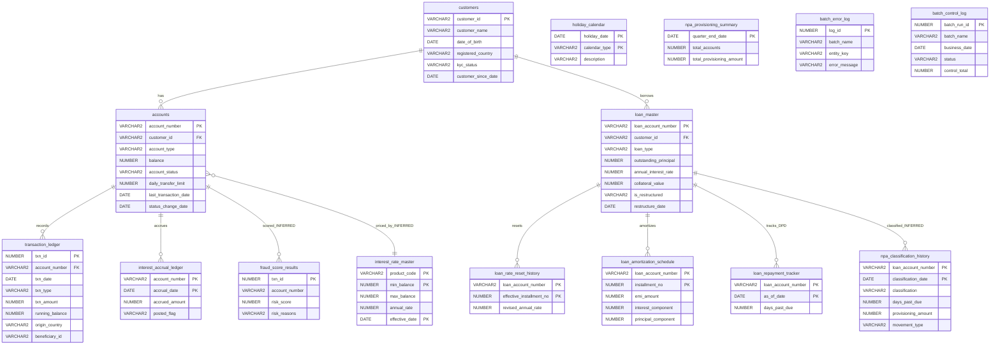

# Data Model and ERD

Source file: [`00_ddl_create_schema.sql`](../../00_ddl_create_schema.sql). This is the single DDL script; run it first, before loading sample data or compiling the programs. Target is Oracle Database (12c+ recommended per the file header). It creates **3 sequences** and **15 tables**. This page holds the entity-relationship model and cross-domain relationships; each table's columns, constraints, and program ownership are documented on its own [table page](tables/customers.md).

The ERD is built from the DDL only. Relationships drawn as declared derive from `FOREIGN KEY` constraints in the script; relationships implied by column naming or by procedural usage but with **no declared foreign key** are labelled INFERRED and must not be read as enforced.

## Sequences

| Sequence | Definition | Consumers (present programs) |
| --- | --- | --- |
| `seq_txn_id` | `START WITH 100001 INCREMENT BY 1 NOCACHE` | `transaction_ledger.txn_id` in [04](../programs/04-monthly-interest-credit.md) and [05](../programs/05-fund-transfer.md); also used by the DML loader |
| `seq_log_id` | `START WITH 1 INCREMENT BY 1 NOCACHE` | `batch_error_log.log_id` in [04](../programs/04-monthly-interest-credit.md) |
| `seq_batch_run_id` | `START WITH 1 INCREMENT BY 1 NOCACHE` | `batch_control_log.batch_run_id` — **no present program uses it** (see [coverage-and-gaps](../coverage-and-gaps.md)) |

`NOCACHE` guarantees strictly increasing values with no cache loss on instance restart, at the cost of throughput. All three are defined at `00_ddl_create_schema.sql` lines 33-35.

## Index

`idx_txn_ledger_acct_date ON transaction_ledger (account_number, txn_date)` (line 94) supports the account-plus-date lookups that [05](../programs/05-fund-transfer.md) performs for the daily-transfer-limit aggregate and that the absent statement/fraud programs would use.

## Declared foreign keys

Only the customer and loan/account chains carry declared `FOREIGN KEY` constraints:

| Child table | Column(s) | References | Constraint |
| --- | --- | --- | --- |
| `accounts` | `customer_id` | `customers(customer_id)` | `fk_accounts_customer` |
| `transaction_ledger` | `account_number` | `accounts(account_number)` | `fk_txn_account` |
| `loan_master` | `customer_id` | `customers(customer_id)` | `fk_loan_customer` |
| `loan_rate_reset_history` | `loan_account_number` | `loan_master(loan_account_number)` | `fk_rate_reset_loan` |
| `loan_amortization_schedule` | `loan_account_number` | `loan_master(loan_account_number)` | `fk_amort_sched_loan` |
| `interest_accrual_ledger` | `account_number` | `accounts(account_number)` | `fk_accrual_account` |
| `loan_repayment_tracker` | `loan_account_number` | `loan_master(loan_account_number)` | `fk_repay_tracker_loan` |

All constraints in this DDL are created without `DISABLE` or `NOVALIDATE`, so Oracle creates them ENABLED and VALIDATED by default. No constraint in the script declares a disabled or not-validated state.

## Inferred relationships (no declared foreign key)

These links are implied by shared identifier columns but have **no** `FOREIGN KEY` in the DDL, so direct SQL can violate them:

- `fraud_score_results.account_number` → `accounts.account_number` (INFERRED; also `txn_id` conceptually maps to `transaction_ledger.txn_id`).
- `npa_classification_history.loan_account_number` → `loan_master.loan_account_number` (INFERRED).
- `interest_rate_master.product_code` → `accounts.account_type` values (INFERRED; product codes match account-type strings in the DML).
- `npa_provisioning_summary` has no key linking it to individual loans; it is a quarter-end control-total table keyed only on `quarter_end_date`.

## Entity-relationship diagram

*Relationships labelled with an `_INFERRED` suffix have no declared foreign key in the DDL. Attribute lists are abbreviated to the columns that carry the relationships and the key business fields; see each table page for the full column set.*

## Tables by domain

Each table has a dedicated page with full column meanings, constraints, enumerated domains, and the programs that read or write it.

- **Core banking:** [`customers`](tables/customers.md), [`accounts`](tables/accounts.md), [`transaction_ledger`](tables/transaction-ledger.md)
- **Batch audit:** [`batch_error_log`](tables/batch-error-log.md), [`batch_control_log`](tables/batch-control-log.md)
- **Loans:** [`loan_master`](tables/loan-master.md), [`loan_rate_reset_history`](tables/loan-rate-reset-history.md), [`loan_amortization_schedule`](tables/loan-amortization-schedule.md), [`loan_repayment_tracker`](tables/loan-repayment-tracker.md)
- **Interest:** [`interest_rate_master`](tables/interest-rate-master.md), [`interest_accrual_ledger`](tables/interest-accrual-ledger.md)
- **Operational:** [`holiday_calendar`](tables/holiday-calendar.md)
- **Program outputs:** [`fraud_score_results`](tables/fraud-score-results.md), [`npa_classification_history`](tables/npa-classification-history.md), [`npa_provisioning_summary`](tables/npa-provisioning-summary.md)

## What depends on this file

Every program and the [DML loader](dml-sample-data.md) depend on these objects existing. The [business-rules index](../business-rules.md) records the DDL's CHECK/PK/FK constraints as DATABASE-enforced rules. Tables written only by the absent programs 06-10 are catalogued as orphans in [coverage-and-gaps](../coverage-and-gaps.md).
