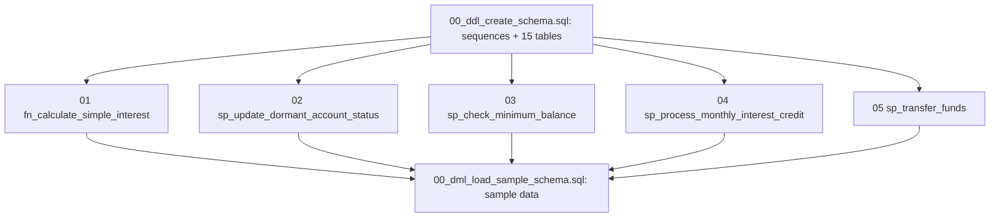
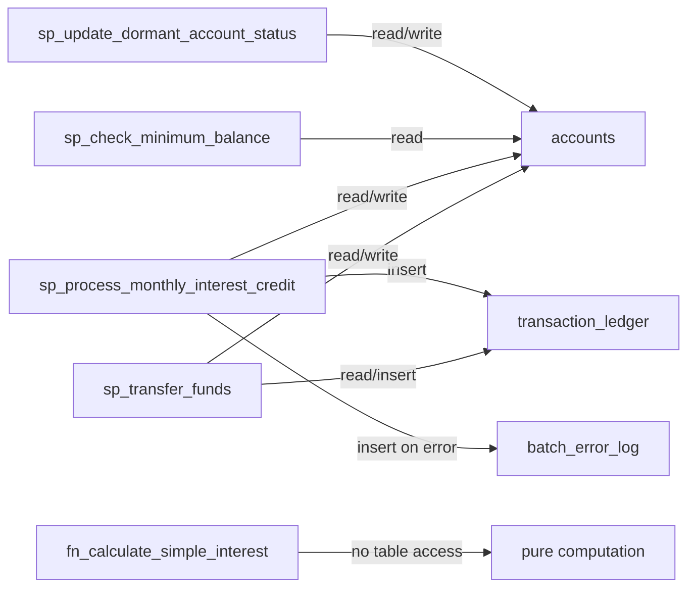

# System Overview

This repository is **production Oracle PL/SQL for a retail banking system**, expressed as a small set of standalone SQL scripts. There is no application server or build system in the checkout: the deliverable is the SQL itself. It has two layers.

- **A physical data model.** [`00_ddl_create_schema.sql`](data-model/ddl-schema.md) defines 3 sequences and 15 tables covering customers, accounts, transactions, loans, interest, batch auditing, and the output tables that downstream jobs populate. [`00_dml_load_sample_schema.sql`](data-model/dml-sample-data.md) seeds a sample dataset shaped to exercise the branching logic of the programs.
- **PL/SQL programs.** Five functions/procedures implement banking operations, graded from SIMPLE to MEDIUM: simple-interest calculation, dormant-account maintenance, minimum-balance checking, monthly interest crediting, and validated fund transfer. Each is documented on its own page under [Programs](programs/overview.md).

Treat every file as production code: this logic moves money and enforces policy. Where the source does not establish a behaviour, this wiki says so rather than inferring from banking convention. Accuracy is prioritised over coverage.

## Business domains

The tables and programs cluster into six domains. Ownership is stated precisely on the [ERD page](data-model/ddl-schema.md) and the per-table pages.

| Domain | Tables | Present programs that touch them |
| --- | --- | --- |
| Core banking | `customers`, `accounts`, `transaction_ledger` | [02](programs/02-dormant-account-status.md), [03](programs/03-minimum-balance.md), [04](programs/04-monthly-interest-credit.md), [05](programs/05-fund-transfer.md) |
| Loans | `loan_master`, `loan_rate_reset_history`, `loan_amortization_schedule`, `loan_repayment_tracker` | none present (owned by absent programs; see [coverage-and-gaps](coverage-and-gaps.md)) |
| Interest | `interest_rate_master`, `interest_accrual_ledger` | none present (see [coverage-and-gaps](coverage-and-gaps.md)) |
| Batch audit | `batch_error_log`, `batch_control_log` | [04](programs/04-monthly-interest-credit.md) writes `batch_error_log`; `batch_control_log` is unused here |
| Operational | `holiday_calendar` | none present |
| Program outputs | `fraud_score_results`, `npa_classification_history`, `npa_provisioning_summary` | none present |

## How the files relate and the run order

The scripts have a strict install order because programs reference schema objects and the DML seeds tables the programs read. The [DDL header](data-model/ddl-schema.md) states this explicitly.

*Install order: create the schema, compile the five programs, then load the sample data. Some DML rows deliberately simulate output that the absent batch programs would otherwise produce.*

Which program reads or writes which table:

*Read/write map of the five present programs. `fn_calculate_simple_interest` touches no tables.*

## Conventions

- **File naming:** `NN_tier_name.sql`, where `NN` is an install-order prefix and `tier` is a complexity grade (`simple`, `medium`). The two `00_` files are schema/data; `01`–`05` are programs.
- **Object naming:** `fn_` prefixes functions, `sp_` prefixes procedures, `seq_` prefixes sequences. Table and column names are lower_snake_case.
- **Result reporting:** procedures return status through `OUT` parameters (result strings such as `ACCOUNT_MARKED_DORMANT`, `SUCCESS`) rather than raising for expected outcomes; unexpected errors use `RAISE_APPLICATION_ERROR` with codes in the `-20001..-20010` range or re-raise.
- **Target:** Oracle Database (12c+ recommended per the DDL header); sequences (not IDENTITY columns) are used for broad compatibility.

## Project context

Git history and a README on the branch (not present in this checkout) describe these files as the **sample input corpus for "STATUTE", a PL/SQL-to-BRD analysis pipeline**. That is context for *why* the files exist and why they are graded by complexity; it is a labelled inference and not part of the on-disk repository. The Python pipeline code is not in this checkout. The DDL and DML also reference programs **06 through 10** that are absent here; their inferred responsibilities and the tables they would own are catalogued in [coverage-and-gaps](coverage-and-gaps.md).

## Where to go next

- [Data model & ERD](data-model/ddl-schema.md) — the schema, constraints, and entity relationships.
- [Per-table pages](data-model/tables/customers.md) — column-level meaning and ownership.
- [Sample data](data-model/dml-sample-data.md) — what each fixture is engineered to trigger.
- [Programs](programs/overview.md) — the five functions/procedures.
- [Business rules](business-rules.md) — every gating condition as a traceable `BR-NN` rule.
- [Coverage and gaps](coverage-and-gaps.md) — orphan tables, hard-coded constants, code-only validations, and the missing programs.
