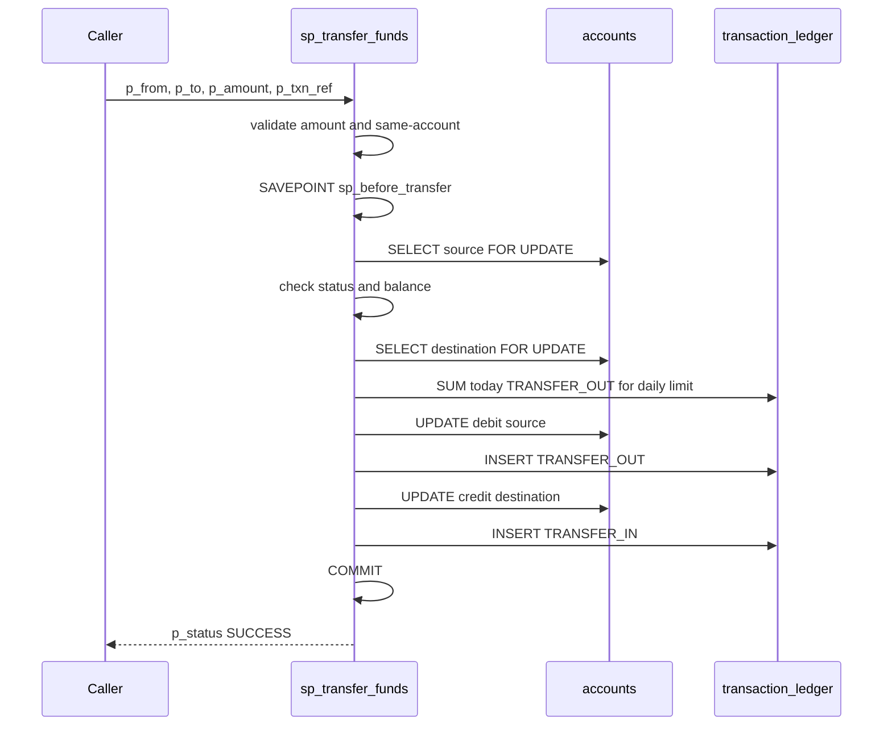

# Program 05: `sp_transfer_funds`

**Purpose (business terms):** move money from one account to another only after confirming both accounts exist and are active, the source has enough balance, and the transfer stays within the source's daily limit — then debit, credit, and log both legs atomically.

Source file: [`05_medium_fund_transfer_with_validation.sql`](../../05_medium_fund_transfer_with_validation.sql) (category MEDIUM). This is the most complex present program: it uses `SELECT ... FOR UPDATE` locking, a `SAVEPOINT`, and named custom exceptions. Reads/writes [`accounts`](../data-model/tables/accounts.md) and reads/inserts [`transaction_ledger`](../data-model/tables/transaction-ledger.md).

## Signature

| Parameter | Mode | Type | Meaning |
| --- | --- | --- | --- |
| `p_from_account` | IN | `VARCHAR2` | Source account (debited). |
| `p_to_account` | IN | `VARCHAR2` | Destination account (credited). |
| `p_amount` | IN | `NUMBER` | Amount to transfer. Must be `> 0`. |
| `p_txn_ref` | IN | `VARCHAR2` | External reference stored on both ledger rows. |
| `p_status` | OUT | `VARCHAR2` | `SUCCESS` or `FAILED`. |
| `p_message` | OUT | `VARCHAR2` | Human-readable result/error. |

## Custom exceptions

Declared at lines 26-30: `e_account_not_found`, `e_account_inactive`, `e_insufficient_balance`, `e_daily_limit_exceeded`, `e_invalid_amount`. Each has a dedicated handler that sets `p_message` and rolls back to the savepoint.

## Walkthrough (source order)

1. **Default status** (line 33): `p_status := 'FAILED'` — the procedure is fail-closed; success is set only at the end.
2. **Amount validation** (lines 35-37): if `p_amount IS NULL OR p_amount <= 0`, `RAISE e_invalid_amount`. See [BR-16](../business-rules.md).
3. **Same-account guard** (lines 39-43): if `p_from_account = p_to_account`, set `FAILED`/message and `RETURN` immediately (no savepoint set yet). See [BR-17](../business-rules.md).
4. **Savepoint** (line 45): `SAVEPOINT sp_before_transfer` — the rollback anchor for every subsequent failure.
5. **Lock & read source** (lines 48-57): `SELECT balance, account_status, daily_transfer_limit INTO ... FROM accounts WHERE account_number = p_from_account FOR UPDATE`; `NO_DATA_FOUND` → `RAISE e_account_not_found`. The `FOR UPDATE` locks the source row for the duration.
6. **Source active check** (lines 59-61): if `v_from_status <> 'ACTIVE'`, `RAISE e_account_inactive`. See [BR-19](../business-rules.md).
7. **Lock & read destination** (lines 64-72): `SELECT account_status INTO v_to_status ... WHERE account_number = p_to_account FOR UPDATE`; `NO_DATA_FOUND` → `RAISE e_account_not_found`. Destination is locked after the source.
8. **Destination active check** (lines 74-76): if `v_to_status <> 'ACTIVE'`, `RAISE e_account_inactive`.
9. **Sufficient balance** (lines 78-80): if `v_from_balance < p_amount`, `RAISE e_insufficient_balance`. See [BR-18](../business-rules.md).
10. **Daily-limit aggregate** (lines 83-92): `SELECT NVL(SUM(txn_amount),0) INTO v_today_txn_total FROM transaction_ledger WHERE account_number = p_from_account AND txn_type = 'TRANSFER_OUT' AND TRUNC(txn_date) = TRUNC(SYSDATE)`; if `(v_today_txn_total + p_amount) > v_daily_limit`, `RAISE e_daily_limit_exceeded`. See [BR-20](../business-rules.md). Note the aggregate uses `SYSDATE`, not `p_txn_ref` or a passed date.
11. **Debit source** (lines 95-106): `UPDATE accounts SET balance = balance - p_amount, last_transaction_date = SYSDATE WHERE account_number = p_from_account`, then `INSERT` a `TRANSFER_OUT` ledger row (`running_balance = v_from_balance - p_amount`, `reference_number = p_txn_ref`).
12. **Credit destination** (lines 109-121): `UPDATE accounts SET balance = balance + p_amount, ...`, then `INSERT` a `TRANSFER_IN` ledger row whose `running_balance` is read back with a subquery `(SELECT balance FROM accounts WHERE account_number = p_to_account)`.
13. **Success** (lines 123-125): `p_status := 'SUCCESS'; p_message := 'Transfer completed successfully.'; COMMIT`.

## Transaction behaviour

`SAVEPOINT sp_before_transfer` is set before any read/write. Every named-exception handler (lines 130-141) executes `ROLLBACK TO sp_before_transfer`, undoing any partial debit/credit while leaving work done before the savepoint intact. The `WHEN OTHERS` handler (lines 142-145) also rolls back to the savepoint and then `RAISE`s. Success commits at line 125. Two exceptions do **not** roll back: `e_invalid_amount` (raised before the savepoint) and the same-account guard (early `RETURN`).

## Debit/credit sequence

*Happy path. Any validation failure raises a custom exception whose handler runs ROLLBACK TO sp_before_transfer and returns p_status FAILED.*

## Exit paths (what the caller observes)

| Condition | `p_status` | `p_message` | Rolled back? |
| --- | --- | --- | --- |
| Success | `SUCCESS` | `Transfer completed successfully.` | no (committed) |
| Invalid/zero/NULL amount | `FAILED` | `Transfer amount must be greater than zero.` | no (before savepoint) |
| Same source and destination | `FAILED` | `Source and destination accounts cannot be the same.` | no (early RETURN) |
| Either account missing | `FAILED` | `One or both accounts do not exist.` | ROLLBACK TO savepoint |
| Either account not active | `FAILED` | `One or both accounts are not active.` | ROLLBACK TO savepoint |
| Insufficient source balance | `FAILED` | `Insufficient balance in source account.` | ROLLBACK TO savepoint |
| Daily limit exceeded | `FAILED` | `Daily transfer limit exceeded.` | ROLLBACK TO savepoint |
| Any other error | `FAILED` | `Unexpected error: ` + `SQLERRM` **and re-raise** | ROLLBACK TO savepoint |

## Invariants

- **Lock ordering:** source is locked with `FOR UPDATE` before destination; both stay locked until commit or rollback. Because two accounts are locked in a fixed source-then-destination order determined by the caller's arguments, two concurrent transfers moving money in opposite directions between the same pair of accounts can acquire the locks in opposite orders and **deadlock**; Oracle resolves this by aborting one transaction with `ORA-00060`, which surfaces through the `WHEN OTHERS` handler.
- **Atomicity:** the debit, its ledger row, the credit, and its ledger row are all committed together, or all rolled back to the savepoint.
- **Fail-closed:** `p_status` starts `FAILED` and only becomes `SUCCESS` after every check passes and both legs are written.

## Ledger `running_balance` consistency

The two legs compute [`transaction_ledger.running_balance`](../data-model/tables/transaction-ledger.md) differently:

- **Debit leg** (line 105): `v_from_balance - p_amount` — computed in PL/SQL from the balance fetched *before* the debit `UPDATE`. This is consistent with the post-debit balance because the source row is locked `FOR UPDATE` and no other value was applied in between.
- **Credit leg** (line 119): a correlated subquery `(SELECT balance FROM accounts WHERE account_number = p_to_account)` executed *after* the credit `UPDATE`, re-reading the now-updated destination row. The destination is held under `FOR UPDATE`, so no concurrent session can change it between the update and the re-read; the two approaches therefore agree in practice.

`running_balance` is a **nullable** column with **no CHECK constraint** (see [`transaction_ledger`](../data-model/tables/transaction-ledger.md)), so the database silently accepts any value written here — an incorrect running balance is an audit-trail defect, not a database error. `txn_amount` and `running_balance` are both `NUMBER(18,2)`; `reference_number` is `p_txn_ref` and `narration` is a computed string (`'Transfer to '`/`'Transfer from '` plus the counterparty account).

## Rules enforced

[BR-16](../business-rules.md), [BR-17](../business-rules.md), [BR-18](../business-rules.md), [BR-19](../business-rules.md), [BR-20](../business-rules.md). All CODE-enforced; the active-status values compared are bounded by the DATABASE CHECK [BR-01](../business-rules.md).
